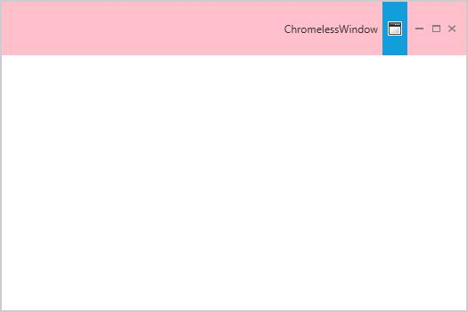

# TitleBarHeight Support

ChromelessWindow now supports changing the FontSize and TitleBarHeight directly with the **“** **TitleFontSize** **”** and **“** **TitleBarHeight** **”** respectively and there is no need to edit the full template to change this.

TitleBarHeight is a property, which is used to change the height of the TitleBar. By default its value is 30 and we can change this default value as desired 

Here is the code example for setting the TitleBarHeight Property





<syncfusion:ChromelessWindow x:Class="Chromelesswindow.MainWindow"

xmlns="http://schemas.microsoft.com/winfx/2006/xaml/presentation"

xmlns:x="http://schemas.microsoft.com/winfx/2006/xaml"

Title="ChromelessWindow" Height="350" Width="525" TitleBarHeight="60" TitleBarBackground="Pink" syncfusion:SkinStorage.VisualStyle="Metro"     x:Name="_chromelessWindow"    xmlns:syncfusion="clr-namespace:Syncfusion.Windows.Shared;assembly=Syncfusion.Shared.WPF" >

<Grid>

</Grid>

</syncfusion:ChromelessWindow>









this.TitleBarHeight = 60;





  Me.TitleBarHeight = 60
  




