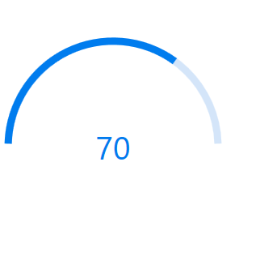
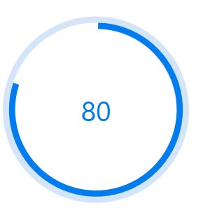
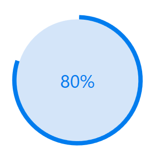
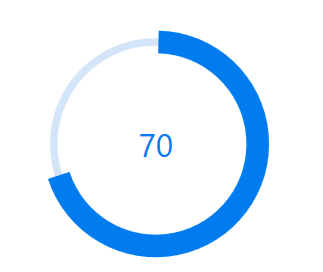
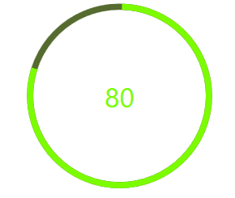
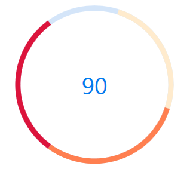
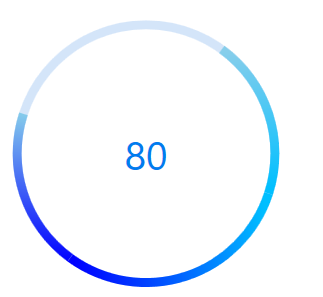
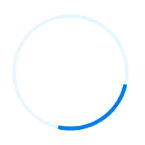
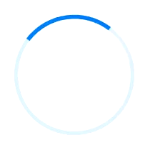

# Appearance in Circular ProgressBar
You can highly customize the appearance of the circular progressbar in the following ways.

## Angle
The appearance of the circular progressbar can be customized to semi-circle, arc, etc. The start and end angles can be customized using the [StartAngle](https://help.syncfusion.com/cr/wpf/Syncfusion.UI.Xaml.ProgressBar.SfCircularProgressBar.html#Syncfusion_UI_Xaml_ProgressBar_SfCircularProgressBar_StartAngleProperty) and [EndAngle](https://help.syncfusion.com/cr/wpf/Syncfusion.UI.Xaml.ProgressBar.SfCircularProgressBar.html#Syncfusion_UI_Xaml_ProgressBar_SfCircularProgressBar_EndAngleProperty) properties. The following code sample demonstrates to change the appearance of the circular progressbar to semi-circle.



<Syncfusion:SfCircularProgressBar  Progress="75" StartAngle="180" EndAngle="360" />


SfCircularProgressBar Circular = new SfCircularProgressBar { Progress = 70 };
Circular.StartAngle = 180;
Circular.EndAngle = 360;
grid.Children.Add(Circular);



## Radius/Thickness 
You can customize the radius or thickness of the circular progressbar based on its usage. The following properties are used to change the look and appearance of the circular progressbar:

•[IndicatorOuterRadius](https://help.syncfusion.com/cr/wpf/Syncfusion.UI.Xaml.ProgressBar.SfCircularProgressBar.html#Syncfusion_UI_Xaml_ProgressBar_SfCircularProgressBar_IndicatorOuterRadiusProperty): Defines the outer radius of the progress indicator.

•[IndicatorInnerRadius](https://help.syncfusion.com/cr/wpf/Syncfusion.UI.Xaml.ProgressBar.SfCircularProgressBar.html#Syncfusion_UI_Xaml_ProgressBar_SfCircularProgressBar_IndicatorInnerRadiusProperty): Defines the inner radius of the progress indicator.

•[TrackOuterRadius](https://help.syncfusion.com/cr/wpf/Syncfusion.UI.Xaml.ProgressBar.SfCircularProgressBar.html#Syncfusion_UI_Xaml_ProgressBar_SfCircularProgressBar_TrackOuterRadiusProperty): Defines the outer radius of the track indicator.

•[TrackInnerRadius](https://help.syncfusion.com/cr/wpf/Syncfusion.UI.Xaml.ProgressBar.SfCircularProgressBar.html#Syncfusion_UI_Xaml_ProgressBar_SfCircularProgressBar_TrackInnerRadiusProperty): Defines the inner radius of the track indicator.

The below  code samples are provided to showcase various customizations of the circular progressbar.

### Track progress outside
The main progressbar shows the current status of the work while track progressbar is aligned outside.


<Syncfusion:SfCircularProgressBar  Progress="80" IndicatorOuterRadius="0.7" IndicatorInnerRadius="0.65" ShowProgressValue="True" />


 SfCircularProgressBar Circular = new SfCircularProgressBar { Progress = 80 };
Circular.IndicatorInnerRadius = 0.65;
Circular.IndicatorOuterRadius = 0.7;
Circular.ShowProgressValue=true;
grid.Children.Add(Circular);



 
### Filled progress indicator
The main progressbar shows the current status of the work by filling the inside area while track progressbar is aligned outside.


 <Syncfusion:SfCircularProgressBar  Progress="80" IndicatorOuterRadius="0.7" IndicatorInnerRadius="0" ShowProgressValue="False"/>


 SfCircularProgressBar Circular = new SfCircularProgressBar { Progress = 80 };
Circular.IndicatorInnerRadius = 0;
Circular.IndicatorOuterRadius = 0.7;
Circular.ShowProgressValue=false;
grid.Children.Add(Circular);



### Track progress inside
The main progressbar shows the current status of the work while track progressbar is aligned inside.


<Syncfusion:SfCircularProgressBar  x:Name="CircularProgressBar" Progress="80" TrackOuterRadius="0.7" TrackInnerRadius="0"  >
            <Syncfusion:SfCircularProgressBar.ProgressContent>
                <StackPanel>
                    <TextBlock Text="{Binding Progress,StringFormat={}{0}%}" TextAlignment="Center" DataContext="CircularProgressBar">
                    </TextBlock>
                </StackPanel>
            </Syncfusion:SfCircularProgressBar.ProgressContent>
        </Syncfusion:SfCircularProgressBar>


 SfCircularProgressBar Circular = new SfCircularProgressBar { Progress = 80 };
Circular.TrackOuterRadius = 0.7;
Circular.TrackInnerRadius = 0;
grid.Children.Add(Circular);



### Thin track progress style
The main progressbar shows the current status of the work with relative thickness.



<Syncfusion:SfCircularProgressBar  Progress="70" IndicatorOuterRadius="0.75" IndicatorInnerRadius="0.6" TrackOuterRadius="0.7" TrackInnerRadius="0.65"   ShowProgressValue="True" >


 SfCircularProgressBar Circular = new SfCircularProgressBar { Progress = 70 };
Circular.IndicatorInnerRadius = 0.6;
Circular.IndicatorOuterRadius = 0.75;
Circular.TrackOuterRadius = 0.7;
Circular.TrackInnerRadius = 0.65;
grid.Children.Add(Circular);



## Color Customization
You can customize the color of the circular progressbar's progress color and track color.The following properties are used to customize the color in the progressbar:

•[ProgressColor](https://help.syncfusion.com/cr/wpf/Syncfusion.UI.Xaml.ProgressBar.ProgressBarBase.html#Syncfusion_UI_Xaml_ProgressBar_ProgressBarBase_ProgressColor): Represents the color of the progress indicator.

•[TrackColor](https://help.syncfusion.com/cr/wpf/Syncfusion.UI.Xaml.ProgressBar.ProgressBarBase.html#Syncfusion_UI_Xaml_ProgressBar_ProgressBarBase_TrackColorProperty): Represents the color of the track indicator.


      
<Syncfusion:SfCircularProgressBar Progress="70" ProgressColor="LawnGreen" TrackColor="DarkOliveGreen"/>


SfCircularProgressBar circular = new SfCircularProgressBar();
circular.Progress = 80;
circular.ProgressColor = new SolidColorBrush(Colors.LawnGreen);
circular.TrackColor = new SolidColorBrush(Colors.DarkOliveGreen);
grid.Children.Add(circular);



## Range Colors

You can visualize the multiple ranges with different solid colors that are mapped to each range to enhance the readability of progress.
The solid colors can be mapped to the specific ranges using the [RangeColor] (https://help.syncfusion.com/cr/wpf/Syncfusion.UI.Xaml.ProgressBar.RangeColor.html).

•[Color](https://help.syncfusion.com/cr/wpf/Syncfusion.UI.Xaml.ProgressBar.RangeColor.html#Syncfusion_UI_Xaml_ProgressBar_RangeColor_Color): Represents the color to the specified range.

•[Start](https://help.syncfusion.com/cr/wpf/Syncfusion.UI.Xaml.ProgressBar.RangeColor.html#Syncfusion_UI_Xaml_ProgressBar_RangeColor_Start): Represents the start range of the color.

•[End](https://help.syncfusion.com/cr/wpf/Syncfusion.UI.Xaml.ProgressBar.RangeColor.html#Syncfusion_UI_Xaml_ProgressBar_RangeColor_End): Represents the end range of the color.



<Syncfusion:SfCircularProgressBar Progress="80" >
            <Syncfusion:SfCircularProgressBar.RangeColors>
                <Syncfusion:RangeColorCollection>
                    <Syncfusion:RangeColor Color="BlanchedAlmond" Start=5" End="30"/>
                    <Syncfusion:RangeColor Color="Coral" Start="30" End="60"/>
                    <Syncfusion:RangeColor Color="Crimson" Start="60" End="100"/>
                </Syncfusion:RangeColorCollection>
            </Syncfusion:SfCircularProgressBar.RangeColors>
</Syncfusion:SfCircularProgressBar>


SfCircularProgressBar circular = new SfCircularProgressBar();
RangeColorCollection rangeColors = new RangeColorCollection();
rangeColors.Add(new RangeColor() { Color = Colors.BlanchedAlmond, Start = 5, End = 30 });
rangeColors.Add(new RangeColor() { Color = Colors.Coral, Start = 30, End = 60 });
rangeColors.Add(new RangeColor() { Color = Colors.Crimson, Start = 60, End = 100 });
circular.Progress = 90;
circular.RangeColors = rangeColors;
grid.Children.Add(circular);       



## Gradient

Gradient shows change in intensity of the colors during the progress. [IsGradient](https://help.syncfusion.com/cr/wpf/Syncfusion.UI.Xaml.ProgressBar.RangeColor.html#Syncfusion_UI_Xaml_ProgressBar_RangeColor_IsGradient) property  in  [RangeColor](https://help.syncfusion.com/cr/wpf/Syncfusion.UI.Xaml.ProgressBar.RangeColor.html) class is used to set gradient effect to the colors applied to the progressbar.


      <Syncfusion:SfCircularProgressBar Progress="80" >
            <Syncfusion:SfCircularProgressBar.RangeColors>
                <Syncfusion:RangeColorCollection>
                    <Syncfusion:RangeColor IsGradient="True" Color="SkyBlue" Start="10" End="30"/>
                    <Syncfusion:RangeColor IsGradient="True" Color="DeepSkyBlue" Start="30" End="60"/>
                    <Syncfusion:RangeColor IsGradient="True" Color="Blue" Start="60" End="100"/>
                </Syncfusion:RangeColorCollection>
            </Syncfusion:SfCircularProgressBar.RangeColors>
        </Syncfusion:SfCircularProgressBar>


SfCircularProgressBar circular = new SfCircularProgressBar();
RangeColorCollection rangeColors = new RangeColorCollection();
rangeColors.Add(new RangeColor() { IsGradient=true, Color = Colors.SkyBlue, Start = 10, End = 30 });
rangeColors.Add(new RangeColor() { IsGradient=true, Color = Colors.DeepSkyBlue, Start = 30, End = 60 });
rangeColors.Add(new RangeColor() { IsGradient=true, Color = Colors.Blue, Start = 60, End = 100 });
circular.RangeColors = rangeColors;
circular.Progress = 80;            
grid.Children.Add(circular);        



## Corner radius
The [IndicatorCornerRadius](https://help.syncfusion.com/cr/wpf/Syncfusion.UI.Xaml.ProgressBar.ProgressBarBase.html#Syncfusion_UI_Xaml_ProgressBar_ProgressBarBase_IndicatorCornerRadiusProperty) property is used to frame rounded edges in the circular progressbar as demonstrated in the following code sample.

N> Proper IndicatorConerRadius value can be set using the formula IndicatorOuterRadius * 10 = IndicatorCornerRadius.



<Grid Name="grid">
    <Syncfusion:SfCircularProgressBar
    Width="150"
    Height="150"
    Margin="5"
    EndAngle="410"
    IndicatorCornerRadius="5"
    Progress="50"
    ShowProgressValue="False"
    StartAngle="130" />
</Grid>


SfCircularProgressBar circular = new SfCircularProgressBar();
circular.Width = 150;
circular.Height = 150;
circular.IndicatorCornerRadius = 5;
circular.Progress = 50;
circular.ShowProgressValue = false;
circular.StartAngle = 130;
circular.EndAngle = 410;
grid.Children.Add(circular);



## AnimationDuration
You can customize the duration for completing one animation cycle and it applies when the `IsIndeterminate` is true. The default value is `3000ms`.


<Grid Name="grid">
    <Syncfusion:SfCircularProgressBar
    Width="150"
    Height="150"
    AnimationDuration="00:00:01"
    IsIndeterminate="True"
    Progress="50"
    ShowProgressValue="False" />
</Grid>


SfCircularProgressBar circular = new SfCircularProgressBar();
circular.Width = 150;
circular.Height = 150;
circular.AnimationDuration = new TimeSpan(0, 0, 1);
circular.IsIndeterminate = true;
circular.Progress = 50;
circular.ShowProgressValue = false;
grid.Children.Add(circular);



## AnimationEasing
You can customize the easing function to apply for linear and circular progress bar animation and it applies when the `IsIndeterminate` is true.


<Grid Name="grid">
    <Syncfusion:SfCircularProgressBar
        Width="150"
        Height="150"
        IsIndeterminate="True"
        Progress="50"
        ShowProgressValue="False">
        <Syncfusion:SfCircularProgressBar.AnimationEasing>
            <BounceEase
                Bounces="20"
                Bounciness="5"
                EasingMode="EaseOut" />
        </Syncfusion:SfCircularProgressBar.AnimationEasing>
    </Syncfusion:SfCircularProgressBar>
</Grid>


SfCircularProgressBar circular = new SfCircularProgressBar();
circular.Width = 150;
circular.Height = 150;
circular.IsIndeterminate = true;
circular.Progress = 50;
circular.ShowProgressValue = false;
BounceEase bounceEase = new BounceEase();
bounceEase.Bounces = 20;
bounceEase.Bounciness = 5;
bounceEase.EasingMode = EasingMode.EaseOut;
circular.AnimationEasing = bounceEase;
grid.Children.Add(circular);


