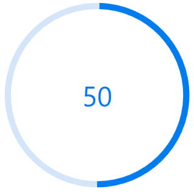

# Creating a simple application with Circular ProgressBar

You can create a WPF application with the SfCircularProgressBar control using the following steps:

## Assembly deployment

Refer to the [control dependencies](https://help.syncfusion.com/wpf/control-dependencies#) section to get the list of assemblies or NuGet package that needs to be added as a reference to use the control in any application.

You can find more details about installing the NuGet package in a WPF application in the following link: [How to install nuget packages](https://help.syncfusion.com/wpf/nuget-packages)

## Adding control through designer

The SfCircularProgressBar control can be added to a WPF application by dragging it from the toolbox to a designer view. The following assembly reference will be added automatically:

* Syncfusion.SfProgressBar.WPF 

## Adding control manually in XAML

To add control manually in XAML, follow the given steps:

1.	Add the following required assembly references to the project:
    * Syncfusion.SfProgressBar.WPF     
2.	Import Syncfusion WPF schema **http://schemas.syncfusion.com/wpf** the in XAML page.
3.	Declare the SfCircularProgressBar control in the XAML page.



<Window
        xmlns="http://schemas.microsoft.com/winfx/2006/xaml/presentation"
        xmlns:x="http://schemas.microsoft.com/winfx/2006/xaml"
        xmlns:d="http://schemas.microsoft.com/expression/blend/2008"
        xmlns:mc="http://schemas.openxmlformats.org/markup-compatibility/2006"
        xmlns:local="clr-namespace:WpfApp4"
        xmlns:Syncfusion="http://schemas.syncfusion.com/wpf" x:Class="WpfApp4.MainWindow"
        mc:Ignorable="d"
        Title="MainWindow" Height="450" Width="800">
     <Grid x:Name="grid">       
       <Syncfusion:SfCircularProgressBar  Progress="50"  Width="347"/>
      </Syncfusion:SfCircularProgressBar>
        </Grid>
</Window>



## Adding  control through code behind

To add control manually through code behind, follow the given steps:

1.	Add the following required assembly references to the project:
   * Syncfusion.SfProgressBar.WPF
2.	Import the Circular ProgressBar namespace **using Syncfusion.UI.Xaml.ProgressBar;**.
3.	Create an Circular ProgressBar instance, and add it to the window.



using Syncfusion.UI.Xaml.ProgressBar;
namespace SfProgressBar
{
    /// 

    /// Interaction logic for MainWindow.xaml
    /// 

    public partial class MainWindow : Window
    {                  
        public MainWindow()
        {
            InitializeComponent();      
                
            SfCircularProgressBar circular = new SfCircularProgressBar();
            circular.Progress = 50;  
            grid.Children.Add(circular);

        }      
    }
}



## Theme

Circular ProgressBar supports various built-in themes. Refer to the below links to apply themes for the Circular ProgressBar,

  * [Apply theme using SfSkinManager](https://help.syncfusion.com/wpf/themes/skin-manager)
	
  * [Create a custom theme using ThemeStudio](https://help.syncfusion.com/wpf/themes/theme-studio#creating-custom-theme)

  