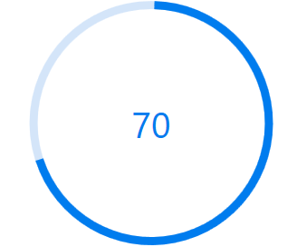

# Different states in Circular ProgressBar
States help to visualize the progress of a task in different modes. You can configure states of the circular progressbar control depending on its usage in following ways.

## Determinate
Determinate is the default state. You can use it when the progress estimation is known. [ShowProgressValue](https://help.syncfusion.com/cr/wpf/Syncfusion.SfProgressBar.WPF~Syncfusion.UI.Xaml.ProgressBar.SfCircularProgressBar~ShowProgressValueProperty.html) property allows to indicate the progress of the operation taken place  in numerical value.

## Indeterminate
By enabling the [IsIndeterminate](https://help.syncfusion.com/cr/wpf/Syncfusion.SfProgressBar.WPF~Syncfusion.UI.Xaml.ProgressBar.ProgressBarBase~IsIndeterminateProperty.html) property, the state of the progressbar can be changed to indeterminate when the progress cannot be estimated or when not being calculated.


      
<Syncfusion:SfCircularProgressBar Progress="70" IsIndeterminate="True"/>            


SfCircularProgressBar Circular = new SfCircularProgressBar { Progress = 70, IsIndeterminate=true};
grid.Children.Add(Circular);        



