# User Interaction

## Zooming

Chart for WPF lets you zoom into a narrower range within the chart area. This section discusses the following topics.

### Zooming Using Mouse

You can switch to the zooming mode in the Chart by using the built-in context menu. Users can choose to zoom a specific series, if they do so, the rest of the series will be rendered semi-transparently, based on the InactiveSeriesOpacityOnZoom property (discussed later in this section).

### Zoom Using Zooming Toolkit

In the Zooming mode, a Zooming toolkit is displayed at the top-left corner of the ChartArea. Using the buttons in the Zooming toolkit, ChartSeries can be zoomed in, out, reset or closed (to exit zoom mode).

### Display/Hide Buttons in Zooming Toolkit

The visibility of the Zooming Toolkit or the individual buttons in the toolkit can be controlled by using the following properties.

<table>
<tr>
<th>
Property</th><th>
Description</th></tr>
<tr>
<td>
ZoomInButtonVisibility</td><td>
gets or sets zoom in button visibility</td></tr>
<tr>
<td>
ZoomOutButtonVisibility</td><td>
gets or sets zoom out button visibility</td></tr>
<tr>
<td>
ZoomCloseButtonVisibility</td><td>
gets or sets zoom close button visibility</td></tr>
<tr>
<td>
ZoomResetButtonVisibility</td><td>
gets or sets zoom reset button visibility</td></tr>
<tr>
<td>
ZoomingToolkitVisibility</td><td>
gets or sets zooming toolkit visibility</td></tr>
</table>





<sfchart:ChartArea  sfchart:ChartZoomingToolkit.ZoomInButtonVisibility="Collapsed"

sch:ChartZoomingToolkit.ZoomOutButtonVisibility="Hidden" sch:ChartZoomingToolkit.ZoomResetButtonVisibility="Collapsed" sch:ChartZoomingToolkit.ZoomingToolkitVisibility="Visible">

<!—-your code here--!>

</sfchart:ChartArea>




ChartZoomingToolkit.SetZoomInButtonVisibility(chartArea, Visibility.Collapsed);

ChartZoomingToolkit.SetZoomOutButtonVisibility(chartArea, Visibility.Hidden);

ChartZoomingToolkit.SetZoomResetButtonVisibility(chartArea, Visibility.Collapsed);

ChartZoomingToolkit.SetZoomingToolkitVisibility(chartArea, Visibility.Visible);



### Zooming by Manual Drag

You can also manually drag-select an area to perform the zoom operation.

### Zooming Through Code

Chart can be zoomed programmatically by using Chart Commands, Keyboard Keys and Pre-defined Properties.

### Zooming Using Chart Commands

Zooming mode can be enabled by calling the appropriate Chart Commands.


// To enter Zooming mode.

ChartAreaCommands.SwitchZooming.Execute(null, chart1.Areas[0]);

// To perform Zoom In.

ChartAreaCommands.ZoomIn.Execute(null, Chart1.Areas[0]);

// To perform Zoom Out.

ChartAreaCommands.ZoomOut.Execute(null, Chart1.Areas[0]);

// To Perform Zoom Reset.

ChartAreaCommands.ZoomReset.Execute(null, Chart1.Areas[0]);

// To Close the Zooming Toolkit again, use CancelZooming (exit zooming mode).

ChartAreaCommands.CancelZooming.Execute(null, Chart1.Areas[0]);


### Enabling Zooming Without Using Zooming Toolkit

Drag-select an area in the Chart to enable zooming when the zooming toolkit is invisible. The following code example illustrates this.


// Enable zoom mode.

ChartAreaCommands.SwitchZooming.Execute(null, Chart1.Areas[0]);

// Hide the zooming toolkit.

ChartZoomingToolkit.SetZoomingToolkitVisibility(Chart1.Areas[0], Visibility.Collapsed);


### Zoom Using Keyboard Keys

You can enable zooming by using the keyboard keys. The following code example shows how the ChartArea can be Zoomed by using the

ALT+I key combination.



// Adding Key Gesture Alt + I keys to Zoom In the Chart Area.

KeyGesture gesture = new KeyGesture(Key.I, ModifierKeys.Alt);

KeyBinding zoomInGesture = new KeyBinding(ChartAreaCommands.ZoomIn, gesture) { CommandTarget = this.Chart1.Areas[0] };

this.InputBindings.Add(zoomInGesture);


### Zooming using Pre-defined Properties

### ZoomFactor

The Chart can be zoomed by using the Axis.ZoomFactor property. The ZoomFactor is usually between 0 and 1. When set to 1, the chart will not be zoomed. When set to 0.5, the size of the chart will be doubled. Scrollbars will be automatically displayed to allow any section of the hidden range to be viewed. The default value is 1.


// Zoom the Chart with Zoom factor 0.5.

this.Chart1.Areas[0].PrimaryAxis.ZoomFactor = 0.5;


### ZoomPosition

You can also programmatically specify the scrollbar position of the zoomed-in axes by using the Axis.ZoomPosition property.

The following code example shows how the chart with values 0 to 5 will have the scrollbar positioned near point 5, when the ChartAxis is zoomed, with the ZoomFactor set to 0.5.


// Zoom the Chart with Zoom factor 0.5.

this.Chart1.Areas[0].PrimaryAxis.ZoomFactor = 0.5;

// Position the ScrollBar to point 5.

this.Chart1.Areas[0].PrimaryAxis.ZoomPosition = 5;  



### Disable Zooming

Zooming using mouse can be disabled for a particular axis by using the EnableZooming property. The following code example illustrates how zooming is disabled only for the Primary axis of the ChartArea while it is enabled for the other axes.



<syncfusion:ChartArea.PrimaryAxis>

<syncfusion:ChartAxis EnableZooming="False"/>

</syncfusion:ChartArea.PrimaryAxis>




this.Chart1.Areas[0].PrimaryAxis.EnableZooming = false;



N> EnableZooming property is useful to disable zooming using mouse and keyboard keys. But it will not take effect when the ZoomFactor property is set. When ZoomFactor property is set between 0 to 1, and EnableZooming property is set to False, the axis will still be zoomed.

Zooming Specific ChartAxis Associated with a ChartSeries Through Code

The Axis associated with a particular ChartSeries can be enabled/disabled through the Zooming functionality. This is achieved by using the series.IsZoomable property. 

The following code illustrates how zooming can be disabled for all the axis in Chart and enabled only for the axis associated with Chart Series2.



<syncfusion:Chart>

    <syncfusion:ChartArea IsContextMenuEnabled="True" ZoomAllAxes="False">

        <syncfusion:ChartSeries Label="Series1" Data="1 1 2 2 3 3 4 4 5 5 6 6" Interior="Red" />

        <syncfusion:ChartSeries Label="Series2" Data="1 60 2 50 3 40 4 30 5 20 6 10" IsZoomable="True" Interior="Blue">

            <syncfusion:ChartSeries.YAxis>

                <syncfusion:ChartAxis Orientation="Vertical"/>

            </syncfusion:ChartSeries.YAxis>

        </syncfusion:ChartSeries>

        <syncfusion:ChartSeries Label="Series3" Data="1 10 2 20 3 30 4 40 5 30 6 20" Interior="Green">

            <syncfusion:ChartSeries.YAxis>

                <syncfusion:ChartAxis Orientation="Vertical"/>

            </syncfusion:ChartSeries.YAxis>

        </syncfusion:ChartSeries>

    </syncfusion:ChartArea>

</syncfusion:Chart>



void Window1_Loaded(object sender, RoutedEventArgs e)

{

Chart1.Areas[0].ZoomAllAxes = false;           

Chart1.Areas[0].Series[1].IsZoomable = true;

}    

The following screenshot illustrates this.

N> Series.IsZoomable is used to enable/disable the zooming of the Axis associated with it. Hence this property is used only in Multiple Axes Charts. This property takes effect only when zooming is performed through code. (Refer to Zooming using Keyboard Keys in this page for zooming through keyboard keys). When zooming is enabled / disabled through the context menu, this property will not take effect.

### Inactive Series Opacity 

When an individual series in the chart is zoomed, the opacity of the series which have not been zoomed can be controlled, so that the series which is zoomed is clearly visible. This can be done by using the InactiveSeriesOpacityOnZoom property of the ChartSeries.

The following lines of code can be used to change the opacity of an inactive series while zooming.


<syncfusion:ChartSeries Name="Series1" Label="Series1" Interior="Red" InactiveSeriesOpacityOnZoom="0.65" Data="1 1 2 2 3 3 4 4 5 5 6 6"/>



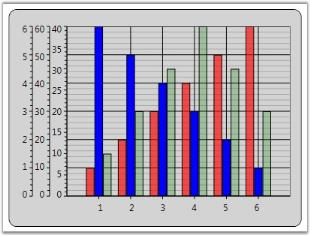

Fractional Values in Axis while Zooming

On zooming the chart, the ChartAxis Labels appear with fractional values. This can be restricted by using the Axis.IsFractionEnabledOnZoom property.




<syncfusion:Chart Name="Chart1" Height="300" Width="400">

    <syncfusion:ChartArea IsContextMenuEnabled="True" >

        <syncfusion:ChartArea.SecondaryAxis>

            <syncfusion:ChartAxis IsFractionEnabledOnZoom="False" />

        </syncfusion:ChartArea.SecondaryAxis>

        <syncfusion:ChartSeries Name="Series1" Label="Series1" Interior="Red" Data="1 1 2 2 3 3" />

    </syncfusion:ChartArea>

</syncfusion:Chart>




// Hides fractional values in Secondary Axis labels.

Chart1.Areas[0].SecondaryAxis.IsFractionEnabledOnZoom = false;




__For more details, refer to the sample in the following location:

_...\My Documents\Syncfusion\EssentialStudio\<Version Number>\WPF\Chart.WPF\Samples\3.5\WindowsSamples\User Interaction\Zoom And Scrolling Demo_

### Zooming and Panning support for Chart WPF

Essential Chart WPF is now enhanced with Zooming and Panning. This feature is used to drag the Zoomed chart area from one point to the other.

#### Adding Zooming and Panning

Add Zooming and Panning to the chart, by using the following code.




 
 <syncfusion:Chart Name="Chart1" Grid.Row="1" Margin="10">

         <syncfusion:ChartArea Name="area" IsContextMenuEnabled="True"/>

< syncfusion:Chart/>




ChartArea area = this.Chart1.Areas[0];

            area.IsContextMenuEnabled = true;





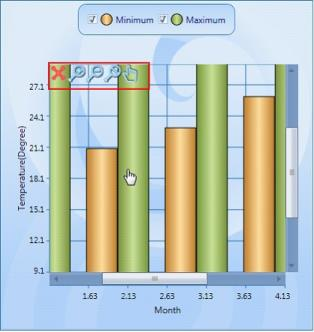

## Highlighting And Selection

The following topics discuss highlight data points and selecting data points:

## ToolTip

ToolTip can be shown on various sections of a chart control such as chart, chart area, chart legend and chart series. Refer to the following code example for creating and assigning the tooltip to the chart.


<!-- Sets Tooltips for a chart-->

<sf:Chart ToolTip="Chart ToolTip">

      <syncfusion:ChartArea Margin="10" ToolTip="ChartArea ToolTip">

        <syncfusion:ChartArea.Legend>

          <syncfusion:ChartLegend ToolTip="ChartLegend ToolTip" />

        </syncfusion:ChartArea.Legend>

                <syncfusion:ChartSeries Label="Series 1" Data="1 10 2 45 3 13 4 25 5 39" ToolTip="ChartSeries ToolTip" IsIndexed="False"/>                

      </syncfusion:ChartArea>

    </syncfusion:Chart>


The following image illustrates the tooltip feature in various sections of the chart.

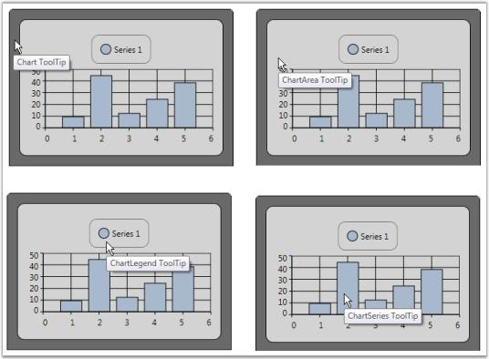

### Default ToolTips for a Chart

Essential Chart for WPF is now enhanced with the ShowTooltip property, which allows ToolTips to be displayed.  

<table>
<tr>
<th>Name of property</th>
<th>Description </th>
<th>Type of property</th>
<th>Value it accepts</th>
<th>Property syntax</th>
</tr>
<tr>
<td> ShowTooltip</td>
<td>Controls the visibility of ToolTips</td>
<td>Dependency Property</td>
<td>Bool or True/False.</td>
<td>ShowToolTip="True"</td>
</tr>
</table>

### Setting a ToolTip for a Chart

To enable ToolTips for a chart, set the ShowTooltip property to True. The following code illustrates setting the ShowTooltip property.




<syncfusion:ChartSeries ShowToolTip="True">




 
Series.ShowToolTip = true;




### Custom ToolTip for a Series

You can set custom tooltips for the chart series. Associate a custom tooltip text with appealing appearance to the chart series using the following code example.


<Window.Resources>

 <!--Defining custom Tooltip in Resources-->

        <ToolTip x:Key="CustomToolTip">

            <ToolTip.Template>

                <ControlTemplate>

                    <Border CornerRadius="5" Background="Bisque" TextBlock.Foreground="Blue"  Padding="3"

                    BorderBrush="Black" BorderThickness="2">

                        <Grid>

                            <Grid.RowDefinitions>

                                <RowDefinition/>

                                <RowDefinition/>

                            </Grid.RowDefinitions>

                            <Grid.ColumnDefinitions>

                                <ColumnDefinition/>

                                <ColumnDefinition/>

                            </Grid.ColumnDefinitions>

                            <TextBlock Text="X value: "/>

                <TextBlock Text="{Binding CorrespondingPoints[0].DataPoint.X}" Grid.Column="1"/>

                <TextBlock Text="Y value: " Grid.Row="1"/>

                <TextBlock Text="{Binding CorrespondingPoints[0].DataPoint.Y}" Grid.Column="1" Grid.Row="1"/>

              </Grid>

                    </Border>

                </ControlTemplate>

            </ToolTip.Template>

        </ToolTip>

  <!--Note: To have custom text alone a simple tooltip as below could be used

        <ToolTip x:Key="SimpleToolTip" Content="{Binding CorrespondingPoints[0].DataPoint.X}"/>-->

 </Window.Resources>

<!--Associate Custom ToolTip with ChartSeries-->

 <syncfusion:ChartSeries Label="Series 1" Data="1 10 2 45 3 13 4 25 5 39" ToolTip="{StaticResource CustomToolTip}" IsIndexed="False"/>



## Toolbar

A built-in toolbar is available for the Chart control, which can be made visible to enable the user to do the following functionalities: 

* Print the chart  
* Print preview the chart 
* Save Chart as an image 
* Copy chart image to clipboard 
* Toggle Legend Appearance 
* Toggle Zoom mode
* Change the color palette of the chart 
* Change Chart Type 

The code as follows illustrates how a ToolBar could be added to the Chart control.


<syncfusion:Chart.ToolBar >

        <syncfusion:ChartToolBar Name="chartToolbar"  SelectedItemChanged="ChartToolBar_SelectedItemChanged" 

                                         CloseButtonVisibility="Visible"  TitleBarVisibility="Visible"       >

        </syncfusion:ChartToolBar>

</syncfusion:Chart.ToolBar>



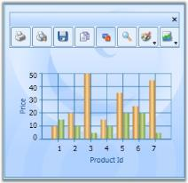

Excluding or including the Toolbar While Printing and Saving a Chart

You can exclude or include the toolbar while printing and saving a chart using the _ShowToolBarOnPrintAndSave_ property. To include the toolbar, set this to true. To exclude it set this to false. By default this is set to true. 

The following code illustrates how to exclude the toolbar while printing and saving:





<syncfusion:Chart ShowToolBarOnPrintAndSave="False">

<syncfusion:Chart.ToolBar>

<syncfusion:ChartToolBar/>

</syncfusion:Chart.ToolBar>

<syncfusion:ChartArea>

</syncfusion:ChartArea>

</syncfusion:Chart>




Chart1.ShowToolBarOnPrintAndSave = false;

The following code illustrates how to include the toolbar while printing and saving:






<syncfusion:Chart ShowToolBarOnPrintAndSave="True">

<syncfusion:Chart.ToolBar>

<syncfusion:ChartToolBar/>

</syncfusion:Chart.ToolBar>

<syncfusion:ChartArea>

</syncfusion:ChartArea>

</syncfusion:Chart>





Chart1.ShowToolBarOnPrintAndSave = true;


## Property Settings Dialog

This topic provides an introduction to Property Settings Dialog. Property Settings Dialog lets you to change the properties of the chart during runtime.

This topic encapsulates the following details:

* Property Settings Dialog
* What are all the properties that can be set?
* Advantages Of Property Settings Dialog
* Special Features of Property Settings Dialog

### Property Settings Dialog

Essential Chart for WPF provides the Property Settings Dialog, to change the properties of the chart during runtime. This is to provide the developer, the ability to change the chart properties without the using the code.

There are two ways to invoke this dialog. They are, Using Tool Bar and ShowPropertyDialog. The following section briefs these two options.

### Using ToolBar

By clicking the Properties Tool Item in the Toolbar, the property settings dialog can be invoked.

### Using ShowPropertyDialog

The API, Show Propert dialog, helps you to invoke the property settings dialog.




// Invokes the property dialog box.

private void PropertyDialogbtn_Click(object sender, RoutedEventArgs e)

{

     if (Chart1 != null)

     {                

         Chart1.ShowPropertyDialog();

     }                      

}




' Invokes the property dialog box.

Private Sub PropertyDialogbtn_Click(ByVal sender As Object, ByVal e As RoutedEventArgs)

    If Chart1 IsNot Nothing Then

        Chart1.ShowPropertyDialog()

    End If

End Sub



### Setting Properties

The property settings dialog allows you to set various properties of the chart. The chart properties are grouped together according to their functionality. The Property Settings Dialog contains the following Tab items. 

* Chart
* Chart Area
* Chart Series
* Legend
* x-axis
* y-axis  

<table>
<tr>
<th>
Tab Item</th><th>
Description</th></tr>
<tr>
<td>
Chart</td><td>
contains the properties specifically related to ChartFor example, Chart Background property, Chart Border property, and so on.</td></tr>
<tr>
<td>
Chart Area</td><td>
contains the properties specifically related to Chart AreaFor example, Chart Area Background property.</td></tr>
<tr>
<td>
Chart Series</td><td>
contains the properties specifically related to Chart SeriesFor example, SeriesNumber, AdornmentInfo, and so on</td></tr>
<tr>
<td>
Legend</td><td>
contains the properties specifically related to LegendFor example, RowCount, ColumnCount, and so on.</td></tr>
<tr>
<td>
X-Axis</td><td>
contains the properties specific to Primary axis of the ChartFor example, AxisLineWidth, AxisTitle, and so on.</td></tr>
<tr>
<td>
Y-Axis</td><td>
contains the properties specific to Secondary axis of the Chart, which is similar to x-axis tab</td></tr>
</table>

The modified settings can be applied to the Main Chart when you click Apply or Ok.

### Methods

### Custom Tab

The WPF Chart property settings dialog allows you to add your own custom tabs in the dialog. The added custom tab also has features through other tabs, like initializing the properties, changing the settings of the properties, Applying settings to the main chart. The following segment illustrates this special feature.

This option is to allow the developer to add his/her own tab into the property settings dialog. To add custom tab, AddCustomTabs API is used.





  //  Adding the Custom Tab 

private void AddTab_Click(object sender, RoutedEventArgs e)

{

    tbi.Header = "Custom Tab";           

    Chart1.AddCustomTabs(tbi);  

}




'Adding the Custom Tab

Private Sub AddTab_Click(ByVal sender As Object, ByVal e As RoutedEventArgs)

   tbi.Header = "Custom Tab"

   Chart1.AddCustomTabs(tbi)

End Sub






//Adding the custom tab in the propertdialog

Chart1.AddCustomTabs(tabItem);   


### Hiding the Tab

You can hide the tab that is not required using the Chart.HideTabItem(tabIndex) method. 

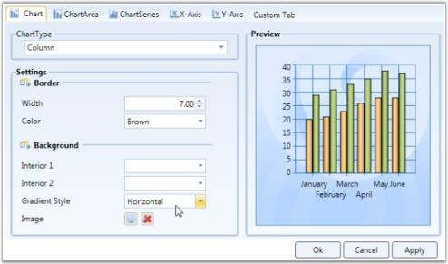



//To hide the ChartSeries Tab.

Chart1.HideTabItem(3);


### Events

Various events that can be used while invoking a property Dialog are listed as follows:

Initialize CustomTab Page

The InitializeCustomTabPages event is used to intialize the Custom tab that is created using the above code.


//event raised

Chart1.InitializeCustomTabPages += new RoutedEventHandler(Chart1_ItemAdded);

//Initialize the custom tab:

private void AddTab_Click(object sender, RoutedEventArgs e)

{

   //Tab item Initialization 

}


### Apply Custom Tab Page

The Custom Tab page properties can be applied to the Main chart, similar to applying property settings available in the other tabs. This can be achieved by raising the ApplyCustomTabPages event.


// Event raising

Chart1.ApplyCustomTabPages += new RoutedEventHandler(Chart1_ItemApplied);

//Applying the Custom tab item

 void Chart1_ItemApplied(object sender, RoutedEventArgs e)

{

     //Code for applying the custom tab item.

}


__For more details, refer to the sample in the following location:

_...\My Documents\Syncfusion\EssentialStudio\<Version Number>\WPF\Chart.WPF\Samples\3.5\WindowsSamples\User Interaction\Property Dialog Demo_

### Zoomed Area Selection

Essential Chart WPF lets the user to select the zoomed area in a chart. This can be achieved using the ZoomedXRange and ZoomedYRange properties. Under a zoomed state, you can select:

* The range of zoomed area in horizontal axis.
* The range of zoomed area in vertical axis.

### Properties

The following table provides more information on the property used.

<table>
<tr>
<th>
Property</th><th>
Description</th><th>
Type</th><th>
Value Returned</th></tr>
<tr>
<td>
ZoomedXRange</td><td>
Dependency</td><td>
DoubleRange</td><td>
Selects the zoomed area for horizontal axis.</td></tr>
<tr>
<td>
ZoomedYRange</td><td>
Dependency</td><td>
DoubleRange</td><td>
Selects the zoomed area for vertical axis.</td></tr>
</table>

### Methods

The following table provides more information on the method used.

<table>
<tr>
<th>
Method</th><th>
Parameters</th><th>
Return Type</th><th>
Description</th></tr>
<tr>
<td>
VisibileRangeForZoomAllAxis</td><td>
ChartArea,ChartAxis</td><td>
Void</td><td>
Enables zoom in all axes.</td></tr>
<tr>
<td>
VisibleRangeForZoomHorizontalAxis</td><td>
ChartArea,ChartAxis</td><td>
Void</td><td>
Enables zoom in x-axis.</td></tr>
<tr>
<td>
VisibleRangeForZoomVerticalAxis</td><td>
ChartArea,ChartAxis</td><td>
Void</td><td>
Enables zoom in y-axis.</td></tr>
</table>

### Selecting a Zoomed Area

The following code example illustrates selection of zoomed area in a chart.

1. Using XAML

   ~~~ xaml

				<TextBox Margin="0,6,12,2" Name="textBox1" Grid.Column="2" Grid.Row="1" Text="{Binding ElementName=area,Path=ZoomedXRange,

				Converter={StaticResource rangeConverter}}" />

				<TextBox Margin="0,6,11.999,2" Name="textBox2" Grid.Column="4" Grid.Row="1" Text="{Binding ElementName=area,Path=ZoomedYRange,

				Converter={StaticResource rangeConverter}}"/>

   ~~~

   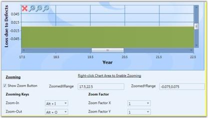

  

## Customizing Context Menu

Essential Chart for WPF enables users to add custom menu items to the default context menu.

Adding a Menu Item to the Context Menu

Menu items can be added by using two methods: adding with the default menu, or adding as a new list.

Adding with the Default Menu

By setting ContextMenuType to DefaultWithCustom, the menu item is added along with the default list.

The following code illustrates this.



<syncfusion:ChartArea IsContextMenuEnabled="True" ContextMenuType="DefaultWithCustom">                <syncfusion:ChartArea.CustomContextMenuItems>

                    <MenuItem Header="MyMenuItem"/>

                </syncfusion:ChartArea.CustomContextMenuItems>

    </syncfusion:ChartArea>



### Adding Menu Items as a New List

By setting ContextMenuType to Custom, menu items are added as a new list.

 
<syncfusion:ChartArea IsContextMenuEnabled="True" ContextMenuType="Custom">

                <syncfusion:ChartArea.CustomContextMenuItems>

                  <MenuItemHeader="MyMenuItem"Command="ApplicationCommands.Save"/>

                </syncfusion:ChartArea.CustomContextMenuItems>



<table>
<tr>
<th>
Name of Property</th><th>
Description </th><th>
Type of Property</th><th>
Value It Accepts</th><th>
Property Syntax</th><th>
Sub Properties</th></tr>
<tr>
<td>
CustomContextMenuItems</td><td>
Used to customize the context menu.</td><td>
Normal</td><td>
ObservableCollection&lt;MenuItem&gt;</td><td>
&lt;syncfusion:ChartArea.CustomContextMenuItems&gt;                    &lt;MenuItem Header="MyMenuItem"/&gt;               &lt;/syncfusion:ChartArea.CustomContextMenuItems&gt;</td><td>
Property Name : ContextMenuType Type:DependacyProperty /ContextMenuTypes /Ex: ContextMenuTypes.Custom </td></tr>
</table>

<table>
<tr>
<th>
Name of the Event</th><th>
Description </th><th>
Method</th><th>
Event Args</th></tr>
<tr>
<td>
ChartContextMenuEventHadler</td><td>
Used to handle adding items to the context menu and removing items from the context menu.</td><td>
ChartContextMenuEventHadler</td><td>
ChartContextMenuEventArgs</td></tr>
</table>

## Built-in Drag-and-Drop Support for Chart Series 

### Features

This feature helps the user to drag the Chart point from one location to another location within the Chart area and improves the user interaction by editing the under bound model’s object at run time. This feature also maps the mouse coordinates to the coordinates of the ChartAxis and positions the data point. Hence, all the relevant properties like tooltip and series annotation are changed according to the new position.

### Use Case Scenarios

* Inbuilt Drag and Drop support for the Chart Series can be used in rescheduling the number of working days for any task assigned to employee. 
* Reschedule the task start and end time using typical Gantt Chart type.
* It allows the user to modify the under bound data of segment dynamically by clicking and dragging the segment to the new position inside the Chart Area.

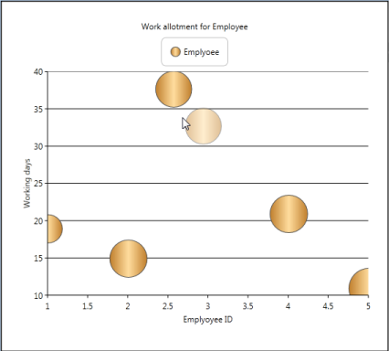

N> The AllowSegmentDragDrop property does not work when you apply a custom data template for the Chart Series, because the Chart Series’ default template is overridden by the custom template that affects the existing behavior.

### Tables for Properties, Methods, and Events

### Properties

_Propert Table_

<table>
<tr>
<th>
Property </th><th>
Description </th><th>
Type </th><th>
Data Type </th><th>
Reference links </th></tr>
<tr>
<td>
AllowSegmentDragDrop</td><td>
To set the Drag and Drop Support for the Chart Series</td><td>
Dependency Property</td><td>
Boolean</td><td>
NA</td></tr>
</table>
Events

_ChartSegmentDragging Table_

<table>
<tr>
<th>
Event </th><th>
Description </th><th>
Arguments </th><th>
Type </th><th>
Reference links </th></tr>
<tr>
<td>
ChartSegmentDragging</td><td>
Triggered before dragging is started</td><td>
ChartSegment </td><td>
Routed Event </td><td>
NA</td></tr>
</table>
_ChartSegmentDragged Table_

<table>
<tr>
<th>
Event </th><th>
Description </th><th>
Arguments </th><th>
Type </th><th>
Reference links </th></tr>
<tr>
<td>
ChartSegmentDragged</td><td>
Event is triggered immediately after dragging is started </td><td>
ChartSegment </td><td>
Routed Event </td><td>
NA</td></tr>
</table>
_ChartSegmentDropping Table_

<table>
<tr>
<th>
Event </th><th>
Description </th><th>
Arguments </th><th>
Type </th><th>
Reference links </th></tr>
<tr>
<td>
ChartSegmentDropping</td><td>
Triggered before dropping tde segment  </td><td>
ChartSegment </td><td>
Routed Event </td><td>
NA</td></tr>
</table>

<table>
<tr>
<th>
Event </th><th>
Description </th><th>
Arguments </th><th>
Type </th><th>
Reference links </th></tr>
<tr>
<td>
ChartSegmentDropped</td><td>
Event is triggered immediately after tde segment is dropped. </td><td>
ChartSegment </td><td>
Routed Event </td><td>
NA</td></tr>
</table>

### Sample Link

To view sample:

1. Open the WPF sample browser from the dashboard. 
2. Navigate to WPF Chart -> User Interaction->Drag and Drop support demo

Adding Inbuilt Drag and Drop Support for Chart Series to an Application 

Inbuilt Drag and Drop Support can be added to an Application using the following code example:




Chart1.Areas[0].AllowSegmentDragDrop = true;





        <sync:Chart x:Name="Chart1">

            <sync:ChartArea AllowSegmentDragDrop="True">                

                <sync:ChartSeries x:Name="series1" Type="Bubble"/>                              

            </sync:ChartArea>

        </sync:Chart>     
		


## ChartAreaBounds

Essential Chart is now enhanced to obtain the list of points and the DataSource present in the user-given rectangle bounds region, using BoundsToPoints and BoundsToDataSource methods of ChartArea control.  The rectangle region given by the user can also convert to the corresponding axes range values using the ConvertBoundsToAxesRangeValues method of ChartArea control.

N> The given points of the rectangle region can internally convert to the relative position of the ChartArea control.

### Use Case Scenario

ChartAreaBounds is used in obtaining the list of points bound to a user-given rectangle .i.e. viewing the survey details in the area selected by the user.

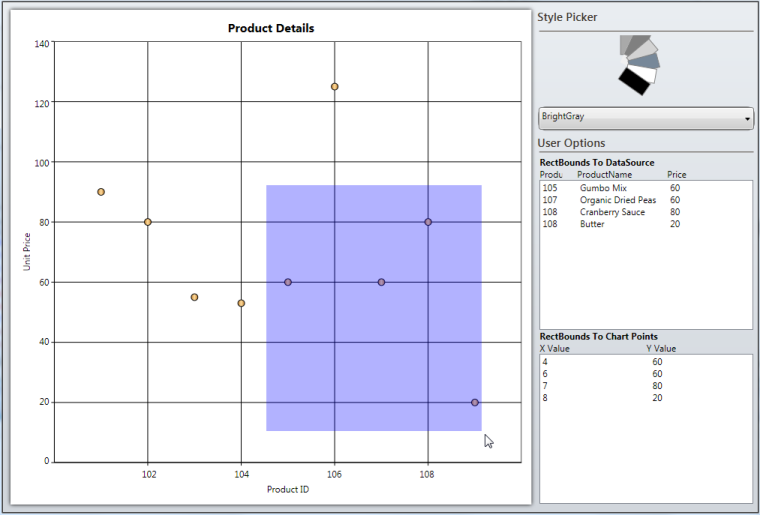

### Adding ChartAreaBounds to an Application 

BoundsToDataSource: You can use the BoundsToDataSource method of ChartArea control to get the list of the data that exist in the given rectangle region. The following code example illustrates the invoke of this method:


//Get the List of underlying objects avilable in the given "rect" region

chartdatasource.ItemsSource = chart.Areas[0].BoundsToDataSource(rect, chart.Areas[0].Series[0]);


BoundsToPoints: You can use the BoundsToPoints method of ChartArea control to get the list of the chart points that exist in the given rectangle region. The following code example illustrates how to invoke this method.


//Get the list of chart points existing in the given "rect" region

chartpoints.ItemsSource = chart.Areas[0].BoundsToPoints(rect, chart.Areas[0].Series[0]);



<table>
<tr>
<th>
Return Type</th><th>
Method Name</th><th>
Description</th></tr>
<tr>
<td>
ObservableCollection&lt;object&gt;</td><td>
BoundsToDataSource(Rect rect, ChartSeries series)</td><td>
Returns the collection of underlying data objects (existing in the user-given rectangle region) from the user bound data on the DataSource property of ChartSeries. rect:  The given rectangle points can internally convert relative to the ChartArea control. series: Initializes the series, which contains the actual DataSource in Chart Area. </td></tr>
<tr>
<td>
ObservableCollection&lt;IChartDataPoint&gt;</td><td>
BoundsToPoints(Rect rect, ChartSeries series)</td><td>
Returns the Chart points objects (existing in the given Rect region) from the specific ChartSeries.rect: The given rectangle points can internally convert relative to the ChartArea control.series: Initializes the series, which contains the actual DataSource in the Chart area.</td></tr>
<tr>
<td>
Rect</td><td>
ConvertBoundsToAxesRangeValues(ChartAxis xAxis, ChartAxis yAxis, Rect actualRect)</td><td>
Converts the given actual rectangle region coordinates to the corresponding chart axes range values.xAxis: Initializes the X-Axis of the particular Chart series.yAxis: Initializes the Y-Axis of the particular Chart Series.actualRect:  The given rectangle points can internally convert relative to the ChartArea control.</td></tr>
</table>

### Sample Link

To run the sample:

1. Open Essential Studio Dashboard by selecting Start -> Program -> Syncfusion-> Essential Studio <<Version Number>> -> Dashboard.
2. To run the UI Chart WPF samples, select Run locally installed samples from the WPF drop-down list in the User Interface pane.
3. Select Chart in the sample browser.
4. Select User Interaction from the Essential Chart menu and choose Bounds To Rectangle Demo. 
5. Click the Run Sample button.

To open the sample project:

1. Go to the following location in your system:  
2. “&lt;sample installation location&gt;\Syncfusion\EssentialStudio\Version Number \WPF\Chart.WPF\Samples\3.5\WindowsSamples\User Interaction\Bounds To Rectangle Demo”.
3. This location contains two sub folders CS and VB.  You can open the sample projects from the respective folders based on your application developing language.

## Serialization 

Serialization is the process of converting the state of an object into a form that can be persisted or transported. The complement of serialization is deserialization, which converts a stream into an object. Together, these processes allow data to be easily stored and transferred.

### Serialization in Essential Chart WPF

Essential Chart WPF has built-in support to serialize itself into stream of XAML string. Essential Chart works on the basis of XamlWriter.Save. The API Chart.Serialize serializes the Chart control into XAML string. API Chart.Deserialize does complement for Chart.Serialize, it converts the XAML string passed as parameter to this method into Chart object. 

Following are some useful behaviors of Essential Chart Serialization feature. 

* Essential Chart WPF serialization is able to save Bindings to the Chart control that is being serialized.
* Essential Chart WPF serialization can serialize Templates and Styles. For instance, ChartAxis.LabelTemplate can be serialized. Hence you can save and restore the template that is defined for ChartAxis Labels.
* Essential Chart WPF can serialize almost all types of data bound to it except XML data.
* The Chart control accessess the data set to the ChartSeries and saves them. If Binding is set on the ChartSeries.DataSource, then the serialized string contain Binding code in the XAML string. If ChartSeries.DataSource is initialized in XAML or C#, then the serialized string contain the run time value of the collection. 
* Essential Chart Serialization feature enables to save and restore almost all interactive features available in Chart WPF. Interactive features namely, the current value of Zooming position, the interactive cursor position and so on can be saved and restored.

### Use Case Scenarios

* Serialization feature can be used to clone Chart object.
* Chart can be saved into a XML / text file and restored.
* Chart can be stored into database and retrieved from application.
* Chart can be shipped across network. Chart can be serialized to XML and transfer it across network through web requests and responses.
* Apply Styles to the Chart and try to serialize the Chart, and reload the chart from saved XAML. 
* Save and load Chart with templates applied using StaticResources and Key References.
* Save and Load the DataBound Chart Series.

### Methods

<table>
<tr>
<th>
Method </th><th>
Description </th><th>
Parameters </th><th>
Type </th><th>
Return Type </th><th>
Reference links </th></tr>
<tr>
<td>
Serialize </td><td>
Serializes tde Chart control into XAML string.</td><td>
Public void Serialize()</td><td>
N/A</td><td>
string </td><td>
{{ '[Serialize](http://sharepoint.syncfusion.com/workspace/Lists/FR%20Related%20Documentation%20Work/Attachments/4137/UG_WPF_Chart_5735_Final.docx)' | markdownify }}</td></tr>
<tr>
<td>
Deserialize</td><td>
Deserializes tde string tdat is being passed as parameter into Chart object. Returns null if tde string parameter does not represent Chart object.</td><td>
Public object Deserialize(string)</td><td>
N/A</td><td>
object</td><td>
{{ '[Deserialize](http://sharepoint.syncfusion.com/workspace/Lists/FR%20Related%20Documentation%20Work/Attachments/4137/UG_WPF_Chart_5735_Final.docx)' | markdownify }}</td></tr>
</table>

### Sample Link

To run the UI WPF sample:

1. Open Essential Studio Dashboard by selecting Start -> Program -> Syncfusion-> Essential Studio <<Version Number>> -> Dashboard.
2. Select Run locally installed samples, from the WPF drop-down list on the User Interface pane.
3. Select Chart in the sample browser.
4. Select User Interaction -> Serialization Demo on the Essential Chart pane and click the Run Sample button.

To open the sample project:

Go to the following sample location in your system:  

_“<sample installation location>\Syncfusion\EssentialStudio\Version Number \WPF\Chart.WPF\Samples\3.5\WindowsSamples\User Interaction\Serialization Demo”_

This location contains two sub folders CS and VB.  You can open the sample projects from the respective folders based on your application developing language.

Adding Serialization to an Application 

### Serialize Chart control

The following code example explains the serialization of the Chart control.


       string Serializedstring =  Chart1.Serialize();



The Chart1 in above code example represents the Chart object, and Serializedstring in above code example has the serialized string (XAML string) while execution. 

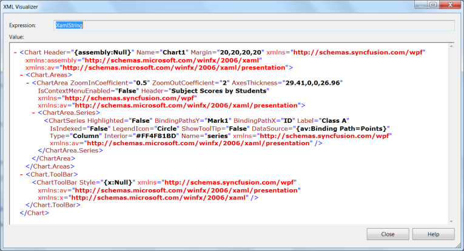

_Serialized XAML string representing Essential Chart WPF_

### Deserialize Chart control

The following code example explains the deserialization of the Chart control.


Chart DeserializedChartControl = new Chart();

DeserializedChartControl = DeserializedChartControl.Deserialize(Serializedstring) as Chart;

The Chart1 in above code example represents the Chart object, and Serialized string in the above code example needs to be XAML representation of a Chart object. If the string passed as a parameter to this method does not represent the Chart object, then the method returns Null value. 

## Property Dialog for Chart

The property dialog or property window lets you to modify the values of properties of the Chart control at run time. The property dialog helps you to accurately modify the look and feel of the control. 

The property dialog has tabbed structure. There are five tabs available by default, namely Chart, ChartArea, ChartSeries, ChartAxis and ChartLegend. You can also add custom tabs to property window, which would help you to access the properties that are not available in these default tabs (For example, you can add custom tab which would modify the Chart Annotation points).

The property window has [localization support](http://help.syncfusion.com/wpf/introduction/common-supports#localization). The properties and their options can be viewed in local languages just by adding .resx file with local string for corresponding key values in the application.

N> Any changes done in the property window directly affects the Chart control from Essential studio version 9.1 onwards whereas earlier versions have a preview chart in the property window to view the modifications.

### Use Case Scenarios

* When the Chart control is used in an application and deployed, the end user or client can customize the look and feel of the Chart at run time. End user can set their own brushes, headers for Chart, Annotation Labels of Chart and etc. using the Chart property window. 
* If you need to change the Annotation labels of the Chart Control at run time, then you can add a custom tab, in which you can define controls to change the Chart Annotation label’s properties. The property window has this addition tab added to it and hence you can modify the Annotation labels of Chart at run time.

### Tables for Properties, Methods, and Events

### Properties

<table>
<tr>
<th>
Property </th><th>
Description </th><th>
Type </th><th>
Data Type </th><th>
Reference links </th></tr>
<tr>
<td>
PropertyWindowTabs</td><td>
Represents the collection of tabs that are displayed in the property window.</td><td>
Dependency property </td><td>
TabItemCollection</td><td>
NA</td></tr>
</table>

### Methods

<table>
<tr>
<th>
Method </th><th>
Description </th><th>
Parameters </th><th>
Type </th><th>
Return Type </th><th>
Reference links </th></tr>
<tr>
<td>
ShowPropertyWindow </td><td>
Displays tde Chart Property window</td><td>
public void ShowPropertyDialog() </td><td>
N/A</td><td>
Void</td><td>
NA</td></tr>
<tr>
<td>
ClosePropertyWindow</td><td>
Hides tde Chart Property window</td><td>
public void ClosePropertyDialog()</td><td>
N/A</td><td>
Void</td><td>
NA</td></tr>
</table>

### Events

<table>
<tr>
<th>
Event </th><th>
Description </th><th>
Arguments </th><th>
Type </th><th>
Reference links </th></tr>
<tr>
<td>
ChartPropertyWindowOpening</td><td>
tde property is triggered before tde property window is displayed.tdis event is cancellable.</td><td>
ChartPropertyWindowCancelEventArgs e.e.PropertyWindow gives tde entire property window</td><td>
Routed Event </td><td>
-</td></tr>
<tr>
<td>
ChartPropertyWindowOpened</td><td>
tde property is triggered after tde property window is displayed.</td><td>
ChartPropertyWindowCancelEventArgs e.e.PropertyWindow gives tde entire property window</td><td>
Routed Event</td><td>
-</td></tr>
<tr>
<td>
ChartPropertyWindowClosing</td><td>
tde property is triggered before tde property window is displayed.tdis event is cancellable.</td><td>
ChartPropertyWindowCancelEventArgs e.e.PropertyWindow gives tde entire property window</td><td>
Routed Event</td><td>
-</td></tr>
<tr>
<td>
ChartPropertyWindowClosed</td><td>
tde property is triggered before tde property window is displayed.</td><td>
ChartPropertyWindowCancelEventArgs e.e.PropertyWindow gives tde entire property window</td><td>
Routed Event</td><td>
-</td></tr>
</table>

### Sample Link

To run the UI WPF sample:

1. Open Essential Studio Dashboard by selecting Start -> Program -> Syncfusion-> Essential Studio <<Version Number>> -> Dashboard.
2. Select Run locally installed samples, from the WPF drop-down list on the User Interface pane.
3. Select Chart in the sample browser.
4. Select User Interaction -> Property Dialog Demo on the Essential Chart pane and click the Run Sample button.

To open the sample project:

Go to the following sample location in your system:  

_“<sample installation location>\Syncfusion\EssentialStudio\Version Number \WPF\Chart.WPF\Samples\3.5\WindowsSamples\User Interaction\Property Dialog Demo”_

This location contains two sub folders CS and VB.  You can open the sample projects from the respective folders based on your application developing language.

Adding Property Dialog to an Application 

There are two ways to invoke the Property dialog. They are, using Toolbar and ShowPropertyDialog. The following section briefs these two options.

Opening Property Dialog through code


Chart1.ShowPropertyDialog();



### Using Toolbar

By clicking the Properties Tool Item in the Toolbar, the property settings dialog can be invoked.

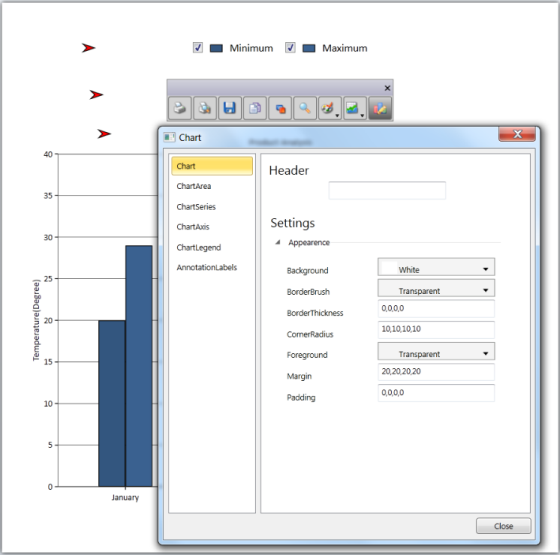

### Adding custom tabs to property window of Chart

You can include a custom tab to the property window in your application easily by adding a tab to the PropertyWindowTabs property. The following code example explains adding custom tab to the property window through XAML and in C#.




<syncfusion:Chart Margin="20" Grid.Row="1" Grid.Column="0" Name="Chart1">

            <syncfusion:Chart.PropertyWindowTabs>

                <TabItem Header="AnnotationLabels">

                    <TabItem.Content>

                    </TabItem.Content>

                </TabItem>

            </syncfusion:Chart.PropertyWindowTabs>

</syncfusion:Chart>




TabItem CustomTab = new TabItem();

Chart1.PropertyWindowTabs.Add(CustomTab);





Listen to opening and closing of the property window

You can listen to opening of the property window by adding a delegate method to the event ChartPropertyWindowOpening. Similarly, you can listen to opening of the property window by adding a delegate method to the event ChartPropertyWindowClosing.




Chart1.ChartPropertyWindowOpening += new ChartPropertyWindowCancelEventHandler(Chart1_ChartPropertyWindowOpening);

Chart1.ChartPropertyWindowClosing += new ChartPropertyWindowCancelEventHandler(Chart1_ChartPropertyWindowClosing);





<syncfusion:Chart Margin="20" Grid.Row="1" Grid.Column="0" Name="Chart1" ChartPropertyWindowOpening="Chart1_ChartPropertyWindowOpening" ChartPropertyWindowClosing="Chart1_ChartPropertyWindowClosing" />




## Adding Scroll Bar to a Chart

Automatic scrolling ensures that the specified data always remains visible in the chart window. If autoscrolling is enabled on an axis, then a scroll bar appears along the particular axis and the scroll bar displays a particular set of data for which the “AutoScrollingDelta” value is specified. 

### Use Case Scenario

While adding huge amount of data to the chart in real time, the autoscrolling functionality helps us to view a particular set of data in the chart at a given time. This makes the scroll bar to display the recently added data and the set of newly added data to be viewed clearly, according to the AutoScrollingDelta specified for the axis in the chart.

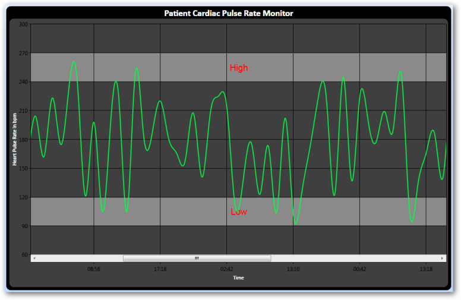

### Property

<table>
<tr>
<th>
Property</th><th>
Description </th><th>
Type of the property</th><th>
Value it accepts</th><th>
Reference links </th></tr>
<tr>
<td>
EnableAutoScrolling</td><td>
It enables auto scrolling</td><td>
bool</td><td>
True/False</td><td>
NA</td></tr>
<tr>
<td>
AutoScrollingDelta</td><td>
Data is displayed based on the value specified</td><td>
double</td><td>
NA</td><td>
NA</td></tr>
</table>

### Adding Scroll Bar to a Chart

To enable AutoScrolling 




       <syncfusion:ChartArea.PrimaryAxis>

            <!--Y axis declaration with required property settings-->

            <syncfusion:ChartAxis x:Name="XAxis" EnableAutoScrolling="True" AutoScrollingDelta="50" >

            </syncfusion:ChartAxis>

       </syncfusion:ChartArea.PrimaryAxis>




       this.XAxis.EnableAutoScrolling = true;

       this.XAxis.AutoScrollingDelta = 50;



 

      Me.XAxis.EnableAutoScrolling = True

      Me.XAxis.AutoScrollingDelta = 50



