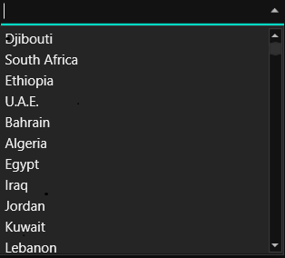

# Appearance in WPF AutoComplete (Classic)

## Theme

AutoComplete supports various built-in themes. Refer to the below links to apply themes for the AutoComplete,

  * [Apply theme using SfSkinManager](https://help.syncfusion.com/wpf/themes/skin-manager)
	
  * [Create a custom theme using ThemeStudio](https://help.syncfusion.com/wpf/themes/theme-studio#creating-custom-theme)

   

## Show the shadow effect

You can show the shadow effect of AutoComplete by using [DropShadowEffect](https://docs.microsoft.com/en-us/dotnet/api/system.windows.media.effects.dropshadoweffect?view=netcore-3.1). You can also set the distance between the control and shadow by using [ShadowDepth](https://docs.microsoft.com/en-us/dotnet/api/system.windows.media.effects.dropshadoweffect.shadowdepthproperty?view=netcore-3.1) property.

Refer the below code for your reference.





<syncfusion:AutoComplete Height="30" Width="150" Text="AutoComplete">
    <syncfusion:AutoComplete.Effect>
        <DropShadowEffect ShadowDepth="10" Color="LightGray" Opacity="2" />
    </syncfusion:AutoComplete.Effect>
</syncfusion:AutoComplete>





AutoComplete autoComplete = new AutoComplete();
autoComplete.Height = 30;
autoComplete.Width = 150;
autoComplete.Text = "AutoComplete";
DropShadowEffect shadowEffect = new DropShadowEffect();
shadowEffect.ShadowDepth = 10;
shadowEffect.Color = Colors.LightGray;
shadowEffect.Opacity = 2;
autoComplete.Effect = shadowEffect;
grid.Children.Add(autoComplete);





