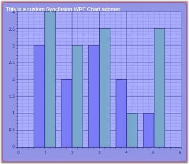

## Use Custom Adorners In Chart Or Chart Area

Custom Adorners can be added to the Chart or ChartArea to add any custom UI elements over the Chart or ChartArea. The following code example illustrates adding and removing adorners to a ChartArea.





<sfchart:Chart Name="Chart1">

    <sfchart:ChartArea GridBackground="White">

        <sfchart:ChartSeries Name="Series11" Type= "Column"

        DataSource="{Binding Source={StaticResource myXmlData}, XPath=Products/Product}"

        BindingPathX="X" BindingPathsY="Series1Y, Series1Y1" >

        </sfchart:ChartSeries>

    </sfchart:ChartArea>

</sfchart:Chart>




public class Window1 : Window

{

    public Window1()

    {

        InitializeComponent();

    }

    private void SetAdornmentClick(object sender, RoutedEventArgs e)

    {

        foreach (ChartArea area in Chart1.Areas)

        {

            AdornerLayer.GetAdornerLayer(area).Add(new CustomAdorner(area));

        }

    }

    private void RemoveAdornment(object sender, RoutedEventArgs e)

    {

        // Get adorner layer for Chart control.

        foreach (ChartArea area in Chart1.Areas)

        {

            AdornerLayer adornerLayer = AdornerLayer.GetAdornerLayer(area);

            // Iterate over each adorner.

            foreach (Adorner adorner in adornerLayer.GetAdorners(area))

            {

                if (adorner is CustomAdorner)

                {

                    adornerLayer.Remove(adorner);

                    break;

                }

            }

        }

    }

}

internal class CustomAdorner : Adorner

{

    public CustomAdorner(UIElement adornedElement)

        : base(adornedElement) { }

    protected override void OnRender(DrawingContext drawingContext)

    {

        Brush b = (Brush)new BrushConverter().ConvertFromString("#7A4047F7");

        drawingContext.DrawRectangle(b, new Pen(Brushes.Red, 1), new Rect(new Point(0, 0), DesiredSize));

        FormattedText text = new FormattedText("This is a custom Syncfusion WPF Chart adorner", Thread.CurrentThread.CurrentUICulture,

        FlowDirection.LeftToRight, new Typeface("Arial"), 14, Brushes.White);

        drawingContext.DrawText(text, new Point(10, 10));

        base.OnRender(drawingContext);

    }

}



