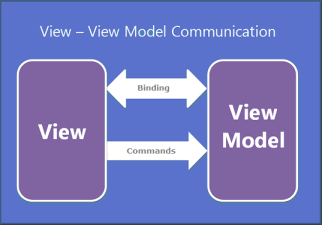
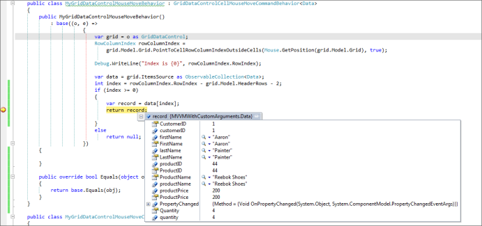

# MVVM Enhancements

## View – View Model Communication

In MVVM, commands are used to communicate between the View and View Model when a particular action takes place in the View. The GridData control contains events for all actions. In some cases, you may have to use events to meet requirements that do not adhere to the MVVM policy; you can overcome this with the EventToCommand approach.

To support the EventToCommand approach, commands have been added for all events in the GridData control and tables to provide complete MVVM support.

GridData control has two commands for each event. The first one passes the event argument to the command as parameter, and the second one does not pass any parameter to the command. This apart, the command parameter can also be changed at Sample level.

## Adding Commands to a GridData Control

You can add commands to a GridData control in the following three ways:

* By using Command with actual event arguments
* By using Command with custom parameter
* By overriding existing command behavior

### By using a Command with Actual Event Arguments

This section explains how to add GridDataControlRecordsSelectionChangedCommandWithEventArgs command to the GridData control. The actual event arguments are passed to the Command method as parameters.

The following code example illustrates how to define the GridDataControlRecordsSelectionChangeddCommandWithEventArgs command in XAML.



<syncfusion:GridDataControl x:Name="dataGrid" AutoPopulateColumns="True" AutoPopulateRelations="False" 

ItemsSource="{Binding GDCSource}" ShowAddNewRow="False" 

syncmvvm:GridDataControlRecordsSelectionChangedCommandWithEventArgs.Command="{Binding SelectedItemChanged}">



The following code example illustrates binding GridDataControlRecordsSelectionChangedCommandWithEventArgs defined in the View.



private BaseCommand selectedItemChanged;

public BaseCommand SelectedItemChanged

{

get
{

if (selectedItemChanged == null)
selectedItemChanged = new BaseCommand(SelectedItemChangedMethod);
return selectedItemChanged;

}

}

void SelectedItemChangedMethod(object parameter)
{

var item = parameter as GridDataRecordsSelectionChangedEventArgs;
if (item != null)

{

var data = item.AddedItems[0] as Data;
this.SelectedCustomerID = "Customer ID : " + data.CustomerID;

}

}



When you select a record while running your application, the SelectedItemChanged command is triggered with the actual GridDataRecordsSelectionChangedEventArgs event argument.

### Sample Location

A sample application can be downloaded from the following location:

[http://www.syncfusion.com/downloads/Support/DirectTrac/95643/MVVMWithActualEventArgs1100780673.zip](http://www.syncfusion.com/downloads/Support/DirectTrac/95643/MVVMWithActualEventArgs1100780673.zip)

## By using a Command with a Custom Parameter

This section illustrates how to add the GridDataControlRecordsSelectionChangedCommand command to the GridData control and pass the GridData control as customer parameter.

The following code example can be used to define GridDataControlRecordsSelectionChangeddCommand in XAML.



<syncfusion:GridDataControl x:Name="dataGrid" Grid.Row="0" AutoPopulateColumns="False" ItemsSource="{Binding GDCSource}"

				syncmvvm:GridDataControlRecordsSelectionChangedCommand.Command="{Binding SelectedItemChanged}"

				syncmvvm:GridDataControlRecordsSelectionChangedCommand.CommandParameter="{

				Binding ElementName=dataGrid}">



The following code example is used for binding GridDataControlRecordsSelectionChangedCommand defined in the view.



private BaseCommand selectedItemChanged;

public BaseCommand SelectedItemChanged
{

	get

	{

		if (selectedItemChanged == null)

		selectedItemChanged = new BaseCommand(SelectedItemChangedMethod);

		return selectedItemChanged;

	}

}

void SelectedItemChangedMethod(object parameter)
{

	var grid = parameter as GridDataControl;
	
	if(grid != null)
	{

		var data = grid.SelectedItem as Data;
		this.SelectedCustomerID = "Customer ID : " +  data.CustomerID;

	}

}



When you select a record while running your application, the SelectedItemChanged command gets triggered with the custom GridDataControl parameter.

If there is no parameter set in the View, then the parameter is passed in the method call.

#### Sample Location

A sample application can be downloaded from the following location:

[http://www.syncfusion.com/downloads/Support/DirectTrac/95643/MVVMWithCustomParameter1792996222.zip](http://www.syncfusion.com/downloads/Support/DirectTrac/95643/MVVMWithCustomParameter1792996222.zip)

### By Overriding the Command Behavior

Another approach is to override a command’s behavior with a custom parameter. This section explains how to override the GridDataControlCellMouseMoveCommandBehavior and return the record (i.e. return the record on which the pointer rests).

First, you need to create a class and override it from the GridDataControlCellMouseMoveCommandBehavior as shown in the following code example.



public class MyGridDataControlMouseMoveBehavior : GridDataControlCellMouseMoveCommandBehavior<Data>
{

public MyGridDataControlMouseMoveBehavior(): base((o, e) =>

{

	var grid = o as GridDataControl;
	
	RowColumnIndex rowColumnIndex = grid.Model.Grid.PointToCellRowColumnIndexOutsideCells(Mouse.GetPosition(grid.Model.Grid), true);
	
	Debug.WriteLine("Index is {0}", rowColumnIndex.RowIndex);
	
	var data = grid.ItemsSource as ObservableCollection<Data>;
	
	int index = rowColumnIndex.RowIndex - grid.Model.HeaderRows - 2;
	
	if (index >= 0)
	{

		var record = data[index];
		return record;

	}                   
	else
		return null;

	})
}

public class MyGridDataControlMouseMoveCommand : GridDataControlCellMouseMoveCommand<Data, MyGridDataControlMouseMoveBehavior>        
{

} 



Now, bind the behavior to the GridData control. The following code example illustrates this.



<syncfusion:GridDataControl x:Name="dataGrid" Grid.Row="0" AutoPopulateColumns="True" AutoPopulateRelations="False" ItemsSource="{Binding GDCSource}"                        Utils:MyGridDataControlMouseMoveCommand.Command="{Binding MouseMoveCommand}"

							VisualStyle="Office14Blue" />
							


When you hover the mouse over a row while running your application, the overridden behavior class triggers and returns the current record.

#### Sample Location

A sample application can be downloaded from the following location:

[http://www.syncfusion.com/downloads/Support/DirectTrac/95643/MVVMWithCustomArguments1965076929.zip](http://www.syncfusion.com/downloads/Support/DirectTrac/95643/MVVMWithCustomArguments1965076929.zip)