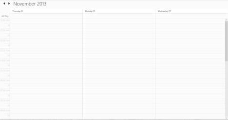
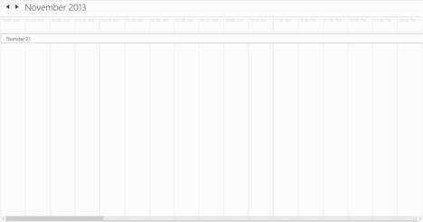

# Visible-Dates-customization in WPF Schedule (Classic)

All views in the schedule have their own number of visible dates. The SfSchedule control allows users to view multiple dates in the day and time line views.

If users want to view particular dates in a single view, users can provide a DateTime collection to the ScheduleDateRange property to view the particular dates in the day and time line view types.



ObservableCollection<DateTime> visibleDates = newObservableCollection<DateTime>();

            DateTime Date1 = new DateTime(2013, 9, 1);

            DateTime Date2 = new DateTime(2013, 9, 22);

            visibleDates.Add(Date1);

            visibleDates.Add(Date2);

            SfSchedule schedule = new SfSchedule();

            schedule.ScheduleDateRange= visibleDates;



