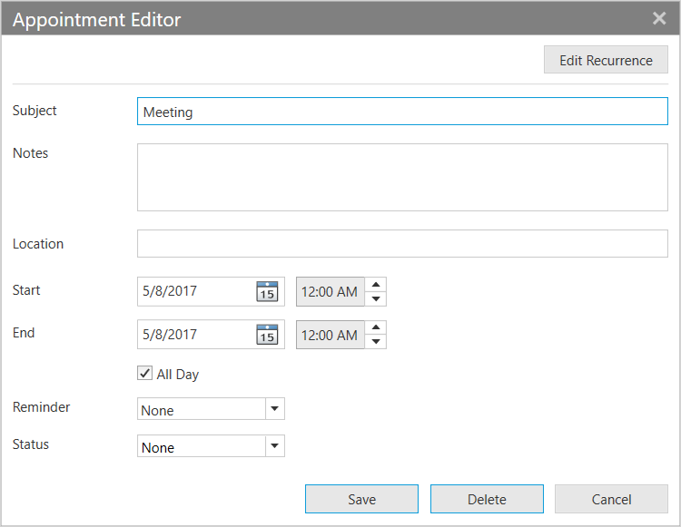
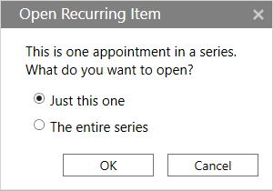
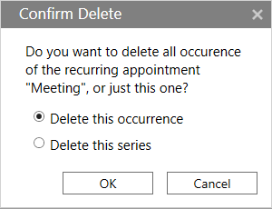

# Appointment Editing in WPF Schedule (Classic)
This section explains how to handle appointment editing in WPF scheduler and also explains about the appointment resizing and drag drop operations.

## Editing Appointment
Scheduler supports to edit the appointment by using 'Appointment Editor' UI window. User can open this window by double click over the appointment or right click over the appointment and select the edit option from the `ContextMenu`.

ContextMenu edit option

Appointment editor window

User can edit the fields in appointment editor window. The changes will be saved back in appointment and mapped data object when using data binding. 

## Edit recurring appointment
Scheduler supports to edit the recurrence appointment. The following window will appear when user edit the recurrence appointment to select whether to edit only the particular occurrence or appointment series.

You can also handle the opening of `Open Recurring Item` window using `RecurrenceEditMode` property in [AppointmentEditorOpeningEventArgs](https://help.syncfusion.com/cr/wpf/Syncfusion.UI.Xaml.Schedule.AppointmentEditorOpeningEventArgs.html) by handling `AppointmentEditorOpening` event.

#### AppointmentEditorOpening event
When user opens the appointment editor UI window to edit the appointment, then scheduler notifies by [AppointmentEditorOpening](https://help.syncfusion.com/cr/wpf/Syncfusion.UI.Xaml.Schedule.SfSchedule.html) event.

[AppointmentEditorOpeningEventArgs](https://help.syncfusion.com/cr/wpf/Syncfusion.UI.Xaml.Schedule.AppointmentEditorOpeningEventArgs.html) has following members which provides information for `AppointmentEditorOpening` event.

[Action](https://help.syncfusion.com/cr/wpf/Syncfusion.UI.Xaml.Schedule.AppointmentEditorOpeningEventArgs.html#Syncfusion_UI_Xaml_Schedule_AppointmentEditorOpeningEventArgs_Action) - Gets the action (add or delete or edit) for the selected appointment.

[Appointment](https://help.syncfusion.com/cr/wpf/Syncfusion.UI.Xaml.Schedule.AppointmentEditorOpeningEventArgs.html#Syncfusion_UI_Xaml_Schedule_AppointmentEditorOpeningEventArgs_Appointment) - Gets the selected appointment details.

`RecurrenceEditMode` - Get or Sets the edit mode to perform the edit option to edit the occurrence or series for recurrence appointment.
    
    * User - Default window dialog will appear when editing a recurrence appointment to select the edit option from the end-user itself.
    * Occurrence - Edit the particular occurrence alone in recurrence appointment. Default window dialog will not appear.
    * Series - Edit the entire series in recurrence appointment. Default window dialog will not appear.

[SelectedResource](https://help.syncfusion.com/cr/wpf/Syncfusion.UI.Xaml.Schedule.AppointmentEditorOpeningEventArgs.html#Syncfusion_UI_Xaml_Schedule_AppointmentEditorOpeningEventArgs_SelectedResource) - Gets the selected appointment resource details if scheduler does have the resource.

[StartTime](https://help.syncfusion.com/cr/wpf/Syncfusion.UI.Xaml.Schedule.AppointmentEditorOpeningEventArgs.html#Syncfusion_UI_Xaml_Schedule_AppointmentEditorOpeningEventArgs_StartTime) - Gets the appointment start time

[Cancel](https://docs.microsoft.com/en-us/dotnet/api/system.componentmodel.canceleventargs.cancel) - To avoid the default appointment editor showing by enabling this property. 

For example, to use custom the appointment editor window instead of default appointment editor window you can handle [AppointmentEditorOpening](https://help.syncfusion.com/cr/wpf/Syncfusion.UI.Xaml.Schedule.SfSchedule.html) event.



this.schedule.AppointmentEditorOpening += Schedule_AppointmentEditorOpening;
private void Schedule_AppointmentEditorOpening(object sender, AppointmentEditorOpeningEventArgs e)
{
    //To handle the default appointment editior window by setting the e.Cancel value as true.
    e.Cancel = true;
    if (e.Appointment != null)
    {
        //Display the custom appointment editor window to edit the appointment
    }
    else
    {
        //Display the custom appointment editor window to add new appointment
    }
}



#### AppointmentEditorClosed
Scheduler notifies by [AppointmentEditorClosed](https://help.syncfusion.com/cr/wpf/Syncfusion.UI.Xaml.Schedule.SfSchedule.html) when user close the appointment editor window.
[AppointmentEditorClosedEventArgs](https://help.syncfusion.com/cr/wpf/Syncfusion.UI.Xaml.Schedule.AppointmentEditorClosedEventArgs.html) event has following members which provides information for `AppointmentEditorClosed` event.

[Action](https://help.syncfusion.com/cr/wpf/Syncfusion.UI.Xaml.Schedule.AppointmentEditorClosedEventArgs.html#Syncfusion_UI_Xaml_Schedule_AppointmentEditorClosedEventArgs_Action) - Gets the action of appointment which is add or delete or edit.

[EditedAppointment](https://help.syncfusion.com/cr/wpf/Syncfusion.UI.Xaml.Schedule.AppointmentEditorClosedEventArgs.html#Syncfusion_UI_Xaml_Schedule_AppointmentEditorClosedEventArgs_EditedAppointment) - Gets the edited appointment details if appointment editor closed with edit action.

[OriginalAppointment](https://help.syncfusion.com/cr/wpf/Syncfusion.UI.Xaml.Schedule.AppointmentEditorClosedEventArgs.html#Syncfusion_UI_Xaml_Schedule_AppointmentEditorClosedEventArgs_OriginalAppointment) - Gets the selected appointment details.

[IsNew](https://help.syncfusion.com/cr/wpf/Syncfusion.UI.Xaml.Schedule.AppointmentEditorClosedEventArgs.html#Syncfusion_UI_Xaml_Schedule_AppointmentEditorClosedEventArgs_IsNew) - Gets the appointment is new or not. 

[Handled](https://help.syncfusion.com/cr/wpf/Syncfusion.UI.Xaml.Schedule.AppointmentEditorClosedEventArgs.html#Syncfusion_UI_Xaml_Schedule_AppointmentEditorClosedEventArgs_Handled) - To handle appointment editor changes update into the Scheduler `Appointments` collection.

For example, to handle the appointment adding for today's date, you can handle the `AppointmentEditorClosed` event.



this.schedule.AppointmentEditorClosed += Schedule_AppointmentEditorClosed;
private void Schedule_AppointmentEditorClosed(object sender, AppointmentEditorClosedEventArgs e)
{
    var appointment = e.EditedAppointment as ScheduleAppointment;
    if (appointment != null)
    {
        if (appointment.StartTime.Day == DateTime.Now.Day)
            e.Handled = true;
    }
}



## Disable appointment editing
Scheduler supports to prevent the editing of the appointments by using [AllowEditing](https://help.syncfusion.com/cr/wpf/Syncfusion.UI.Xaml.Schedule.SfSchedule.html#Syncfusion_UI_Xaml_Schedule_SfSchedule_AllowEditing) property.



<Schedule:SfSchedule x:Name="Schedule" AllowEditing="False"/>


this.Schedule.AllowEditing = false;



## Create read only appointment
Scheduler supports to create the read only appointment by using [ScheduleAppointment.ReadOnly]((https://help.syncfusion.com/cr/wpf/Syncfusion.UI.Xaml.Schedule.ScheduleAppointment.html#Syncfusion_UI_Xaml_Schedule_ScheduleAppointment_ReadOnly)) property. If you enable this property, user will not be able to perform edit, resize and drag drop operations.



//// Creating an instance for schedule appointment collection
ScheduleAppointmentCollection scheduleAppointmentCollection = new ScheduleAppointmentCollection();
////Adding schedule appointment in schedule appointment collection 
scheduleAppointmentCollection.Add(new ScheduleAppointment()
{
    StartTime = new DateTime(2017, 05, 08, 10, 0, 0),
    EndTime = new DateTime(2017, 05, 10, 10, 0, 0),
    Subject = "Anniversary",
    Location = "Hutchison road",
    ReadOnly = true,
    AppointmentBackground = Brushes.Green
});

//Adding schedule appointment collection to Appointments of SfSchedule
this.Schedule.Appointments = scheduleAppointmentCollection;



## Appointment deleting
Scheduler supports three ways to remove the selected appointment
1. Pressing <kbd>Delete</kbd> key
2. Using `ContextMenu` delete option.
3. Using AppointmentEditor.

#### Delete recurring appointment
Scheduler supports to delete the recurrence appointment. The following window will appear when user deletes the recurrence appointment to select the delete option to make the changes for occurrence or appointment series.

#### AppointmentDeleting event
Scheduler notifies by [AppointmentDeleting](https://help.syncfusion.com/cr/wpf/Syncfusion.UI.Xaml.Schedule.SfSchedule.html) event when user delete the appointment.
[AppointmentDeletingEventArgs](https://help.syncfusion.com/cr/wpf/Syncfusion.UI.Xaml.Schedule.AppointmentDeletingEventArgs.html) has following members which provides information for `AppointmentDeleting` event.

`Appointment` - Gets the selected appointment
`MappedObject` - Gets the binding object details of selected appointment if schedule appointments are mapped with custom object.
`RecurrenceEditMode` - Gets or sets whether to delete particular occurrence or appointment sequence when delete a recurrence appointment. You can let end-user handle this option (using built-in dialog shown in scheduler) or define it by yourself using `AppointmentDeleting` event. 
    * User - Default window dialog will appear when deleting a recurrence appointment to select the delete option from the end-user itself.
    * Occurrence - Delete the particular occurrence alone in recurrence appointment. Default window dialog will not appear.
    * Series - Delete the entire series in recurrence appointment. Default window dialog will not appear.
[Cancel](https://docs.microsoft.com/en-us/dotnet/api/system.componentmodel.canceleventargs.cancel) - By enabling this property, avoid deleting the appointment. 

## Appointment resizing
Scheduler supports to resize the appointment using the option `Resize`option from the `ScheduleAppointment` context menu. This support is available for all views except 'Month' view.

#### AppointmentStartResizing event
Scheduler notifies by [AppointmentStartResizing](https://help.syncfusion.com/cr/wpf/Syncfusion.UI.Xaml.Schedule.SfSchedule.html) event when user start to resize the appointment.

[AppointmentStartResizingEventArgs](https://help.syncfusion.com/cr/wpf/Syncfusion.UI.Xaml.Schedule.AppointmentStartResizingEventArgs.html) has following members which provides information for `AppointmentStartResizing` event.

[Appointment](https://help.syncfusion.com/cr/wpf/Syncfusion.UI.Xaml.Schedule.AppointmentStartResizingEventArgs.html#Syncfusion_UI_Xaml_Schedule_AppointmentStartResizingEventArgs_Appointment) - Get the appointment details that is start to resize.
[Cancel](https://docs.microsoft.com/en-us/dotnet/api/system.componentmodel.canceleventargs.cancel) - Setting value to true, cancels the triggered action.



this.schedule.AppointmentStartResizing += Schedule_AppointmentStartResizing;
private void Schedule_AppointmentStartResizing(object sender, AppointmentStartResizingEventArgs e)
{
    //To notify when start to resize the appointment.    
}



#### AppointmentResizing event
Scheduler notifies by [AppointmentResizing](https://help.syncfusion.com/cr/wpf/Syncfusion.UI.Xaml.Schedule.SfSchedule.html) event when user resizing the appointment.

[AppointmentResizingEventArgs](https://help.syncfusion.com/cr/wpf/Syncfusion.UI.Xaml.Schedule.AppointmentResizingEventArgs.html) has following members which provides information for `AppointmentResizing` event.

[Appointment](https://help.syncfusion.com/cr/wpf/Syncfusion.UI.Xaml.Schedule.AppointmentStartResizingEventArgs.html#Syncfusion_UI_Xaml_Schedule_AppointmentStartResizingEventArgs_Appointment) - Gets the resizing appointment details.

[From](https://help.syncfusion.com/cr/wpf/Syncfusion.UI.Xaml.Schedule.AppointmentResizingEventArgs.html#Syncfusion_UI_Xaml_Schedule_AppointmentResizingEventArgs_From) - Gets the appointment start time.

[To](https://help.syncfusion.com/cr/wpf/Syncfusion.UI.Xaml.Schedule.AppointmentResizingEventArgs.html#Syncfusion_UI_Xaml_Schedule_AppointmentResizingEventArgs_To) - Gets the appointment end time.

[ResizeType](https://help.syncfusion.com/cr/wpf/Syncfusion.UI.Xaml.Schedule.AppointmentResizingEventArgs.html#Syncfusion_UI_Xaml_Schedule_AppointmentResizingEventArgs_ResizeType) - Gets the resize type for appointment whether it is resizing from start or end.

[RefreshAppointment](https://help.syncfusion.com/cr/wpf/Syncfusion.UI.Xaml.Schedule.AppointmentResizingEventArgs.html#Syncfusion_UI_Xaml_Schedule_AppointmentResizingEventArgs_RefreshAppointment) - Get or Sets appointment need to be refresh or not. 



this.schedule.AppointmentResizing += Schedule_AppointmentResizing;
private void Schedule_AppointmentStartResizing(object sender, AppointmentResizingEventArgs e)
{
    //To notify when resizing the appointment.    
}



#### AppointmentEndResizing event
Scheduler notifies by [AppointmentEndResizing](https://help.syncfusion.com/cr/wpf/Syncfusion.UI.Xaml.Schedule.SfSchedule.html) event when user ends the appointment resizing.

[AppointmentEndResizingEventArgs](https://help.syncfusion.com/cr/wpf/Syncfusion.UI.Xaml.Schedule.AppointmentEndResizingEventArgs.html) has following members which provides information for `AppointmentEndResizing` event.

[Appointment](https://help.syncfusion.com/cr/wpf/Syncfusion.UI.Xaml.Schedule.AppointmentEndResizingEventArgs.html#Syncfusion_UI_Xaml_Schedule_AppointmentEndResizingEventArgs_Appointment) - Gets the resizing appointment details.

[From](https://help.syncfusion.com/cr/wpf/Syncfusion.UI.Xaml.Schedule.AppointmentEndResizingEventArgs.html#Syncfusion_UI_Xaml_Schedule_AppointmentEndResizingEventArgs_From) - Gets the appointment start time.

[To](https://help.syncfusion.com/cr/wpf/Syncfusion.UI.Xaml.Schedule.AppointmentEndResizingEventArgs.html#Syncfusion_UI_Xaml_Schedule_AppointmentEndResizingEventArgs_To) - Gets the appointment end time.

[ResizeType](https://help.syncfusion.com/cr/wpf/Syncfusion.UI.Xaml.Schedule.AppointmentEndResizingEventArgs.html#Syncfusion_UI_Xaml_Schedule_AppointmentEndResizingEventArgs_ResizeType) - Gets the resize type for appointment whether it is resizing from start or end.

[Cancel](https://docs.microsoft.com/en-us/dotnet/api/system.componentmodel.canceleventargs.cancel) - Setting value to true, cancels the triggered action.



this.schedule.AppointmentEndResizing += Schedule_AppointmentResizing;
private void Schedule_AppointmentStartResizing(object sender, AppointmentEndResizingEventArgs e)
{
    //To notify when resizing is completed for an appointment.    
}



## Drag and drop
Scheduler supports to reschedule the appointment by performing the drag and drop operation. This support is available for all views. 

#### DragStarting event
Scheduler notifies by [DragStarting](https://help.syncfusion.com/cr/wpf/Syncfusion.UI.Xaml.Schedule.SfSchedule.html) when start to drag the appointment.
[DragStartingEventArgs](https://help.syncfusion.com/cr/wpf/Syncfusion.UI.Xaml.Schedule.DragStartingEventArgs.html) has following members which provides information for `DragStarting` event.

[Appointment](https://help.syncfusion.com/cr/wpf/Syncfusion.UI.Xaml.Schedule.DragStartingEventArgs.html#Syncfusion_UI_Xaml_Schedule_DragStartingEventArgs_Appointment) - Get the selected appointment.
[Cancel](https://docs.microsoft.com/en-us/dotnet/api/system.componentmodel.canceleventargs.cancel) - Setting the value as `true` to prevent the drag and drop operation.



this.schedule.DragStarting += Schedule_DragStarting;
private void Schedule_DragStarting(object sender, DragStartingEventArgs e)
{
    //To notify when start to drag the appointment.
}



#### AppointmentDragging event
Scheduler notifies by [AppointmentDragging](https://help.syncfusion.com/cr/wpf/Syncfusion.UI.Xaml.Schedule.SfSchedule.html) when drag the appointment.
[AppointmentDraggingEventArgs](https://help.syncfusion.com/cr/wpf/Syncfusion.UI.Xaml.Schedule.AppointmentDraggingEventArgs.html) has following members which provides information for `AppointmentDragging` event.

[Appointment](https://help.syncfusion.com/cr/wpf/Syncfusion.UI.Xaml.Schedule.AppointmentDraggingEventArgs.html#Syncfusion_UI_Xaml_Schedule_AppointmentDraggingEventArgs_Appointment) - Gets the selected appointment.
[From](https://help.syncfusion.com/cr/wpf/Syncfusion.UI.Xaml.Schedule.AppointmentDraggingEventArgs.html#Syncfusion_UI_Xaml_Schedule_AppointmentDraggingEventArgs_From) - Gets the selected appointment start time.
[RefreshAppointment](https://help.syncfusion.com/cr/wpf/Syncfusion.UI.Xaml.Schedule.AppointmentDraggingEventArgs.html#Syncfusion_UI_Xaml_Schedule_AppointmentDraggingEventArgs_RefreshAppointment) - Gets or sets the bool value to update the appointment `StartTime` and `EndTime` while dragging the appointment or not. 
[Resource](https://help.syncfusion.com/cr/wpf/Syncfusion.UI.Xaml.Schedule.AppointmentDraggingEventArgs.html#Syncfusion_UI_Xaml_Schedule_AppointmentDraggingEventArgs_Resources) - Gets the resource details if the selected appointment presenting the resource.
[To](https://help.syncfusion.com/cr/wpf/Syncfusion.UI.Xaml.Schedule.AppointmentDraggingEventArgs.html#Syncfusion_UI_Xaml_Schedule_AppointmentDraggingEventArgs_To) - Gets the selected appointment end time.



this.Schedule.AppointmentDragging += Schedule_AppointmentDragging;
private void Schedule_AppointmentDragging(object sender, AppointmentDraggingEventArgs e)
{
    //To notify when dragging the appointment.
}



#### AppointmentStartDragging event
Scheduler notifies by [AppointmentStartDragging](https://help.syncfusion.com/cr/wpf/Syncfusion.UI.Xaml.Schedule.SfSchedule.html) when user start to drag the appointment.
[AppointmentStartDraggingEventArgs](https://help.syncfusion.com/cr/wpf/Syncfusion.UI.Xaml.Schedule.AppointmentStartDraggingEventArgs.html) has following members which provides information for `AppointmentStartDragging` event.

[Appointment](https://help.syncfusion.com/cr/wpf/Syncfusion.UI.Xaml.Schedule.AppointmentStartDraggingEventArgs.html#Syncfusion_UI_Xaml_Schedule_AppointmentStartDraggingEventArgs_Appointment) - Gets the selected appointment.



this.schedule.AppointmentStartDragging += Schedule_AppointmentStartDragging;
private void Schedule_AppointmentStartDragging(object sender, AppointmentStartDraggingEventArgs e)
{
    //To notify when start to drag the appointment        
}


#### AppointmentEndDragging event
Scheduler notifies by [AppointmentEndDragging](https://help.syncfusion.com/cr/wpf/Syncfusion.UI.Xaml.Schedule.SfSchedule.html) when user ends to drag the appointment.
[AppointmentEndDraggingEventArgs](https://help.syncfusion.com/cr/wpf/Syncfusion.UI.Xaml.Schedule.AppointmentEndDraggingEventArgs.html) has following members which provides information for `AppointmentEndDragging` event.

[Appointment](https://help.syncfusion.com/cr/wpf/Syncfusion.UI.Xaml.Schedule.AppointmentEndDraggingEventArgs.html#Syncfusion_UI_Xaml_Schedule_AppointmentEndDraggingEventArgs_Appointment) - Gets the selected appointment.
[From](https://help.syncfusion.com/cr/wpf/Syncfusion.UI.Xaml.Schedule.AppointmentEndDraggingEventArgs.html#Syncfusion_UI_Xaml_Schedule_AppointmentEndDraggingEventArgs_From) - Gets the selected appointment start time.
[Resource](https://help.syncfusion.com/cr/wpf/Syncfusion.UI.Xaml.Schedule.AppointmentEndDraggingEventArgs.html#Syncfusion_UI_Xaml_Schedule_AppointmentEndDraggingEventArgs_Resources) - Gets the resource details if the selected appointment does have added in resource.
[To](https://help.syncfusion.com/cr/wpf/Syncfusion.UI.Xaml.Schedule.AppointmentEndDraggingEventArgs.html#Syncfusion_UI_Xaml_Schedule_AppointmentEndDraggingEventArgs_To) - Gets the selected appointment end time.



this.schedule.AppointmentEndDragging += Schedule_AppointmentEndDragging;
private void Schedule_AppointmentEndDragging(object sender, AppointmentEndDraggingEventArgs e)
{
    //To notify when the appointment dragging is end.
}

