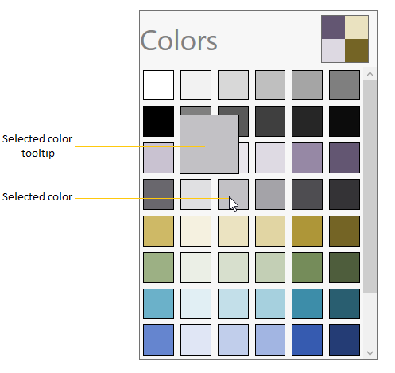
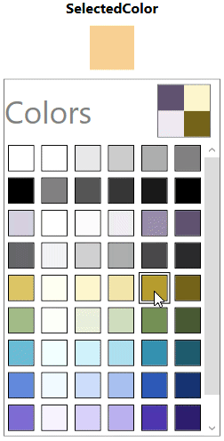
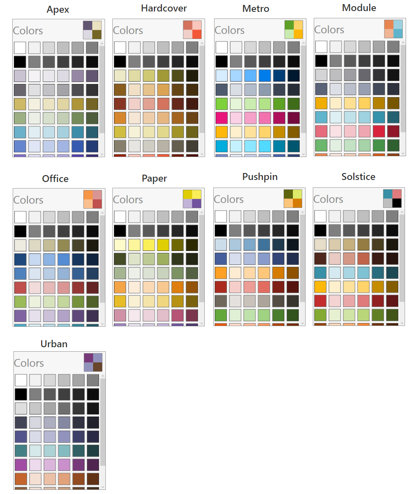
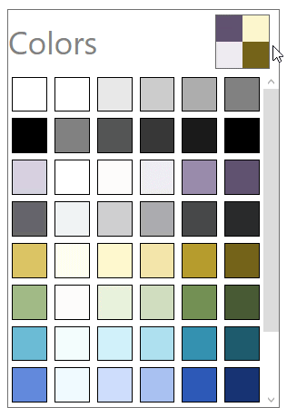

# Getting Started with WPF ColorPalette (SfColorPalette)

This section explains how to create a WPF [ColorPalette](https://help.syncfusion.com/cr/cref_files/wpf/Syncfusion.SfColorPalette.Wpf~Syncfusion.Windows.Controls.Media.SfColorPalette.html) and explains about its structure and features.

## Structure of ColorPalette

## Assembly deployment

Refer to the [Control Dependencies](https://help.syncfusion.com/wpf/control-dependencies#sfcolorpalette) section to get the list of assemblies or `NuGet` package that needs to be added as a reference to use the control in any application.

Refer to this [documentation](https://help.syncfusion.com/wpf/visual-studio-integration/nuget-packages) to find more details about installing nuget packages in a WPF application.

## Adding WPF ColorPalette via designer

`ColorPalette` can be added to an application by dragging it from the toolbox to a designer view. The following dependent assemblies will be added automatically:

* Syncfusion.SfColorPalette.WPF
* Syncfusion.SfShared.WPF

   

## Adding WPF ColorPalette via XAML

To add the `ColorPalette` manually in XAML, follow these steps:

1) Create a new WPF project in Visual Studio.

2) Add the following required assembly reference to the project:

* Syncfusion.SfColorPalette.WPF
* Syncfusion.SfShared.WPF

3) Import Syncfusion WPF schema **http://schemas.syncfusion.com/wpf**, and declare the `ColorPalette` in WPF XAML page.




<Window x:Class="ColorPalette_sample.MainWindow"
        xmlns="http://schemas.microsoft.com/winfx/2006/xaml/presentation"
        xmlns:x="http://schemas.microsoft.com/winfx/2006/xaml"
        xmlns:d="http://schemas.microsoft.com/expression/blend/2008"
        xmlns:mc="http://schemas.openxmlformats.org/markup-compatibility/2006"
        xmlns:local="clr-namespace:ColorPalette_sample"
        xmlns:syncfusion="http://schemas.syncfusion.com/wpf"
        mc:Ignorable="d"
        Title="MainWindow" Height="450" Width="800">
<Grid Name="grid">
    <syncfusion:SfColorPalette Name="colorPalette" />
</Grid>




## Adding WPF ColorPalette via C#

To add the `ColorPalette` manually in C#, follow these steps:

1) Create a new WPF application via Visual Studio.

2) Add the following required assembly references to the project:

* Syncfusion.SfColorPalette.WPF
* Syncfusion.SfShared.WPF

3) Include the required namespace.




using Syncfusion.Windows.Controls.Media;




4) Create an instance of `ColorPalette`, and add it to the window.




SfColorPalette colorPalette = new SfColorPalette();




N> View [Sample](https://github.com/SyncfusionExamples/syncfusion-wpf-sfcolorpalette-examples/tree/master/Samples/DataBinding) in GitHub

## Select a Color

You can select any color by clicking the respective color item in the `ColorPalette`. You can get selected color from the [SelectedColor](https://help.syncfusion.com/cr/cref_files/wpf/Syncfusion.SfColorPalette.Wpf~Syncfusion.Windows.Controls.Media.SfColorPalette~SelectedColor.html) property. If you selecting any color, then the selected color will be displayed as tooltip.

N> View [Sample](https://github.com/SyncfusionExamples/syncfusion-wpf-sfcolorpalette-examples/tree/master/Samples/DataBinding) in GitHub

## Binding a selected color

You can bind the selected color of `ColorPalette` to any objects by using the `SelectedColor` property.

Here, the `SelectedColor` of the `ColorPalette` bind with the `Rectangle.Fill` property with color to brush converter.




//ColorToBrushConverter.cs
public class ColorToSolidColorBrushValueConverter : IValueConverter {
    public object Convert(object value, Type targetType, object parameter, CultureInfo culture) {
        if (null == value)
            return null;
        Color color = (Color)value;
        return new SolidColorBrush(color);
    }
    public object ConvertBack(object value, Type targetType, object parameter, CultureInfo culture) {
        return true;
    }
}







<Grid>
    <Grid.Resources>

    <!--Color to brush converter-->
        <local:ColorToSolidColorBrushValueConverter  x:Key="ColorToSolidColorBrush_ValueConverter"/>
    </Grid.Resources>
    <StackPanel>
        <TextBlock Text="SelectedColor"/>
        <Rectangle Fill="{Binding ElementName=SfColorPalette ,
                                  Path= SelectedColor, 
                                  Converter={StaticResource ColorToSolidColorBrush_ValueConverter}}"/>
        <syncfusion:SfColorPalette x:Name="SfColorPalette" />
    </StackPanel>
</Grid>




N> View [Sample](https://github.com/SyncfusionExamples/syncfusion-wpf-sfcolorpalette-examples/tree/master/Samples/DataBinding) in GitHub

## Navigate to the list of swatches

You can navigate and select a different colors from the different swatches by clicking the Swatches button which is placed on the right top corner of the `ColorPalette` control.

### List of swatches

N> View [Sample](https://github.com/SyncfusionExamples/syncfusion-wpf-sfcolorpalette-examples/tree/master/Samples/DataBinding) in GitHub
