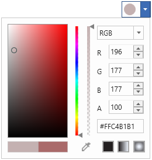
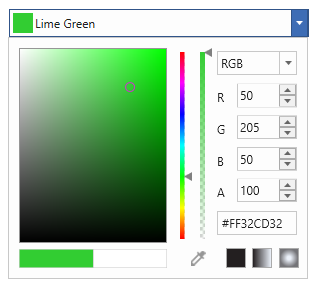
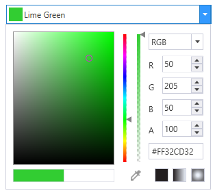
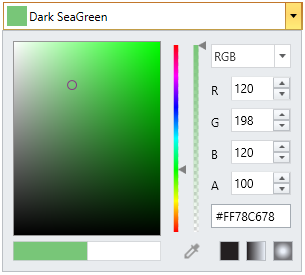
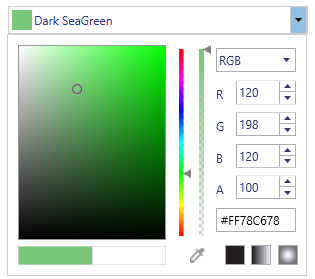

## Header Template

Header of the ColorPicker can be customized using [HeaderTemplate](https://help.syncfusion.com/cr/wpf/Syncfusion.Shared.Wpf~Syncfusion.Windows.Shared.ColorPicker~HeaderTemplate.html) property.




<DataTemplate x:Key="CustomHeaderTemplate" DataType="syncfusion:ColorPicker">
  <StackPanel Orientation="Horizontal">
    <Border Name="selectedColorRect"
     HorizontalAlignment="Left" 
     Width="20" Height="20" Margin="2" 
     Background="{Binding Color,RelativeSource={RelativeSource FindAncestor, AncestorType={x:Type syncfusion:ColorPicker}}, Converter={StaticResource ColorToBrush}}"/>
  </StackPanel>
</DataTemplate>

<sync:ColorPicker  HeaderTemplate="{StaticResource CustomHeaderTemplate}"/>




## Setting flow direction

Right to left layout of the ColorPicker is set by using the [FlowDirection](https://docs.microsoft.com/en-us/dotnet/api/system.windows.frameworkelement.flowdirection?view=netframework-4.8) property.




<syncfusion:ColorPicker FlowDirection="RightToLeft" Name="colorPicker"/>





colorPicker.FlowDirection = FlowDirection.RightToLeft;




## Alpha Visibility

Alpha/Opacity parameter of the color can be altered using delicate slider which handle alpha visibility. This can be disabled by [IsAlphaVisible](https://help.syncfusion.com/cr/wpf/Syncfusion.Shared.Wpf~Syncfusion.Windows.Shared.ColorPicker~IsAlphaVisible.html) property.



 <syncfusion:ColorPicker x:Name="colorPicker" IsAlphaVisible="False"/>




 colorPicker.IsAlphaVisible = false;




## Setting VisualStyle for ColorPicker control

You can enhance the appearance of the [ColorPicker](https://help.syncfusion.com/cr/wpf/Syncfusion.Shared.Wpf~Syncfusion.Windows.Shared.ColorPicker.html) by using the [VisualStyle](https://help.syncfusion.com/cr/wpf/Syncfusion.Shared.Wpf~Syncfusion.Windows.Shared.SkinStorage~VisualStyleProperty.html) property. VisualStyle is an attached property that gets or sets the value for the visual style. Use the following code to set the visual style for the ColorPicker control.




<syncfusion:ColorPicker  syncfusion:SkinStorage.VisualStyle="Office2013" Name="colorPicker"/>





 SkinStorage.SetVisualStyle(colorPicker, "Office2013"); 




