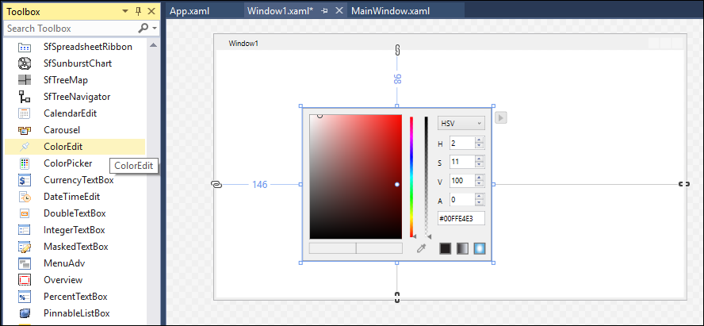

## Standalone editor 

[ColorEdit](https://help.syncfusion.com/cr/wpf/Syncfusion.Shared.Wpf~Syncfusion.Windows.Shared.ColorEdit.html) can be used as a Standalone editor, which has its own properties just like ColorPicker. 

 

 [ColorEdit](https://help.syncfusion.com/cr/wpf/Syncfusion.Shared.Wpf~Syncfusion.Windows.Shared.ColorEdit.html) consist of delicate properties to edit color value code behind.

<table>
<tr>
<th>
Property </th><th>
Description </th></tr>
<tr>
<td>
  {{ '[R](https://help.syncfusion.com/cr/wpf/Syncfusion.Shared.Wpf~Syncfusion.Windows.Shared.ColorEdit~R.html)' | markdownify }}</td><td>
Specifies the Red parameter for RGB model.</td>
</tr>
<tr>
<td>
{{ '[G](https://help.syncfusion.com/cr/wpf/Syncfusion.Shared.Wpf~Syncfusion.Windows.Shared.ColorEdit~G.html)' | markdownify }}  </td><td>
Specifies the Green parameter for RGB model.</td>
</tr>
<tr>
<td>
  {{ '[B](https://help.syncfusion.com/cr/wpf/Syncfusion.Shared.Wpf~Syncfusion.Windows.Shared.ColorEdit~B.html)' | markdownify }} </td><td>
Specifies the Blue parameter for RGB model.</td>
</tr>
<tr>
<td>
 {{ '[H](https://help.syncfusion.com/cr/wpf/Syncfusion.Shared.Wpf~Syncfusion.Windows.Shared.ColorEdit~H.html)' | markdownify }} </td><td>
Specifies the Hue parameter for HSV model</td>
</tr>
<tr>
<td>
 {{ '[S](https://help.syncfusion.com/cr/wpf/Syncfusion.Shared.Wpf~Syncfusion.Windows.Shared.ColorEdit~S.html)' | markdownify }} </td><td>
Specifies the Saturation parameter for HSV model</td>
</tr>
<tr>
<td>
 {{ '[V](https://help.syncfusion.com/cr/wpf/Syncfusion.Shared.Wpf~Syncfusion.Windows.Shared.ColorEdit~V.html)' | markdownify }} </td><td>
Specifies the Hue parameter for HSV model</td>
</tr>
<tr>
<td>
  {{ '[A](https://help.syncfusion.com/cr/wpf/Syncfusion.Shared.Wpf~Syncfusion.Windows.Shared.ColorEdit~A.html)' | markdownify }} </td><td>
Specifies the Alpha or opacity parameter</td>
</tr>
</table>

## Header Template

Header of the ColorPicker can be customized using [HeaderTemplate](https://help.syncfusion.com/cr/wpf/Syncfusion.Shared.Wpf~Syncfusion.Windows.Shared.ColorPicker~HeaderTemplate.html) property.




<DataTemplate x:Key="CustomHeaderTemplate" DataType="syncfusion:ColorPicker">
  <StackPanel Orientation="Horizontal">
   <Border Name="selectedColorRect" HorizontalAlignment="Left" Width="20" Height="20" Margin="2" 
                        Background="{Binding Color,RelativeSource={RelativeSource FindAncestor, AncestorType={x:Type syncfusion:ColorPicker}}, Converter={StaticResource ColorToBrush}}"/>
 </StackPanel>
</DataTemplate>

<sync:ColorPicker  HeaderTemplate="{StaticResource CustomHeaderTemplate}"/>




## Setting VisualStyle for ColorPicker and ColorEdit controls  

You can enhance the appearance of the [ColorPicker](https://help.syncfusion.com/cr/wpf/Syncfusion.Shared.Wpf~Syncfusion.Windows.Shared.ColorPicker.html) and ColorEdit control by using the [VisualStyle](https://help.syncfusion.com/cr/wpf/Syncfusion.Shared.Wpf~Syncfusion.Windows.Shared.SkinStorage~VisualStyleProperty.html) property. VisualStyle is an attached property that gets or sets the value for the visual style. Use the following code to set the visual style for the ColorPicker and ColorEdit controls.




<syncfusion:ColorPicker  syncfusion:SkinStorage.VisualStyle="Office2013" Name="colorPicker"/>





 SkinStorage.SetVisualStyle(colorPicker, "Office2013"); 




