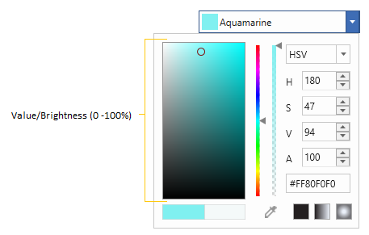
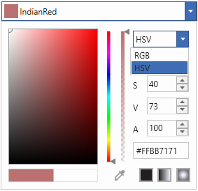

### What is solid color?

Solid color comprises a single color created can specify its alpha, red, blue, and green channels or use one of the predefined color provided by the [Colors](https://docs.microsoft.com/en-us/dotnet/api/system.windows.media.colors?view=netframework-4.8) class.

# How to choose your color

Choosing color from HSV(Hue, saturation and value) explained below

## HUE

Hue is the color portion of the model, expressed as a number from 0 to 360 degrees with all colors fall under certain range. In [ColorPicker](https://help.syncfusion.com/cr/wpf/Syncfusion.Shared.Wpf~Syncfusion.Windows.Shared.ColorPicker.html), Hue parameter can be altered using slider given below.

## Saturation

Saturation describes the amount of gray in a particular color, from 0 to 100 percent.

## Value/Brightness

Value works in conjunction with saturation and describes the brightness or intensity of the color, from 0-100 percent, where 0 is completely black, and 100 is the brightest and reveals the most color.

## Color Format

[ColorPicker](https://help.syncfusion.com/cr/wpf/Syncfusion.Shared.Wpf~Syncfusion.Windows.Shared.ColorPicker.html) controls can be displayed in two different modes. They are HSV and RGB modes. The [VisualizationStyle](https://help.syncfusion.com/cr/wpf/Syncfusion.Shared.Wpf~Syncfusion.Windows.Shared.ColorPicker~VisualizationStyle.html) property is used to switch between these modes.

## RGB

Color from RGB (Red, green, and blue) color model can be assigned using [ColorSelectionMode](https://help.syncfusion.com/cr/wpf/Syncfusion.Shared.Wpf~Syncfusion.Windows.Tools.ColorSelectionMode.html).RGB




<syncfusion:ColorPicker  VisualizationStyle="RGB" Name="colorpicker"/>





ColorPicker colorPicker = new ColorPicker();

colorPicker.VisualizationStyle = ColorSelectionMode.RGB;

this.Content = colorPicker;




## HSV

Color from RGB (Red, green, and blue) color model can be assigned using [ColorSelectionMode](https://help.syncfusion.com/cr/wpf/Syncfusion.Shared.Wpf~Syncfusion.Windows.Tools.ColorSelectionMode.html).HSV




<syncfusion:ColorPicker VisualizationStyle="HSV" Name="colorpicker"/>




ColorPicker colorPicker = new ColorPicker();

colorPicker.VisualizationStyle = ColorSelectionMode.HSV;    

this.Content = colorPicker;




## Hexadecimal format

Hexadecimal color values are also supported in ColorPicker, the built-in textbox helps with color selection and editing.

## Eye Dropper

[ColorPicker](https://help.syncfusion.com/cr/wpf/Syncfusion.Shared.Wpf~Syncfusion.Windows.Shared.ColorPicker.html) consist of `eye-dropper` which can be dragged across the anywhere on the screen,picks the color it is currently hovering above, along with the associated hexadecimal (HEX) color value.

## Select a standard color

[ColorPicker](https://help.syncfusion.com/cr/wpf/Syncfusion.Shared.Wpf~Syncfusion.Windows.Shared.ColorPicker.html) has build-in color ComboBox to select standard color easily. This can be enabled using [IsColorPaletteVisible](https://help.syncfusion.com/cr/wpf/Syncfusion.Shared.Wpf~Syncfusion.Windows.Shared.ColorPicker~IsColorPaletteVisible.html) property.



 <syncfusion:ColorPicker x:Name="colorPicker" IsColorPaletteVisible="True"/>




 IsColorPaletteVisible.IsColorPaletteVisible = true;




## Get color name from color property

[ColorPicker](https://help.syncfusion.com/cr/wpf/Syncfusion.Shared.Wpf~Syncfusion.Windows.Shared.ColorPicker.html) come along with method which returns the nearest names of color property, this can be obtained by [SuchColor](https://help.syncfusion.com/cr/wpf/Syncfusion.Shared.Wpf~Syncfusion.Windows.Shared.ColorEdit~SuchColor.html) method.




private void ColorPicker_SelectedBrushChanged(DependencyObject d, DependencyPropertyChangedEventArgs e)
{
    ColorPicker colorPicker = d as ColorPicker;
    textBlock.Text = Syncfusion.Windows.Shared.ColorEdit.SuchColor(colorPicker.Color)[0];
}




## Tooltip

ColorPicker support to show selected color via Tooltip while hovering through the color palette, this can be enabled using [EnableToolTip](https://help.syncfusion.com/cr/wpf/Syncfusion.Shared.Wpf~Syncfusion.Windows.Shared.ColorPicker~EnableToolTip.html) property.




<syncfusion:ColorPicker  Width="300" EnableToolTip="True"  Name="colorpicker"/>





ColorPicker colorPicker = new ColorPicker();

colorPicker.EnableToolTip = true;

this.Content = colorPicker;




