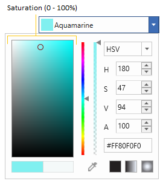
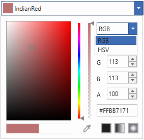
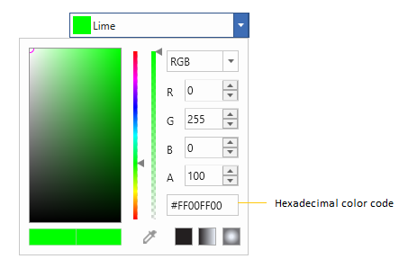
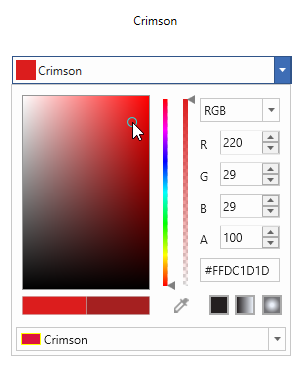

# Select solid color with WPF ColorPicker

This section explains how to select a solid color from different color models, how to modify their individual properties and also gives brief information about eye dropper, standard colors.

### What is solid color?

Solid color comprises a single color with its alpha, red, blue and green channels or use one of the predefined color provided by the `Colors` class.

## How to select your solid color

Choosing solid color from HSV(Hue, saturation and value) explained below.

### Hue 

Hue is the color portion of the model, expressed as a number between `0` and `360` degrees, with all colors falling within a certain range. In [ColorPicker](https://help.syncfusion.com/cr/wpf/Syncfusion.Shared.Wpf~Syncfusion.Windows.Shared.ColorPicker.html), the Hue value can be modified using the slider or H-Hue value editor.

### Saturation

Saturation describes the amount of gray in a particular color, from 0 to 100 percent. The Saturation value can be modified using the slider or S-Saturation value editor.

### Value/Brightness

Value works in conjunction with saturation and describes the brightness or intensity of the color, from `0-100` percent, where `0` is completely black, and `100` is the brightest and reveals the most color. The Value/Brightness value can be modified using the slider or V-Value value editor.

## Select RGB and HSV color

`ColorPicker` controls can be displayed in two different modes. They are HSV and RGB modes. The [VisualizationStyle](https://help.syncfusion.com/cr/wpf/Syncfusion.Shared.Wpf~Syncfusion.Windows.Shared.ColorPicker~VisualizationStyle.html) property is used to switch between these modes. By default, the RGB mode is enabled.

### RGB

We can pick a color in RGB (Red, green, and blue) color format by setting the value of the `VisualizationStyle` property as [ColorSelectionMode.RGB](https://help.syncfusion.com/cr/wpf/Syncfusion.Shared.Wpf~Syncfusion.Windows.Tools.ColorSelectionMode.html). Color formats can be switched from HSV to RGB at runtime, using built-in color model `ComboBox`.




<syncfusion:ColorPicker  VisualizationStyle="RGB" Name="colorpicker"/>




ColorPicker colorPicker = new ColorPicker();
colorPicker.VisualizationStyle = ColorSelectionMode.RGB;
this.Content = colorPicker;




### HSV

We can pick a color in HSV (Hue, Saturation, and Value/Brightness) color format by setting the value of the `VisualizationStyle` property as [ColorSelectionMode.HSV](https://help.syncfusion.com/cr/wpf/Syncfusion.Shared.Wpf~Syncfusion.Windows.Tools.ColorSelectionMode.html). Color formats can be switched from RGB to HSV at runtime, using built-in color model `ComboBox`.




<syncfusion:ColorPicker VisualizationStyle="HSV" Name="colorpicker"/>




ColorPicker colorPicker = new ColorPicker();
colorPicker.VisualizationStyle = ColorSelectionMode.HSV;
this.Content = colorPicker;




## Get solid color using Hexadecimal code

Hexadecimal color values are also supported in `ColorPicker`, the built-in `TextBox` helps with color selection and editing. Based on the hexadecimal values in the `TextBox`, the color will be picked. 

## Pick a color from anywhere (Eye Dropper)

`ColorPicker` consist of `eye-dropper` which can be dragged across the anywhere on the screen and picks the color where it is currently hovering above, along with the associated hexadecimal (HEX) color value.

## Select a standard color

`ColorPicker` has built-in color `ComboBox` to select standard color easily. By default, the standard color `ComboBox` is not shown in the `ColorPicker`. If we want to use the standard color `ComboBox`, use the [IsColorPaletteVisible](https://help.syncfusion.com/cr/wpf/Syncfusion.Shared.Wpf~Syncfusion.Windows.Shared.ColorPicker~IsColorPaletteVisible.html) property value as `true`. The default value of `IsColorPaletteVisible` property is `false`.




 <syncfusion:ColorPicker x:Name="colorPicker" IsColorPaletteVisible="True"/>




ColorPicker colorPicker = new ColorPicker();
colorPicker.IsColorPaletteVisible = true;




## Solid color changed notification

Selected color changed in [ColorPicker](https://help.syncfusion.com/cr/wpf/Syncfusion.Shared.Wpf~Syncfusion.Windows.Shared.ColorPicker.html) can be examined using [ColorChanged](https://help.syncfusion.com/cr/wpf/Syncfusion.Shared.Wpf~Syncfusion.Windows.Shared.ColorPicker~ColorChanged_EV.html) event.




<syncfusion:ColorPicker ColorChanged="ColorPicker_ColorChanged"
                        Name="colorPicker"/>




ColorPicker  colorPicker = new ColorPicker();
colorPicker.ColorChanged += ColorPicker_ColorChanged;







//Invoked when the selected color is changed
private void ColorPicker_ColorChanged(DependencyObject d, DependencyPropertyChangedEventArgs e)
{
    // Enter your code here
}




## Get color name from color property

`ColorPicker` come along with method which returns the nearest names of [Color](https://help.syncfusion.com/cr/wpf/Syncfusion.Shared.Wpf~Syncfusion.Windows.Shared.ColorEdit~Color.html) property, this can be obtained by [SuchColor](https://help.syncfusion.com/cr/wpf/Syncfusion.Shared.Wpf~Syncfusion.Windows.Shared.ColorEdit~SuchColor.html) method. We can get similar four color names of the `Color` property by passing the index value from 0 to 3 in the `SuchColor` method.




<TextBlock Name= "textBlock" Width="200" Height="30"/>
<syncfusion:ColorPicker Name="colorPicker" SelectedBrushChanged="ColorPicker_SelectedBrushChanged"/>




ColorPicker colorPicker= new ColorPicker();
colorPicker.SelectedBrushChanged += ColorPicker_SelectedBrushChanged;







private void ColorPicker_SelectedBrushChanged(DependencyObject d, DependencyPropertyChangedEventArgs e)
{
    textBlock.Text = Syncfusion.Windows.Shared.ColorEdit.SuchColor(colorPicker.Color)[0];
}




 
 We can select a gradient colors which is explained in the [Select gradient color](https://help.syncfusion.com/wpf/color-picker/gradient-brush) page.

 Click [here](https://github.com/SyncfusionExamples/wpf-colorpicker-examples/tree/master/Samples/ChooseColor) to download the sample that showcases how to select a solid color from the `ColorPicker`.
