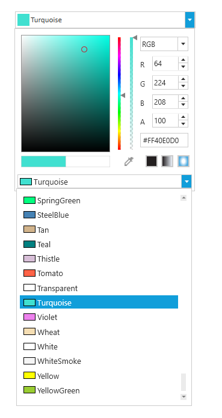
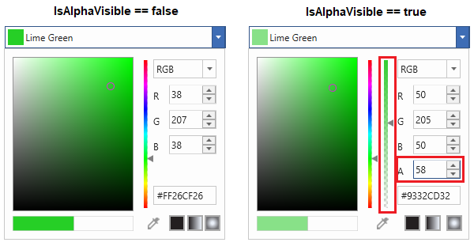
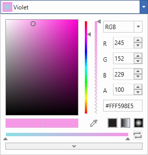
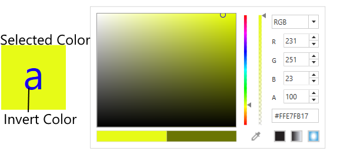

## Setting flow direction

Flow Direction of the ColorPicker and ColorEdit controls is set by using the [FlowDirection](https://docs.microsoft.com/en-us/dotnet/api/system.windows.frameworkelement.flowdirection?view=netframework-4.8) property.




<syncfusion:ColorPicker FlowDirection="RightToLeft" Name="colorPicker"/>





colorPicker.FlowDirection = FlowDirection.RightToLeft;




## Color Palette

[ColorPicker](https://help.syncfusion.com/cr/wpf/Syncfusion.Shared.Wpf~Syncfusion.Windows.Shared.ColorPicker.html) has build-in color palette to select solid color easily. This can be enabled using [IsColorPaletteVisible](https://help.syncfusion.com/cr/wpf/Syncfusion.Shared.Wpf~Syncfusion.Windows.Shared.ColorPicker~IsColorPaletteVisible.html) property.



 <syncfusion:ColorEdit  x:Name="ColorEdit2"   IsColorPaletteVisible="True"/>




 IsColorPaletteVisible.IsColorPaletteVisible = true;




## Alpha Visibility

Alpha/Opacity parameter of the color can be altered using delicate slider which handle alpha visibility. This can be disabled by [IsAlphaVisible](https://help.syncfusion.com/cr/wpf/Syncfusion.Shared.Wpf~Syncfusion.Windows.Shared.ColorPicker~IsAlphaVisible.html) property.



 <syncfusion:ColorEdit  x:Name="ColorEdit2"   IsAlphaVisible="False"/>




 ColorEdit2.IsAlphaVisible = false;




## Gradient brush display mode

Brush representation of ColorPicker can be customized using [GradientBrushDisplayMode](https://help.syncfusion.com/cr/wpf/Syncfusion.Shared.Wpf~Syncfusion.Windows.Shared.ColorPicker~GradientBrushDisplayMode.html) property.




<sync:ColorPicker  GradientBrushDisplayMode = "Extended"/>





colorPicker1.GradientBrushDisplayMode = Syncfusion.Windows.Tools.GradientBrushDisplayMode.Extended;







<sync:ColorPicker  GradientBrushDisplayMode = "Default"/>





colorPicker1.GradientBrushDisplayMode = Syncfusion.Windows.Tools.GradientBrushDisplayMode.Default;




## Inverted Color 

[ColorEdit](https://help.syncfusion.com/cr/wpf/Syncfusion.Shared.Wpf~Syncfusion.Windows.Shared.ColorEdit.html) has option to get the contrast/inverted color of the selected color using [InvertColor](https://help.syncfusion.com/cr/wpf/Syncfusion.Shared.Wpf~Syncfusion.Windows.Shared.ColorEdit~InvertColor.html) property.



 <syncfusion:ColorEdit  x:Name="ColorEdit2"    />
   <TextBlock  Name="textblock2" Text="a"  TextAlignment="Center"  FontSize="70"  Background="{Binding ElementName=ColorEdit2, Path=Brush,UpdateSourceTrigger=PropertyChanged}" HorizontalAlignment="Center" VerticalAlignment="Center" Height="110" Width="110">
     <TextBlock.Foreground>
       <SolidColorBrush Color="{Binding ElementName=ColorEdit2,Path=InvertColor,UpdateSourceTrigger=PropertyChanged}"/>
     </TextBlock.Foreground>
 </TextBlock>




textblock2.Background = ColorEdit2.Brush;

textblock2.Foreground = new SolidColorBrush(ColorEdit3.InvertColor);




## ScRGB-Color

ScRGB color can be obtained by setting [IsScRGBColor](https://help.syncfusion.com/cr/wpf/Syncfusion.Shared.Wpf~Syncfusion.Windows.Shared.ColorEdit~IsScRGBColor.html) property in ColorEdit.



 <syncfusion:ColorEdit  x:Name="ColorEdit2"   IsScRGBColor="True"/>




 ColorEdit2.IsScRGBColor = true;




