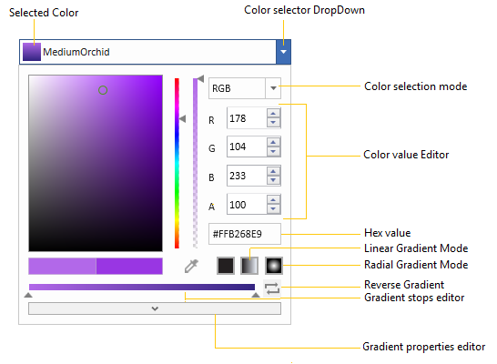
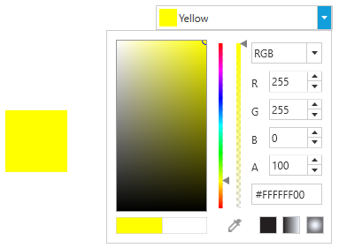
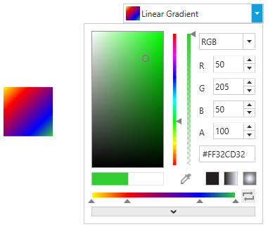
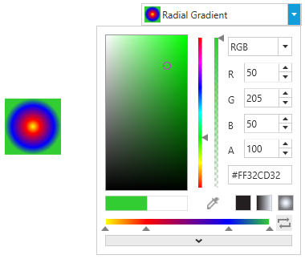
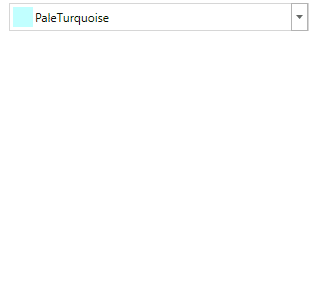

# Getting Started with ColorPicker

This section explains how to create a WPF [ColorPicker](https://help.syncfusion.com/cr/wpf/Syncfusion.Shared.Wpf~Syncfusion.Windows.Shared.ColorPicker.html) and explains about its structure.

## Structure of ColorPicker

The various elements of ColorPicker are illustrated in the following screenshot.

## Assembly deployment

Refer to the [Control Dependencies](https://help.syncfusion.com/wpf/control-dependencies#colorpicker) section to get the list of assemblies or NuGet package that needs to be added as a reference to use the control in any application.

Refer to this [documentation](https://help.syncfusion.com/wpf/visual-studio-integration/nuget-packages) to find more details about installing nuget packages in a WPF application.

## Adding WPF ColorPicker via designer

1) [ColorPicker](https://help.syncfusion.com/cr/wpf/Syncfusion.Shared.Wpf~Syncfusion.Windows.Shared.ColorPicker.html) can be added to an application by dragging it from the toolbox to a designer view. The following dependent assemblies will be added automatically:

* Syncfusion.Shared.WPF

   

2. Set the properties for the ColorPicker in the design mode, using the Smart Tag feature.

## Adding WPF ColorPicker via XAML

To add the [ColorPicker](https://help.syncfusion.com/cr/wpf/Syncfusion.Shared.Wpf~Syncfusion.Windows.Shared.ColorPicker.html) manually in XAML, follow these steps:

1) Create a new WPF project in Visual Studio.

2) Add the following required assembly references to the project:

* Syncfusion.Shared.WPF

3) Import Syncfusion WPF schema **http://schemas.syncfusion.com/wpf**, and declare the ColorPicker in XAML page.





<Window x:Class="ColorPicker_sample.MainWindow"
        xmlns="http://schemas.microsoft.com/winfx/2006/xaml/presentation"
        xmlns:x="http://schemas.microsoft.com/winfx/2006/xaml"
        xmlns:d="http://schemas.microsoft.com/expression/blend/2008"
        xmlns:mc="http://schemas.openxmlformats.org/markup-compatibility/2006"
        xmlns:local="clr-namespace:ColorPicker_sample"
        xmlns:syncfusion="http://schemas.syncfusion.com/wpf"
        mc:Ignorable="d"
        Title="MainWindow" Height="450" Width="800">

<Grid Name="grid">
    <syncfusion:ColorPicker Name="colorPicker" Height="100" Width="280"/>
</Grid>





## Adding WPF ColorPicker via C#

To add the ColorPicker manually in C#, follow these steps:

1) Create a new WPF application via Visual Studio.

2) Add the following required assembly references to the project:

* Syncfusion.Shared.WPF

3) Include the required namespace.





using Syncfusion.Windows.Shared;





4) Create an instance of [ColorPicker](https://help.syncfusion.com/cr/wpf/Syncfusion.Shared.Wpf~Syncfusion.Windows.Shared.ColorPicker.html), and add it to the window.





ColorPicker colorPicker = new ColorPicker();

colorPicker.Width = 300;

grid.Children.Add(colorPicker); 





## Select a Color

Selecting solid color or gradient brush through [ColorPicker](https://help.syncfusion.com/cr/wpf/Syncfusion.Shared.Wpf~Syncfusion.Windows.Shared.ColorPicker.html) can be done using [Color](https://help.syncfusion.com/cr/wpf/Syncfusion.Shared.Wpf~Syncfusion.Windows.Shared.ColorPicker~Color.html) and [Brush](https://help.syncfusion.com/cr/wpf/Syncfusion.Shared.Wpf~Syncfusion.Windows.Shared.ColorPicker~Brush.html) properties.

### Programmatically

Here color can be picked programmatically by following the few steps below.

### Solid

[ColorPicker](https://help.syncfusion.com/cr/wpf/Syncfusion.Shared.Wpf~Syncfusion.Windows.Shared.ColorPicker.html) supports [SolidColorBrush](https://docs.microsoft.com/en-us/dotnet/api/system.windows.media.solidcolorbrush?view=netframework-4.8) as well as [Color](https://docs.microsoft.com/en-us/dotnet/api/system.windows.media.color?view=netframework-4.8) color selection.




<syncfusion:ColorPicker x:Name="colorPicker" Brush="Yellow"/>




colorPicker.Brush = Brushes.Yellow;







 <syncfusion:ColorPicker x:Name="colorPicker" Color="Yellow"/>




colorPicker.Color = Colors.Yellow;




### Gradient

[ColorPicker](https://help.syncfusion.com/cr/wpf/Syncfusion.Shared.Wpf~Syncfusion.Windows.Shared.ColorPicker.html) supports gradient brushes which holds multiple colors that blend into each other along an axis.

**Linear Gradient**

[Linear Gradient](https://docs.microsoft.com/en-us/dotnet/api/system.windows.media.lineargradientbrush) can be selected by the gradient colors and their location along the gradient axis using the GradientStop objects.




 <syncfusion:ColorPicker x:Name="colorPicker" Width="200">
   <syncfusion:ColorPicker.Brush>
        <LinearGradientBrush StartPoint="0,0" EndPoint="1,1">
             <GradientStop Color="Yellow" Offset="0.0" />
             <GradientStop Color="Red" Offset="0.25" />
             <GradientStop Color="Blue" Offset="0.75" />
             <GradientStop Color="LimeGreen" Offset="1.0" />
        </LinearGradientBrush>
    </syncfusion:ColorPicker.Brush>
 </syncfusion:ColorPicker>



LinearGradientBrush linearGradient = new LinearGradientBrush();
linearGradient.StartPoint = new Point(0.5, 0);
linearGradient.EndPoint = new Point(0.5, 1);
linearGradient.GradientStops.Add(new GradientStop(Colors.Yellow, 0.0));
linearGradient.GradientStops.Add(new GradientStop(Colors.Red, 0.25));
linearGradient.GradientStops.Add(new GradientStop(Colors.Blue, 0.75));
linearGradient.GradientStops.Add(new GradientStop(Colors.LimeGreen, 1.0));

colorPicker.Brush = linearGradient;




**Radial Gradient**

[Radial Gradient](https://docs.microsoft.com/en-us/dotnet/api/system.windows.media.radialgradientbrush) is similar to [Linear Gradient](https://docs.microsoft.com/en-us/dotnet/api/system.windows.media.lineargradientbrush), except for the axis defined by the circle.




 <syncfusion:ColorPicker x:Name="colorPicker" Width="200">
     <syncfusion:ColorPicker.Brush>
         <RadialGradientBrush GradientOrigin="0.5,0.5" Center="0.5,0.5" RadiusX="0.5" RadiusY="0.5">
            <GradientStop Color="Yellow" Offset="0" />
            <GradientStop Color="Red" Offset="0.25" />
            <GradientStop Color="Blue" Offset="0.75" />
            <GradientStop Color="LimeGreen" Offset="1" />
        </RadialGradientBrush>
     </syncfusion:ColorPicker.Brush>
 </syncfusion:ColorPicker>



RadialGradientBrush radialGradient = new RadialGradientBrush();
radialGradient.GradientOrigin = new Point(0.5, 0.5);
radialGradient.Center = new Point(0.5, 0.5);
radialGradient.RadiusX = 0.5;
radialGradient.RadiusY = 0.5;
radialGradient.GradientStops.Add(new GradientStop(Colors.Yellow, 0.0));
radialGradient.GradientStops.Add(new GradientStop(Colors.Red, 0.25));
radialGradient.GradientStops.Add(new GradientStop(Colors.Blue, 0.75));
radialGradient.GradientStops.Add(new GradientStop(Colors.LimeGreen, 1.0));

colorPicker.Brush = radialGradient;




## Interactively

[ColorPicker](https://help.syncfusion.com/cr/wpf/Syncfusion.Shared.Wpf~Syncfusion.Windows.Shared.ColorPicker.html) consist of bunch of input components to select color and edit its properties runtime.

### Color changed notification

Color changed in [ColorPicker](https://help.syncfusion.com/cr/wpf/Syncfusion.Shared.Wpf~Syncfusion.Windows.Shared.ColorPicker.html) can be examined using [SelectedBrushChanged](https://help.syncfusion.com/cr/wpf/Syncfusion.Shared.Wpf~Syncfusion.Windows.Shared.ColorPicker~SelectedBrushChanged_EV.html) and [ColorChanged](https://help.syncfusion.com/cr/wpf/Syncfusion.Shared.Wpf~Syncfusion.Windows.Shared.ColorPicker~ColorChanged_EV.html).

 


colorPicker.SelectedBrushChanged += ColorPicker_SelectedBrushChanged;

private void ColorPicker_SelectedBrushChanged(DependencyObject d, DependencyPropertyChangedEventArgs e)
{
    // code here
}




### Disable gradient editor

Transition from Solid to Gradient brush can be restricted using [IsGradientPropertyEnabled](https://help.syncfusion.com/cr/wpf/Syncfusion.Shared.Wpf~Syncfusion.Windows.Shared.ColorPicker~IsGradientPropertyEnabled.html) properties.

The following code examples illustrate this:




<syncfusion:ColorPicker x:Name="colorPicker" IsGradientEditorEnabled="false"/>





ColorPicker colorPicker = new ColorPicker ();
colorPicker. IsGradientEditorEnabled =  false;




