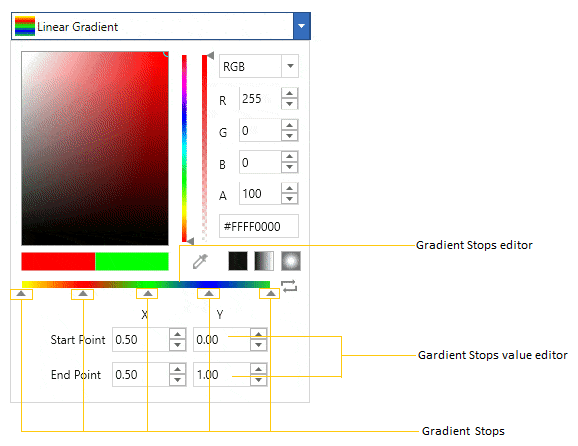
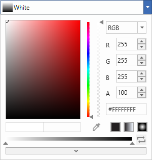
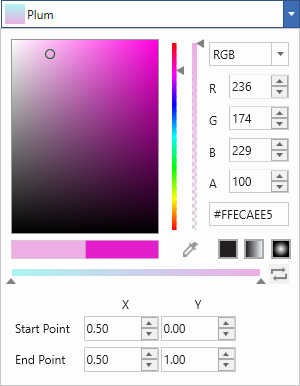

## ColorPicker with Gradient Support

Color Picker now comes with Gradient tool which returns a brush of type Solid, Linear or Radial. The offsets can be added or dropped dynamically and its position can be changed to produce different color combinations.

## Switch Brush Type

Brush type can be switched between solid to gradient or vice versa, runtime as well as programmatically. This can be switched using [BrushMode](https://help.syncfusion.com/cr/wpf/Syncfusion.Shared.Wpf~Syncfusion.Windows.Shared.ColorPicker~BrushMode.html) property.




<Syncfusion: ColorPicker x:Name="colorPicker" BrushMode="Gradient"   ></  Syncfusion: ColorPicker >





ColorPicker colorPicker = new ColorPicker ();
colorPicker.BrushMode = BrushModes.Gradient;




### Restrict Solid to Gradient switch

Transition from Solid to Gradient brush can be restricted using  [EnableSolidToGradientSwitch](https://help.syncfusion.com/cr/wpf/Syncfusion.Shared.Wpf~Syncfusion.Windows.Shared.ColorPicker~EnableSolidToGradientSwitch.html) and [IsGradientPropertyEnabled](https://help.syncfusion.com/cr/wpf/Syncfusion.Shared.Wpf~Syncfusion.Windows.Shared.ColorPicker~IsGradientPropertyEnabled.html) properties.

The following code examples illustrate this:




<Syncfusion: ColorPicker x:Name="colorPicker"  EnableSolidToGradientSwitch="true"   ></  Syncfusion: ColorPicker >
<Syncfusion:ColorEdit x:Name="colorPicker" IsGradientEditorEnabled="false"  EnableSolidToGradientSwitch="false"   ></  Syncfusion: ColorEdit >





ColorPicker colorPicker = new ColorPicker ();
colorPicker.EnableSolidToGradientSwitch =  false;
colorPicker. IsGradientEditorEnabled =  false;




## Gradient brush editor

[ColorPicker](https://help.syncfusion.com/cr/wpf/Syncfusion.Shared.Wpf~Syncfusion.Windows.Shared.ColorPicker.html) has gradient editor similar to that of VisualStudio brush editor. Adding new gradient stops, altering the offset and changing the color of the gradient stops can be done run-time.

## Linear Brush

Start and end point of the selected [Linear Gradient brush](https://docs.microsoft.com/en-us/dotnet/api/system.windows.media.lineargradientbrush?view=netframework-4.8) can be edited runtime through the input options as well as with their properties listed in below table.

<table>
<tr>
<th>
Properties</th><th>
Description</th></tr>
<tr>
<td>
{{ '[Startpoint](https://help.syncfusion.com/cr/wpf/Syncfusion.Shared.Wpf~Syncfusion.Windows.Shared.ColorEdit~Startpoint.html)' | markdownify }}</td><td>
Indicates Start point of LinearGradientBrush.</td></tr>
<tr>
<td>
{{ '[Endpoint](https://help.syncfusion.com/cr/wpf/Syncfusion.Shared.Wpf~Syncfusion.Windows.Shared.ColorEdit~Endpoint.html)' | markdownify }}</td><td>
Indicates End point of LinearGradientBrush.</td></tr>

</table>

## Radial Brush

Gradient origin, Centre and Radius of the selected [Radial Gradient brush](https://docs.microsoft.com/en-us/dotnet/api/system.windows.media.radialgradientbrush?view=netframework-4.8) can be edited runtime through the input options as well as with their properties listed in below table.

<table>
<tr>
<th>
Properties</th><th>
Description</th></tr>
<tr>
<td>
{{ '[GradientOrigin](https://help.syncfusion.com/cr/wpf/Syncfusion.Shared.Wpf~Syncfusion.Windows.Shared.ColorEdit~GradientOrigin.html)' | markdownify }}</td><td>
Indicates gradient origin of RadialGradientBrush.</td></tr>
<tr>
<td>
{{ '[CentrePoint](https://help.syncfusion.com/cr/wpf/Syncfusion.Shared.Wpf~Syncfusion.Windows.Shared.ColorEdit~CentrePoint.html)' | markdownify }}</td><td>
Indicates centre point of RadialGradientBrush.</td></tr>
<tr>
<td>
{{ '[RadiusX](https://help.syncfusion.com/cr/wpf/Syncfusion.Shared.Wpf~Syncfusion.Windows.Shared.ColorEdit~RadiusX.html)' | markdownify }}</td><td>
Indicates X value in Radius of RadialGradientBrush.</td></tr>
<tr>
<td>
{{ '[RadiusY](https://help.syncfusion.com/cr/wpf/Syncfusion.Shared.Wpf~Syncfusion.Windows.Shared.ColorEdit~RadiusY.html)' | markdownify }}</td><td>
Indicates Y value in Radius of RadialGradientBrush.</td></tr>
</table>

## Property Editor Mode

[GradientPropertyEditorMode](https://help.syncfusion.com/cr/wpf/Syncfusion.Shared.Wpf~Syncfusion.Windows.Shared.ColorPicker~GradientPropertyEditorMode.html) property specifies whether Gradient Editor should be displayed as a Popup or in extended mode.




<Syncfusion:ColorPicker x:Name="colorPicker"    GradientPropertyEditorMode="Popup" ></ Syncfusion: ColorPicker >
<Syncfusion: ColorPicker x:Name="colorPicker"  GradientPropertyEditorMode="Extended"  ></Syncfusion: ColorPicker >




ColorPicker colorPicker = new ColorPicker ();
colorPicker.GradientPropertyEditorMode =  GradientPropertyEditorMode.Popup;
colorPicker. GradientPropertyEditorMode =  GradientPropertyEditorMode.Extended;




The GradientEditor is displayed accordingly.

