# Edit a gradient brush with WPF ColorPicker

This section gives a brief note on how to create gradient brushes, modify their colors and modify their properties.

### What is a gradient brush? 

A gradient brush paints an area with multiple colors that blend into each other along an axis. [ColorPicker](https://www.syncfusion.com/wpf-ui-controls/colorpicker) now comes with Gradient tool which returns a brush of type Linear and Radial gradient colors. The offsets can be added or dropped dynamically and its position can be changed to produce different color combinations.

## Gradient Colors

We can add a multiple color combination for the gradient brush using the `GradientStopsEditor`. We can add new gradient stops, change the offset and change the color of the gradient stops at run-time. The created gradient stops are combined together provides a gradient color.

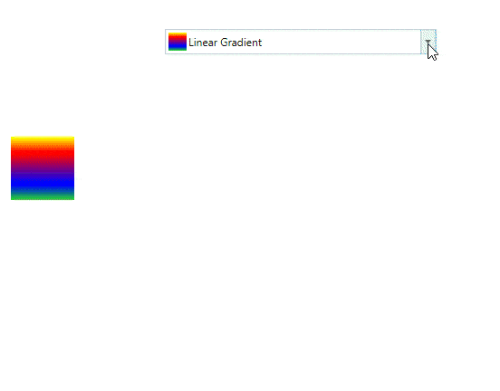

### Add or Remove Gradient Colors

We can add a more gradient colors by using the gradient stops. Gradient stops can be added to existing gradient by clicking on the `GradientStopEditor`. 

To remove a gradient stops, select the gradient stop which want to be remove and press `Delete` key or mouse drag it away, so that it will removed from the `GradientStopsEditor`.

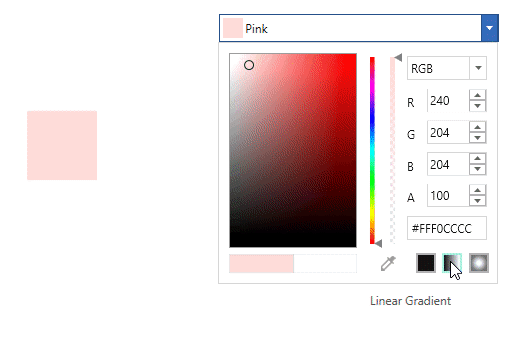

### Arrange Gradient Colors

We can re-arrange the gradient colors by adjusting the gradient stops. Gradient stops positions can be altered just by dragging it along the `GradientStopEditor`. The Gradient color will be generated on the basis of the order of the gradient stops arranged.

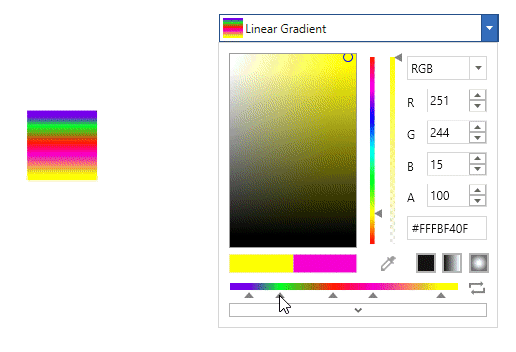

### Change the Gradient Colors

We can change the gradient colors by changing the color of gradient stops. Color of a gradient stops changed by selecting that particular gradient stop and change the color from the color picker.

## Create Linear Gradient colors

We can create linear gradient colors by programmatically using the `LinearGradientbrush` with its `LinearGradientbrush.GradientStops`, `StartPoint` and `EndPoint` properties or can create and change it at runtime by using `GradientStopsEditor` and `StartPoint`, `EndPoint` input options available in the `GradientPropertyEditor`. By default, the linear gradient colors are combined horizontally by start and end points. The default value of `StartPoint` is (0.5, 0) and `EndPoint` is (0.5, 1).

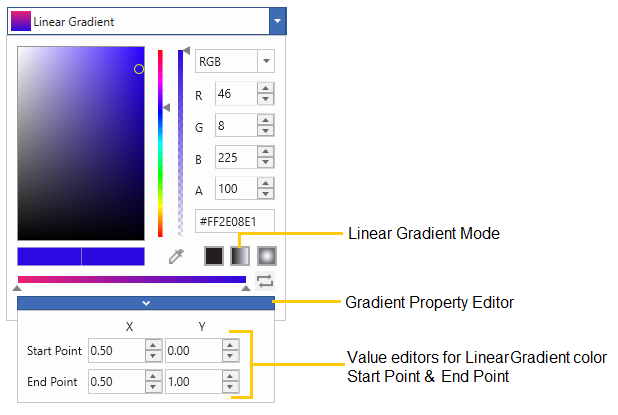

<table>
<tr>
<th>
Properties</th><th>
Description</th></tr>
<tr>
<td>
{{ '[Startpoint](https://help.syncfusion.com/cr/wpf/Syncfusion.Shared.Wpf~Syncfusion.Windows.Shared.ColorEdit~Startpoint.html)' | markdownify }}</td><td>
Indicates the Start point of LinearGradientBrush.</td></tr>
<tr>
<td>
{{ '[Endpoint](https://help.syncfusion.com/cr/wpf/Syncfusion.Shared.Wpf~Syncfusion.Windows.Shared.ColorEdit~Endpoint.html)' | markdownify }}</td><td>
Indicates the End point of LinearGradientBrush.</td></tr>
</table>




class ViewModel {
    public Brush LinearGradientBrush {get; set;}
    public ViewModel() {
        //Creating LinearGradient brush
        LinearGradientBrush LinearBrush = new LinearGradientBrush();
        LinearBrush.StartPoint = new Point(0, 1);
        LinearBrush.EndPoint = new Point(1, 1);
        LinearBrush.GradientStops.Add(new GradientStop(Colors.Yellow, 0.0));
        LinearBrush.GradientStops.Add(new GradientStop(Colors.Red, 0.25));
        LinearBrush.GradientStops.Add(new GradientStop(Colors.Blue, 0.75));
        LinearBrush.GradientStops.Add(new GradientStop(Colors.LimeGreen, 1.0));  
              
        // Assigning a created linear gradient brush to `LinearGradientBrush` property
        LinearGradientBrush = LinearBrush;
    }
}







<syncfusion:ColorPicker Brush="{Binding LinearGradientBrush}"
                        Name="colorPicker">
    <syncfusion:ColorPicker.DataContext>
        <local:ViewModel></local:ViewModel>
    </syncfusion:ColorPicker.DataContext>
</syncfusion:ColorPicker>







ColorPicker colorPicker = new ColorPicker();
colorPicker.DataContext = new ViewModel();
colorPicker.SetBinding(ColorPicker.BrushProperty, new Binding("LinearGradientBrush"));




Here, Linear Gradient created by the gradient colors and their location along the gradient axis using the `GradientStop` objects.

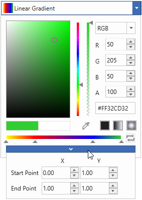

**Diagonal Linear Gradient (StartPoint(0,0), EndPoint(1,1))**

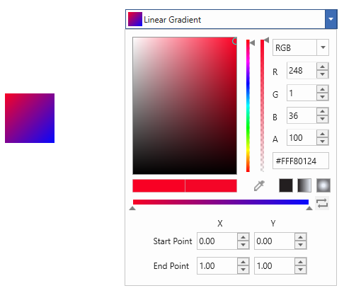

**Vertical Linear Gradient (StartPoint(0, 0.5), EndPoint(1, 0.5)**

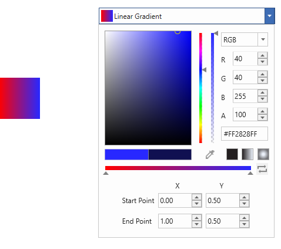

## Create Radial Gradient colors

We can create radial gradient colors by programmatically using the `RadialGradientBrush ` with its `RadialGradientBrush.GradientStops`,  `GradientOrigin`, `Radius` and `Centre` properties. Radial gradient brush colors can changed at runtime using the `GradientStopsEditor` and its `GradientOrigin`, `Centre` and `Radius` can be changed at runtime using the input options available in the `GradientPropertyEditor`.

<table>
<tr>
<th>
Properties</th><th>
Description</th></tr>
<tr>
<td>
{{ '[GradientOrigin](https://help.syncfusion.com/cr/wpf/Syncfusion.Shared.Wpf~Syncfusion.Windows.Shared.ColorEdit~GradientOrigin.html)' | markdownify }}</td><td>
Indicates the gradient origin of RadialGradientBrush.</td></tr>
<tr>
<td>
{{ '[CentrePoint](https://help.syncfusion.com/cr/wpf/Syncfusion.Shared.Wpf~Syncfusion.Windows.Shared.ColorEdit~CentrePoint.html)' | markdownify }}</td><td>
Indicates the centre point of RadialGradientBrush.</td></tr>
<tr>
<td>
{{ '[RadiusX](https://help.syncfusion.com/cr/wpf/Syncfusion.Shared.Wpf~Syncfusion.Windows.Shared.ColorEdit~RadiusX.html)' | markdownify }}</td><td>
Indicates the X value in Radius of RadialGradientBrush.</td></tr>
<tr>
<td>
{{ '[RadiusY](https://help.syncfusion.com/cr/wpf/Syncfusion.Shared.Wpf~Syncfusion.Windows.Shared.ColorEdit~RadiusY.html)' | markdownify }}</td><td>
Indicates the Y value in Radius of RadialGradientBrush.</td></tr>
</table>




class ViewModel {
    public Brush RadialGradientBrush { get; set; }    
    public ViewModel() {
         //Creating Radial Gradient brush
        RadialGradientBrush radialBrush = new RadialGradientBrush();
        radialBrush.GradientOrigin = new Point(0.5, 0.5);
        radialBrush.Center = new Point(0.5, 0.5);
        radialBrush.RadiusX = 0.5;
        radialBrush.RadiusY = 0.5;
        radialBrush.GradientStops.Add(new GradientStop(Colors.Yellow, 0.0));
        radialBrush.GradientStops.Add(new GradientStop(Colors.Red, 0.25));
        radialBrush.GradientStops.Add(new GradientStop(Colors.Blue, 0.75));
        radialBrush.GradientStops.Add(new GradientStop(Colors.LimeGreen, 1.0));

        // Assigning a created radial gradient brush to `RadialGradientBrush` property
        RadialGradientBrush = radialBrush;
    }
}







<syncfusion:ColorPicker Brush="{Binding RadialGradientBrush}"
                        Name="colorPicker">
    <syncfusion:ColorPicker.DataContext>
        <local:ViewModel></local:ViewModel>
    </syncfusion:ColorPicker.DataContext>
</syncfusion:ColorPicker>







ColorPicker colorPicker = new ColorPicker();
colorPicker.DataContext = new ViewModel();
colorPicker.SetBinding(ColorPicker.BrushProperty, new Binding("RadialGradientBrush"));




Here, Radial Gradient created by the gradient colors and their location along the gradient axis using the `GradientStop` objects.

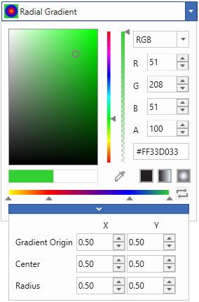

**Gradient Origin (0.25, 0.25)**

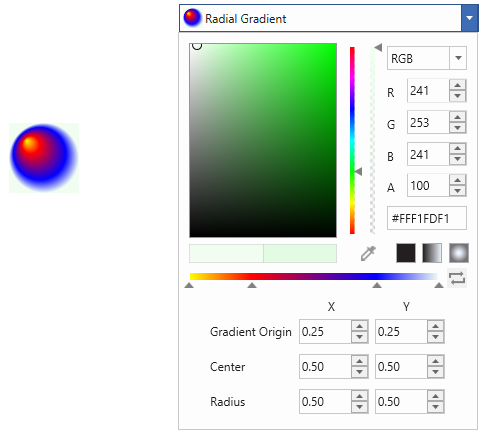

**Centre (0.25, 0.25)**

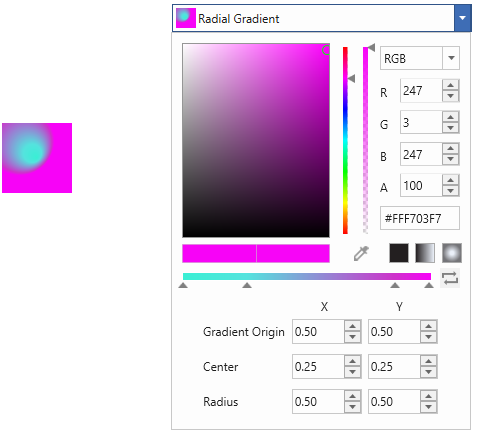

**Radius (0.25, 0.25)**

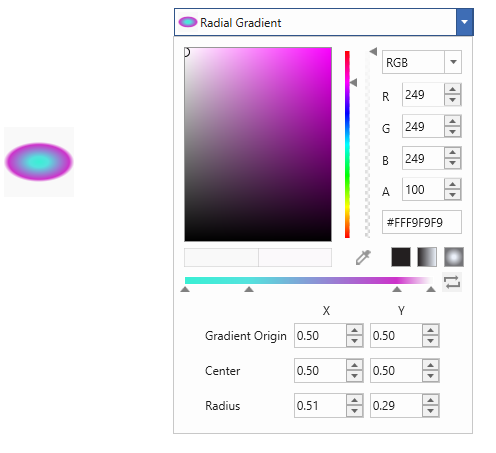

### Reverse the Gradient Colors

[ColorPicker](https://help.syncfusion.com/cr/wpf/Syncfusion.Shared.Wpf~Syncfusion.Windows.Shared.ColorPicker.html) comes with the reverse button which helps in changing the gradient colors upside down or in case of radial gradient inside out. 

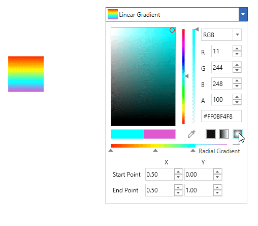

## Show selected Gradient Color Name

By default, the selected Gradient mode name is displayed in `ColorPicker`. If we want to display the selected gradient color name instead of the Gradient mode name, use the [GradientBrushDisplayMode](https://help.syncfusion.com/cr/wpf/Syncfusion.Shared.Wpf~Syncfusion.Windows.Shared.ColorPicker~GradientBrushDisplayMode.html) value as `Extended`. The default value of `GradientBrushDisplayMode` property is `Default`.




<Syncfusion:ColorPicker x:Name="colorPicker" GradientBrushDisplayMode="Extended"/>




ColorPicker colorPicker = new ColorPicker();
colorPicker.GradientBrushDisplayMode =  GradientBrushDisplayMode.Extended;




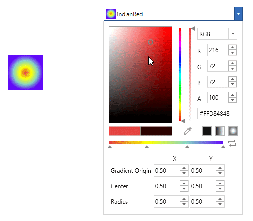

## Show Gradient Property Editor

We can display the gradient property editor either in popup mode or in extended mode. By default, the gradient property editor is displayed in the extended mode. If we want display the gradient property editor only in a popup, use the [GradientPropertyEditorMode](https://help.syncfusion.com/cr/wpf/Syncfusion.Shared.Wpf~Syncfusion.Windows.Shared.ColorPicker~GradientPropertyEditorMode.html) property value as `PopUp`. 




<Syncfusion:ColorPicker x:Name="colorPicker" GradientPropertyEditorMode="Popup"/>




ColorPicker colorPicker = new ColorPicker();
colorPicker.GradientPropertyEditorMode =  GradientPropertyEditorMode.Popup;




**GradientPropertyEditorMode="Popup"**

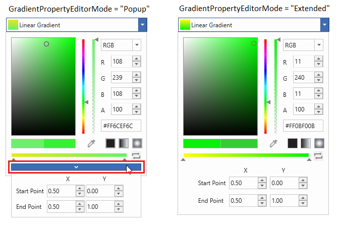

**GradientPropertyEditorMode="Extended"**

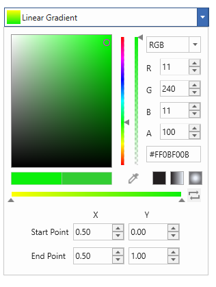

## Switch between Solid, Gradient mode

### Solid brush Mode to Gradient brush mode

We can change the brush mode from solid to gradient or vice versa at runtime as well as programmatically. By default, the `Solid` brush mode is enabled. If we want `Gradient` brush mode, use the [BrushMode](https://help.syncfusion.com/cr/wpf/Syncfusion.Shared.Wpf~Syncfusion.Windows.Shared.ColorEdit~BrushMode.html) property value as `Gradient`.




<Syncfusion: ColorPicker x:Name="colorPicker" BrushMode="Gradient"/>





ColorPicker colorPicker = new ColorPicker();
colorPicker.BrushMode = BrushModes.Gradient;




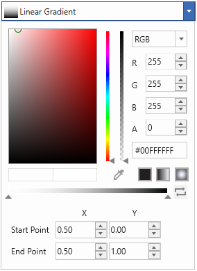

Here, The `ColorPicker` is in Gradient brush mode.

### Switch between Solid, Linear and Gradient brush mode

We can change the brush mode directly by clicking on the corresponding Solid, Linear or Gradient mode buttons which are placed in the bottom right corner of the `ColorPicker`.

## Disable Switching between Solid, Linear and Gradient brush mode

 If we want to disable the Solid, Linear and Gradient brush mode transition, use the [IsGradientPropertyEnabled](https://help.syncfusion.com/cr/wpf/Syncfusion.Shared.Wpf~Syncfusion.Windows.Shared.ColorPicker~IsGradientPropertyEnabled.html) property value as `false`. It will hide the Solid, Linear and Gradient brush button. The Default value of `IsGradientPropertyEnabled` property is `true`.




<syncfusion:ColorPicker x:Name="colorPicker" IsGradientPropertyEnabled="false"/>




ColorPicker colorPicker = new ColorPicker ();
colorPicker.IsGradientPropertyEnabled = false;




