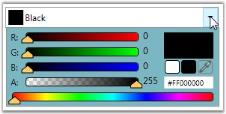
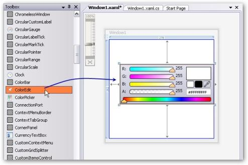

# Getting Started

This section guides you on getting started with ColorPicker and ColorEdit controls. It covers the following topics:

## Why to use our ColorPicker control

Here are some highlights about our ColorPicker control.

* The selected color is visualized in a tooltip for the benefit of the users
* ColorPicker is used in two modes—RGB and HSV
* Support for picking colors using eyedropper. Drag the eyedropper to anywhere in your application to pick the color of a specific location or even a point

## Create ColorPicker control

There are two possible ways to create a ColorPicker control.

### Through designer

To create a ColorPicker control through designer, follow the below steps.

1. Drag the ColorPicker control from the toolbox onto the design area. 

   

2. Set the properties for the ColorPicker in the design mode, using the Smart Tag feature.

### Programmatically

You can create a ColorPicker control either by using XAML code or C# code. Use the following code example to create a ColorPicker control.




<!-- Adding ColorPicker -->
<syncfusion:ColorPicker  Name="colorPicker"/>




//Creating an instance of color picker
ColorPicker colorPicker = new ColorPicker();

//Adding control to the window
this.Content = colorPicker;




   

## Create ColorEdit control

There are two possible ways to create a simple ColorEdit control.

### Through designer 

To create the ColorEdit control through designer, follow the below steps.

1. Drag a ColorEdit control from the toolbox onto the design area.

   

2. Set the properties for ColorEdit in design mode, using the Smart Tag feature. 

### Programmatically

You can create a ColorEdit control either by using XAML code or C# code. Use the following code snippet to create a ColorEdit control.




<!-- Adding ColorEdit -->
<syncfusion:ColorEdit  Name="colorEdit"/>




//Creating an instance of ColorEdit control
ColorEdit colorEdit = new ColorEdit();

//Adding control to the window
this.Content = colorEdit; 




   
