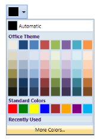
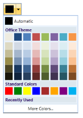
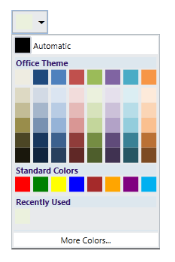

# Appearance

The appearance of the ColorPickerPalette control can be customized by using the VisualStyle property. The following are the various built-in visual styles for ColorPickerPalette control.

* Metro
* Blend
* Office2007Blue
* Office2007Black
* Office2007Silver
* Office2003
* VS2010
* Transparent

In the below code example, Metro theme is applied to the ColorPickerPalette control. 



<syncfusion:ColorPickerPalette x:Name="colorPickerPalette" Color="Orange" syncfusion:SkinStorage.VisualStyle="Metro"  ThemePanelVisibility="Visible" Width="200" Height="50”/> 





SkinStorage.SetVisualStyle(colorPickerPalette, "Metro"); 



Metro

Blend

Office2007Blue

Office2007Black

Office2007Silver

Office2003

Transparent

