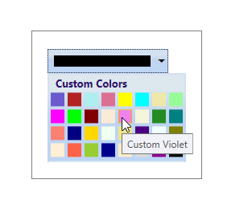

# Color Themes

The ColorPickerPalette control includes a list of predefined themes. It allows you to set the required themes. Based on the selected themes, combination of selected theme colors will be displayed on the ThemePanel. The default theme if set to “Office” theme. You can also set the visibility of the ThemePanel by using the ThemePanelVisibility Property.

## Use Case Scenarios

You can use the Color Themes to have colors based on specific themes.

## Adding Color Theme to an Application 

Color themes can be added to an application by using XAML or C# code.

The following code example illustrates how to add the Color Theme feature to an application through XAML.



<sync:ColorPickerPalette x:Name="ColorPicker" Themes="Apex" />



The following code example illustrates how to add the Color Theme feature to an application through C#.



ColorPickerPalette colorpicker = new ColorPickerPalette();

colorpicker.Themes = PaletteTheme.Apex;



### Properties

<table>
<tr>
<th>
Property </th><th>
Description </th><th>
Type </th><th>
Data Type </th><th>
Reference links </th></tr>
<tr>
<td>
Themes</td><td>
Describes the enum which contains Palette Themes that can be applied to ColorPickerPalette Themes Panel.</td><td>
Dependency Property</td><td>
PaletteTheme.Office</td><td>
</td></tr>
</table>

### Sample Link

To view samples: 

1. Select Start -> Programs -> Syncfusion -> Essential Studio xx.x.x.xx -> Dashboard.
2. Select   Run Locally Installed Samples in WPF Button.
3. Now expand the DragAndDropManagerDemo tree-view item in the Sample Browser.
4. Choose any one of the samples listed under it to launch. 

## Creating Custom ColorPalette

`ColorPickerPalette` control can be entirely customized with a custom collection of colors. The following properties must be set for creating custom color palette. 

<table>
<tr>
<th>
Property</th><th>
Description</th><th>
Data Type</th></tr>
<tr>
<td>
CustomColorsCollection </td><td>
Gets or sets a collection of CustomColors to be displayed in custom tab</td><td>
ObservableCollection<CustomColor></td></tr>
<tr>
<td>
IsCustomTabVisible</td><td>
Gets or Sets the visibility of Custom tab</td><td>
Visibility</td></tr>
<tr>
<td>
SetCustomColors</td><td>
Gets or Sets the value indicating whether custom colors are enabled or not</td><td>
Boolean</td></tr>
<tr>
<td>
CustomHeaderVisibility</td><td>
Gets or Sets the visibility of Custom tab header</td><td>Visibility</td></tr>
<tr>
<td>
CustomHeaderText</td><td>
Gets or Sets the header text in Custom tab</td><td>
string</td></tr>
</table>

### CustomColor

`CustomColor` has the properties `Color` and `ColorName`. `Color` property indicates the color value and `ColorName` is the tooltip shown on mouse hover.

N> `CustomColor` class is available in `Syncfusion.Windows.Tools.Controls` namespace.





<syncfusion:ColorPickerPalette ThemePanelVisibility="Collapsed" StandardPanelVisibility="Collapsed"
                               RecentlyUsedPanelVisibility="Collapsed" MoreColorOptionVisibility="Collapsed"
							   AutomaticColorVisibility="Collapsed" IsCustomTabVisible="Visible"
							   SetCustomColors="True" CustomHeaderVisibility="Visible"
							   CustomHeaderText="Custom Colors">
							   
<syncfusion:ColorPickerPalette.CustomColorsCollection>

      <syncfusion:CustomColor Color="SlateBlue" ColorName="Custom SlateBlue"/>
      ...
      <syncfusion:CustomColor Color="Navy" ColorName="Custom Navy"/> 
	         
</syncfusion:ColorPickerPalette.CustomColorsCollection>

</syncfusion:ColorPickerPalette>





ColorPickerPalette colorPickerPalette = new ColorPickerPalette();

colorPickerPalette.ThemePanelVisibility= Visibility.Collapsed;

colorPickerPalette.StandardPanelVisibility= Visibility.Collapsed;

colorPickerPalette.RecentlyUsedPanelVisibility= Visibility.Collapsed;

colorPickerPalette.MoreColorOptionVisibility= Visibility.Collapsed;

colorPickerPalette.AutomaticColorVisibility= Visibility.Collapsed;

colorPickerPalette.IsCustomTabVisible= Visibility.Visible;

colorPickerPalette.SetCustomColors= true;

colorPickerPalette.CustomHeaderVisibility= Visibility.Visible;

colorPickerPalette.CustomHeaderText="Custom Colors";

ObservableCollection<CustomColor> customColors = new ObservableCollection<CustomColor>();

customColors.Add(new CustomColor() { Color = Colors.SlateBlue, ColorName = "Custom SlateBlue" });

// Add requred custom colors

customColors.Add(new CustomColor() { Color = Colors.Navy, ColorName = "Custom Navy" });

colorPalette.CustomColorsCollection = customColors;





The following screenshot shows the custom ColorPalette,

