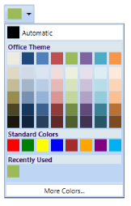
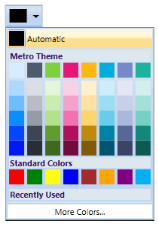

# Color Themes

The ColorPickerPalette control includes a list of predefined themes. It allows you to set the required themes. Based on the selected themes, combination of selected theme colors will be displayed on the ThemePanel. The default theme if set to “Office” theme. You can also set the visibility of the ThemePanel by using the ThemePanelVisibility Property.

## Use Case Scenarios

You can use the Color Themes to have colors based on specific themes.

## Adding Color Theme to an Application 

Color themes can be added to an application by using XAML or C# code.

The following code example illustrates how to add the Color Theme feature to an application through XAML.



<sync:ColorPickerPalette x:Name="ColorPicker" Themes="Apex" />



The following code example illustrates how to add the Color Theme feature to an application through C#.



ColorPickerPalette colorpicker = new ColorPickerPalette();

colorpicker.Themes = PaletteTheme.Apex;



### Properties

<table>
<tr>
<th>
Property </th><th>
Description </th><th>
Type </th><th>
Data Type </th><th>
Reference links </th></tr>
<tr>
<td>
Themes</td><td>
Describes the enum which contains Palette Themes that can be applied to ColorPickerPalette Themes Panel.</td><td>
Dependency Property</td><td>
PaletteTheme.Office</td><td>
</td></tr>
</table>

### Sample Link

To view samples: 

1. Select Start -> Programs -> Syncfusion -> Essential Studio xx.x.x.xx -> Dashboard.
2. Select   Run Locally Installed Samples in WPF Button.
3. Now expand the DragAndDropManagerDemo tree-view item in the Sample Browser.
4. Choose any one of the samples listed under it to launch. 

