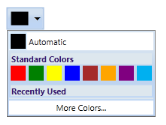
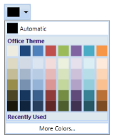
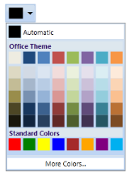

# Setting Panel Visibilities

The ColorPickerPalette control includes three panels namely ThemePanel, StandardColorPanel, RecentlyUsedPanel. You can set the visibility of these panels by using the ThemePanelVisibility, StandardPanelVisibility, RecentlyUsedPanelVisibility properties respectively. The ThemePanel displays the palette of selected theme colors and their variant colors in the panel. The StandardColorPanel displays a palette of 8 preset colors in panel. The RecentlyUsedColor panel displays the most recently used colors.

### Use Case Scenarios

You can use the ColorPickerPalette control to view the panels of your choice.

## Adding Setting Panel Visibilities to an Application 

Setting Panel Visibilities can be added to an application by using XAML or C# code.

The following code example illustrates how to add the Setting Panel Visibilities feature to an application through XAML.





<sync:ColorPickerPalette x:Name="ColorPicker" 

ThemePanelVisibility="Collapsed"/>

<sync:ColorPickerPalette x:Name="ColorPicker" 

StandardPanelVisibility="Collapsed"/>

<sync:ColorPickerPalette x:Name="ColorPicker" 

RecentlyUsedPanelVisibility="Collapsed"/>



The following code example illustrates how to add the Setting Panel Visibilities feature to an application through C#.





ColorPickerPalette colorpicker = new ColorPickerPalette();

colorpicker.ThemePanelVisibility = System.Windows.Visibility.Collapsed;

colorpicker.StandardPanelVisibility = System.Windows.Visibility.Collapsed;

colorpicker.RecentlyUsedPanelVisibility = System.Windows.

                                          Visibility.Collapsed;





ColorPickerPalette colorpicker = new ColorPickerPalette()

colorpicker.ThemePanelVisibility = System.Windows.Visibility.Collapsed

colorpicker.StandardPanelVisibility = System.Windows.Visibility.Collapsed

colorpicker.RecentlyUsedPanelVisibility = System.Windows.

                                          Visibility.Collapsed





### Properties

<table>
<tr>
<th>
Property </th><th>
Description </th><th>
Type </th><th>
Data Type </th><th>
Reference links </th></tr>
<tr>
<td>
ThemePanelVisibility</td><td>
Enables or disables the visibility of the ThemePanel.</td><td>
DependencyProperty</td><td>
ThemePanelVisibility.Visible</td><td>
</td></tr>
<tr>
<td>
StandardPanelVisibility</td><td>
Enables or disables the visibility of the StandardColorPanel.</td><td>
DependencyProperty</td><td>
StandardPanelVisibility.Visible</td><td>
</td></tr>
<tr>
<td>
RecentlyUsedPanelVisibility</td><td>
Enables or disables the visibility of the Recently Used ColorPanel.</td><td>
DependencyProperty</td><td>
RecentlyUsedPanelVisibility.Visible</td><td>
</td></tr>
</table>

### Sample Link

To view samples: 

1. Select Start -> Programs -> Syncfusion -> Essential Studio xx.x.x.xx -> Dashboard.
2. Select Run Locally Installed Samples in WPF Button.
3. Now Search ColorPickerPalette sample and launch it.

