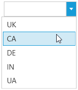

# Getting Started with WPF ComboBox (ComboBoxAdv)

This section provides a quick overview for working with the ComboBox (ComboBoxAdv).

## Assembly deployment

Refer to the [control dependencies](https://help.syncfusion.com/wpf/control-dependencies#comboboxadv) section to get the list of assemblies or NuGet package that needs to be added as a reference to use the control in any application.

You can find more details about installing the NuGet package in a WPF application in the following link:
[How to install nuget packages](https://help.syncfusion.com/wpf/nuget-packages)

## Creating simple application with ComboBox (ComboBoxAdv)

By following the below steps, You will create WPF application that contains ComboBox.

1. [Creating project](#Creating-the-project)
2. [Adding control via designer](#Adding-control-via-designer)
3. [Adding control manually in XAML](#Adding-control-manually-in-XAML)
4. [Adding control manually in C#](#Adding control manually in C#)
5. [Creating Data Model for sample application](#Creating Data Model for sample application)
6. [Binding to Data ](#Creating Data Model for sample application)

### Creating the project 

Create new project in Visual Studio to display ComboBoxAdv.

### Adding control via designer

ComboBox (ComboBoxAdv) can be added to the application by dragging it from Toolbox and dropping it in Designer view. The required assembly will be added automatically.

### Adding control manually in XAML

In order to add control manually in XAML, do the below steps,

1. Add the below required assembly references to the project,
           * Syncfusion.Shared.WPF
2.  Import Syncfusion WPF schema **http://schemas.syncfusion.com/wpf**.
3. Declare ComboBoxAdv in XAML page.


<Window x:Class="ComboBox.MainWindow"
        xmlns="http://schemas.microsoft.com/winfx/2006/xaml/presentation"
        xmlns:x="http://schemas.microsoft.com/winfx/2006/xaml"
        xmlns:d="http://schemas.microsoft.com/expression/blend/2008"
        xmlns:mc="http://schemas.openxmlformats.org/markup-compatibility/2006"
        xmlns:local="clr-namespace:ComboBox" xmlns:Syncfusion="http://schemas.microsoft.com/netfx/2009/xaml/presentation" xmlns:syncfusion="http://schemas.syncfusion.com/wpf"
        mc:Ignorable="d"
        Title="MainWindow" Height="450" Width="800">
    <Grid>
        <syncfusion:ComboBoxAdv x:Name="comboBoxAdv1" DefaultText="Choose Items" Height="70" Width="170" ItemsSource="{Binding Countries}" DisplayMemberPath="Name"  SelectedValuePath="Code" SelectedValueDelimiter=" - ">
        </syncfusion:ComboBoxAdv>
    </Grid>
</Window>



### Adding control manually in C#

In order to add control manually in C#, do the below steps,

1. Add the below required assembly references to the project,
           * Syncfusion.Shared.WPF
2. Import Wizard namespace **Syncfusion.Windows.Tools.Controls**.
3. Create Wizard control instance and add it to the page.



using System.Windows;
using Syncfusion.Windows.Tools.Controls;

namespace ComboBox
{
    /// 

    /// Interaction logic for MainWindow.xaml
    /// 

    public partial class MainWindow : Window
    {
        public MainWindow()
        {
            InitializeComponent();
            ComboBoxAdv comboBoxAdv = new ComboBoxAdv();
            this.Content = comboBoxAdv;
            comboBoxAdv.Height = 70;
            comboBoxAdv.Width = 140;
            comboBoxAdv.DefaultText = "choose Items";
        }
    }
}



### Creating Data Model for sample application

1. Create data object class named **Model** and declare properties as shown below,


namespace ComboBox
{
    public class Model
    {
        private string text;
        public string Text
        {
            get { return text; }
            set { text = value; }
        }
    }
}



2. Create a **ViewModel** class with several data objects in constructor.
 

using System.Collections.ObjectModel;
using System.ComponentModel;

namespace ComboBox
{
    public class ViewModel : INotifyPropertyChanged
    {
        private ObservableCollection<Model> products;
        public ObservableCollection<Model> Products
        {
            get
            {
                return products;
            }
            set
            {
                products = value;
                RaisePropertyChanged("Products");
            }
        }
        public ViewModel()
        {
            Products = new ObservableCollection<Model>();
            Products.Add(new Model() { Text = "Item 1" });
            Products.Add(new Model() { Text = "Item 2" });
            Products.Add(new Model() { Text = "Item 3" });
            Products.Add(new Model() { Text = "Item 4" });
            Products.Add(new Model() { Text = "Item 5" });
        }
        public event PropertyChangedEventHandler PropertyChanged;
        public void RaisePropertyChanged(string propertyName)
        {
            PropertyChanged?.Invoke(this, new PropertyChangedEventArgs(propertyName));
        }
    }
}



### Binding to Data 

Bind the collection created in previous step to `ComboBoxAdv.ItemsSource` property in XAML by setting ViewModel as `DataContext`.



<Window x:Class="ComboBox.MainWindow"
        xmlns="http://schemas.microsoft.com/winfx/2006/xaml/presentation"
        xmlns:x="http://schemas.microsoft.com/winfx/2006/xaml"
        xmlns:d="http://schemas.microsoft.com/expression/blend/2008"
        xmlns:mc="http://schemas.openxmlformats.org/markup-compatibility/2006"
        xmlns:local="clr-namespace:ComboBox" xmlns:Syncfusion="http://schemas.microsoft.com/netfx/2009/xaml/presentation" xmlns:syncfusion="http://schemas.syncfusion.com/wpf"
        mc:Ignorable="d"
        Title="MainWindow" Height="450" Width="800">
    <Grid>
        <syncfusion:ComboBoxAdv 
            Name="comboBoxAdv" 
            ItemsSource="{Binding Products}"
            DisplayMemberPath="Text"
            SelectedValue="{Binding SelectedItems, Mode=TwoWay, UpdateSourceTrigger=PropertyChanged}"
            VerticalAlignment="Center" 
            HorizontalAlignment="Center" 
            Width="126"/>
    </Grid>
</Window>


namespace ComboBox
{
    public partial class MainWindow : Window
    {
        public MainWindow()
        {
            InitializeComponent();
            this.DataContext = new ViewModel();
        }
    }
}



Now, run the application and you can expert the below output.

N> [View the same in GitHub](https://help.syncfusion.com/wpf/treeview/expand-the-item)

## Feature summary

The features of the ComboBoxAdv control are listed below:

* AllowMultiSelect—ComboBoxAdv allows multiple selection
* DefaultText—ComboBoxAdv displays a string when none of the items is selected 
* SelectedValueDelimiter—It allows customizing the delimiter string displayed between selected items

## Use case scenarios

If multiple choices are allowed for the user, then the ComboBoxAdv is useful to display those multiple choices. Instead of displaying all the choices initially,the choices displayed with in the drop-down whenever the user click on the ComboBoxAdv control.

## Default selection behavior

By default, `AllowMultiSelect` property of ComboboxAdv is false. Therefore, it allows users to select only one item from drop-down. In default selection, previous selection has been cleared when new item is selected.

The following screenshot displays the default selection behavior of ComboBoxAdv.

