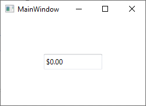
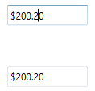

# Getting Started

## Assembly deployment

Refer to the [control dependencies](https://help.syncfusion.com/wpf/control-dependencies#currencytextbox) section to get the list of assemblies or NuGet package that needs to be added as a reference to use the control in any application.

You can find more details about installing the NuGet package in a WPF application in the following link: 

[How to install nuget packages](https://help.syncfusion.com/wpf/nuget-packages)

## Create a simple application with CurrencyTextBox

You can create a WPF application with the CurrencyTextBox control using the following steps:

## Create a project

Create a new WPF project in Visual Studio to display the CurrencyTextBox with functionalities.

## Add control through designer

The CurrencyTextBox control can be added to an application by dragging it from the toolbox to a designer view. The **Syncfusion.Shared.WPF** assembly reference will be added automatically to the project.

## Add control manually in XAML

To add the control manually in XAML, follow the given steps:

1.	Add the **Syncfusion.Shared.WPF** assembly reference to the project.
2.	Import Syncfusion WPF schema **http://schemas.syncfusion.com/wpf** in the XAML page.
3.	Declare the CurrencyTextBox control in the XAML page.



<Window xmlns="http://schemas.microsoft.com/winfx/2006/xaml/presentation"
        xmlns:x="http://schemas.microsoft.com/winfx/2006/xaml"
        xmlns:syncfusion="http://schemas.syncfusion.com/wpf" 
        x:Class="CurrencyTextBoxSample.MainWindow"
        Title="CurrencyTextBox Sample" Height="350" Width="525">
    <Grid>
        <!--Adding CurrencyTextBox control -->
        <syncfusion:CurrencyTextBox x:Name="currencyTextBox" Width="100" Height="100" VerticalAlignment="Center" HorizontalAlignment="Center"/>
    </Grid>
</Window>



## Add control manually in C\#

To add the control manually in C#, follow the given steps:

1. Add the **Syncfusion.Shared.WPF** assembly reference to the project. 
2. Import CurrencyTextBox namespace **using Syncfusion.Windows.Shared;**.
3. Create a CurrencyTextBox instance, and add it to the window.



using Syncfusion.Windows.Shared;
namespace CurrencyTextBoxSample
{
    /// 

    /// Interaction logic for MainWindow.xaml
    /// 

    public partial class MainWindow : Window
    {
        public MainWindow()
        {
            InitializeComponent();
            //Creating an instance of CurrencyTextBox control
            CurrencyTextBox currencyTextBox = new CurrencyTextBox();
            //Adding CurrencyTextBox as window content
            this.Content = currencyTextBox;
        } 
    }
}



## Bind value

Data binding is the process of establishing a connection between the application UI and business logic. Data binding can be unidirectional (source -> target or target <- source) or bidirectional (source <-> target). You can bind the data to the CurrencyTextBox using the [Value](https://help.syncfusion.com/cr/wpf/Syncfusion.Shared.Wpf~Syncfusion.Windows.Shared.CurrencyTextBox~Value.html) property. Refer to the [Data binding](https://help.syncfusion.com/wpf/currencytextbox/data-binding-support) section for more details.
 


<StackPanel>
<syncfusion:CurrencyTextBox x:Name="currencyTextBox1" Grid.Row="1" Height="25" Width="100"/>
<!--Binding value -->
<syncfusion:CurrencyTextBox x:Name="currencyTextBox2" Grid.Row="3" Width="100" Height="25" Value="{Binding ElementName=currencyTextBox1,Path=Value,Mode=TwoWay}" />
</StackPanel>



## Setting the minimum and maximum values

You can define the minimum and maximum values by setting the [MinVal](https://help.syncfusion.com/cr/wpf/Syncfusion.Shared.Wpf~Syncfusion.Windows.Shared.CurrencyTextBox~MinValue.html) and [MaxVal](https://help.syncfusion.com/cr/wpf/Syncfusion.Shared.Wpf~Syncfusion.Windows.Shared.CurrencyTextBox~MaxValue.html) properties of CurrencyTextBox.
 


<syncfusion:CurrencyTextBox x:Name="currencyTextBox" Width="100" Height="25" Value="100" MinValue="-999" MaxValue="999"/>


//Setting minimum value
currencyTextBox.MinValue = -999;
//Setting maximum value
currencyTextBox.MaxValue = 999;



## Number format

You can customize the number format using either the [NumberFormat](https://help.syncfusion.com/cr/wpf/Syncfusion.Shared.Wpf~Syncfusion.Windows.Shared.EditorBase~NumberFormat.html) property or the [CurrencyGroupSeparator](https://help.syncfusion.com/cr/wpf/Syncfusion.Shared.Wpf~Syncfusion.Windows.Shared.CurrencyTextBox~CurrencyGroupSeparator.html), [CurrencyGroupSizes](https://help.syncfusion.com/cr/wpf/Syncfusion.Shared.Wpf~Syncfusion.Windows.Shared.CurrencyTextBox~CurrencyGroupSizes.html), [CurrencyDecimalDigits](https://help.syncfusion.com/cr/wpf/Syncfusion.Shared.Wpf~Syncfusion.Windows.Shared.CurrencyTextBox~CurrencyDecimalDigits.html), and [CurrencyDecimalSeparator](https://help.syncfusion.com/cr/wpf/Syncfusion.Shared.Wpf~Syncfusion.Windows.Shared.CurrencyTextBox~CurrencyDecimalSeparator.html), [CurrencySymbol](https://help.syncfusion.com/cr/wpf/Syncfusion.Shared.Wpf~Syncfusion.Windows.Shared.CurrencyTextBox~CurrencySymbol.html), [CurrencyNegativePattern](https://help.syncfusion.com/cr/wpf/Syncfusion.Shared.Wpf~Syncfusion.Windows.Shared.CurrencyTextBox~CurrencyNegativePattern.html), and [CurrencyPositivePattern](https://help.syncfusion.com/cr/wpf/Syncfusion.Shared.Wpf~Syncfusion.Windows.Shared.CurrencyTextBox~CurrencyPositivePattern.html) properties of CurrencyTextBox.



<syncfusion:CurrencyTextBox x:Name="currencyTextBox" Height="25" Width="150" Value="1234567" CurrencyGroupSeparator="/" CurrencyDecimalDigits="4" CurrencyDecimalSeparator="*" CurrencySymbol="$"/>


Syncfusion.Windows.Shared.CurrencyTextBox currencyTextBox = new   Syncfusion.Windows.Shared.CurrencyTextBox();
currencyTextBox.Width = 100;
currencyTextBox.Height = 25;
currencyTextBox.Value = 1234567;
currencyTextBox.CurrencyGroupSeparator = "/";
currencyTextBox.CurrencyDecimalDigits = 4;
currencyTextBox.CurrencyDecimalSeparator = "*";
currencyTextBox.CurrencySymbol = "$";



