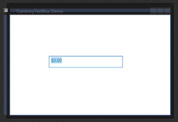
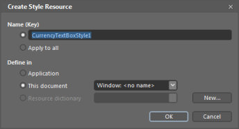
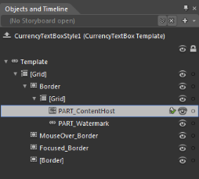

# Appearance  

## Setting VisualStyle for CurrencyTextBox

The appearance of the CurrencyTextBox control can be customized by using the VisualStyle property. The following are the various built-in visual styles for CurrencyTextBox control.

* Blend
* Office2003
* Office2007Blue
* Office2007Black
* Office2007Silver
* ShinyBlue
* ShinyRed
* SyncOrange
* VS2010
* Transparent

## Blendability

You can edit the CurrencyTextBox Template to give a nice look and feel by using Expression Blend.

### The steps to edit the CurrencyTextBox Template by using Expression Blend are as follows:

1. Create a simple WPF application in Expression Blend.
2. Drag and drop the CurrencyTextBox into the application from the Assets tab.

   

3. After creating the CurrencyTextBox, select the CurrencyTextBox and navigate to Object -> Edit Style -> Edit a Copy, to edit the Template of the CurrencyTextBox.

   

   ### Another way to edit the Template is as follows:

4. In Object and Timeline, right click the CurrencyTextBox control and select the Edit Template option, as displayed below. 
5. This will open a dialog (below) where you can give your style a name and define exactly where you’d like to store it.

   

   {:.prettyprint}

The result of these steps is an XAML, which is placed within your application. This XAML represents the default style for the CurrencyTextBox.

<syncfusion:CurrencyTextBox x:Name="currencyTextBox" Height="25" Width="150" Style="{StaticResource CurrencyTextBoxStyle1}"/>

All template items can now be found in the Objects and Timeline window.

Now you can replace the existing Template setter and Triggers with your own creation. In the Triggers tab you can select the Trigger and customize it as you want.

Here is a simple example to customize the UnFocused state of the CurrencyTextBox: 



<Trigger Property="IsFocused" Value="False">

    <Setter Property="Background" TargetName="Border" Value="LightGray"/>

</Trigger>


When the control loses its focus, the Background color is set to LightGray. Similarly, you can customize every state and property in Expression Blend.

See Also

Creating a CurrencyTextBox by using Expression Blend

Creating a CurrencyTextbox by using XAML

