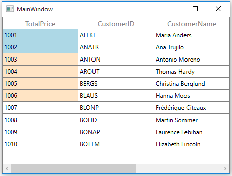
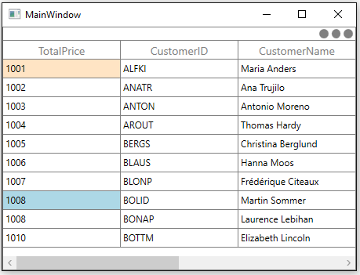
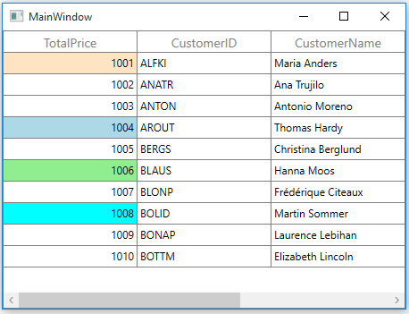
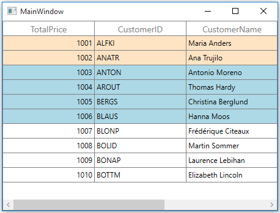
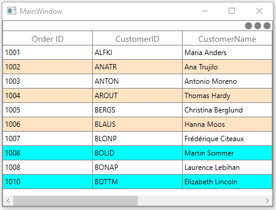

# Conditional styling in WPF DataGrid (SfDataGrid)

You can style the DataGrid and its inner elements (cells, rows and columns) conditionally based on data in `three` ways,

1. Using Converter
2. Using Data Triggers
3. Using StyleSelector 

<table>
<tr>
<td>
<th>
Approach
</th>
</td>
<td>
<th>
Performance
</th>
</td>
</tr>
<tr>
<td>
<code>Using Converter</code>
</td>
<td>
Provide good performance when compared other two ways.
</td>
</tr>
<tr>
<td>
<code>Using Data Triggers</code>
</td>
<td>
When compared to converter, performance is slow while styling more number of columns or rows.
</td>
</tr>
<tr>
<td>
<code>Using StyleSelector</code>
</td>
<td>
It affects scrolling performance while styling more number of columns based on number of columns visible.
</td>
</tr>
</table>

## Cell style

### Conditional styling of cells using converter

The record cells ([GridCell](http://help.syncfusion.com/cr/cref_files/wpf/Syncfusion.SfGrid.WPF~Syncfusion.UI.Xaml.Grid.GridCell.html)) can be customized conditionally by changing its property value based on `cell value` or `data object` using `converter`. 

Here, `GridCell` background is changed using `converter`, where converter returns the value based on `OrderID` property of underlying record.



<Window.Resources>
    <local:ColorConverter x:Key="converter"/>
</Window.Resources>

<syncfusion:GridTextColumn MappingName="TotalPrice">
    <syncfusion:GridTextColumn.CellStyle>
        
    </syncfusion:GridTextColumn.CellStyle>
</syncfusion:GridTextColumn>


public class ColorConverter : IValueConverter
{

    public object Convert(object value, Type targetType, object parameter, CultureInfo culture)
    {
        int input = (int)value;

      //custom condition is checked based on data.

        if (input < 1003)
            return new SolidColorBrush(Colors.LightBlue);

        else if (input < 1007)
            return new SolidColorBrush(Colors.Bisque);

        else
            return DependencyProperty.UnsetValue;
    }

    public object ConvertBack(object value, Type targetType, object parameter, CultureInfo culture)
    {
        throw new NotImplementedException();
    }
}



### Condition styling of cells based on record using converter

You can also style the cells based on record instead of passing single property to `converter`, where `converter` returns the value based on underlying record. This can be assigned to `GridColumn.CellStyle` to style the column based on other `column` properties.



<Window.Resources>
    <local:ColorConverter x:Key="converter"/>
    
</Window.Resources>

<syncfusion:SfDataGrid x:Name="dataGrid"
                       ItemsSource="{Binding Orders}" />



public class ColorConverter : IValueConverter
{

    public object Convert(object value, Type targetType, object parameter, CultureInfo culture)
    {
        var data = value as OrderInfo;

        //custom condition is checked based on data.

        if (data.OrderID < 1003)
            return new SolidColorBrush(Colors.LightBlue);

        else if (data.OrderID < 1007)
            return new SolidColorBrush(Colors.Bisque);

        else
            return DependencyProperty.UnsetValue;
    }

    public object ConvertBack(object value, Type targetType, object parameter, CultureInfo culture)
    {
        throw new NotImplementedException();
    }
}



### Conditional styling of cells using triggers

The record cells ([GridCell](http://help.syncfusion.com/cr/cref_files/wpf/Syncfusion.SfGrid.WPF~Syncfusion.UI.Xaml.Grid.GridCell.html)) can be customized by setting [Style.Triggers](https://msdn.microsoft.com/en-us/library/system.windows.style.triggers(v=vs.110).aspx) that apply property values based on specified conditions. Multiple conditions can be specified by setting [MultiDataTrigger](https://msdn.microsoft.com/en-us/library/system.windows.multidatatrigger(v=vs.110).aspx).



<syncfusion:GridTextColumn MappingName="OrderID" >
    <syncfusion:GridTextColumn.CellStyle>
        
    </syncfusion:GridTextColumn.CellStyle>
</syncfusion:GridTextColumn>



Here, `GridCell’s` are conditionally customized based on `OrderID` value.

### Conditional styling of cells using style selector

The record cells ([GridCell](http://help.syncfusion.com/cr/cref_files/wpf/Syncfusion.SfGrid.WPF~Syncfusion.UI.Xaml.Grid.GridCell.html)) can be customized conditionally based on data by setting [SfDataGrid.CellStyleSelector](http://help.syncfusion.com/cr/cref_files/wpf/Syncfusion.SfGrid.WPF~Syncfusion.UI.Xaml.Grid.SfDataGrid~CellStyleSelector.html) property and the particular column record cells can be customized by setting [GridColumn.CellStyleSelector](http://help.syncfusion.com/cr/cref_files/wpf/Syncfusion.SfGrid.WPF~Syncfusion.UI.Xaml.Grid.GridColumnBase~CellStyleSelector.html) property and you can get the container as `GridCell` in the `StyleSelector`.

N> `GridColumn.CellStyleSelector` takes higher priority than `SfDataGrid.CellStyleSelector` property.



<Application.Resources>
         <local:SelectorClass x:Key="styleSelector"/>
    
        
</Application.Resources>

<syncfusion:SfDataGrid x:Name="dataGrid"
        ItemsSource="{Binding Orders}" CellStyleSelector="{StaticResource styleSelector}"/>


public class SelectorClass : StyleSelector
{

    public override Style SelectStyle(object item, DependencyObject container)
    {
        var data = item as OrderInfo;

        if (data != null && ((container as GridCell).ColumnBase.GridColumn.MappingName == "TotalPrice"))
        {

            //custom condition is checked based on data.

            if (data.TotalPrice < 1005)
                return App.Current.Resources["redCellStyle"] as Style;
            return App.Current.Resources["blueCellStyle"] as Style;
        }
        return base.SelectStyle(item, container);
    }
}



Here, `GridCell’s` are customized based on `TotalPrice` property of underlying record.

## Row style

### Conditional styling of rows using converter

The record rows ([VirtualizingCellsControl](http://help.syncfusion.com/cr/cref_files/wpf/Syncfusion.SfGrid.WPF~Syncfusion.UI.Xaml.Grid.VirtualizingCellsControl.html) ) can be customized conditionally by changing its property value based on `cell value` or `data object` by using `converter`, where `converter` returns the value based on Underlying record.



<Window.Resources>
    <local:ColorConverter x:Key="converter"/>
    
</Window.Resources>

<syncfusion:SfDataGrid x:Name="dataGrid"
ItemsSource="{Binding Orders}"/>


public class ColorConverter : IValueConverter
{

    public object Convert(object value, Type targetType, object parameter, CultureInfo culture)
    {
        var input = (value as OrderInfo).TotalPrice;

       //custom condition is checked based on data.

        if (input < 1003)
            return new SolidColorBrush(Colors.Bisque);

        else if (input < 1007)
            return new SolidColorBrush(Colors.LightBlue);

        else
            return DependencyProperty.UnsetValue;
    }

    public object ConvertBack(object value, Type targetType, object parameter, CultureInfo culture)
    {
        throw new NotImplementedException();
    }
}



Here, rows are customized based on `TotalPrice` property of underlying record.

### Conditional styling of rows using style selector

The record rows ([VirtualizingCellsControl](http://help.syncfusion.com/cr/cref_files/wpf/Syncfusion.SfGrid.WPF~Syncfusion.UI.Xaml.Grid.VirtualizingCellsControl.html) ) can be customized conditionally based on data by setting [SfDataGrid.RowStyleSelector](http://help.syncfusion.com/cr/cref_files/wpf/Syncfusion.SfGrid.WPF~Syncfusion.UI.Xaml.Grid.SfDataGrid~RowStyleSelector.html) property and you can get the container as `VirtualizingCellsControl` in `StyleSelector`.



<Application.Resources>
    
    
</Application.Resources>

<Window.Resources>
    <local:CustomRowStyleSelector x:Key="rowStyleSelector" />
</Window.Resources>

<syncfusion:SfDataGrid x:Name="dataGrid"
                       ItemsSource="{Binding Orders}"
                       RowStyleSelector="{StaticResource rowStyleSelector}"/>


public class CustomRowStyleSelector : StyleSelector
{

    public override Style SelectStyle(object item, DependencyObject container)
    {
        var row = (item as DataRowBase).RowData;
        var data = row as OrderInfo;

        if (data.TotalPrice < 1004)
            return App.Current.Resources["rowStyle1"] as Style;
        return App.Current.Resources["rowStyle2"] as Style;
    }
}



Here, rows are customized based on `TotalPrice` property of underlying record.

## Alternate row style

The appearance of alternating rows can be customized conditionally based on data by setting [SfDataGrid.AlternatingRowStyleSelector](http://help.syncfusion.com/cr/cref_files/wpf/Syncfusion.SfGrid.WPF~Syncfusion.UI.Xaml.Grid.SfDataGrid~AlternatingRowStyleSelector.html) property.



<Application.Resources>
    
    
</Application.Resources>

<Window.Resources>
    <local:CustomRowStyleSelector x:Key="alternatingRowStyleSelector" />
</Window.Resources>

<syncfusion:SfDataGrid x:Name="dataGrid"
                       ItemsSource="{Binding Orders}"                             
                       AlternatingRowStyleSelector="{StaticResource alternatingRowStyleSelector}"/>


public class CustomRowStyleSelector : StyleSelector
{

    public override Style SelectStyle(object item, DependencyObject container)
    {
        var row = (item as DataRowBase).RowData;
        var data = row as OrderInfo;

        // Applying alternating background for rows.

        if (data.OrderID < 1006)
            return App.Current.Resources["rowStyle1"] as Style;
        return App.Current.Resources["rowStyle2"] as Style;
    }
}



Here, alternating rows are customized based on `OrderID` property of underlying record.

## Caption summary cell style

### Conditional styling of caption summary cells using converter

The appearance of `caption summary cell` can be customized conditionally based on `summary value` by using `converter`, where `converter` returns the value based on `summary value`. 



<Window.Resources>
    <local:ColorConverter x:Key="converter"/>
    
</Window.Resources>

<syncfusion:SfDataGrid x:Name="dataGrid" 
                       ShowGroupDropArea="True"
                       ItemsSource="{Binding Orders}">
        <syncfusion:SfDataGrid.CaptionSummaryRow>
            <syncfusion:GridSummaryRow ShowSummaryInRow="False">
                <syncfusion:GridSummaryRow.SummaryColumns>
                    <syncfusion:GridSummaryColumn Name="price"
                                                  Format="'{Sum:c}'"
                                                  MappingName="TotalPrice"
                                                  SummaryType="DoubleAggregate" />
                    <syncfusion:GridSummaryColumn Name="customerID"
                                                  Format="'{Count:c}'"
                                                  MappingName="CustomerID"
                                                  SummaryType="CountAggregate" />
                </syncfusion:GridSummaryRow.SummaryColumns>
            </syncfusion:GridSummaryRow>
        </syncfusion:SfDataGrid.CaptionSummaryRow>
    </syncfusion:SfDataGrid>


public class ColorConverter : IValueConverter
{

    public object Convert(object value, Type targetType, object parameter, CultureInfo culture)
    {
        var summaryValue = (value as Group).SummaryDetails.SummaryValues[0];
        var aggregateValue = summaryValue.AggregateValues.ElementAt(0);
        var calculatedValue = aggregateValue.Value;

        //custom condition is checked.

        if ((double)calculatedValue < 1005)
            return new SolidColorBrush(Colors.Red);
        return new SolidColorBrush(Colors.DarkBlue);
    }

    public object ConvertBack(object value, Type targetType, object parameter, CultureInfo culture)
    {
        throw new NotImplementedException();
    }
}



Here, `caption summary cells` are customized based on `TotalPrice` summary value.

### Conditional styling of caption summary cells using style selector

The appearance of `caption summary cell` can be customized conditionally based on `summary value` by setting [SfDataGrid.CaptionSummaryCellStyleSelector](http://help.syncfusion.com/cr/cref_files/wpf/Syncfusion.SfGrid.WPF~Syncfusion.UI.Xaml.Grid.SfDataGrid~CaptionSummaryCellStyleSelector.html) and you can get the container as `GridCaptionSummaryCell` using `StyleSelector`.



<Application.Resources>
    
</Application.Resources>

<Window.Resources>
    <local:SelectorClass x:Key="selector"/>
</Window.Resources>	

<syncfusion:SfDataGrid x:Name="dataGrid" 
                       ShowGroupDropArea="True"
                       CaptionSummaryCellStyleSelector="{StaticResource  selector}"
                       ItemsSource="{Binding Orders}">

    <syncfusion:SfDataGrid.CaptionSummaryRow>
        <syncfusion:GridSummaryRow ShowSummaryInRow="False">
            <syncfusion:GridSummaryRow.SummaryColumns>
                <syncfusion:GridSummaryColumn Name="price"
                                              Format="'{Sum:c}'"
                                              MappingName="TotalPrice"
                                              SummaryType="DoubleAggregate" />
                <syncfusion:GridSummaryColumn Name="customerID"
                                              Format="'{Count:c}'"
                                              MappingName="CustomerID"
                                              SummaryType="CountAggregate" />
            </syncfusion:GridSummaryRow.SummaryColumns>
        </syncfusion:GridSummaryRow>
    </syncfusion:SfDataGrid.CaptionSummaryRow>
</syncfusion:SfDataGrid>


public class SelectorClass : StyleSelector
{

    public override Style SelectStyle(object item, DependencyObject container)
    {
        var summaryValue = (item as Group).SummaryDetails.SummaryValues[0];
        var aggregateValue = summaryValue.AggregateValues.ElementAt(0);
        var calculatedValue = aggregateValue.Value;

        //custom condition is checked.

        if ((double)calculatedValue < 0)
            return App.Current.Resources["captionSummaryStyle"] as Style;
        return base.SelectStyle(item, container);
    }
}



Here, caption summary cells are customized based on `TotalPrice` summary value.

### Conditional styling of caption summary cell based on column

The `caption summary cells` can be conditionally customized summary column. 

Here, `caption summary cells` are customized based on `TotalPrice` summary column.



<Application.Resources>
    
</Application.Resources>

<Window.Resources>
    <local:SelectorClass x:Key="selector"/>
</Window.Resources>	

<syncfusion:SfDataGrid x:Name="dataGrid" 
                       ShowGroupDropArea="True"
                       CaptionSummaryCellStyleSelector="{StaticResource  selector}"
                       ItemsSource="{Binding Orders}">

    <syncfusion:SfDataGrid.CaptionSummaryRow>
        <syncfusion:GridSummaryRow ShowSummaryInRow="False">
            <syncfusion:GridSummaryRow.SummaryColumns>
                <syncfusion:GridSummaryColumn Name="price"
                                              Format="'{Sum:c}'"
                                              MappingName="TotalPrice"
                                              SummaryType="DoubleAggregate" />
                <syncfusion:GridSummaryColumn Name="customerID"
                                              Format="'{Count:c}'"
                                              MappingName="CustomerID"
                                              SummaryType="CountAggregate" />
            </syncfusion:GridSummaryRow.SummaryColumns>
        </syncfusion:GridSummaryRow>
    </syncfusion:SfDataGrid.CaptionSummaryRow>
</syncfusion:SfDataGrid>


public class SelectorClass : StyleSelector
{

    public override Style SelectStyle(object item, DependencyObject container)
    {
        var cell = container as GridCaptionSummaryCell;

        if (cell.ColumnBase.GridColumn.MappingName == "TotalPrice")
        {
            var groupKey = (int)(item as Group).Key;

            //custom condition is checked.

            if (groupKey < 0)
                return App.Current.Resources["captionSummaryStyle"] as Style;
        }
        return null;
    }
}



## Caption summary row style

### Conditional styling of caption summary row using converter

The appearance of `caption summary row` can be customized conditionally based on `summary value` by using `converter`, where `converter` returns the value based on `summary value`. 



<Window.Resources>
    <local:ColorConverter x:Key="converter"/>
    
</Window.Resources>

<syncfusion:SfDataGrid x:Name="dataGrid" 
                       ShowGroupDropArea="True"
                       ItemsSource="{Binding Orders}">
    <syncfusion:SfDataGrid.CaptionSummaryRow>
        <syncfusion:GridSummaryRow Title="Total Price : {price}" ShowSummaryInRow="True">
            <syncfusion:GridSummaryRow.SummaryColumns>
                <syncfusion:GridSummaryColumn Name="price"
                                              Format="'{Sum:c}'"
                                              MappingName="TotalPrice"
                                              SummaryType="DoubleAggregate" />
                <syncfusion:GridSummaryColumn Name="customerID"
                                              Format="'{Count:c}'"
                                              MappingName="CustomerID"
                                              SummaryType="CountAggregate" />
            </syncfusion:GridSummaryRow.SummaryColumns>
        </syncfusion:GridSummaryRow>
    </syncfusion:SfDataGrid.CaptionSummaryRow>
</syncfusion:SfDataGrid>


public class ColorConverter : IValueConverter
{

    public object Convert(object value, Type targetType, object parameter, CultureInfo culture)
    {
        var summaryValue = (value as Group).SummaryDetails.SummaryValues[0];
        var aggregateValue = summaryValue.AggregateValues.ElementAt(0);
        var calculatedValue = aggregateValue.Value;

        //custom condition is checked.

        if ((double)calculatedValue < 1005)
            return new SolidColorBrush(Colors.LightBlue);
        return new SolidColorBrush(Colors.Bisque);
    }

    public object ConvertBack(object value, Type targetType, object parameter, CultureInfo culture)
    {
        throw new NotImplementedException();
    }
}



Here, `caption summary rows` are customized based on `TotalPrice` summary value.

### Conditional styling of caption summary row using style selector

In another way, appearance of `caption summary row` can be customized conditionally based on `summary value` by setting [SfDataGrid.CaptionSummaryRowStyleSelector](http://help.syncfusion.com/cr/cref_files/wpf/Syncfusion.SfGrid.WPF~Syncfusion.UI.Xaml.Grid.SfDataGrid~CaptionSummaryRowStyleSelector.html) and you can get the container as `CaptionSummaryRowControl` in `StyleSelector`.

Here, `caption summary rows` are customized where [group key](http://help.syncfusion.com/cr/cref_files/wpf/Syncfusion.Data.WPF~Syncfusion.Data.Group~Key.html) value is negative.



<Application.Resources>
    
</Application.Resources>

<Window.Resources>
    <local:SelectorClass x:Key="styleSelector"/>    
</Window.Resources>

<syncfusion:SfDataGrid x:Name="dataGrid" 
                       ShowGroupDropArea="True"
                       CaptionSummaryRowStyleSelector="{StaticResource styleSelector}"
                       ItemsSource="{Binding Orders}">
    <syncfusion:SfDataGrid.CaptionSummaryRow>
        <syncfusion:GridSummaryRow Title="Total Price : {price}" ShowSummaryInRow="True">
            <syncfusion:GridSummaryRow.SummaryColumns>
                <syncfusion:GridSummaryColumn Name="price"
                                              Format="'{Sum:c}'"
                                              MappingName="TotalPrice"
                                              SummaryType="DoubleAggregate" />
                <syncfusion:GridSummaryColumn Name="customerID"
                                              Format="'{Count:c}'"
                                              MappingName="CustomerID"
                                              SummaryType="CountAggregate" />
            </syncfusion:GridSummaryRow.SummaryColumns>
        </syncfusion:GridSummaryRow>
    </syncfusion:SfDataGrid.CaptionSummaryRow>
</syncfusion:SfDataGrid>


public class SelectorClass : StyleSelector
{
    public override Style SelectStyle(object item, DependencyObject container)
    {
        var row = (item as SpannedDataRow).RowData;
        var groupKey = (int)(row as Group).Key;        
        //custom condition is checked.
        if (groupKey < 0)
            return App.Current.Resources["captionSummaryStyle"] as Style;
        return null;
    }
}



Here, `caption summary rows` are customized based on `TotalPrice` summary value.

### Conditional styling of caption summary row based on group level

The appearance of `caption summary row` can be conditionally customized based on [grouping level](http://help.syncfusion.com/cr/cref_files/wpf/Syncfusion.SfGrid.WPF~Syncfusion.UI.Xaml.Grid.DataRowBase~Level.html) using `StyleSelector`. 



<Application.Resources>

    
    
    

</Application.Resources>

<Window.Resources>
    <local:CustomCaptionSummaryRowStyleSelector x:Key="styleSelector" />
</Window.Resources>

<syncfusion:SfDataGrid x:Name="dataGrid"
                       CaptionSummaryRowStyleSelector="{StaticResource styleSelector}"
                       ItemsSource="{Binding Orders}"
                       ShowGroupDropArea="True">


public class CustomCaptionSummaryRowStyleSelector : StyleSelector
{

    public override Style SelectStyle(object item, DependencyObject container)
    {
        var dataRow = item as DataRowBase;
        var level = dataRow.Level;

        //based on group levels, style applied to CaptionSummaryRow

        if (level == 1)
            return App.Current.Resources["rowStyle1"] as Style;

        else if (level == 2)
            return App.Current.Resources["rowStyle2"] as Style;

        else if (level == 3)
            return App.Current.Resources["rowStyle3"] as Style;
        return base.SelectStyle(item, container);
    }
}



Here, `caption summary rows` are customized based on `grouping level` (example: level1, level2, level3, etc.).

## Group summary cell style

Group summary cells can be customized conditionally by getting particular summary value from [SummaryValues](http://help.syncfusion.com/cr/cref_files/wpf/Syncfusion.Data.WPF~Syncfusion.Data.SummaryRecordEntry~SummaryValues.html) through `converter` or `style selector`. Likewise, you can also customize the group summary cell based on various properties exposed in [GridSummaryRow](http://help.syncfusion.com/cr/cref_files/wpf/Syncfusion.SfGrid.WPF~Syncfusion.UI.Xaml.Grid.GridSummaryRow_members.html) (example: [ShowSummaryInRow](http://help.syncfusion.com/cr/cref_files/wpf/Syncfusion.SfGrid.WPF~Syncfusion.UI.Xaml.Grid.GridSummaryRow~ShowSummaryInRow.html) property).

### Conditional styling of group summary cell using converter

The appearance of `group summary cell` can be customized conditionally based on `summary value` by using ‘converter’, where `converter` returns the value based on `summary value`.



<Window.Resources>
    <local:ColorConverter x:Key="converter"/>
    
</Window.Resources>

<syncfusion:SfDataGrid x:Name="dataGrid" 
                       ShowGroupDropArea="True"
                       ItemsSource="{Binding Orders}">
         <syncfusion:SfDataGrid.GroupSummaryRows>
                <syncfusion:GridSummaryRow ShowSummaryInRow="False">
                    <syncfusion:GridSummaryRow.SummaryColumns>
                        <syncfusion:GridSummaryColumn Name="price"
                                                      Format="'{Sum:c}'"
                                                      MappingName="TotalPrice"
                                                      SummaryType="DoubleAggregate" />
                        <syncfusion:GridSummaryColumn Name="customerID"
                                                      Format="'{Count:c}'"
                                                      MappingName="CustomerID"
                                                      SummaryType="CountAggregate" />
                    </syncfusion:GridSummaryRow.SummaryColumns>
                </syncfusion:GridSummaryRow>
                <syncfusion:GridSummaryRow Title="TotalPrice:  {totalPrice}" ShowSummaryInRow="True">
                    <syncfusion:GridSummaryRow.SummaryColumns>
                        <syncfusion:GridSummaryColumn Name="totalPrice"
                                                      Format="'{Sum:c}'"
                                                      MappingName="TotalPrice"
                                                      SummaryType="DoubleAggregate" />
                    </syncfusion:GridSummaryRow.SummaryColumns>
                </syncfusion:GridSummaryRow>
            </syncfusion:SfDataGrid.GroupSummaryRows>
  </syncfusion:SfDataGrid>


public class ColorConverter : IValueConverter
{

    public object Convert(object value, Type targetType, object parameter, CultureInfo culture)
    {
        var summaryValue = (value as SummaryRecordEntry).SummaryValues[0];
        var aggregateValue = summaryValue.AggregateValues.ElementAt(0);      
        var calculatedValue = aggregateValue.Value;

        //custom condition is checked.

        if ((double)calculatedValue < 1500)
            return new SolidColorBrush(Colors.Red);
        return new SolidColorBrush(Colors.DarkBlue);
    }

    public object ConvertBack(object value, Type targetType, object parameter, CultureInfo culture)
    {
        throw new NotImplementedException();
    }
}



Here, `group summary cells` are customized based on `TotalPrice` summary value.

### Conditional styling of group summary cell using style selector

The appearance of `group summary cell` can be customized conditionally based on `summary value` by setting [SfDataGrid.GroupSummaryCellStyleSelector](http://help.syncfusion.com/cr/cref_files/wpf/Syncfusion.SfGrid.WPF~Syncfusion.UI.Xaml.Grid.SfDataGrid~GroupSummaryCellStyleSelector.html) and you can get the container as `GridGroupSummaryCell` in `StyleSelector`.

Here, `group summary cells` are customized based on summary values whether it’s `positive` or `negative`.



<Application.Resources>
    
    
</Application.Resources>

<Window.Resources>
    <local:SelectorClass x:Key="styleSelector"/>        
</Window.Resources>

<syncfusion:SfDataGrid x:Name="dataGrid"
                       ShowGroupDropArea="True"
                       GroupSummaryCellStyleSelector="{StaticResource styleSelector}"
                       ItemsSource="{Binding Orders}">
            <syncfusion:SfDataGrid.GroupSummaryRows>
                <syncfusion:GridSummaryRow ShowSummaryInRow="False">
                    <syncfusion:GridSummaryRow.SummaryColumns>
                        <syncfusion:GridSummaryColumn Name="price"
                                                      Format="'{Sum:c}'"
                                                      MappingName="TotalPrice"
                                                      SummaryType="DoubleAggregate" />
                        <syncfusion:GridSummaryColumn Name="customerID"
                                                      Format="'{Count:c}'"
                                                      MappingName="CustomerID"
                                                      SummaryType="CountAggregate" />
                    </syncfusion:GridSummaryRow.SummaryColumns>
                </syncfusion:GridSummaryRow>
                <syncfusion:GridSummaryRow Title="TotalPrice:  {totalPrice}" ShowSummaryInRow="True">
                    <syncfusion:GridSummaryRow.SummaryColumns>
                        <syncfusion:GridSummaryColumn Name="totalPrice"
                                                      Format="'{Sum:c}'"
                                                      MappingName="TotalPrice"
                                                      SummaryType="DoubleAggregate" />
                    </syncfusion:GridSummaryRow.SummaryColumns>
                </syncfusion:GridSummaryRow>
            </syncfusion:SfDataGrid.GroupSummaryRows>
     </syncfusion:SfDataGrid>


public class SelectorClass : StyleSelector
{

    public override Style SelectStyle(object item, DependencyObject container)
    {
        var summaryValue = (item as SummaryRecordEntry).SummaryValues[0];
        var aggregateValue = summaryValue.AggregateValues.ElementAt(0);
        var calculatedValue = aggregateValue.Value;

        //custom condition is checked.

        if ((double)calculatedValue < 0)
            return App.Current.Resources["customGroupSummary1"] as Style;

        return App.Current.Resources["customGroupSummary"] as Style;                 
    }
}



Here, `group summary cells` are customized based on `TotalPrice` summary value.

### Conditional styling of group summary cell based on column

The `group summary cells` can be conditionally customized based on summary column. 

Here, `group summary cells` are customized based on `TotalPrice` summary column.



<Application.Resources>
    
    
</Application.Resources>

<Window.Resources>
    <local:SelectorClass x:Key="styleSelector"/>        
</Window.Resources>

<syncfusion:SfDataGrid x:Name="dataGrid"
                       ShowGroupDropArea="True"
                       GroupSummaryCellStyleSelector="{StaticResource styleSelector}"
                       ItemsSource="{Binding Orders}">
            <syncfusion:SfDataGrid.GroupSummaryRows>
                <syncfusion:GridSummaryRow ShowSummaryInRow="False">
                    <syncfusion:GridSummaryRow.SummaryColumns>
                        <syncfusion:GridSummaryColumn Name="price"
                                                      Format="'{Sum:c}'"
                                                      MappingName="TotalPrice"
                                                      SummaryType="DoubleAggregate" />
                        <syncfusion:GridSummaryColumn Name="customerID"
                                                      Format="'{Count:c}'"
                                                      MappingName="CustomerID"
                                                      SummaryType="CountAggregate" />
                    </syncfusion:GridSummaryRow.SummaryColumns>
                </syncfusion:GridSummaryRow>
                <syncfusion:GridSummaryRow Title="TotalPrice:  {totalPrice}" ShowSummaryInRow="True">
                    <syncfusion:GridSummaryRow.SummaryColumns>
                        <syncfusion:GridSummaryColumn Name="totalPrice"
                                                      Format="'{Sum:c}'"
                                                      MappingName="TotalPrice"
                                                      SummaryType="DoubleAggregate" />
                    </syncfusion:GridSummaryRow.SummaryColumns>
                </syncfusion:GridSummaryRow>
            </syncfusion:SfDataGrid.GroupSummaryRows>
     </syncfusion:SfDataGrid>


public class SelectorClass : StyleSelector
{

    public override Style SelectStyle(object item, DependencyObject container)
    {
        var cell = container as GridGroupSummaryCell;

        if (cell.ColumnBase.GridColumn.MappingName == "TotalPrice")
        {            
            var summaryValue = (item as SummaryRecordEntry).SummaryValues[0];
            var aggregateValue = summaryValue.AggregateValues.ElementAt(0);
            var calculatedValue = aggregateValue.Value;

            //custom condition is checked.

            if (aggregateValue.Key != "Count" && (double)calculatedValue < 0)
                return App.Current.Resources["customGroupSummary1"] as Style;
        }
        return App.Current.Resources["customGroupSummary"] as Style;
    }
}



## Group summary row style

Group summary row can be customized conditionally by getting particular summary value from [SummaryValues](http://help.syncfusion.com/cr/cref_files/wpf/Syncfusion.Data.WPF~Syncfusion.Data.SummaryRecordEntry~SummaryValues.html) through `converter` or `style selector`. Likewise, you can also customize the group summary row based on various properties exposed in [GridSummaryRow](http://help.syncfusion.com/cr/cref_files/wpf/Syncfusion.SfGrid.WPF~Syncfusion.UI.Xaml.Grid.GridSummaryRow_members.html) (example: [ShowSummaryInRow](http://help.syncfusion.com/cr/cref_files/wpf/Syncfusion.SfGrid.WPF~Syncfusion.UI.Xaml.Grid.GridSummaryRow~ShowSummaryInRow.html) property).

### Conditional styling of group summary row using converter

The appearance of `group summary row` can be customized conditionally based on `summary value` by using `converter`, where `converter` returns the value based on `summary value`.



<Window.Resources>
    <local:ColorConverter x:Key="converter"/>
    
</Window.Resources>

<syncfusion:SfDataGrid x:Name="dataGrid" 
                       ShowGroupDropArea="True"
                       ItemsSource="{Binding Orders}">
            <syncfusion:SfDataGrid.GroupSummaryRows>
                <syncfusion:GridSummaryRow ShowSummaryInRow="False">
                    <syncfusion:GridSummaryRow.SummaryColumns>
                        <syncfusion:GridSummaryColumn Name="price"
                                                      Format="'{Sum:c}'"
                                                      MappingName="TotalPrice"
                                                      SummaryType="DoubleAggregate" />
                        <syncfusion:GridSummaryColumn Name="customerID"
                                                      Format="'{Count:c}'"
                                                      MappingName="CustomerID"
                                                      SummaryType="CountAggregate" />
                    </syncfusion:GridSummaryRow.SummaryColumns>
                </syncfusion:GridSummaryRow>
                <syncfusion:GridSummaryRow Title="TotalPrice:  {totalPrice}" ShowSummaryInRow="True">
                    <syncfusion:GridSummaryRow.SummaryColumns>
                        <syncfusion:GridSummaryColumn Name="totalPrice"
                                                      Format="'{Sum:c}'"
                                                      MappingName="TotalPrice"
                                                      SummaryType="DoubleAggregate" />
                    </syncfusion:GridSummaryRow.SummaryColumns>
                </syncfusion:GridSummaryRow>
            </syncfusion:SfDataGrid.GroupSummaryRows>
    </syncfusion:SfDataGrid>


public class ColorConverter : IValueConverter
{

    public object Convert(object value, Type targetType, object parameter, CultureInfo culture)
    {
        var summaryValue = (value as SummaryRecordEntry).SummaryValues[0];
        var aggregateValue = summaryValue.AggregateValues.ElementAt(0);      
        var calculatedValue = aggregateValue.Value;

        //custom condition is checked.

        if (aggregateValue.Key != "Count" && (double)calculatedValue < 1500)
            return new SolidColorBrush(Colors.LightBlue);
        return new SolidColorBrush(Colors.Bisque);
    }

    public object ConvertBack(object value, Type targetType, object parameter, CultureInfo culture)
    {
        throw new NotImplementedException();
    }
}



Here, `group summary rows` are customized based on `TotalPrice` summary value.

### Conditional styling of group summary row using style selector

The appearance of `group summary row` can be customized conditionally based on `summary value` by setting [SfDataGrid.GroupSummaryRowStyleSelector](http://help.syncfusion.com/cr/cref_files/wpf/Syncfusion.SfGrid.WPF~Syncfusion.UI.Xaml.Grid.SfDataGrid~GroupSummaryRowStyleSelector.html) and you can get the container as `GridGroupSummaryRowControl` in `StyleSelector`.



<Application.Resources>
    
    
</Application.Resources>

<Window.Resources>
    <local:SelectorClass x:Key="styleSelector"/>    
</Window.Resources>

<syncfusion:SfDataGrid x:Name="dataGrid"
                       GroupSummaryRowStyleSelector="{StaticResource styleSelector}"
                       ShowGroupDropArea="True"
                       ItemsSource="{Binding Orders}">
            <syncfusion:SfDataGrid.GroupSummaryRows>
                <syncfusion:GridSummaryRow ShowSummaryInRow="False">
                    <syncfusion:GridSummaryRow.SummaryColumns>
                        <syncfusion:GridSummaryColumn Name="price"
                                                      Format="'{Sum:c}'"
                                                      MappingName="TotalPrice"
                                                      SummaryType="DoubleAggregate" />
                        <syncfusion:GridSummaryColumn Name="customerID"
                                                      Format="'{Count:c}'"
                                                      MappingName="CustomerID"
                                                      SummaryType="CountAggregate" />
                    </syncfusion:GridSummaryRow.SummaryColumns>
                </syncfusion:GridSummaryRow>
                <syncfusion:GridSummaryRow Title="TotalPrice:  {totalPrice}" ShowSummaryInRow="True">
                    <syncfusion:GridSummaryRow.SummaryColumns>
                        <syncfusion:GridSummaryColumn Name="totalPrice"
                                                      Format="'{Sum:c}'"
                                                      MappingName="TotalPrice"
                                                      SummaryType="DoubleAggregate" />
                    </syncfusion:GridSummaryRow.SummaryColumns>
                </syncfusion:GridSummaryRow>
            </syncfusion:SfDataGrid.GroupSummaryRows>
    </syncfusion:SfDataGrid>


public class SelectorClass : StyleSelector
{

    public override Style SelectStyle(object item, DependencyObject container)
    {
        var summaryRecordEntry = (item as SpannedDataRow).RowData;
        var summaryValue = (summaryRecordEntry as SummaryRecordEntry).SummaryValues[0];
        var aggregateValue = summaryValue.AggregateValues.ElementAt(0);
        var calculatedValue = aggregateValue.Value;

        //custom condition is checked.

        if ( (double)calculatedValue < 0)
            return App.Current.Resources["customGroupSummary1"] as Style;

        return App.Current.Resources["customGroupSummary"] as Style;                 
    }
}



Here, `group summary rows` are customized based on `TotalPrice` summary value whether it’s `positive` or `negative`.

## Table summary cell

Table summary cells can be customized conditionally by getting particular summary value from [SummaryValues](http://help.syncfusion.com/cr/cref_files/wpf/Syncfusion.Data.WPF~Syncfusion.Data.SummaryRecordEntry~SummaryValues.html) through `converter` or `style selector`. Likewise, you can also customize the table summary cell based on various properties exposed in [GridSummaryRow](http://help.syncfusion.com/cr/cref_files/wpf/Syncfusion.SfGrid.WPF~Syncfusion.UI.Xaml.Grid.GridSummaryRow_members.html) (example: [ShowSummaryInRow](http://help.syncfusion.com/cr/cref_files/wpf/Syncfusion.SfGrid.WPF~Syncfusion.UI.Xaml.Grid.GridSummaryRow~ShowSummaryInRow.html) property).

### Conditional styling of table summary cells using converter

The appearance of `table summary cell` can be customized conditionally based on `summary value` using `converter`, where `converter` returns the value based on `summary value`. 



<Window.Resources>
    <local:ColorConverter x:Key="converter"/>
    
</Window.Resources>

<syncfusion:SfDataGrid x:Name="dataGrid"
                       ShowRowHeader="True"
                       ItemsSource="{Binding Orders}">
              <syncfusion:SfDataGrid.TableSummaryRows>
                <syncfusion:GridTableSummaryRow Position="Top" ShowSummaryInRow="False">
                    <syncfusion:GridTableSummaryRow.SummaryColumns>

                        <syncfusion:GridSummaryColumn Name="price"
                                                      Format="'{Sum:c}'"
                                                      MappingName="TotalPrice"
                                                      SummaryType="DoubleAggregate" />
                        <syncfusion:GridSummaryColumn Name="customerID"
                                                      Format="'{Count:c}'"
                                                      MappingName="CustomerID"
                                                      SummaryType="CountAggregate" />

                    </syncfusion:GridTableSummaryRow.SummaryColumns>
                </syncfusion:GridTableSummaryRow>

                <syncfusion:GridSummaryRow Title="Count : {count}, Total Price :  {totalPrice}" ShowSummaryInRow="True">
                    <syncfusion:GridSummaryRow.SummaryColumns>
                        <syncfusion:GridSummaryColumn Name="count"
                                                      Format="'{Sum:c}'"
                                                      MappingName="TotalPrice"
                                                      SummaryType="DoubleAggregate" />
                        <syncfusion:GridSummaryColumn Name="totalPrice"
                                                      Format="'{Sum:c}'"
                                                      MappingName="TotalPrice"
                                                      SummaryType="DoubleAggregate" />

                    </syncfusion:GridSummaryRow.SummaryColumns>
                </syncfusion:GridSummaryRow>
            </syncfusion:SfDataGrid.TableSummaryRows>
        </syncfusion:SfDataGrid>


public class ColorConverter : IValueConverter
{

    public object Convert(object value, Type targetType, object parameter, CultureInfo culture)
    {
        var summaryValue = (value as SummaryRecordEntry).SummaryValues[0];
        var aggregateValue = summaryValue.AggregateValues.ElementAt(0);      
        var calculatedValue = aggregateValue.Value;

        //custom condition is checked.

        if (aggregateValue.Key != "Count" && (double)calculatedValue < 1500)
            return new SolidColorBrush(Colors.Red);
        return new SolidColorBrush(Colors.LightBlue);
    }

    public object ConvertBack(object value, Type targetType, object parameter, CultureInfo culture)
    {
        throw new NotImplementedException();
    }
}



Here, `table summary cells` are customized based on `TotalPrice` summary value.

### Conditional styling of table summary cell using style selector

The appearance of `table summary cell` can be customized conditionally based on summary value by setting [SfDataGrid.TableSummaryCellStyleSelector](http://help.syncfusion.com/cr/cref_files/wpf/Syncfusion.SfGrid.WPF~Syncfusion.UI.Xaml.Grid.SfDataGrid~TableSummaryCellStyleSelector.html) and you can get the container as `GridTableSummaryCell` in `StyleSelector`.



<Application.Resources>
    
    
</Application.Resources>

<Window.Resources>
    <local:SelectorClass x:Key="styleSelector"/>        
</Window.Resources>

<syncfusion:SfDataGrid x:Name="dataGrid"    
                       ShowRowHeader="True"            
                       ItemsSource="{Binding Orders}"
                       TableSummaryCellStyleSelector="{StaticResource styleSelector}">
           <syncfusion:SfDataGrid.TableSummaryRows>
                <syncfusion:GridTableSummaryRow Position="Top" ShowSummaryInRow="False">
                    <syncfusion:GridTableSummaryRow.SummaryColumns>

                        <syncfusion:GridSummaryColumn Name="price"
                                                      Format="'{Sum:c}'"
                                                      MappingName="TotalPrice"
                                                      SummaryType="DoubleAggregate" />
                        <syncfusion:GridSummaryColumn Name="customerID"
                                                      Format="'{Count:c}'"
                                                      MappingName="CustomerID"
                                                      SummaryType="CountAggregate" />

                    </syncfusion:GridTableSummaryRow.SummaryColumns>
                </syncfusion:GridTableSummaryRow>

                <syncfusion:GridSummaryRow Title="Total Price :  {totalPrice}" ShowSummaryInRow="True">
                    <syncfusion:GridSummaryRow.SummaryColumns>                        
                        <syncfusion:GridSummaryColumn Name="totalPrice"
                                                      Format="'{Sum:c}'"
                                                      MappingName="TotalPrice"
                                                      SummaryType="DoubleAggregate" />

                    </syncfusion:GridSummaryRow.SummaryColumns>
                </syncfusion:GridSummaryRow>
            </syncfusion:SfDataGrid.TableSummaryRows>
        </syncfusion:SfDataGrid>


public class SelectorClass : StyleSelector
{

    public override Style SelectStyle(object item, DependencyObject container)
    {
        var summaryValue = (item as SummaryRecordEntry).SummaryValues[0];
        var aggregateValue = summaryValue.AggregateValues.ElementAt(0);
        var calculatedValue = aggregateValue.Value;
        var cell = container as GridTableSummaryCell;

        //custom condition is checked.

        if ((double)calculatedValue < 8500 && cell.ColumnBase.GridColumn.MappingName == "TotalPrice")
            return App.Current.Resources["customTableSummary"] as Style;

        return App.Current.Resources["customTableSummary1"] as Style;
    }
}



Here, `table summary cells` are customized based on `TotalPrice` summary value.

### Conditional styling of table summary cell based on column

The `table summary cells` can be conditionally customized based on summary column.

Here, `table summary cells` are customized based on `TotalPrice` summary column.



<Application.Resources>
    
    
</Application.Resources>

<Window.Resources>
    <local:SelectorClass x:Key="styleSelector"/>        
</Window.Resources>

<syncfusion:SfDataGrid x:Name="dataGrid"    
                       ShowRowHeader="True"            
                       ItemsSource="{Binding Orders}"
                       TableSummaryCellStyleSelector="{StaticResource styleSelector}">
           <syncfusion:SfDataGrid.TableSummaryRows>
                <syncfusion:GridTableSummaryRow Position="Top" ShowSummaryInRow="False">
                    <syncfusion:GridTableSummaryRow.SummaryColumns>

                        <syncfusion:GridSummaryColumn Name="price"
                                                      Format="'{Sum:c}'"
                                                      MappingName="TotalPrice"
                                                      SummaryType="DoubleAggregate" />
                        <syncfusion:GridSummaryColumn Name="customerID"
                                                      Format="'{Count:c}'"
                                                      MappingName="CustomerID"
                                                      SummaryType="CountAggregate" />

                    </syncfusion:GridTableSummaryRow.SummaryColumns>
                </syncfusion:GridTableSummaryRow>

                <syncfusion:GridSummaryRow Title="Total Price :  {totalPrice}" ShowSummaryInRow="True">
                    <syncfusion:GridSummaryRow.SummaryColumns>                        
                        <syncfusion:GridSummaryColumn Name="totalPrice"
                                                      Format="'{Sum:c}'"
                                                      MappingName="TotalPrice"
                                                      SummaryType="DoubleAggregate" />

                    </syncfusion:GridSummaryRow.SummaryColumns>
                </syncfusion:GridSummaryRow>
            </syncfusion:SfDataGrid.TableSummaryRows>
        </syncfusion:SfDataGrid>


public class SelectorClass : StyleSelector
{

    public override Style SelectStyle(object item, DependencyObject container)
    {
        var cell = container as GridTableSummaryCell;

        // column name is checked.

        if (cell.ColumnBase.GridColumn.MappingName == "TotalPrice")
            return App.Current.Resources["TableSummaryStyle1"] as Style;
        return App.Current.Resources["TableSummaryStyle2"] as Style;

    }
}



## Table summary row style

Table summary rows can be customized conditionally by getting particular summary value from [SummaryValues](http://help.syncfusion.com/cr/cref_files/wpf/Syncfusion.Data.WPF~Syncfusion.Data.SummaryRecordEntry~SummaryValues.html) through `converter` or `style selector`. Likewise, you can also customize the table summary row based on various properties exposed in [GridSummaryRow](http://help.syncfusion.com/cr/cref_files/wpf/Syncfusion.SfGrid.WPF~Syncfusion.UI.Xaml.Grid.GridSummaryRow_members.html) (example: [ShowSummaryInRow](http://help.syncfusion.com/cr/cref_files/wpf/Syncfusion.SfGrid.WPF~Syncfusion.UI.Xaml.Grid.GridSummaryRow~ShowSummaryInRow.html) property).

### Conditional styling of table summary row using converter

The appearance of `table summary row` can be customized conditionally based on `summary value` using `converter`, where `converter` returns the value based on `summary value`.



<Window.Resources>
    <local:ColorConverter x:Key="converter"/>
    
</Window.Resources>

<syncfusion:SfDataGrid x:Name="dataGrid"
                       ShowRowHeader="True"
                       ItemsSource="{Binding Orders}">



public class ColorConverter : IValueConverter
{

    public object Convert(object value, Type targetType, object parameter, CultureInfo culture)
    {
        var summaryValue = (value as SummaryRecordEntry).SummaryValues[0];
        var aggregateValue = summaryValue.AggregateValues.ElementAt(0);      
        var calculatedValue = aggregateValue.Value;

        //custom condition is checked.

        if (aggregateValue.Key != "Count" && (double)calculatedValue < 1500)
            return new SolidColorBrush(Colors.Bisque);
        return new SolidColorBrush(Colors.LightBlue);
    }

    public object ConvertBack(object value, Type targetType, object parameter, CultureInfo culture)
    {
        throw new NotImplementedException();
    }
}



Here, `table summary rows` are customized based on `TotalPrice` summary value.

### Conditional styling of table summary row using style selector

The appearance of `table summary row` can be customized conditionally based on `summary value` by setting [SfDataGrid.TableSummaryRowStyleSelector](http://help.syncfusion.com/cr/cref_files/wpf/Syncfusion.SfGrid.WPF~Syncfusion.UI.Xaml.Grid.SfDataGrid~TableSummaryRowStyleSelector.html) and you can get the container as `GridTableSummaryRowControl` in `StyleSelector`.



<Application.Resources>
    
    
</Application.Resources>

<Window.Resources>
    <local:SelectorClass x:Key="styleSelector"/>    
</Window.Resources>

<syncfusion:SfDataGrid x:Name="dataGrid"             
                       ShowRowHeader="True"   
                       ItemsSource="{Binding Orders}" 
                       TableSummaryRowStyleSelector="{StaticResource styleSelector}" >
            <syncfusion:SfDataGrid.TableSummaryRows>
                <syncfusion:GridTableSummaryRow Position="Top" ShowSummaryInRow="False">
                    <syncfusion:GridTableSummaryRow.SummaryColumns>

                        <syncfusion:GridSummaryColumn Name="price"
                                                      Format="'{Sum:c}'"
                                                      MappingName="TotalPrice"
                                                      SummaryType="DoubleAggregate" />
                        <syncfusion:GridSummaryColumn Name="customerID"
                                                      Format="'{Count:c}'"
                                                      MappingName="CustomerID"
                                                      SummaryType="CountAggregate" />

                    </syncfusion:GridTableSummaryRow.SummaryColumns>
                </syncfusion:GridTableSummaryRow>

                <syncfusion:GridSummaryRow Title="Count : {count}, Total Price :  {totalPrice}" ShowSummaryInRow="True">
                    <syncfusion:GridSummaryRow.SummaryColumns>
                        <syncfusion:GridSummaryColumn Name="count"
                                                      Format="'{Sum:c}'"
                                                      MappingName="TotalPrice"
                                                      SummaryType="DoubleAggregate" />
                        <syncfusion:GridSummaryColumn Name="totalPrice"
                                                      Format="'{Sum:c}'"
                                                      MappingName="TotalPrice"
                                                      SummaryType="DoubleAggregate" />

                    </syncfusion:GridSummaryRow.SummaryColumns>
                </syncfusion:GridSummaryRow>
            </syncfusion:SfDataGrid.TableSummaryRows>
        </syncfusion:SfDataGrid>


public class SelectorClass : StyleSelector
{

    public override Style SelectStyle(object item, DependencyObject container)
    {
        var summaryRecordEntry = (item as SpannedDataRow).RowData;
        var summaryValue = (summaryRecordEntry as SummaryRecordEntry).SummaryValues[0];
        var aggregateValue = summaryValue.AggregateValues.ElementAt(0);
        var calculatedValue = aggregateValue.Value;

        //custom condition is checked.

        if (aggregateValue.Key != "Count" && (double)calculatedValue < 0)
            return App.Current.Resources["customTableSummary"] as Style;

        return App.Current.Resources["customTableSummary1"] as Style;                 
    }
}



Here, `table summary rows` are customized based on `TotalPrice` summary value.

## Table summary cell alignment based on column

The alignment of summary cells can be customized conditionally based on summary column. 

Here, `horizontal alignment` of table summary cells are changed based on column name. Likewise, you can change the `horizontal alignment` of group, caption summary cells.



<Application.Resources>
    
    
</Application.Resources>

<Window.Resources>
    <local:TableSummaryStyleSelector x:Key="tableSummaryStyleSelector" />
</Window.Resources>

<syncfusion:SfDataGrid x:Name="dataGrid"
                       ItemsSource="{Binding Orders}"
                       TableSummaryCellStyleSelector="{StaticResource tableSummaryStyleSelector}">
<syncfusion:SfDataGrid.TableSummaryRows>
                <syncfusion:GridTableSummaryRow Position="Top" ShowSummaryInRow="False">
                    <syncfusion:GridTableSummaryRow.SummaryColumns>

                        <syncfusion:GridSummaryColumn Name="price"
                                                      Format="'{Sum:c}'"
                                                      MappingName="TotalPrice"
                                                      SummaryType="DoubleAggregate" />
                        <syncfusion:GridSummaryColumn Name="customerID"
                                                      Format="'{Count:c}'"
                                                      MappingName="CustomerID"
                                                      SummaryType="CountAggregate" />

                    </syncfusion:GridTableSummaryRow.SummaryColumns>
                </syncfusion:GridTableSummaryRow>

                <syncfusion:GridSummaryRow Title="Count : {count}, Total Price :  {totalPrice}" ShowSummaryInRow="True">
                    <syncfusion:GridSummaryRow.SummaryColumns>
                        <syncfusion:GridSummaryColumn Name="count"
                                                      Format="'{Sum:c}'"
                                                      MappingName="TotalPrice"
                                                      SummaryType="DoubleAggregate" />
                        <syncfusion:GridSummaryColumn Name="totalPrice"
                                                      Format="'{Sum:c}'"
                                                      MappingName="TotalPrice"
                                                      SummaryType="DoubleAggregate" />

                    </syncfusion:GridSummaryRow.SummaryColumns>
                </syncfusion:GridSummaryRow>
            </syncfusion:SfDataGrid.TableSummaryRows>
        </syncfusion:SfDataGrid>


public class TableSummaryStyleSelector : StyleSelector
{

    public override Style SelectStyle(object item, DependencyObject container)
    {
        var cell = container as GridTableSummaryCell;

        // Horizontal Alignments changed based on MappingName

        if (cell.ColumnBase.GridColumn.MappingName == "TotalPrice")
            return App.Current.Resources["TableSummaryStyle1"] as Style;
        return App.Current.Resources["TableSummaryStyle2"] as Style;
    }
}



Here, `horizontal alignment` of `TotalPrice` column alone left, other column `horizontal alignment` are changed into right.

## Row header style

The appearance of row header ([GridRowHeaderCell](http://help.syncfusion.com/cr/cref_files/wpf/Syncfusion.SfGrid.WPF~Syncfusion.UI.Xaml.Grid.GridRowHeaderCell.html)) can be customized conditionally by changing its property value based on `cell value` or `data object` by using `converter`, where `converter` returns the value based on Underlying record.

Here, `row headers` are customized based on `AmountPaid` property of underlying record.



<Window.Resources>
            <local:ColorConverter x:Key="converter" />
            
</Window.Resources>

<syncfusion:SfDataGrid x:Name="dataGrid"
                       ItemsSource="{Binding Orders}"
                       ShowRowHeader="True">
     <syncfusion:SfDataGrid.Columns>
                <syncfusion:GridCheckBoxColumn MappingName="AmountPaid" />
     </syncfusion:SfDataGrid.Columns>
</syncfusion:SfDataGrid>


public class ColorConverter : IValueConverter
{

    public object Convert(object value, Type targetType, object parameter, CultureInfo culture)
    {
        var data = value as OrderInfo;

        //custom condition is checked.

        if (data.AmountPaid)
            return Brushes.Green;

        else
            return Brushes.Red;
    }

    public object ConvertBack(object value, Type targetType, object parameter, CultureInfo culture)
    {
        throw new NotImplementedException();
    }
}



