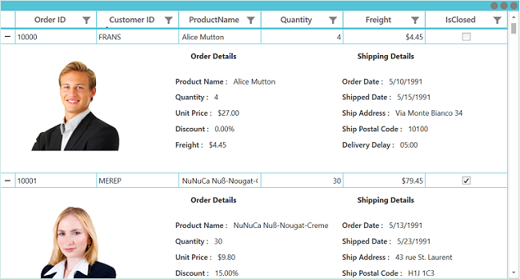
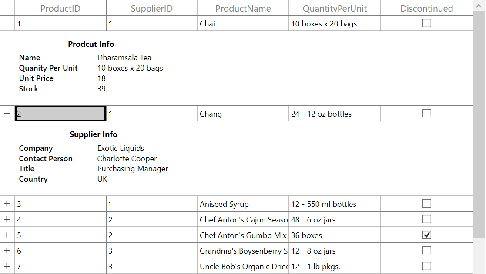

# Record Template View in WPF DataGrid (SfDataGrid)

The SfDataGrid provides support to represent additional information of a row using [TemplateViewDefinition](http://help.syncfusion.com/cr/cref_files/wpf/Syncfusion.SfGrid.WPF~Syncfusion.UI.Xaml.Grid.TemplateViewDefinition.html) that can be defined in datagrid. It allows you to load any WPF controls to [TemplateViewDefinition.RowTemplate](http://help.syncfusion.com/cr/cref_files/wpf/Syncfusion.SfGrid.WPF~Syncfusion.UI.Xaml.Grid.TemplateViewDefinition~RowTemplate.html) in order to display the additional information of a row. You can expand or collapse the row template view by using an expander in a row or programmatically.

## Defining row template

Template view can be generated for the master row by using the [RowTemplate](http://help.syncfusion.com/cr/cref_files/wpf/Syncfusion.SfGrid.WPF~Syncfusion.UI.Xaml.Grid.TemplateViewDefinition~RowTemplate.html) defined in the [TemplateViewDefinition](http://help.syncfusion.com/cr/cref_files/wpf/Syncfusion.SfGrid.WPF~Syncfusion.UI.Xaml.Grid.TemplateViewDefinition.html).

Follow the below steps to define the row template,
	* Create [TemplateViewDefinition](http://help.syncfusion.com/cr/cref_files/wpf/Syncfusion.SfGrid.WPF~Syncfusion.UI.Xaml.Grid.TemplateViewDefinition.html).
	* Define data template for the [TemplateViewDefinition.RowTemplate](http://help.syncfusion.com/cr/cref_files/wpf/Syncfusion.SfGrid.WPF~Syncfusion.UI.Xaml.Grid.TemplateViewDefinition~RowTemplate.html) property.
	* Then add [TemplateViewDefinition](http://help.syncfusion.com/cr/cref_files/wpf/Syncfusion.SfGrid.WPF~Syncfusion.UI.Xaml.Grid.TemplateViewDefinition.html) to the [SfDataGrid.DetailsViewDefinition](http://help.syncfusion.com/cr/cref_files/wpf/Syncfusion.SfGrid.WPF~Syncfusion.UI.Xaml.Grid.DetailsViewDefinition.html). 

You can bind the row data using the Data.PropertyName (where Data is the underlying object bound).



<Window.Resources>
	<DataTemplate x:Key="DetailsViewTemplate">
        <Grid>
            <Grid.RowDefinitions>
                <RowDefinition Height="Auto"/>
                <RowDefinition Height="125"/>
			</Grid.RowDefinitions>
            <Grid.ColumnDefinitions>
                <ColumnDefinition Width="250"/>
                <ColumnDefinition/>
                <ColumnDefinition/>
            </Grid.ColumnDefinitions>
            <Image Grid.Row="0" Grid.Column="0" Grid.RowSpan="2" Margin="5" Height="150" HorizontalAlignment="Left" 
                   Source="{Binding Path=Data.CustomerID, Converter={StaticResource ImageConverter}}" />
            <Label Grid.Column="1" Grid.Row="0" HorizontalAlignment="Left"
                   Margin="25,0,0,0" Content="Order Details" FontWeight="Bold" />
            <StackPanel Orientation="Vertical" Grid.Column="1" Grid.Row="1" 
						HorizontalAlignment="Left" VerticalAlignment="Center">
                <StackPanel Orientation="Horizontal">
                    <Label HorizontalAlignment="Left" VerticalAlignment="Center" FontWeight="SemiBold"
                           Content="Product Name :"/>
                    <TextBlock HorizontalAlignment="Left" VerticalAlignment="Center" Margin="5"
                               Text="{Binding Data.ProductName}"/>
                </StackPanel>

                <StackPanel Orientation="Horizontal">
                    <Label HorizontalAlignment="Left" VerticalAlignment="Center"
                           FontWeight="SemiBold" Content="Quantity :"/>
                    <TextBlock HorizontalAlignment="Left" VerticalAlignment="Center" Margin="5"
                               Text="{Binding Data.Quantity}"/>
                </StackPanel>

                <StackPanel Orientation="Horizontal">
                    <Label HorizontalAlignment="Left" VerticalAlignment="Center"
                           FontWeight="SemiBold" Content="Unit Price :"/>
                    <TextBlock HorizontalAlignment="Left" VerticalAlignment="Center" Margin="5"
                               Text="{Binding Data.UnitPrice, StringFormat='{}{0:C}'}"/>
                </StackPanel>

                <StackPanel Orientation="Horizontal">
                    <Label HorizontalAlignment="Left" VerticalAlignment="Center"
                           FontWeight="SemiBold" Content="Discount :"/>
                    <TextBlock HorizontalAlignment="Left" VerticalAlignment="Center" Margin="5"
                               Text="{Binding Data.Discount, StringFormat='{}{0:P}'}"/>
                </StackPanel>

                <StackPanel Orientation="Horizontal">
                    <Label HorizontalAlignment="Left" VerticalAlignment="Center"
                           FontWeight="SemiBold" Content="Freight :"/>
                    <TextBlock HorizontalAlignment="Left" VerticalAlignment="Center" Margin="5"
                               Text="{Binding Data.Freight, StringFormat='{}{0:c}'}"/>
                </StackPanel>
            </StackPanel>
            <Label Grid.Column="2" Grid.Row="0" HorizontalAlignment="Left" Margin="25,0,0,0"
                   Content="Shipping Details" FontWeight="Bold" />
            <StackPanel Orientation="Vertical" Grid.Column="2" Grid.Row="1" 
						HorizontalAlignment="Left" VerticalAlignment="Center">
                <StackPanel Orientation="Horizontal">
                    <Label HorizontalAlignment="Right" VerticalAlignment="Center"
                           FontWeight="SemiBold" Content="Order Date :"/>
                    <TextBlock HorizontalAlignment="Left" VerticalAlignment="Center" Margin="5"
                               Text="{Binding Data.OrderDate, StringFormat=d}"/>
                </StackPanel>

                <StackPanel Orientation="Horizontal">
                    <Label HorizontalAlignment="Right" VerticalAlignment="Center"
                           FontWeight="SemiBold" Content="Shipped Date :"/>
                    <TextBlock HorizontalAlignment="Left" VerticalAlignment="Center" Margin="5"
                               Text="{Binding Data.ShippedDate, StringFormat=d}"/>
                </StackPanel>

                <StackPanel Orientation="Horizontal">
                    <Label HorizontalAlignment="Right" VerticalAlignment="Center"
                           FontWeight="SemiBold" Content="Ship Address :"/>
                    <TextBlock HorizontalAlignment="Left" VerticalAlignment="Center" Margin="5"
                               Text="{Binding Data.ShipAddress}"/>
                </StackPanel>

                <StackPanel Orientation="Horizontal">
                    <Label HorizontalAlignment="Right" VerticalAlignment="Center"
                           FontWeight="SemiBold" Content="Ship Postal Code :"/>
                    <TextBlock HorizontalAlignment="Left" VerticalAlignment="Center" Margin="5"
                               Text="{Binding Data.ShipPostalCode, StringFormat=hh\\:mm}"/>
                </StackPanel>

                <StackPanel Orientation="Horizontal">
                    <Label HorizontalAlignment="Right" VerticalAlignment="Center"
                           FontWeight="SemiBold" Content="Delivery Delay :"/>
                    <TextBlock HorizontalAlignment="Left" VerticalAlignment="Center" Margin="5"
                               Text="{Binding Data.DeliveryDelay, StringFormat=dd\\:hh}"/>
                </StackPanel>
            </StackPanel>
        </Grid>
    </DataTemplate>
</Window.Resources>

<syncfusion:SfDataGrid Name="dataGrid"
                       AutoGenerateColumns="False"                                    
                       ItemsSource="{Binding OrderList}">
	<syncfusion:SfDataGrid.DetailsViewDefinition>
		<syncfusion:TemplateViewDefinition  RowTemplate="{StaticResource DetailsViewTemplate}"/>
	</syncfusion:SfDataGrid.DetailsViewDefinition>
</syncfusion:SfDataGrid>




## Defining RowTemplateSelector

[TemplateViewDefinition](http://help.syncfusion.com/cr/cref_files/wpf/Syncfusion.SfGrid.WPF~Syncfusion.UI.Xaml.Grid.TemplateViewDefinition.html) provides support to choose different `DataTemplate` based on underlying data object using [TemplateViewDefinition.RowTemplateSelector](http://help.syncfusion.com/cr/cref_files/wpf/Syncfusion.SfGrid.WPF~Syncfusion.UI.Xaml.Grid.TemplateViewDefinition~RowTemplateSelector.html) property.



<Application.Resources>
    <DataTemplate x:Key="ProductInfo">
        <Grid HorizontalAlignment="Left">
            <Grid.RowDefinitions>
                <RowDefinition Height="Auto" />
                <RowDefinition Height="Auto" />
            </Grid.RowDefinitions>
            <Label Grid.Row="0" HorizontalAlignment="Center" Content="Prodcut Info"
                   FontWeight="Bold" />
			<Grid Grid.Row="1" HorizontalAlignment="Left" VerticalAlignment="Center">
                <Grid.ColumnDefinitions>
                    <ColumnDefinition Width="120" />
                    <ColumnDefinition Width="*" />
                </Grid.ColumnDefinitions>
                <Grid.RowDefinitions>
                    <RowDefinition Height="Auto" />
                    <RowDefinition Height="Auto" />
                    <RowDefinition Height="Auto" />
                    <RowDefinition Height="Auto" />
                </Grid.RowDefinitions>
                <TextBlock Grid.Row="0" Grid.Column="0" HorizontalAlignment="Left"
                               FontWeight="DemiBold" Text="Name" />
                <TextBlock Grid.Row="0" Grid.Column="1" HorizontalAlignment="Left"
                               Text="{Binding Data.EnglishName}" />
                <TextBlock Grid.Row="1" Grid.Column="0" HorizontalAlignment="Left"
                               FontWeight="DemiBold" Text="Quantity Per Unit" />
                <TextBlock Grid.Row="1" Grid.Column="1" HorizontalAlignment="Left"
                               Text="{Binding Data.QuantityPerUnit}" />
                <TextBlock Grid.Row="2" Grid.Column="0" HorizontalAlignment="Left"
                               FontWeight="DemiBold" Text="Unit Price" />
                <TextBlock Grid.Row="2" Grid.Column="1" HorizontalAlignment="Left"
                               Text="{Binding Data.UnitPrice}" />
                <TextBlock Grid.Row="3" Grid.Column="0" HorizontalAlignment="Left"
                               FontWeight="DemiBold" Text="Stock" />
                <TextBlock Grid.Row="3" Grid.Column="1" HorizontalAlignment="Left"
                               Text="{Binding Data.UnitsInStock}" />
            </Grid>
        </Grid>
    </DataTemplate>

    <DataTemplate x:Key="SupplierInfo" >
        <Grid HorizontalAlignment="Left">
            <Grid.RowDefinitions>
                <RowDefinition Height="Auto" />
                <RowDefinition Height="Auto" />
            </Grid.RowDefinitions>
            <Label Grid.Row="0" HorizontalAlignment="Center" Content="Supplier Info"
                   FontWeight="Bold" />
            <Grid HorizontalAlignment="Left" Grid.Row="1" >
                <Grid.ColumnDefinitions>
                    <ColumnDefinition Width="120" />
                    <ColumnDefinition Width="*" />
                </Grid.ColumnDefinitions>
                <Grid.RowDefinitions>
                    <RowDefinition Height="Auto" />
                    <RowDefinition Height="Auto" />
                    <RowDefinition Height="Auto" />
                    <RowDefinition Height="Auto" />
                </Grid.RowDefinitions>
                <TextBlock Grid.Row="0" Grid.Column="0" HorizontalAlignment="Left"
                           FontWeight="DemiBold" Text="Company" />
                <TextBlock Grid.Row="0" Grid.Column="1" HorizontalAlignment="Left"
                           Text="{Binding Data.Suppliers.CompanyName}" />
                <TextBlock Grid.Row="1" Grid.Column="0" HorizontalAlignment="Left"
                           FontWeight="DemiBold" Text="Contact Person" />
                <TextBlock Grid.Row="1" Grid.Column="1" HorizontalAlignment="Left"
                           Text="{Binding Data.Suppliers.ContactName}" />
                <TextBlock Grid.Row="2" Grid.Column="0" HorizontalAlignment="Left"
                           FontWeight="DemiBold" Text="Title" />
                <TextBlock Grid.Row="2" Grid.Column="1" HorizontalAlignment="Left"
                           Text="{Binding Data.Suppliers.ContactTitle, Mode=OneTime}" />
                <TextBlock Grid.Row="3" Grid.Column="0" HorizontalAlignment="Left"
                           FontWeight="DemiBold" Text="Country" />
                <TextBlock Grid.Row="3" Grid.Column="1" HorizontalAlignment="Left"
                           Text="{Binding Data.Suppliers.Country}" />
			</Grid>
		</Grid>
    </DataTemplate>
</Application.Resources>

<Window.Resources>
	<local:detailsViewTemplateSelector x:Key="EditTemplateSelector"/>
</Window.Resources>

<syncfusion:SfDataGrid Name="dataGrid"
                       AutoGenerateColumns="False"                                    
                       ItemsSource="{Binding OrderList}">
	<syncfusion:SfDataGrid.DetailsViewDefinition>
		<syncfusion:TemplateViewDefinition RowTemplateSelector="{StaticResource EditTemplateSelector}"/>
	</syncfusion:SfDataGrid.DetailsViewDefinition>
</syncfusion:SfDataGrid>




public class detailsViewTemplateSelector : DataTemplateSelector
{
    public override DataTemplate SelectTemplate(object item, DependencyObject container)
    {
        var productId = ((item as RecordEntry).Data as Products).ProductID;
        if (productId % 2 == 0)
            return Application.Current.FindResource("SupplierInfo") as DataTemplate;
        else
            return Application.Current.FindResource("ProductInfo") as DataTemplate;
    }
}




## Height customization

### Height mode

You can customize height of the row that contains [RowTemplate](http://help.syncfusion.com/cr/cref_files/wpf/Syncfusion.SfGrid.WPF~Syncfusion.UI.Xaml.Grid.TemplateViewDefinition~RowTemplate.html) by using the [TemplateViewDefinition.HeightMode](http://help.syncfusion.com/cr/cref_files/wpf/Syncfusion.SfGrid.WPF~Syncfusion.UI.Xaml.Grid.TemplateViewDefinition~HeightMode.html) property. The height modes are as follows.

<table>
<tr>
<th>
Height mode
</th>
<th>
Definition
</th>
</tr>
<tr>
<td>
Auto
</td>
<td>
Arranges template for the actual size as the {{'[RowTemplate](http://help.syncfusion.com/cr/cref_files/wpf/Syncfusion.SfGrid.WPF~Syncfusion.UI.Xaml.Grid.TemplateViewDefinition~RowTemplate.html)'| markdownify}} is measured.
</td>
</tr>
<tr>
<td>
Fixed
</td>
<td>
Arranges template for the specified height in {{'[TemplateViewDefinition.Height](http://help.syncfusion.com/cr/cref_files/wpf/Syncfusion.SfGrid.WPF~Syncfusion.UI.Xaml.Grid.TemplateViewDefinition~Height.html)'| markdownify}}.
</td>
</tr>
<tr>
<td>
ViewPort
</td>
<td>
Arranges template for the ViewPortHeight when the {{'[RowTemplate](http://help.syncfusion.com/cr/cref_files/wpf/Syncfusion.SfGrid.WPF~Syncfusion.UI.Xaml.Grid.TemplateViewDefinition~RowTemplate.html)'| markdownify}} actual height is greater than ViewPortHeight.
</td>
</tr>
</table>

## Keyboard navigation support for DetailsViewTemplate

In the SfDataGrid, you can navigate from parent row to DetailsViewTemplate and vice-versa using Tab key by default. You can also restrict tab key navigation from parent to DetailsViewTemplate by setting the [TemplateViewDefinition.TemplateNavigationMode](http://help.syncfusion.com/cr/cref_files/wpf/Syncfusion.SfGrid.WPF~Syncfusion.UI.Xaml.Grid.TemplateViewDefinition~NavigationMode.html) property value to `ExcludeTemplateRow`.



<syncfusion:SfDataGrid Name="dataGrid"
                       AutoGenerateColumns="False"                                    
                       ItemsSource="{Binding OrderList}">
	<syncfusion:SfDataGrid.DetailsViewDefinition>
		<syncfusion:TemplateViewDefinition  RowTemplate="{StaticResource DetailsViewTemplate}" TemplateNavigationMode="ExcludeTemplateRow`"/>
	</syncfusion:SfDataGrid.DetailsViewDefinition>
</Syncfusion.SfDataGrid>



N> Except <kbd>Tab</kbd> key, other keys does not allow keyboard navigation from parent row to DetailsViewTemplate and vice-versa.

## Populating record template view using events

You can set the [RowTemplate](http://help.syncfusion.com/cr/cref_files/wpf/Syncfusion.SfGrid.WPF~Syncfusion.UI.Xaml.Grid.TemplateViewDefinition~RowTemplate.html) on-demand when expanding the record by using the [GridDetailsViewExpandingEventArgs.RowTemplate](http://help.syncfusion.com/cr/cref_files/wpf/Syncfusion.SfGrid.WPF~Syncfusion.UI.Xaml.Grid.GridDetailsViewExpandingEventArgs~RowTemplate.html) property in [SfDataGrid.DetailsViewExpanding](http://help.syncfusion.com/cr/cref_files/wpf/Syncfusion.SfGrid.WPF~Syncfusion.UI.Xaml.Grid.SfDataGrid~DetailsViewExpanding_EV.html) event handler.



<syncfusion:SfDataGrid Name="dataGrid"
                       AutoGenerateColumns="False"                                    
                       ItemsSource="{Binding OrderList}">
	<syncfusion:SfDataGrid.DetailsViewDefinition>
		<syncfusion:TemplateViewDefinition  RowTemplate="{StaticResource DetailsViewTemplate}"/>
	</syncfusion:SfDataGrid.DetailsViewDefinition>
</Syncfusion.SfDataGrid>


private DataTemplate GetDataTemplate()
{
    FrameworkElementFactory textBlock = new FrameworkElementFactory(typeof(TextBlock));
    Binding binding = new Binding();
    textBlock.SetBinding(TextBlock.TextProperty, binding);
    binding.Path = new PropertyPath("Data.ProductName");
    var dataTemplate = new DataTemplate() { VisualTree = textBlock };
    return dataTemplate;
}

private void dataGrid_DetailsViewExpanding(object sender, Syncfusion.UI.Xaml.Grid.GridDetailsViewExpandingEventArgs e)
{
    e.RowTemplate = GetDataTemplate();
}       



## Expanding and collapsing row template programmatically

The SfDataGrid allows you to expand or collapse the [RowTemplate](http://help.syncfusion.com/cr/cref_files/wpf/Syncfusion.SfGrid.WPF~Syncfusion.UI.Xaml.Grid.TemplateViewDefinition~RowTemplate.html) programmatically in different ways.

### Expand or collapse all the row template

You can expand or collapse all the [RowTemplate](http://help.syncfusion.com/cr/cref_files/wpf/Syncfusion.SfGrid.WPF~Syncfusion.UI.Xaml.Grid.TemplateViewDefinition~RowTemplate.html) by using the [ExpandAllDetailsView](http://help.syncfusion.com/cr/cref_files/wpf/Syncfusion.SfGrid.WPF~Syncfusion.UI.Xaml.Grid.SfDataGrid~ExpandAllDetailsView.html) and [CollapseAllDetailsView](http://help.syncfusion.com/cr/cref_files/wpf/Syncfusion.SfGrid.WPF~Syncfusion.UI.Xaml.Grid.SfDataGrid~CollapseAllDetailsView.html) methods.



this.dataGrid.ExpandAllDetailsView();
this.dataGrid.CollapseAllDetailsView();



### Expand or collapse row template based on record index

You can expand or collapse the [RowTemplate](http://help.syncfusion.com/cr/cref_files/wpf/Syncfusion.SfGrid.WPF~Syncfusion.UI.Xaml.Grid.TemplateViewDefinition~RowTemplate.html) based on the record index by using the [ExpandDetailsViewAt](http://help.syncfusion.com/cr/cref_files/wpf/Syncfusion.SfGrid.WPF~Syncfusion.UI.Xaml.Grid.SfDataGrid~ExpandDetailsViewAt.html) and [CollapseDetailsViewAt](http://help.syncfusion.com/cr/cref_files/wpf/Syncfusion.SfGrid.WPF~Syncfusion.UI.Xaml.Grid.SfDataGrid~CollapseDetailsViewAt.html) methods.



this.dataGrid.ExpandDetailsViewAt(0);
this.dataGrid.CollapseDetailsViewAt(0);



## Handling events 

### DetailsViewExpanding

The [DetailsViewExpanding](http://help.syncfusion.com/cr/cref_files/wpf/Syncfusion.SfGrid.WPF~Syncfusion.UI.Xaml.Grid.SfDataGrid~DetailsViewExpanding_EV.html) event is raised when the [RowTemplate](http://help.syncfusion.com/cr/cref_files/wpf/Syncfusion.SfGrid.WPF~Syncfusion.UI.Xaml.Grid.TemplateViewDefinition~RowTemplate.html) is expanded by using an expander.



this.dataGrid.DetailsViewExpanding += dataGrid_DetailsViewExpanding;

void dataGrid_DetailsViewExpanding(object sender, Syncfusion.UI.Xaml.Grid.GridDetailsViewExpandingEventArgs e)
{
}



### DetailsViewExpanded

The [DetailsViewExpanded](http://help.syncfusion.com/cr/cref_files/wpf/Syncfusion.SfGrid.WPF~Syncfusion.UI.Xaml.Grid.SfDataGrid~DetailsViewExpanded_EV.html) event is raised when the [RowTemplate](http://help.syncfusion.com/cr/cref_files/wpf/Syncfusion.SfGrid.WPF~Syncfusion.UI.Xaml.Grid.TemplateViewDefinition~RowTemplate.html) is expanded by using an expander.



this.dataGrid.DetailsViewExpanded += dataGrid_DetailsViewExpanded;

void dataGrid_DetailsViewExpanded(object sender, Syncfusion.UI.Xaml.Grid.GridDetailsViewExpandingEventArgs e)
{
}



### DetailsViewCollapsing

The [DetailsViewCollapsing](http://help.syncfusion.com/cr/cref_files/wpf/Syncfusion.SfGrid.WPF~Syncfusion.UI.Xaml.Grid.SfDataGrid~DetailsViewCollapsing_EV.html) event is raised when the [RowTemplate](http://help.syncfusion.com/cr/cref_files/wpf/Syncfusion.SfGrid.WPF~Syncfusion.UI.Xaml.Grid.TemplateViewDefinition~RowTemplate.html) is collapsed by using an expander.



this.dataGrid.DetailsViewCollapsing += dataGrid_DetailsViewCollapsing;

void dataGrid_DetailsViewCollapsing(object sender, Syncfusion.UI.Xaml.Grid.GridDetailsViewExpandingEventArgs e)
{
}



### DetailsViewCollapsed

The [DetailsViewCollapsed](http://help.syncfusion.com/cr/cref_files/wpf/Syncfusion.SfGrid.WPF~Syncfusion.UI.Xaml.Grid.SfDataGrid~DetailsViewCollapsed_EV.html) event is raised when the [RowTemplate](http://help.syncfusion.com/cr/cref_files/wpf/Syncfusion.SfGrid.WPF~Syncfusion.UI.Xaml.Grid.TemplateViewDefinition~RowTemplate.html) is collapsed by using an expander.



this.dataGrid.DetailsViewCollapsed += dataGrid_DetailsViewCollapsed;

void dataGrid_DetailsViewCollapsed(object sender, Syncfusion.UI.Xaml.Grid.GridDetailsViewExpandingEventArgs e)
{
}



### Cancel expanding or collapsing operations through events

You can cancel the expanding operation when expanding the [RowTemplate](http://help.syncfusion.com/cr/cref_files/wpf/Syncfusion.SfGrid.WPF~Syncfusion.UI.Xaml.Grid.TemplateViewDefinition~RowTemplate.html) by using the [GridDetailsViewExpandingEventArgs.Cancel](https://msdn.microsoft.com/en-us/library/system.componentmodel.canceleventargs.cancel.aspx) property in the [DetailsViewExpanding](http://help.syncfusion.com/cr/cref_files/wpf/Syncfusion.SfGrid.WPF~Syncfusion.UI.Xaml.Grid.SfDataGrid~DetailsViewExpanding_EV.html) event handler.



this.dataGrid.DetailsViewExpanding += dataGrid_DetailsViewExpanding;

void dataGrid_DetailsViewExpanding(object sender, Syncfusion.UI.Xaml.Grid.GridDetailsViewExpandingEventArgs e)
{
 
    if ((e.Record as OrderInfo).OrderID == 1002)
        e.Cancel = true;
}




Similarly, the collapsing operation can also be canceled through the [GridDetailsViewCollapsingEventArgs.Cancel](https://msdn.microsoft.com/en-us/library/system.componentmodel.canceleventargs.cancel.aspx) property in [DetailsViewCollapsing](http://help.syncfusion.com/cr/cref_files/wpf/Syncfusion.SfGrid.WPF~Syncfusion.UI.Xaml.Grid.SfDataGrid~DetailsViewCollapsing_EV.html) event handler.



this.dataGrid.DetailsViewCollapsing += dataGrid_DetailsViewCollapsing;

void dataGrid_DetailsViewCollapsing(object sender, Syncfusion.UI.Xaml.Grid.GridDetailsViewCollapsingEventArgs e)
{
 
    if ((e.Record as OrderInfo).OrderID == 1002)
        e.Cancel = true;
}



## Limitations

Limitations are:

* Does not support both `DetailsViewTemplate` and `DetailsViewDataGrid` at same level.
* Does not support more than one `DetailsViewTemplate` in same level.
