# Summaries in WPF DataGrid (SfDataGrid)

SfDataGrid provides support to display the concise information about the data objects using summaries. SfDataGrid provides below three different types of summary rows.

* **Table Summary** – Used to display summary information of table either at top or bottom of SfDataGrid. 

* **Group Summary** – used to display summary information of data objects in each group.

* **Caption Summary** – used to display summary information in the caption of the group.
 

Summary rows are represented by using [GridSummaryRow](http://help.syncfusion.com/cr/cref_files/wpf/Syncfusion.SfGrid.WPF~Syncfusion.UI.Xaml.Grid.GridSummaryRow.html) and  each `GridSummaryRow` hold summary information of columns in [SummaryColumns](http://help.syncfusion.com/cr/cref_files/wpf/Syncfusion.SfGrid.WPF~Syncfusion.UI.Xaml.Grid.GridSummaryRow~SummaryColumns.html) property . The `SummaryColumns` contains the collection of [GridSummaryColumn](http://help.syncfusion.com/cr/cref_files/wpf/Syncfusion.SfGrid.WPF~Syncfusion.UI.Xaml.Grid.GridSummaryColumn.html) which carries the name of column ,format and its summary aggregate type.

## Table Summary

The table summary calculates the summary value over all the records. SfDataGrid allows you to add any number of table summary rows in top and bottom of SfDataGrid.

You can add table summary row in SfDataGrid by adding [GridTableSummaryRow](http://help.syncfusion.com/cr/cref_files/wpf/Syncfusion.SfGrid.WPF~Syncfusion.UI.Xaml.Grid.GridTableSummaryRow.html) to [SfDataGrid.TableSummaryRows](http://help.syncfusion.com/cr/cref_files/wpf/Syncfusion.SfGrid.WPF~Syncfusion.UI.Xaml.Grid.SfDataGrid~TableSummaryRows.html) collection.

### Defining summary for column

You can display summary information in the column by setting [GridSummaryRow.ShowSummaryInRow](http://help.syncfusion.com/cr/cref_files/wpf/Syncfusion.SfGrid.WPF~Syncfusion.UI.Xaml.Grid.GridSummaryRow~ShowSummaryInRow.html) to `false` and defining summary columns. To calculate summary based on column you have to specify the below properties,

1. [GridSummaryColumn.MappingName](http://help.syncfusion.com/cr/cref_files/wpf/Syncfusion.SfGrid.WPF~Syncfusion.UI.Xaml.Grid.GridSummaryColumn~MappingName.html) – MappingName of the column (Property name of data object) that you want calculate summary.

2. [GridSummaryColumn.SummaryType](http://help.syncfusion.com/cr/cref_files/wpf/Syncfusion.SfGrid.WPF~Syncfusion.UI.Xaml.Grid.GridSummaryColumn~SummaryType.html) – SfDataGrid provides different built-in summary calculation functions for various types.

3. [GridSummaryColumn.Format](http://help.syncfusion.com/cr/cref_files/wpf/Syncfusion.SfGrid.WPF~Syncfusion.UI.Xaml.Grid.GridSummaryColumn~Format.html) – Used to define format string for summary based on support function name’s in specified SummaryType.

Refer [Formatting Summary](#formatting-summary) section to know more about how to format summary and [Aggregate Types](#aggregate-types) section to know about different Summary Types.

In the below code snippet, summary is defined for `UnitPrice` and `ProductName` columns.



<syncfusion:SfDataGrid x:Name="dataGrid"                               
                       AutoGenerateColumns="True"
                       ItemsSource="{Binding Orders}">

    <syncfusion:SfDataGrid.TableSummaryRows>
        <syncfusion:GridTableSummaryRow ShowSummaryInRow="False">
            <syncfusion:GridSummaryRow.SummaryColumns>
                <syncfusion:GridSummaryColumn Name="PriceAmount"
                                              Format="'Total UnitPrice : {Sum:c}'"
                                              MappingName="UnitPrice"
                                              SummaryType="DoubleAggregate" />
                <syncfusion:GridSummaryColumn Name="ProductCount"
                                              Format="'Total Product Count : {Count:d}'"
                                              MappingName="ProductName"
                                              SummaryType="CountAggregate" />
            </syncfusion:GridSummaryRow.SummaryColumns>
        </syncfusion:GridTableSummaryRow>
    </syncfusion:SfDataGrid.TableSummaryRows>

</syncfusion:SfDataGrid>


this.dataGrid.TableSummaryRows.Add(new GridTableSummaryRow()
{
    ShowSummaryInRow = false,
    SummaryColumns = new ObservableCollection<ISummaryColumn>()
    {
        new GridSummaryColumn()
        { 
            Name = "PriceAmount", 
            MappingName="UnitPrice", 
            SummaryType= SummaryType.Int32Aggregate, 
            Format="Total UnitPrice : {Sum:c}"
        }, 

        new GridSummaryColumn()
        {
            Name="ProductCount",
            MappingName="ProductName",
            SummaryType=SummaryType.CountAggregate,
            Format="Total Product Count : {Count:d}"
        },
    }
});



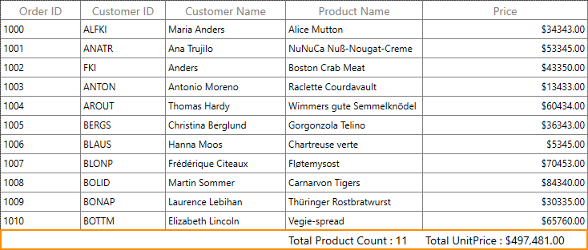

### Displaying summary for Row

You can display summary information in row by setting [GridSummaryRow.ShowSummaryInRow](http://help.syncfusion.com/cr/cref_files/wpf/Syncfusion.SfGrid.WPF~Syncfusion.UI.Xaml.Grid.GridSummaryRow~ShowSummaryInRow.html) to `true` and defining summary columns. You have to set [GridSummaryRow.Title](http://help.syncfusion.com/cr/cref_files/wpf/Syncfusion.SfGrid.WPF~Syncfusion.UI.Xaml.Grid.GridSummaryRow~Title.html) based on [GridSummaryColumn.Name](http://help.syncfusion.com/cr/cref_files/wpf/Syncfusion.SfGrid.WPF~Syncfusion.UI.Xaml.Grid.GridSummaryColumn~Name.html) property to format summary columns values in row. 

Refer [Formatting Summary](#formatting-summary) section to know more about how to format summary.
 


<syncfusion:SfDataGrid x:Name="dataGrid"
                       AutoGenerateColumns="True"
                       ItemsSource="{Binding Orders}">
                       
    <syncfusion:SfDataGrid.TableSummaryRows>
        <syncfusion:GridTableSummaryRow Title=" Total Price : {PriceAmount} for {ProductCount} products " ShowSummaryInRow="True">
            <syncfusion:GridSummaryRow.SummaryColumns>
                <syncfusion:GridSummaryColumn Name="PriceAmount"
                                                Format="'{Sum:c}'"
                                                MappingName="UnitPrice"
                                                SummaryType="DoubleAggregate" />
    
                <syncfusion:GridSummaryColumn Name="ProductCount"
                                                Format="'{Count:d}'"
                                                MappingName="ProductName"
                                                SummaryType="CountAggregate" />
    
            </syncfusion:GridSummaryRow.SummaryColumns>
        </syncfusion:GridTableSummaryRow>
    </syncfusion:SfDataGrid.TableSummaryRows>
    
</syncfusion:SfDataGrid>


this.dataGrid.TableSummaryRows.Add(new GridTableSummaryRow()
{
    ShowSummaryInRow = true,
    Title = "Total Price: {PriceAmount} for {ProductCount} Products",
    SummaryColumns = new ObservableCollection<ISummaryColumn>()
    {
        new GridSummaryColumn()
        { 
            Name = "PriceAmount", 
            MappingName="UnitPrice", 
            SummaryType= SummaryType.Int32Aggregate, 
            Format="{Sum:c}"
        }, 

        new GridSummaryColumn()
        {
            Name="ProductCount",
            MappingName="ProductName",
            SummaryType=SummaryType.CountAggregate,
            Format="{Count:d}"
        },
    }
});



### Table summary template

The data grid hosts any view(s) inside a table summary for the entire row or for individual columns by loading a template.

#### Displaying template for a row

The template for the row can be loaded by using [DataTemplate](https://msdn.microsoft.com/en-us/library/system.windows.datatemplate.aspx) or [DataTemplateSelector](https://docs.microsoft.com/en-us/dotnet/api/system.windows.controls.datatemplateselector?view=netframework-4.8) as follows,

##### Using template 

The template for the table summary row can be loaded using the [GridSummaryRow.TitleTemplate](https://help.syncfusion.com/cr/cref_files/wpf/Syncfusion.SfGrid.WPF~Syncfusion.UI.Xaml.Grid.GridSummaryRow~TitleTemplate.html) property with [GridSummaryRow.ShowSummaryInRow](http://help.syncfusion.com/cr/cref_files/wpf/Syncfusion.SfGrid.WPF~Syncfusion.UI.Xaml.Grid.GridSummaryRow~ShowSummaryInRow.html) enabled.



<syncfusion:ChromelessWindow.Resources>
    <local:TableSummaryRowConverter x:Key="summaryConverter" />
</syncfusion:ChromelessWindow.Resources>
<syncfusion:SfDataGrid x:Name="dataGrid"
                       AutoGenerateColumns="True"
                       ItemsSource="{Binding Orders}">
<syncfusion:SfDataGrid.TableSummaryRows>
    <syncfusion:GridTableSummaryRow Title=" Total Price : {PriceAmount} for {ProductCount} products " ShowSummaryInRow="True" Position="Bottom">
        <syncfusion:GridSummaryRow.SummaryColumns>
            <syncfusion:GridSummaryColumn Name="PriceAmount"
                                    Format="'{Sum:c}'"
                                    MappingName="UnitPrice"
                                    SummaryType="DoubleAggregate" />

            <syncfusion:GridSummaryColumn Name="ProductCount"
                                    Format="'{Count:d}'"
                                    MappingName="ProductName"
                                    SummaryType="CountAggregate" />
        </syncfusion:GridSummaryRow.SummaryColumns>
        <syncfusion:GridSummaryRow.TitleTemplate>
            <DataTemplate>
                <TextBlock  Text="{Binding Converter={StaticResource summaryConverter}, ConverterParameter= {x:Reference Name= dataGrid}}" Foreground="Blue" Background="Yellow" FontSize="15"></TextBlock>
            </DataTemplate>
        </syncfusion:GridSummaryRow.TitleTemplate>
    </syncfusion:GridTableSummaryRow>
</syncfusion:SfDataGrid.TableSummaryRows>
</syncfusion:SfDataGrid>


class TableSummaryRowConverter : IValueConverter
{
    public object Convert(object value, Type targetType, object parameter, CultureInfo culture)
    {

        var data = value != null ? value as SummaryRecordEntry : null;
        if (data != null)
        {
            SfDataGrid dataGrid = (SfDataGrid)parameter;
            var unitPrice = SummaryCreator.GetSummaryDisplayText(data, "UnitPrice", dataGrid.View);
            var count = SummaryCreator.GetSummaryDisplayText(data, "ProductName", dataGrid.View);

            return "Total Price : " + unitPrice.ToString() + " for " + count.ToString() + " Products ";
        }

        return null;
    }

    public object ConvertBack(object value, Type targetType, object parameter, CultureInfo culture)
    {
        return null;
    }
}



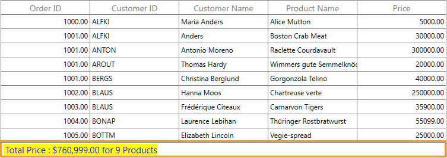

##### Using template selector

The template for the table summary row can also be loaded based on data object and the data-bound element using the [GridSummaryRow.TitleTemplateSelector](https://help.syncfusion.com/cr/cref_files/wpf/Syncfusion.SfGrid.WPF~Syncfusion.UI.Xaml.Grid.GridSummaryRow~TitleTemplateSelector.html) property with [GridSummaryRow.ShowSummaryInRow](http://help.syncfusion.com/cr/cref_files/wpf/Syncfusion.SfGrid.WPF~Syncfusion.UI.Xaml.Grid.GridSummaryRow~ShowSummaryInRow.html) enabled.



<Window.Resources>
    <local:TemplateSelector x:Key="templateSelector" />
</Window.Resources>
<syncfusion:SfDataGrid x:Name="dataGrid"
                       AutoGenerateColumns="True"
                       ItemsSource="{Binding Orders}">
<syncfusion:SfDataGrid.TableSummaryRows>
    <syncfusion:GridTableSummaryRow Title="Total Price : {PriceAmount} for {ProductCount} products" ShowSummaryInRow="True" Position="Bottom" TitleTemplateSelector="{StaticResource templateSelector}">
        <syncfusion:GridSummaryRow.SummaryColumns>
            <syncfusion:GridSummaryColumn Name="PriceAmount"
                                    Format="'{Sum:c}'"
                                    MappingName="UnitPrice"
                                    SummaryType="DoubleAggregate" />
									
            <syncfusion:GridSummaryColumn Name="ProductCount"
                                    Format="'{Count:d}'"
                                    MappingName="ProductName"
                                    SummaryType="CountAggregate" />
            </syncfusion:GridSummaryColumn>
        </syncfusion:GridSummaryRow.SummaryColumns>
    </syncfusion:GridTableSummaryRow>
</syncfusion:SfDataGrid.TableSummaryRows>
</syncfusion:SfDataGrid>


public class TemplateSelector : DataTemplateSelector
{
    public override DataTemplate SelectTemplate(object item, DependencyObject container)
    {
        var summaryRecordEntry = item as SummaryRecordEntry;

        if (summaryRecordEntry.SummaryRow.ShowSummaryInRow)
        {
            return Application.Current.MainWindow.Resources["GridSummaryRowTemplate"] as DataTemplate;
        }
        else
        {
            return Application.Current.MainWindow.Resources["GridSummaryColumnTemplate"] as DataTemplate;
        }

        return null;
    }
}



#### Displaying template for a column

The template for the summary column can be loaded by using `DataTemplate` or `DataTemplateSelector` as follows,

##### Using template

The template for the defined summary column can be loaded using the [GridSummaryColumn.Template](https://help.syncfusion.com/cr/cref_files/wpf/Syncfusion.SfGrid.WPF~Syncfusion.UI.Xaml.Grid.GridSummaryColumn~Template.html) property.



<syncfusion:ChromelessWindow.Resources>
    <local:SummaryColumnConverter x:Key="summaryColumnConverter" />
</syncfusion:ChromelessWindow.Resources>	
<syncfusion:SfDataGrid x:Name="dataGrid"
                       AutoGenerateColumns="True"
                       ItemsSource="{Binding Orders}">
<syncfusion:SfDataGrid.TableSummaryRows>
    <syncfusion:GridTableSummaryRow Position="Bottom" ShowSummaryInRow="False">
        <syncfusion:GridTableSummaryRow.SummaryColumns>
            <syncfusion:GridSummaryColumn Name="PriceAmount"
                                  Format="'Total Price : {Sum:c}'"
                                  MappingName="UnitPrice"
                                  SummaryType="DoubleAggregate" >
                <syncfusion:GridSummaryColumn.Template>
                    <DataTemplate>
                        <TextBlock Text="{Binding Converter={ StaticResource summaryColumnConverter}, ConverterParameter=UnitPrice }" Foreground="Red" Background="LightBlue"></TextBlock>
                    </DataTemplate>
                </syncfusion:GridSummaryColumn.Template>
            </syncfusion:GridSummaryColumn>
            <syncfusion:GridSummaryColumn Name="ProductCount"
                                  Format="'Total Product Count : {Count:d}'"
                                  MappingName="ProductName"
                                  SummaryType="CountAggregate">
                <syncfusion:GridSummaryColumn.Template>
                    <DataTemplate>
                        <TextBlock Text="{Binding Converter={ StaticResource summaryColumnConverter}, ConverterParameter=ProductName }" Foreground="Red" Background="LightBlue"></TextBlock>
                    </DataTemplate>
                </syncfusion:GridSummaryColumn.Template>
            </syncfusion:GridSummaryColumn>
        </syncfusion:GridTableSummaryRow.SummaryColumns>
    </syncfusion:GridTableSummaryRow>
</syncfusion:SfDataGrid.TableSummaryRows>
</syncfusion:SfDataGrid>


class SummaryColumnConverter : IValueConverter
{
    public object Convert(object value, Type targetType, object parameter, CultureInfo culture)
    {
        var summaryRecordEntry = value as SummaryRecordEntry;
        if (summaryRecordEntry != null)
        {
            var columnName = parameter.ToString();
            var summaryRow = summaryRecordEntry.SummaryRow;
            var summaryCol = summaryRow.SummaryColumns.FirstOrDefault(s => s.MappingName == columnName);
            var summaryItems = summaryRecordEntry.SummaryValues;
            if (summaryItems != null && summaryCol != null)
            {
                var item = summaryItems.FirstOrDefault(s => s.Name == summaryCol.Name);
                if (item != null)
                {
                    if (columnName == "ProductName")
                        return string.Format("Total Product Count : {0:d}", item.AggregateValues.Values.ToArray());
                    if (columnName == "UnitPrice")
                        return string.Format("Total Price : {0:c}", item.AggregateValues.Values.ToArray());
                }
            }
        }

        return "Value is wrong";
    }

    public object ConvertBack(object value, Type targetType, object parameter, CultureInfo culture)
    {
        return null;

    }
}



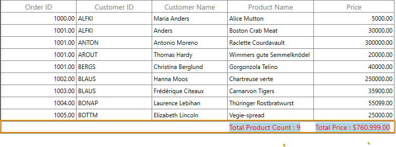

##### Using template selector

The template for the defined summary column can also be loaded based on data object and the data-bound element using the [GridSummaryColumn.TemplateSelector](https://help.syncfusion.com/cr/cref_files/wpf/Syncfusion.SfGrid.WPF~Syncfusion.UI.Xaml.Grid.GridSummaryColumn~TemplateSelector.html) property.



<syncfusion:ChromelessWindow.Resources>
    <local:TemplateSelector x:Key="templateSelector" />
</syncfusion:ChromelessWindow.Resources>
<syncfusion:SfDataGrid x:Name="dataGrid"
                       AutoGenerateColumns="True"
                       ItemsSource="{Binding Orders}">
<syncfusion:SfDataGrid.TableSummaryRows>
    <syncfusion:GridSummaryRow ShowSummaryInRow="False">
        <syncfusion:GridSummaryRow.SummaryColumns>
            <syncfusion:GridSummaryColumn Name="PriceAmount"
                                  Format="'Total Price : {Sum:c}'"
                                  MappingName="UnitPrice"
                                  SummaryType="DoubleAggregate" TemplateSelector="{StaticResource templateSelector}">
            </syncfusion:GridSummaryColumn>
        </syncfusion:GridSummaryRow.SummaryColumns>
    </syncfusion:GridSummaryRow>
</syncfusion:SfDataGrid.TableSummaryRows>
</syncfusion:SfDataGrid>


public class TemplateSelector : DataTemplateSelector
{
    public override DataTemplate SelectTemplate(object item, DependencyObject container)
    {
        if (item == null)
            return null;

        var summaryRecordEntry = item as SummaryRecordEntry;

        if (summaryRecordEntry.SummaryRow.ShowSummaryInRow)
        {
            return Application.Current.MainWindow.Resources["GridSummaryRowTemplate"] as DataTemplate;
        }
        else
        {
            return Application.Current.MainWindow.Resources["GridSummaryColumnTemplate"] as DataTemplate;
        }
    }
}



### Displaying column summary with title

SfDataGrid supports to show column summary and title summary at the same time. You can show column summary along with title by defining the [GridSummaryRow.Title](http://help.syncfusion.com/cr/cref_files/wpf/Syncfusion.SfGrid.WPF~Syncfusion.UI.Xaml.Grid.GridSummaryRow~Title.html)  and [GridSummaryRow.TitleColumnCount](https://help.syncfusion.com/cr/cref_files/wpf/Syncfusion.SfGrid.WPF~Syncfusion.UI.Xaml.Grid.GridSummaryRow~TitleColumnCount.html) property along with defining summary columns. Showing column summary along with title can be only supported if [GridSummaryRow.ShowSummaryInRow](http://help.syncfusion.com/cr/cref_files/wpf/Syncfusion.SfGrid.WPF~Syncfusion.UI.Xaml.Grid.GridSummaryRow~ShowSummaryInRow.html) is disabled.

Refer [Defining summary for column](#defining-summary-for-column) section to know more about how to define summary columns.

In the below code snippet, `GridSummaryRow.TitleColumnCount` is set as 2 and [GridSummaryRow.Title](http://help.syncfusion.com/cr/cref_files/wpf/Syncfusion.SfGrid.WPF~Syncfusion.UI.Xaml.Grid.GridSummaryRow~Title.html) is defined along with summary columns.



<syncfusion:SfDataGrid x:Name="dataGrid"
                       AutoGenerateColumns="True"
                       ItemsSource="{Binding Orders}"
                       ShowGroupDropArea="True">
    <syncfusion:SfDataGrid.TableSummaryRows>
       <syncfusion:GridTableSummaryRow ShowSummaryInRow="False" TitleColumnCount="2" Position="Top"
                                       Title="Total Price : {PriceAmount} for {ProductCount} products">
            <syncfusion:GridSummaryRow.SummaryColumns>
                <syncfusion:GridSummaryColumn Name="CustomerName" 
                                              Format=" {Count:d}"
                                              MappingName="CustomerName" 
                                              SummaryType="CountAggregate" />
                <syncfusion:GridSummaryColumn Name="PriceAmount"
                                              Format=" {Sum:c}"
                                              MappingName="UnitPrice"
                                              SummaryType="DoubleAggregate" />
                <syncfusion:GridSummaryColumn Name="ProductCount"
                                              Format=" {Count:d}"
                                              MappingName="ProductName"
                                              SummaryType="CountAggregate" />                        
            </syncfusion:GridSummaryRow.SummaryColumns>
       </syncfusion:GridTableSummaryRow>      	
       <syncfusion:GridTableSummaryRow ShowSummaryInRow="False" TitleColumnCount="2" Position="Bottom"
                                       Title="Total Price : {PriceAmount} for {ProductCount} products">
            <syncfusion:GridSummaryRow.SummaryColumns>
                <syncfusion:GridSummaryColumn Name="CustomerName" 
                                              Format=" {Count:d}"
                                              MappingName="CustomerName" 
                                              SummaryType="CountAggregate" />
                <syncfusion:GridSummaryColumn Name="PriceAmount"
                                              Format=" {Sum:c}"
                                              MappingName="UnitPrice"
                                              SummaryType="DoubleAggregate" />
                <syncfusion:GridSummaryColumn Name="ProductCount"
                                              Format=" {Count:d}"
                                              MappingName="ProductName"
                                              SummaryType="CountAggregate" />                        
            </syncfusion:GridSummaryRow.SummaryColumns>
       </syncfusion:GridTableSummaryRow>
    </syncfusion:SfDataGrid.TableSummaryRows>    
</syncfusion:SfDataGrid>


this.dataGrid.TableSummaryRows.Add(new GridTableSummaryRow()
{
    ShowSummaryInRow = false,
    Position = TableSummaryRowPosition.Top,
    Title = "Total Price : {PriceAmount} for {ProductCount} products",
    TitleColumnCount = 2,
    SummaryColumns = new ObservableCollection<ISummaryColumn>()
    {
        new GridSummaryColumn()
        {
            Name="CustomerName",
            Format="{Count:d}",
            MappingName="CustomerName",
            SummaryType=SummaryType.CountAggregate
        },
		
        new GridSummaryColumn()
        {
            Name = "PriceAmount",
            MappingName="UnitPrice",
            SummaryType= SummaryType.DoubleAggregate,
            Format="{Sum:c}"
        },
		
        new GridSummaryColumn()
        {
            Name="ProductCount",
            MappingName="ProductName",
            SummaryType=SummaryType.CountAggregate,
            Format="{Count:d}"
        }        
    }
});

this.dataGrid.TableSummaryRows.Add(new GridTableSummaryRow()
{
    ShowSummaryInRow = false,
    Position = TableSummaryRowPosition.Bottom,
    Title = "Total Price : {PriceAmount} for {ProductCount} products",
    TitleColumnCount = 2,
    SummaryColumns = new ObservableCollection<ISummaryColumn>()
    {
        new GridSummaryColumn()
        {
            Name="CustomerName",
            Format="{Count:d}",
            MappingName="CustomerName",
            SummaryType=SummaryType.CountAggregate
        },
		
        new GridSummaryColumn()
        {
            Name = "PriceAmount",
            MappingName="UnitPrice",
            SummaryType= SummaryType.DoubleAggregate,
            Format="{Sum:c}"
        },
		
        new GridSummaryColumn()
        {
            Name="ProductCount",
            MappingName="ProductName",
            SummaryType=SummaryType.CountAggregate,
            Format="{Count:d}"
        }        
    }
});




The following screenshot illustrates displaying summary columns with title at same time for `TableSummaryRow`.

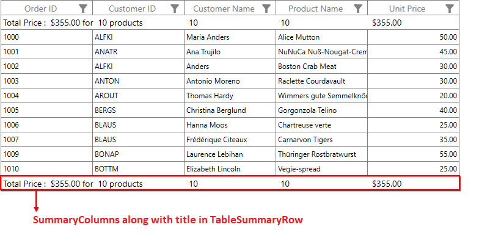

#### Limitations

The following are the limitations of displaying column summary along with title at same time for `TableSummaryRow`:

* If [FrozenColumnCount](https://help.syncfusion.com/cr/cref_files/wpf/Syncfusion.SfGrid.WPF~Syncfusion.UI.Xaml.Grid.SfGridBase~FrozenColumnCount.html) is defined lesser than `GridSummaryRow.TitleColumnCount`, the title summary will be spanned to [FrozenColumnCount](https://help.syncfusion.com/cr/cref_files/wpf/Syncfusion.SfGrid.WPF~Syncfusion.UI.Xaml.Grid.SfGridBase~FrozenColumnCount.html) range, since spanned range and frozen range cannot be vary.
* Summary columns defined in the `GridSummaryRow.TitleColumnCount` range will not be shown.

#### Displaying template for column summary with title

The template for column summary can also be displayed with title template using `DataTemplate` or `DataTemplateSelector` as follows,

##### Using template

The template for column summary can also be displayed with title template using `GridSummaryRow.TitleColumnCount` property along with defining `GridSummaryRow.TitleTemplate` and `GridSummaryColumn.Template` properties.



<syncfusion:ChromelessWindow.Resources>
    <local:TableSummaryRowConverter x:Key="summaryRowConverter"/>
		<local:SummaryColumnConverter x:Key="summaryColumnConverter" />
</syncfusion:ChromelessWindow.Resources>
<syncfusion:SfDataGrid x:Name="dataGrid"
                       AutoGenerateColumns="True"
                       ItemsSource="{Binding Orders}"
                       ShowGroupDropArea="True"
                       AllowResizingColumns="True">
    <syncfusion:SfDataGrid.TableSummaryRows>
        <syncfusion:GridSummaryRow Title="Total Price : {PriceAmount} for {ProductCount} products" ShowSummaryInRow="False" TitleColumnCount="2">
            <syncfusion:GridSummaryRow.SummaryColumns>
                <syncfusion:GridSummaryColumn Name="PriceAmount"
                          Format="'{Sum:c}'"
                          MappingName="UnitPrice"
                          SummaryType="DoubleAggregate" >
                    <syncfusion:GridSummaryColumn.Template>
                        <DataTemplate>
                            <TextBlock Text="{Binding Converter={ StaticResource summaryColumnConverter}, ConverterParameter=UnitPrice }" Foreground="Red" Background="LightBlue"></TextBlock>
                        </DataTemplate>
                    </syncfusion:GridSummaryColumn.Template>
                </syncfusion:GridSummaryColumn>
                <syncfusion:GridSummaryColumn Name="ProductCount"
                          Format="'{Count:d}'"
                          MappingName="ProductName"
                          SummaryType="CountAggregate">
                    <syncfusion:GridSummaryColumn.Template>
                        <DataTemplate>
                            <TextBlock Text="{Binding Converter={ StaticResource summaryColumnConverter}, ConverterParameter=ProductName }" Foreground="Red" Background="LightBlue"></TextBlock>
                        </DataTemplate>
                    </syncfusion:GridSummaryColumn.Template>
                </syncfusion:GridSummaryColumn>
            </syncfusion:GridSummaryRow.SummaryColumns>
            <syncfusion:GridSummaryRow.TitleTemplate>
                <DataTemplate>
                    <TextBlock  Text="{Binding Converter={StaticResource summaryRowConverter}, ConverterParameter= {x:Reference Name= dataGrid}}" Foreground="Blue" Background="Yellow" FontSize="15"></TextBlock>
                </DataTemplate>
            </syncfusion:GridSummaryRow.TitleTemplate>
        </syncfusion:GridSummaryRow>
    </syncfusion:SfDataGrid.TableSummaryRows>
</syncfusion:SfDataGrid>



##### Using template selector

The template for column summary can also be displayed with title template based on data object and the data-bound element using `GridSummaryRow.TitleColumnCount` property along with defining `GridSummaryRow.TitleTemplateSelector` and `GridSummaryColumn.TemplateSelector` properties.



<syncfusion:ChromelessWindow.Resources>
    <local:TemplateSelector x:Key="templateSelector" />
</syncfusion:ChromelessWindow.Resources>
<syncfusion:SfDataGrid x:Name="dataGrid"
                       AutoGenerateColumns="True"
                       ItemsSource="{Binding Orders}"
                       ShowGroupDropArea="True"
                       AllowResizingColumns="True">
    <syncfusion:SfDataGrid.TableSummaryRows>
        <syncfusion:GridSummaryRow Title="Total Price : {PriceAmount} for {ProductCount} products" ShowSummaryInRow="False" TitleColumnCount="2" TitleTemplateSelector = "{StaticResource templateSelector}" >
            <syncfusion:GridSummaryRow.SummaryColumns>
                <syncfusion:GridSummaryColumn Name="PriceAmount"
                          Format="'{Sum:c}'"
                          MappingName="UnitPrice"
                          SummaryType="DoubleAggregate" TemplateSelector = "{StaticResource templateSelector}">
                </syncfusion:GridSummaryColumn>
                <syncfusion:GridSummaryColumn Name="ProductCount"
                          Format="'{Count:d}'"
                          MappingName="ProductName"
                          SummaryType="CountAggregate" TemplateSelector = "{StaticResource templateSelector}">
                </syncfusion:GridSummaryColumn>
            </syncfusion:GridSummaryRow.SummaryColumns>
        </syncfusion:GridSummaryRow>
    </syncfusion:SfDataGrid.TableSummaryRows>
</syncfusion:SfDataGrid>



### Positioning TableSummaryRow

You can position the table summary either at top or bottom of SfDataGrid by setting [GridTableSummaryRow.Position](http://help.syncfusion.com/cr/cref_files/wpf/Syncfusion.SfGrid.WPF~Syncfusion.UI.Xaml.Grid.GridTableSummaryRow~Position.html) property.



<syncfusion:SfDataGrid x:Name="dataGrid"
                        AutoGenerateColumns="True"
                        ItemsSource="{Binding Orders}">

    <syncfusion:SfDataGrid.TableSummaryRows>

        <syncfusion:GridTableSummaryRow Position="Top" ShowSummaryInRow="False">
            <syncfusion:GridSummaryRow.SummaryColumns>
                <syncfusion:GridSummaryColumn Name="PriceAmount"
                                              Format="'{Sum:c}'"
                                              MappingName="UnitPrice"
                                              SummaryType="DoubleAggregate" />
            </syncfusion:GridSummaryRow.SummaryColumns>
        </syncfusion:GridTableSummaryRow>

        <syncfusion:GridTableSummaryRow Title=" Total Product count: {ProductCount}"
                                        Position="Bottom"
                                        ShowSummaryInRow="True">
            <syncfusion:GridSummaryRow.SummaryColumns>
                <syncfusion:GridSummaryColumn Name="ProductCount"
                                                Format="'{Count:d}'"
                                                MappingName="ProductName"
                                                SummaryType="CountAggregate" />
            </syncfusion:GridSummaryRow.SummaryColumns>
        </syncfusion:GridTableSummaryRow>

    </syncfusion:SfDataGrid.TableSummaryRows>
</syncfusion:SfDataGrid>


GridTableSummaryRow tablesummaryrow1 = new GridTableSummaryRow() 
{ 
    ShowSummaryInRow = false, 
    Position = TableSummaryRowPosition.Top,
    SummaryColumns = new ObservableCollection<ISummaryColumn>()
    {

        new GridSummaryColumn()
        {
            Name="PriceAmount",
            Format="{Sum:c}",
            MappingName="UnitPrice",
            SummaryType=SummaryType.DoubleAggregate 

        }
    }
};

GridTableSummaryRow tablesummaryrow2 = new GridTableSummaryRow()
{
    ShowSummaryInRow = true,
    Position = TableSummaryRowPosition.Bottom,
    Title="Total Product count: {ProductCount}",
    SummaryColumns = new ObservableCollection<ISummaryColumn>()
    {

        new GridSummaryColumn()
        {
            Name="ProductCount",
            Format="{Count:d}",
            MappingName="ProductName",
            SummaryType=SummaryType.CountAggregate 
        }
    }
};

this.dataGrid.TableSummaryRows.Add(tablesummaryrow1);
this.dataGrid.TableSummaryRows.Add(tablesummaryrow2);



## Group Summary

Group summary values calculated based on the records in the group and the summary information will be displayed at the bottom of each group. You can view the group summary row by expanding the corresponding group header. SfDataGrid allows you to add any number of group summary rows.

You can add the group summary rows in SfDataGrid by adding the [GridSummaryRow](http://help.syncfusion.com/cr/cref_files/wpf/Syncfusion.SfGrid.WPF~Syncfusion.UI.Xaml.Grid.GridSummaryRow.html) to [SfDataGrid.GroupSummaryRows](http://help.syncfusion.com/cr/cref_files/wpf/Syncfusion.SfGrid.WPF~Syncfusion.UI.Xaml.Grid.SfDataGrid~GroupSummaryRows.html) collection.

### Defining summary for column

You can display summary information in the column by setting [GridSummaryRow.ShowSummaryInRow](http://help.syncfusion.com/cr/cref_files/wpf/Syncfusion.SfGrid.WPF~Syncfusion.UI.Xaml.Grid.GridSummaryRow~ShowSummaryInRow.html) to `false` and defining summary columns. To calculate summary based on column you have to specify the below properties,

1. [GridSummaryColumn.MappingName](http://help.syncfusion.com/cr/cref_files/wpf/Syncfusion.SfGrid.WPF~Syncfusion.UI.Xaml.Grid.GridSummaryColumn~MappingName.html) – MappingName of the column (Property name of data object) that you want calculate summary.

2. [GridSummaryColumn.SummaryType](http://help.syncfusion.com/cr/cref_files/wpf/Syncfusion.SfGrid.WPF~Syncfusion.UI.Xaml.Grid.GridSummaryColumn~SummaryType.html) – SfDataGrid provides different built-in summary calculation functions for various types.

3. [GridSummaryColumn.Format](http://help.syncfusion.com/cr/cref_files/wpf/Syncfusion.SfGrid.WPF~Syncfusion.UI.Xaml.Grid.GridSummaryColumn~Format.html) – Used to define format string for summary based on support function name’s in specified SummaryType.

Refer [Formatting Summary](#formatting-summary) section to know more about how to format summary and [Aggregate Types](#aggregate-types) section to know about different Summary Type’s.

In the below code snippet, summary is defined for `UnitPrice` and `ProductName` columns.



<syncfusion:SfDataGrid x:Name="dataGrid"                             
                       AutoGenerateColumns="True"
                       ItemsSource="{Binding Orders}"
                       ShowGroupDropArea="True">

    <syncfusion:SfDataGrid.GroupSummaryRows>
        <syncfusion:GridSummaryRow ShowSummaryInRow="False">
            <syncfusion:GridSummaryRow.SummaryColumns>
                <syncfusion:GridSummaryColumn Name="PriceAmount"
                                              Format="'Amount - {Sum:c}'"
                                              MappingName="UnitPrice"
                                              SummaryType="DoubleAggregate" />

                <syncfusion:GridSummaryColumn Name="ProductCount"
                                              Format="'Count - {Count:d}'"
                                              MappingName="ProductName"
                                              SummaryType="CountAggregate" />
            </syncfusion:GridSummaryRow.SummaryColumns>
        </syncfusion:GridSummaryRow>
    </syncfusion:SfDataGrid.GroupSummaryRows>
    
</syncfusion:SfDataGrid>



this.dataGrid.GroupSummaryRows.Add(new GridSummaryRow()
{
    ShowSummaryInRow = false,    
    SummaryColumns = new ObservableCollection<ISummaryColumn>()
    {

        new GridSummaryColumn()
        { 
            Name = "PriceAmount", 
            MappingName="UnitPrice", 
            SummaryType= SummaryType.Int32Aggregate, 
            Format="Amount - {Sum:c}"
        }, 

        new GridSummaryColumn()
        {
            Name="ProductCount",
            MappingName="ProductName",
            SummaryType=SummaryType.CountAggregate,
            Format="Count - {Count:d}"
        },
    }
});



### Displaying summary for Row

You can display summary information in row by setting [GridSummaryRow.ShowSummaryInRow](http://help.syncfusion.com/cr/cref_files/wpf/Syncfusion.SfGrid.WPF~Syncfusion.UI.Xaml.Grid.GridSummaryRow~ShowSummaryInRow.html) to `true` and defining summary columns. You have to define [GridSummaryRow.Title](http://help.syncfusion.com/cr/cref_files/wpf/Syncfusion.SfGrid.WPF~Syncfusion.UI.Xaml.Grid.GridSummaryRow~Title.html) based on [GridSummaryColumn.Name](http://help.syncfusion.com/cr/cref_files/wpf/Syncfusion.SfGrid.WPF~Syncfusion.UI.Xaml.Grid.GridSummaryColumn~Name.html) property to format summary columns values in row.
 
Refer [Formatting Summary](#formatting-summary) section to know more about how to format summary. 



<syncfusion:SfDataGrid x:Name="dataGrid"
                       AutoGenerateColumns="True"
                       ItemsSource="{Binding Orders}"
                       ShowGroupDropArea="True">

    <syncfusion:SfDataGrid.GroupSummaryRows>
        <syncfusion:GridSummaryRow Title="Total Price : {PriceAmount} for {ProductCount} products" ShowSummaryInRow="True">
            <syncfusion:GridSummaryRow.SummaryColumns>
                <syncfusion:GridSummaryColumn Name="PriceAmount"
                                              Format="'{Sum:c}'"
                                              MappingName="UnitPrice"
                                              SummaryType="DoubleAggregate" />

                <syncfusion:GridSummaryColumn Name="ProductCount"
                                              Format="'{Count:d}'"
                                              MappingName="ProductName"
                                              SummaryType="CountAggregate" />
            </syncfusion:GridSummaryRow.SummaryColumns>
        </syncfusion:GridSummaryRow>
    </syncfusion:SfDataGrid.GroupSummaryRows>

</syncfusion:SfDataGrid>


this.dataGrid.GroupSummaryRows.Add(new GridSummaryRow()
{
    Title = "Total Price : {PriceAmount} for {ProductCount} products",

    ShowSummaryInRow = true,
    SummaryColumns = new ObservableCollection<ISummaryColumn>()
    {
        new GridSummaryColumn()
        { 
            Name = "PriceAmount", 
            MappingName="UnitPrice", 
            SummaryType= SummaryType.Int32Aggregate, 
            Format="{Sum:c}"
        }, 

        new GridSummaryColumn()
        {
            Name="ProductCount",
            MappingName="ProductName",
            SummaryType=SummaryType.CountAggregate,
            Format="{Count:d}"
        },
    }
});




### Group summary template

The data grid hosts any view(s) inside a group summary for the entire row or for individual columns by loading a template.

#### Displaying template for a row

The template for the row can be loaded by using `DataTemplate` or `DataTemplateSelector` as follows,

##### Using template

The template for the group summary row can be loaded using the [GridSummaryRow.TitleTemplate](https://help.syncfusion.com/cr/cref_files/wpf/Syncfusion.SfGrid.WPF~Syncfusion.UI.Xaml.Grid.GridSummaryRow~TitleTemplate.html) property with [GridSummaryRow.ShowSummaryInRow](http://help.syncfusion.com/cr/cref_files/wpf/Syncfusion.SfGrid.WPF~Syncfusion.UI.Xaml.Grid.GridSummaryRow~ShowSummaryInRow.html) enabled.



<syncfusion:ChromelessWindow.Resources>
    <local:GroupSummaryRowConverter x:Key="groupSummaryRowConverter"/>
</syncfusion:ChromelessWindow.Resources>
<syncfusion:SfDataGrid x:Name="dataGrid"
                       AutoGenerateColumns="True"
                       ItemsSource="{Binding Orders}">
<syncfusion:SfDataGrid.GroupSummaryRows>
    <syncfusion:GridSummaryRow Title="Total Price : {PriceAmount} for {ProductCount} products" ShowSummaryInRow="True">
        <syncfusion:GridSummaryRow.SummaryColumns>
            <syncfusion:GridSummaryColumn Name="PriceAmount"
                                    Format="'{Sum:c}'"
                                    MappingName="UnitPrice"
                                    SummaryType="DoubleAggregate" />

            <syncfusion:GridSummaryColumn Name="ProductCount"
                                    Format="'{Count:d}'"
                                    MappingName="ProductName"
                                    SummaryType="CountAggregate" />
        </syncfusion:GridSummaryRow.SummaryColumns>
        <syncfusion:GridSummaryRow.TitleTemplate>
            <DataTemplate>
                <TextBlock  Text="{Binding Converter={StaticResource groupSummaryRowConverter}, ConverterParameter= {x:Reference Name= dataGrid}}" Foreground="Blue" Background="Yellow" FontSize="15"></TextBlock>
            </DataTemplate>
        </syncfusion:GridSummaryRow.TitleTemplate>
    </syncfusion:GridSummaryRow>
</syncfusion:SfDataGrid.GroupSummaryRows>
</syncfusion:SfDataGrid>


class GroupSummaryRowConverter : IValueConverter
{
    public object Convert(object value, Type targetType, object parameter, CultureInfo culture)
    {

        var data = value != null ? value as SummaryRecordEntry : null;
        if (data != null)
        {
            SfDataGrid dataGrid = (SfDataGrid)parameter;
            var unitPrice = SummaryCreator.GetSummaryDisplayText(data, "UnitPrice", dataGrid.View);
            var count = SummaryCreator.GetSummaryDisplayText(data, "ProductName", dataGrid.View);

            return "Total Price : " + unitPrice.ToString() + " for " + count.ToString() + " Products ";
        }

        return null;
    }

    public object ConvertBack(object value, Type targetType, object parameter, CultureInfo culture)
    {
        return null;
    }
}



##### Using template selector

The template for the group summary row can also be loaded based on data object and the data-bound element using the [GridSummaryRow.TitleTemplateSelector](https://help.syncfusion.com/cr/cref_files/wpf/Syncfusion.SfGrid.WPF~Syncfusion.UI.Xaml.Grid.GridSummaryRow~TitleTemplateSelector.html) property with [GridSummaryRow.ShowSummaryInRow](http://help.syncfusion.com/cr/cref_files/wpf/Syncfusion.SfGrid.WPF~Syncfusion.UI.Xaml.Grid.GridSummaryRow~ShowSummaryInRow.html) enabled.



<syncfusion:ChromelessWindow.Resources>
    <local:TemplateSelector x:Key="templateSelector" />
</syncfusion:ChromelessWindow.Resources>
<syncfusion:SfDataGrid x:Name="dataGrid"
                       AutoGenerateColumns="True"
                       ItemsSource="{Binding Orders}">
<syncfusion:SfDataGrid.GroupSummaryRows>
    <syncfusion:GridSummaryRow Title="Total Price : {PriceAmount} for {ProductCount} products" ShowSummaryInRow="True" TitleTemplateSelector="{StaticResource templateSelector}">
        <syncfusion:GridSummaryRow.SummaryColumns>
            <syncfusion:GridSummaryColumn Name="PriceAmount"
                        Format="'{Sum:c}'"
                        MappingName="UnitPrice"
                        SummaryType="DoubleAggregate" />

            <syncfusion:GridSummaryColumn Name="ProductCount"
                        Format="'{Count:d}'"
                        MappingName="ProductName"
                        SummaryType="CountAggregate" />
        </syncfusion:GridSummaryRow.SummaryColumns>
    </syncfusion:GridSummaryRow>
</syncfusion:SfDataGrid.GroupSummaryRows>
</syncfusion:SfDataGrid>


public class TemplateSelector : DataTemplateSelector
{
    public override DataTemplate SelectTemplate(object item, DependencyObject container)
    {
        var summaryRecordEntry = item as SummaryRecordEntry;

        if (summaryRecordEntry.SummaryRow.ShowSummaryInRow)
        {
            return Application.Current.MainWindow.Resources["GridSummaryRowTemplate"] as DataTemplate;
        }
        else
        {
            return Application.Current.MainWindow.Resources["GridSummaryColumnTemplate"] as DataTemplate;
        }

        return null;
    }
}



#### Displaying template for a column

The template for the summary column can be loaded by using `DataTemplate` or `DataTemplateSelector` as follows,

##### Using Template 

The template for the defined summary column can be loaded using the [GridSummaryColumn.Template](https://help.syncfusion.com/cr/cref_files/wpf/Syncfusion.SfGrid.WPF~Syncfusion.UI.Xaml.Grid.GridSummaryColumn~Template.html) property.



<syncfusion:ChromelessWindow.Resources>
    <local:SummaryColumnConverter x:Key="summaryColumnConverter" />
</syncfusion:ChromelessWindow.Resources>
<syncfusion:SfDataGrid x:Name="dataGrid"
                       AutoGenerateColumns="True"
                       ItemsSource="{Binding Orders}">
<syncfusion:SfDataGrid.GroupSummaryRows>
    <syncfusion:GridSummaryRow ShowSummaryInRow="False">
        <syncfusion:GridSummaryRow.SummaryColumns>
            <syncfusion:GridSummaryColumn Name="PriceAmount"
                                  Format="'Total Price : {Sum:c}'"
                                  MappingName="UnitPrice"
                                  SummaryType="DoubleAggregate" >
                <syncfusion:GridSummaryColumn.Template>
                    <DataTemplate>
                        <TextBlock Text="{Binding Converter={ StaticResource summaryColumnConverter}, ConverterParameter=UnitPrice }" Foreground="Red" Background="LightBlue"></TextBlock>
                    </DataTemplate>
                </syncfusion:GridSummaryColumn.Template>
            </syncfusion:GridSummaryColumn>
            <syncfusion:GridSummaryColumn Name="ProductCount"
                                  Format="'Total Product Count : {Count:d}'"
                                  MappingName="ProductName"
                                  SummaryType="CountAggregate">
                <syncfusion:GridSummaryColumn.Template>
                    <DataTemplate>
                        <TextBlock Text="{Binding Converter={ StaticResource summaryColumnConverter}, ConverterParameter=ProductName }" Foreground="Red" Background="LightBlue"></TextBlock>
                    </DataTemplate>
                </syncfusion:GridSummaryColumn.Template>
            </syncfusion:GridSummaryColumn>
        </syncfusion:GridSummaryRow.SummaryColumns>
    </syncfusion:GridSummaryRow>
</syncfusion:SfDataGrid.GroupSummaryRows>
</syncfusion:SfDataGrid>


class SummaryColumnConverter : IValueConverter
{
    public object Convert(object value, Type targetType, object parameter, CultureInfo culture)
    {
        var summaryRecordEntry = value as SummaryRecordEntry;
        if (summaryRecordEntry != null)
        {
            var columnName = parameter.ToString();
            var summaryRow = summaryRecordEntry.SummaryRow;
            var summaryCol = summaryRow.SummaryColumns.FirstOrDefault(s => s.MappingName == columnName);
            var summaryItems = summaryRecordEntry.SummaryValues;
            if (summaryItems != null && summaryCol != null)
            {
                var item = summaryItems.FirstOrDefault(s => s.Name == summaryCol.Name);
                if (item != null)
                {
                    if (columnName == "ProductName")
                        return string.Format("Total Product Count : {0:d}", item.AggregateValues.Values.ToArray());
                    if (columnName == "UnitPrice")
                        return string.Format("Total Price : {0:c}", item.AggregateValues.Values.ToArray());
                }
            }
        }

        return "Value is wrong";
    }

    public object ConvertBack(object value, Type targetType, object parameter, CultureInfo culture)
    {
        return null;
    }
}



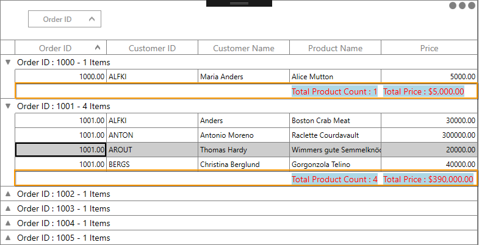

##### Using template selector

The template for the defined summary column can also be loaded based on data object and the data-bound element using the [GridSummaryColumn.TemplateSelector](https://help.syncfusion.com/cr/cref_files/wpf/Syncfusion.SfGrid.WPF~Syncfusion.UI.Xaml.Grid.GridSummaryColumn~TemplateSelector.html) property.



<syncfusion:ChromelessWindow.Resources>
    <local:TemplateSelector x:Key="templateSelector" />
</syncfusion:ChromelessWindow.Resources>
<syncfusion:SfDataGrid x:Name="dataGrid"
                       AutoGenerateColumns="True"
                       ItemsSource="{Binding Orders}">
<syncfusion:SfDataGrid.GroupSummaryRows>
    <syncfusion:GridSummaryRow ShowSummaryInRow="False">
        <syncfusion:GridSummaryRow.SummaryColumns>
            <syncfusion:GridSummaryColumn Name="PriceAmount"
                                  Format="'Total Price : {Sum:c}'"
                                  MappingName="UnitPrice"
                                  SummaryType="DoubleAggregate" TemplateSelector="{StaticResource templateSelector}">
            </syncfusion:GridSummaryColumn>
        </syncfusion:GridSummaryRow.SummaryColumns>
    </syncfusion:GridSummaryRow>
</syncfusion:SfDataGrid.GroupSummaryRows>
</syncfusion:SfDataGrid>


public class TemplateSelector : DataTemplateSelector
{
    public override DataTemplate SelectTemplate(object item, DependencyObject container)
    {
        if (item == null)
            return null;

        var summaryRecordEntry = item as SummaryRecordEntry;

        if (summaryRecordEntry.SummaryRow.ShowSummaryInRow)
        {
            return Application.Current.MainWindow.Resources["GridSummaryRowTemplate"] as DataTemplate;
        }
        else
        {
            return Application.Current.MainWindow.Resources["GridSummaryColumnTemplate"] as DataTemplate;
        }
    }
}



### Displaying column summary with title

SfDataGrid supports to show column summary and title summary at the same time. You can show column summary along with title by defining the [GridSummaryRow.Title](http://help.syncfusion.com/cr/cref_files/wpf/Syncfusion.SfGrid.WPF~Syncfusion.UI.Xaml.Grid.GridSummaryRow~Title.html)  and [GridSummaryRow.TitleColumnCount](https://help.syncfusion.com/cr/cref_files/wpf/Syncfusion.SfGrid.WPF~Syncfusion.UI.Xaml.Grid.GridSummaryRow~TitleColumnCount.html) property along with defining summary columns. Showing column summary along with title can be only supported if [GridSummaryRow.ShowSummaryInRow](http://help.syncfusion.com/cr/cref_files/wpf/Syncfusion.SfGrid.WPF~Syncfusion.UI.Xaml.Grid.GridSummaryRow~ShowSummaryInRow.html) is disabled.

Refer [Defining summary for column](#defining-summary-for-column-1) section to know more about how to define summary columns.

In the below code snippet, `GridSummaryRow.TitleColumnCount` is set as 2 and [GridSummaryRow.Title](http://help.syncfusion.com/cr/cref_files/wpf/Syncfusion.SfGrid.WPF~Syncfusion.UI.Xaml.Grid.GridSummaryRow~Title.html) is defined along with summary columns.



<syncfusion:SfDataGrid x:Name="dataGrid"                             
                       AutoGenerateColumns="True"
                       ItemsSource="{Binding Orders}"
                       ShowGroupDropArea="True">
    <syncfusion:SfDataGrid.GroupSummaryRows>
        <syncfusion:GridSummaryRow ShowSummaryInRow="False" TitleColumnCount="2" 
                                   Title="Total Price: {PriceAmount} for {ProductCount} Products" >
            <syncfusion:GridSummaryRow.SummaryColumns>
                <syncfusion:GridSummaryColumn Name="CustomerName" 
                                              Format=" {Count:d}"
                                              MappingName="CustomerName" 
                                              SummaryType="CountAggregate" />
                <syncfusion:GridSummaryColumn Name="PriceAmount"
                                              Format=" {Sum:c}"
                                              MappingName="UnitPrice"
                                              SummaryType="DoubleAggregate" />
                <syncfusion:GridSummaryColumn Name="ProductCount"
                                              Format=" {Count:d}"
                                              MappingName="ProductName"
                                              SummaryType="CountAggregate" />                        
            </syncfusion:GridSummaryRow.SummaryColumns>
        </syncfusion:GridSummaryRow>
    </syncfusion:SfDataGrid.GroupSummaryRows>
</syncfusion:SfDataGrid>


this.dataGrid.GroupSummaryRows.Add(new GridSummaryRow()
{
    ShowSummaryInRow = false,
    Title = "Total Price: {PriceAmount} for {ProductCount} Products",
    TitleColumnCount = 2,
    SummaryColumns = new ObservableCollection<ISummaryColumn>()
    {
        new GridSummaryColumn()
        {
            Name="CustomerName",
            Format="{Count:d}",
            MappingName="CustomerName",
            SummaryType=SummaryType.CountAggregate
        },
		
        new GridSummaryColumn()
        {
            Name = "PriceAmount",
            MappingName="UnitPrice",
            SummaryType= SummaryType.DoubleAggregate,
            Format="{Sum:c}"
        },
		
        new GridSummaryColumn()
        {
            Name="ProductCount",
            MappingName="ProductName",
            SummaryType=SummaryType.CountAggregate,
            Format="{Count:d}"
        }        
    }
});




The following screenshot illustrates displaying summary columns with title at same time for `GroupSummaryRow`.

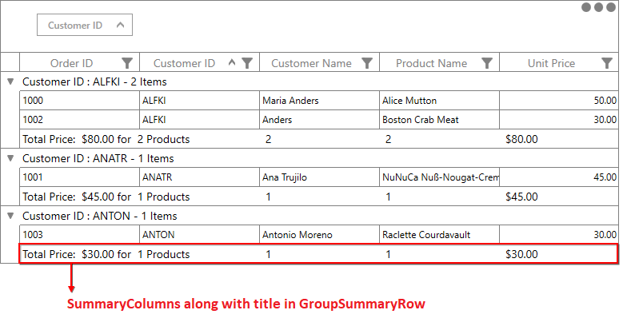

#### Limitations

The following are the limitations of displaying column summary along with title at same time for `GroupSummaryRow`:

* If [FrozenColumnCount](https://help.syncfusion.com/cr/cref_files/wpf/Syncfusion.SfGrid.WPF~Syncfusion.UI.Xaml.Grid.SfGridBase~FrozenColumnCount.html) is defined lesser than `GridSummaryRow.TitleColumnCount`, the title summary will be spanned to [FrozenColumnCount](https://help.syncfusion.com/cr/cref_files/wpf/Syncfusion.SfGrid.WPF~Syncfusion.UI.Xaml.Grid.SfGridBase~FrozenColumnCount.html) range, since spanned range and frozen range cannot be vary.
* Summary columns defined in the `GridSummaryRow.TitleColumnCount` range will not be shown.

#### Displaying template for column summary with title

The template for column summary can also be displayed with title template using `DataTemplate` or `DataTemplateSelector` as follows,

##### Using template 

The template for column summary can also be displayed with title template using `GridSummaryRow.TitleColumnCount` property along with defining `GridSummaryRow.TitleTemplate` and `GridSummaryColumn.Template` properties.



<syncfusion:ChromelessWindow.Resources>
    <local:GroupSummaryRowConverter x:Key="groupSummaryRowConverter"/>
		<local:SummaryColumnConverter x:Key="summaryColumnConverter" />
</syncfusion:ChromelessWindow.Resources>
<syncfusion:SfDataGrid x:Name="dataGrid"
                       AutoGenerateColumns="True"
                       ItemsSource="{Binding Orders}"
                       ShowGroupDropArea="True"
                       AllowResizingColumns="True">
    <syncfusion:SfDataGrid.GroupSummaryRows>
        <syncfusion:GridSummaryRow Title="Total Price : {PriceAmount} for {ProductCount} products" ShowSummaryInRow="False" TitleColumnCount="2">
            <syncfusion:GridSummaryRow.SummaryColumns>
                <syncfusion:GridSummaryColumn Name="PriceAmount"
                          Format="'{Sum:c}'"
                          MappingName="UnitPrice"
                          SummaryType="DoubleAggregate" >
                    <syncfusion:GridSummaryColumn.Template>
                        <DataTemplate>
                            <TextBlock Text="{Binding Converter={ StaticResource summaryColumnConverter}, ConverterParameter=UnitPrice }" Foreground="Red" Background="LightBlue"></TextBlock>
                        </DataTemplate>
                    </syncfusion:GridSummaryColumn.Template>
                </syncfusion:GridSummaryColumn>
                <syncfusion:GridSummaryColumn Name="ProductCount"
                          Format="'{Count:d}'"
                          MappingName="ProductName"
                          SummaryType="CountAggregate">
                    <syncfusion:GridSummaryColumn.Template>
                        <DataTemplate>
                            <TextBlock Text="{Binding Converter={ StaticResource summaryColumnConverter}, ConverterParameter=ProductName }" Foreground="Red" Background="LightBlue"></TextBlock>
                        </DataTemplate>
                    </syncfusion:GridSummaryColumn.Template>
                </syncfusion:GridSummaryColumn>
            </syncfusion:GridSummaryRow.SummaryColumns>
            <syncfusion:GridSummaryRow.TitleTemplate>
                <DataTemplate>
                    <TextBlock  Text="{Binding Converter={StaticResource groupSummaryRowConverter}, ConverterParameter= {x:Reference Name= dataGrid}}" Foreground="Blue" Background="Yellow"  FontSize="15"></TextBlock>
                </DataTemplate>
            </syncfusion:GridSummaryRow.TitleTemplate>
        </syncfusion:GridSummaryRow>
    </syncfusion:SfDataGrid.GroupSummaryRows>
</syncfusion:SfDataGrid>



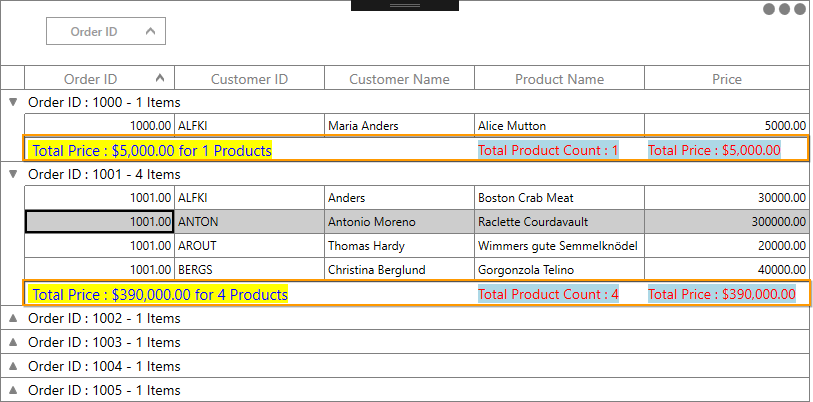

##### Using template selector

The template for column summary can also be displayed with title template based on data object and the data-bound element using `GridSummaryRow.TitleColumnCount` property along with defining `GridSummaryRow.TitleTemplateSelector` and `GridSummaryColumn.TemplateSelector` properties.



<syncfusion:ChromelessWindow.Resources>
    <local:TemplateSelector x:Key="templateSelector" />
</syncfusion:ChromelessWindow.Resources>
<syncfusion:SfDataGrid x:Name="dataGrid"
                       AutoGenerateColumns="True"
                       ItemsSource="{Binding Orders}"
                       ShowGroupDropArea="True"
                       AllowResizingColumns="True">
    <syncfusion:SfDataGrid.GroupSummaryRows>
        <syncfusion:GridSummaryRow Title="Total Price : {PriceAmount} for {ProductCount} products" ShowSummaryInRow="False" TitleColumnCount="2" TitleTemplateSelector = "{StaticResource templateSelector}" >
            <syncfusion:GridSummaryRow.SummaryColumns>
                <syncfusion:GridSummaryColumn Name="PriceAmount"
                          Format="'Total Price : {Sum:c}'"
                          MappingName="UnitPrice"
                          SummaryType="DoubleAggregate" TemplateSelector = "{StaticResource templateSelector}">
                </syncfusion:GridSummaryColumn>
                <syncfusion:GridSummaryColumn Name="ProductCount"
                          Format="'Total Product Count : {Count:d}'"
                          MappingName="ProductName"
                          SummaryType="CountAggregate" TemplateSelector = "{StaticResource templateSelector}">
                </syncfusion:GridSummaryColumn>
            </syncfusion:GridSummaryRow.SummaryColumns>
        </syncfusion:GridSummaryRow>
    </syncfusion:SfDataGrid.GroupSummaryRows>
</syncfusion:SfDataGrid>



## Caption Summaries

SfDataGrid provides built-in support for caption summaries. The caption summary value calculated based on the records in a group and the summary information will be displayed in the caption of group.

Below screen shot shows the built-in caption summary of Group.

### Formatting built-in caption summary

By default, the summary value displayed in `CaptionSummaryRow`  based on [SfDataGrid.GroupCaptionTextFormat](http://help.syncfusion.com/cr/cref_files/wpf/Syncfusion.SfGrid.WPF~Syncfusion.UI.Xaml.Grid.SfDataGrid~GroupCaptionTextFormat.html) property. 

The default group caption format is `{ColumnName}: {Key} - {ItemsCount} Items`.

* **ColumnName** -   Displays the name of the column currently grouped.
* **Key**   -   Displays the key value of group.
* **ItemsCount** -   Displays the number of items in group.

You can change group caption format to display column name and count alone by setting `GroupCaptionTextFormat` as below,



<syncfusion:SfDataGrid  x:Name="dataGrid"
                        AllowGrouping="True"
                        AutoGenerateColumns="True"
                        GroupCaptionTextFormat=" ColumnName: {Key} "
                        ItemsSource="{Binding Orders}"
                        ShowGroupDropArea="True"/>



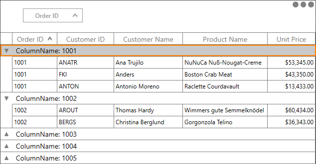

### Defining summary for column

You can display summary information in the column by setting [GridSummaryRow.ShowSummaryInRow](http://help.syncfusion.com/cr/cref_files/wpf/Syncfusion.SfGrid.WPF~Syncfusion.UI.Xaml.Grid.GridSummaryRow~ShowSummaryInRow.html) to `false` and defining summary columns. To calculate summary based on column you have to specify the below properties,

1. [GridSummaryColumn.MappingName](http://help.syncfusion.com/cr/cref_files/wpf/Syncfusion.SfGrid.WPF~Syncfusion.UI.Xaml.Grid.GridSummaryColumn~MappingName.html) – MappingName of the column (Property name of data object) that you want calculate summary.

2. [GridSummaryColumn.SummaryType](http://help.syncfusion.com/cr/cref_files/wpf/Syncfusion.SfGrid.WPF~Syncfusion.UI.Xaml.Grid.GridSummaryColumn~SummaryType.html) – SfDataGrid provides different built-in summary calculation functions for various types.

3. [GridSummaryColumn.Format](http://help.syncfusion.com/cr/cref_files/wpf/Syncfusion.SfGrid.WPF~Syncfusion.UI.Xaml.Grid.GridSummaryColumn~Format.html) – Used to define format string for summary based on support function name’s in specified SummaryType.

Refer [Formatting Summary](#formatting-summary) section to know more about how to format summary and [Aggregate Types](#aggregate-types) section to know about different Summary Type’s.

In the below code snippet, summary is defined for `UnitPrice` and `ProductName` columns.



<syncfusion:SfDataGrid x:Name="dataGrid"
                        AutoGenerateColumns="True"
                        ItemsSource="{Binding Orders}"
                        ShowGroupDropArea="True">
            
    <syncfusion:SfDataGrid.CaptionSummaryRow>
        <syncfusion:GridSummaryRow ShowSummaryInRow="False">
            <syncfusion:GridSummaryRow.SummaryColumns>
                <syncfusion:GridSummaryColumn Name="PriceAmount"
                                                Format="'{Sum:c}'"
                                                MappingName="UnitPrice"
                                                SummaryType="DoubleAggregate" />
                <syncfusion:GridSummaryColumn Name="ProductCount"
                                                Format="'{Count:d}'"
                                                MappingName="ProductName"
                                                SummaryType="CountAggregate" />
            </syncfusion:GridSummaryRow.SummaryColumns>
        </syncfusion:GridSummaryRow>
    </syncfusion:SfDataGrid.CaptionSummaryRow>
</syncfusion:SfDataGrid>


this.dataGrid.CaptionSummaryRow = new GridSummaryRow()
{
    ShowSummaryInRow = false,                
    SummaryColumns = new ObservableCollection<ISummaryColumn>()
    {

        new GridSummaryColumn()
        { 
            Name = "PriceAmount", 
            MappingName="UnitPrice", 
            SummaryType= SummaryType.Int32Aggregate, 
            Format="{Sum:c}"
        }, 

        new GridSummaryColumn()
        {
            Name="ProductCount",
            MappingName="ProductName",
            SummaryType=SummaryType.CountAggregate,
            Format="{Count:d}"
        },
    }
};



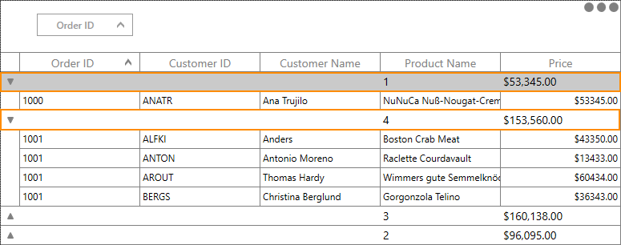

### Displaying summary for Row

You can display summary information in row by setting [GridSummaryRow.ShowSummaryInRow](http://help.syncfusion.com/cr/cref_files/wpf/Syncfusion.SfGrid.WPF~Syncfusion.UI.Xaml.Grid.GridSummaryRow~ShowSummaryInRow.html) to `true` and defining summary columns. You have to define [GridSummaryRow.Title](http://help.syncfusion.com/cr/cref_files/wpf/Syncfusion.SfGrid.WPF~Syncfusion.UI.Xaml.Grid.GridSummaryRow~Title.html) based on [GridSummaryColumn.Name](http://help.syncfusion.com/cr/cref_files/wpf/Syncfusion.SfGrid.WPF~Syncfusion.UI.Xaml.Grid.GridSummaryColumn~Name.html) property to format summary columns values in row.
 
Refer [Formatting Summary](#formatting-summary) section to know more about how to format summary. 



<syncfusion:SfDataGrid x:Name="dataGrid"
                       AutoGenerateColumns="True"
                       ItemsSource="{Binding Orders}"
                       ShowGroupDropArea="True">

    <syncfusion:SfDataGrid.CaptionSummaryRow>
        <syncfusion:GridSummaryRow Title="Total Price : {PriceAmount} for {ProductCount} Products" ShowSummaryInRow="True">
            <syncfusion:GridSummaryRow.SummaryColumns>
                <syncfusion:GridSummaryColumn Name="PriceAmount"
                                              Format="'{Sum:c}'"
                                              MappingName="UnitPrice"
                                              SummaryType="DoubleAggregate" />
                <syncfusion:GridSummaryColumn Name="ProductCount"
                                              Format="'{Count:d}'"
                                              MappingName="ProductName"
                                              SummaryType="CountAggregate" />
            </syncfusion:GridSummaryRow.SummaryColumns>
        </syncfusion:GridSummaryRow>
    </syncfusion:SfDataGrid.CaptionSummaryRow>
</syncfusion:SfDataGrid>


this.dataGrid.CaptionSummaryRow = new GridSummaryRow()
{
    ShowSummaryInRow = true,
    Title = "Total Price: {PriceAmount} for {ProductCount} Products",
    SummaryColumns = new ObservableCollection<ISummaryColumn>()
    {

        new GridSummaryColumn()
        { 
            Name = "PriceAmount", 
            MappingName="UnitPrice", 
            SummaryType= SummaryType.Int32Aggregate, 
            Format="{Sum:c}"
        }, 

        new GridSummaryColumn()
        {
            Name="ProductCount",
            MappingName="ProductName",
            SummaryType=SummaryType.CountAggregate,
            Format="{Count:d}"
        },
    }
};




### Caption summary template

The data grid hosts any view(s) inside a caption summary for the entire row or for individual columns by loading a template.

#### Displaying template for a row

The template for the row can be loaded by using `DataTemplate` or `DataTemplateSelector` as follows,

##### Using template

The template for the caption summary row can be loaded using the [GridSummaryRow.TitleTemplate](https://help.syncfusion.com/cr/cref_files/wpf/Syncfusion.SfGrid.WPF~Syncfusion.UI.Xaml.Grid.GridSummaryRow~TitleTemplate.html) property with [GridSummaryRow.ShowSummaryInRow](http://help.syncfusion.com/cr/cref_files/wpf/Syncfusion.SfGrid.WPF~Syncfusion.UI.Xaml.Grid.GridSummaryRow~ShowSummaryInRow.html) enabled.



<syncfusion:ChromelessWindow.Resources>
<local:CaptionSummaryRowConverter x:Key="captionSummaryRowConverter"/>
</syncfusion:ChromelessWindow.Resources>
<syncfusion:SfDataGrid x:Name="dataGrid"
                       AutoGenerateColumns="True"
                       ItemsSource="{Binding Orders}">
<syncfusion:SfDataGrid.CaptionSummaryRow>
    <syncfusion:GridSummaryRow Title="Total Price : {PriceAmount} for {ProductCount} Products" ShowSummaryInRow="True">
        <syncfusion:GridSummaryRow.SummaryColumns>
            <syncfusion:GridSummaryColumn Name="PriceAmount"
                                    Format="'{Sum:c}'"
                                    MappingName="UnitPrice"
                                    SummaryType="DoubleAggregate" />

            <syncfusion:GridSummaryColumn Name="ProductCount"
                                    Format="'{Count:d}'"
                                    MappingName="ProductName"
                                    SummaryType="CountAggregate" />
        </syncfusion:GridSummaryRow.SummaryColumns>
        <syncfusion:GridSummaryRow.TitleTemplate>
            <DataTemplate>
                <TextBlock  Text="{Binding Converter={StaticResource captionSummaryRowConverter}, ConverterParameter= {x:Reference Name= dataGrid}}" Foreground="Blue" Background="Yellow" FontSize="15"></TextBlock>
            </DataTemplate>
        </syncfusion:GridSummaryRow.TitleTemplate>
    </syncfusion:GridSummaryRow>
</syncfusion:SfDataGrid.CaptionSummaryRow>
</syncfusion:SfDataGrid>


class CaptionSummaryRowConverter : IValueConverter
{
    public object Convert(object value, Type targetType, object parameter, CultureInfo culture)
    {

        var data = value != null ? value as Group : null;
        if (data != null)
        {
            SfDataGrid dataGrid = (SfDataGrid)parameter;
            var unitPrice = SummaryCreator.GetSummaryDisplayText(data.SummaryDetails, "UnitPrice", dataGrid.View);
            var count = SummaryCreator.GetSummaryDisplayText(data.SummaryDetails, "ProductName", dataGrid.View);

            return "Total Price : " + unitPrice.ToString() + " for " + count.ToString() + " Products ";
        }

        return null;
    }

    public object ConvertBack(object value, Type targetType, object parameter, CultureInfo culture)
    {
        return null;
    }
}



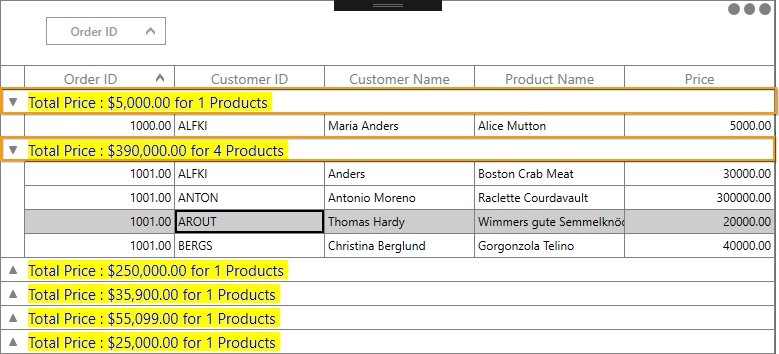

##### Using template selector

The template for the caption summary row can also be loaded based on data object and the data-bound element using the [GridSummaryRow.TitleTemplateSelector](https://help.syncfusion.com/cr/cref_files/wpf/Syncfusion.SfGrid.WPF~Syncfusion.UI.Xaml.Grid.GridSummaryRow~TitleTemplateSelector.html) property with [GridSummaryRow.ShowSummaryInRow](http://help.syncfusion.com/cr/cref_files/wpf/Syncfusion.SfGrid.WPF~Syncfusion.UI.Xaml.Grid.GridSummaryRow~ShowSummaryInRow.html) enabled.



<syncfusion:ChromelessWindow.Resources>
    <local:TemplateSelector x:Key="templateSelector" />
</syncfusion:ChromelessWindow.Resources>
<syncfusion:SfDataGrid x:Name="dataGrid"
                       AutoGenerateColumns="True"
                       ItemsSource="{Binding Orders}">
<syncfusion:SfDataGrid.CaptionSummaryRow>
    <syncfusion:GridSummaryRow Title="Total Price : {PriceAmount} for {ProductCount} Products" ShowSummaryInRow="True" TitleTemplateSelector="{StaticResource templateSelector}">
        <syncfusion:GridSummaryRow.SummaryColumns>
            <syncfusion:GridSummaryColumn Name="PriceAmount"
                        Format="'{Sum:c}'"
                        MappingName="UnitPrice"
                        SummaryType="DoubleAggregate" />

            <syncfusion:GridSummaryColumn Name="ProductCount"
                        Format="'{Count:d}'"
                        MappingName="ProductName"
                        SummaryType="CountAggregate" />
        </syncfusion:GridSummaryRow.SummaryColumns>
    </syncfusion:GridSummaryRow>
</syncfusion:SfDataGrid.CaptionSummaryRow>
</syncfusion:SfDataGrid>


public class TemplateSelector : DataTemplateSelector
{
    public override DataTemplate SelectTemplate(object item, DependencyObject container)
    {
        var summaryRecordEntry = item as SummaryRecordEntry;

        if (summaryRecordEntry.SummaryRow.ShowSummaryInRow)
        {
            return Application.Current.MainWindow.Resources["GridSummaryRowTemplate"] as DataTemplate;
        }
        else
        {
            return Application.Current.MainWindow.Resources["GridSummaryColumnTemplate"] as DataTemplate;
        }

        return null;
    }
}



#### Displaying template for a column

The template for the summary column can be loaded by using `DataTemplate` or `DataTemplateSelector` as follows,

##### Using template 

The template for the defined summary column can be loaded using the [GridSummaryColumn.Template](https://help.syncfusion.com/cr/cref_files/wpf/Syncfusion.SfGrid.WPF~Syncfusion.UI.Xaml.Grid.GridSummaryColumn~Template.html) property.



<syncfusion:ChromelessWindow.Resources>
    <local:CaptionSummaryColumnConverter x:Key="captionSummaryColumnConverter" />
</syncfusion:ChromelessWindow.Resources>
<syncfusion:SfDataGrid x:Name="dataGrid"
                       AutoGenerateColumns="True"
                       ItemsSource="{Binding Orders}">
<syncfusion:SfDataGrid.CaptionSummaryRow>
    <syncfusion:GridSummaryRow ShowSummaryInRow="False">
        <syncfusion:GridSummaryRow.SummaryColumns>
            <syncfusion:GridSummaryColumn Name="PriceAmount"
                                  Format="'Total Price : {Sum:c}'"
                                  MappingName="UnitPrice"
                                  SummaryType="DoubleAggregate" >
                <syncfusion:GridSummaryColumn.Template>
                    <DataTemplate>
                        <TextBlock Text="{Binding Converter={ StaticResource captionsummaryColumnConverter}, ConverterParameter=UnitPrice }" Foreground="Red" Background="LightBlue"></TextBlock>
                    </DataTemplate>
                </syncfusion:GridSummaryColumn.Template>
            </syncfusion:GridSummaryColumn>
            <syncfusion:GridSummaryColumn Name="ProductCount"
                                  Format="'Total Product Count : {Count:d}'"
                                  MappingName="ProductName"
                                  SummaryType="CountAggregate">
                <syncfusion:GridSummaryColumn.Template>
                    <DataTemplate>
                        <TextBlock Text="{Binding Converter={ StaticResource captionsummaryColumnConverter}, ConverterParameter=ProductName }" Foreground="Red" Background="LightBlue"></TextBlock>
                    </DataTemplate>
                </syncfusion:GridSummaryColumn.Template>
            </syncfusion:GridSummaryColumn>
        </syncfusion:GridSummaryRow.SummaryColumns>
    </syncfusion:GridSummaryRow>
</syncfusion:SfDataGrid.CaptionSummaryRow>
</syncfusion:SfDataGrid>


class CaptionSummaryColumnConverter : IValueConverter
{
    public object Convert(object value, Type targetType, object parameter, CultureInfo culture)
    {
        var summaryRecordEntry = value as Group;
        if (summaryRecordEntry != null)
        {
            var columnName = parameter.ToString();
            var summaryRow = summaryRecordEntry.SummaryDetails.SummaryRow;
            var summaryCol = summaryRow.SummaryColumns.FirstOrDefault(s => s.MappingName == columnName);
            var summaryItems = summaryRecordEntry.SummaryDetails.SummaryValues;
            if (summaryItems != null && summaryCol != null)
            {
                var item = summaryItems.FirstOrDefault(s => s.Name == summaryCol.Name);
                if (item != null)
                {
                    if (columnName == "ProductName")
                        return string.Format("Total Product Count : {0:d}", item.AggregateValues.Values.ToArray());
                    if (columnName == "UnitPrice")
                        return string.Format("Total Price : {0:c}", item.AggregateValues.Values.ToArray());
                }
            }
        }

        return "Value is wrong";
    }

    public object ConvertBack(object value, Type targetType, object parameter, CultureInfo culture)
    {
        return null;
    }
}



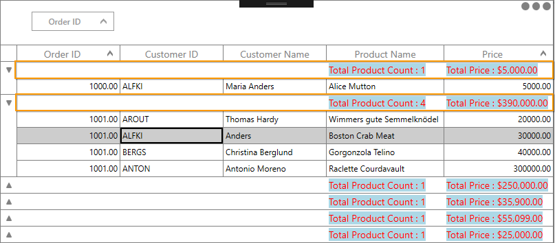

##### Using template selector

The template for the defined summary column can also be loaded based on data object and the data-bound element using the [GridSummaryColumn.TemplateSelector](https://help.syncfusion.com/cr/cref_files/wpf/Syncfusion.SfGrid.WPF~Syncfusion.UI.Xaml.Grid.GridSummaryColumn~TemplateSelector.html) property.



<syncfusion:ChromelessWindow.Resources>
    <local:TemplateSelector x:Key="templateSelector" />
</syncfusion:ChromelessWindow.Resources>
<syncfusion:SfDataGrid x:Name="dataGrid"
                       AutoGenerateColumns="True"
                       ItemsSource="{Binding Orders}">
<syncfusion:SfDataGrid.CaptionSummaryRow>
    <syncfusion:GridSummaryRow ShowSummaryInRow="False">
        <syncfusion:GridSummaryRow.SummaryColumns>
            <syncfusion:GridSummaryColumn Name="PriceAmount"
                                  Format="'Total Price : {Sum:c}'"
                                  MappingName="UnitPrice"
                                  SummaryType="DoubleAggregate" TemplateSelector="{StaticResource templateSelector}">
            </syncfusion:GridSummaryColumn>
        </syncfusion:GridSummaryRow.SummaryColumns>
    </syncfusion:GridSummaryRow>
</syncfusion:SfDataGrid.CaptionSummaryRow>
</syncfusion:SfDataGrid>


public class TemplateSelector : DataTemplateSelector
{
    public override DataTemplate SelectTemplate(object item, DependencyObject container)
    {
        if (item == null)
            return null;

        var summaryRecordEntry = item as SummaryRecordEntry;

        if (summaryRecordEntry.SummaryRow.ShowSummaryInRow)
        {
            return Application.Current.MainWindow.Resources["GridSummaryRowTemplate"] as DataTemplate;
        }
        else
        {
            return Application.Current.MainWindow.Resources["GridSummaryColumnTemplate"] as DataTemplate;
        }
    }
}



### Displaying column summary with title

SfDataGrid supports to show column summary and title summary at the same time. You can show column summary along with title by defining the [GridSummaryRow.Title](http://help.syncfusion.com/cr/cref_files/wpf/Syncfusion.SfGrid.WPF~Syncfusion.UI.Xaml.Grid.GridSummaryRow~Title.html)  and [GridSummaryRow.TitleColumnCount](https://help.syncfusion.com/cr/cref_files/wpf/Syncfusion.SfGrid.WPF~Syncfusion.UI.Xaml.Grid.GridSummaryRow~TitleColumnCount.html) property along with defining summary columns. Showing column summary along with title can be only supported if [GridSummaryRow.ShowSummaryInRow](http://help.syncfusion.com/cr/cref_files/wpf/Syncfusion.SfGrid.WPF~Syncfusion.UI.Xaml.Grid.GridSummaryRow~ShowSummaryInRow.html) is disabled.

Refer [Defining summary for column](#defining-summary-for-column-2) section to know more about how to define summary columns.

In the below code snippet, `GridSummaryRow.TitleColumnCount` is set as 2 and [GridSummaryRow.Title](http://help.syncfusion.com/cr/cref_files/wpf/Syncfusion.SfGrid.WPF~Syncfusion.UI.Xaml.Grid.GridSummaryRow~Title.html) is defined along with summary columns.



<syncfusion:SfDataGrid x:Name="dataGrid"
                       AutoGenerateColumns="True"
                       ItemsSource="{Binding Orders}"
                       ShowGroupDropArea="True">
    <syncfusion:SfDataGrid.CaptionSummaryRow>
        <syncfusion:GridSummaryRow  ShowSummaryInRow="False" TitleColumnCount="2" 
		                            Title=" {ColumnName} : {Key} - {ItemsCount} Items ">
            <syncfusion:GridSummaryRow.SummaryColumns>
                <syncfusion:GridSummaryColumn Name="CustomerName" 
                                              Format=" {Count:d}"
                                              MappingName="CustomerName" 
                                              SummaryType="CountAggregate" />
                <syncfusion:GridSummaryColumn Name="PriceAmount"
                                              Format=" {Sum:c}"
                                              MappingName="UnitPrice"
                                              SummaryType="DoubleAggregate" />
                <syncfusion:GridSummaryColumn Name="ProductCount"
                                              Format=" {Count:d}"
                                              MappingName="ProductName"
                                              SummaryType="CountAggregate" />
            </syncfusion:GridSummaryRow.SummaryColumns>
        </syncfusion:GridSummaryRow>
    </syncfusion:SfDataGrid.CaptionSummaryRow>
</syncfusion:SfDataGrid>


this.dataGrid.CaptionSummaryRow = new GridSummaryRow()
{
    ShowSummaryInRow = false,
    Title = "{ColumnName} : {Key} - {ItemsCount} Items",
    TitleColumnCount = 2,
    SummaryColumns = new ObservableCollection<ISummaryColumn>()
    {
        new GridSummaryColumn()
        {
            Name="CustomerName",
            Format="{Count:d}",
            MappingName="CustomerName",
            SummaryType=SummaryType.CountAggregate
        },

        new GridSummaryColumn()
        {
            Name = "PriceAmount",
            MappingName="UnitPrice",
            SummaryType= SummaryType.DoubleAggregate,
            Format="{Sum:c}"
        },

        new GridSummaryColumn()
        {
            Name="ProductCount",
            MappingName="ProductName",
            SummaryType=SummaryType.CountAggregate,
            Format="{Count:d}"
        }
    }
};




The following screenshot illustrates displaying summary columns with title at same time for `CaptionSummaryRow`.

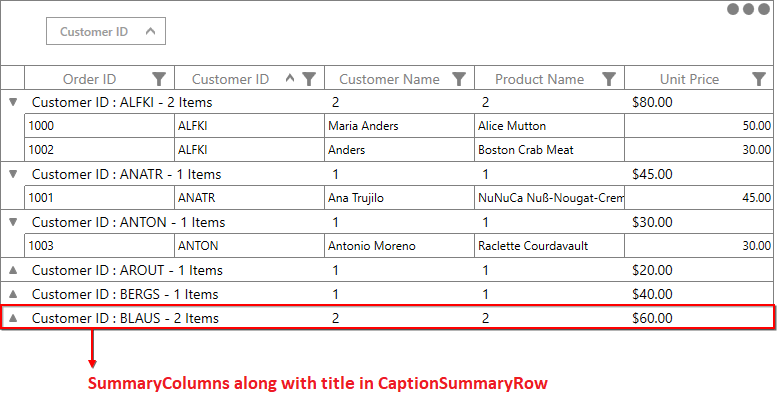

#### Limitations

The following are the limitations of displaying column summary along with title at same time for `CaptionSummaryRow`:

* If [FrozenColumnCount](https://help.syncfusion.com/cr/cref_files/wpf/Syncfusion.SfGrid.WPF~Syncfusion.UI.Xaml.Grid.SfGridBase~FrozenColumnCount.html) is defined lesser than `GridSummaryRow.TitleColumnCount`, the title summary will be spanned to [FrozenColumnCount](https://help.syncfusion.com/cr/cref_files/wpf/Syncfusion.SfGrid.WPF~Syncfusion.UI.Xaml.Grid.SfGridBase~FrozenColumnCount.html) range, since spanned range and frozen range cannot be vary.
* Summary columns defined in the `GridSummaryRow.TitleColumnCount` range will not be shown.

#### Displaying template for column summary with title

The template for column summary can also be displayed with title template using `DataTemplate` or `DataTemplateSelector` as follows,
 
##### Using template 
       
The template for column summary can also be displayed with title template using `GridSummaryRow.TitleColumnCount` property along with defining `GridSummaryRow.TitleTemplate` and `GridSummaryColumn.Template` properties.



<syncfusion:ChromelessWindow.Resources>
    <local:CaptionSummaryRowConverter x:Key="captionSummaryRowConverter" />
	<local:CaptionSummaryColumnConverter x:Key="captionSummaryColumnConverter" />
</syncfusion:ChromelessWindow.Resources>
<syncfusion:SfDataGrid x:Name="dataGrid"
                       AutoGenerateColumns="True"
                       ItemsSource="{Binding Orders}"
                       ShowGroupDropArea="True"
                       AllowResizingColumns="True">
    <syncfusion:SfDataGrid.CaptionSummaryRow>
	    <syncfusion:GridSummaryRow Title="Total Price : {PriceAmount} for {ProductCount} products" ShowSummaryInRow="False" TitleColumnCount="2">
	        <syncfusion:GridSummaryRow.SummaryColumns>
	            <syncfusion:GridSummaryColumn Name="PriceAmount"
	              Format="'{Sum:c}'"
	              MappingName="UnitPrice"
	              SummaryType="DoubleAggregate" >
	                <syncfusion:GridSummaryColumn.Template>
	                    <DataTemplate>
	                        <TextBlock Text="{Binding Converter={ StaticResource captionsummaryColumnConverter}, ConverterParameter=UnitPrice }" Foreground="Red" Background="LightBlue"></TextBlock>
	                    </DataTemplate>
	                </syncfusion:GridSummaryColumn.Template>
	            </syncfusion:GridSummaryColumn>
	            <syncfusion:GridSummaryColumn Name="ProductCount"
	              Format="'{Count:d}'"
	              MappingName="ProductName"
	              SummaryType="CountAggregate">
	                <syncfusion:GridSummaryColumn.Template>
	                    <DataTemplate>
	                        <TextBlock Text="{Binding Converter={ StaticResource captionsummaryColumnConverter}, ConverterParameter=UnitPrice }" Foreground="Red" Background="LightBlue"></TextBlock>
	                    </DataTemplate>
	                </syncfusion:GridSummaryColumn.Template>
	            </syncfusion:GridSummaryColumn>
	        </syncfusion:GridSummaryRow.SummaryColumns>
	        <syncfusion:GridSummaryRow.TitleTemplate>
	            <DataTemplate>
	                <TextBlock  Text="{Binding Converter={StaticResource captionSummaryRowConverter}, ConverterParameter= {x:Reference Name= dataGrid}}" Foreground="Blue" Background="Yellow" FontSize="15"></TextBlock>
	            </DataTemplate>
	        </syncfusion:GridSummaryRow.TitleTemplate>
	    </syncfusion:GridSummaryRow>
	</syncfusion:SfDataGrid.CaptionSummaryRow>	
</syncfusion:SfDataGrid>



##### Using template selector 

The template for column summary can also be displayed with title template based on data object and the data-bound element using `GridSummaryRow.TitleColumnCount` property along with defining `GridSummaryRow.TitleTemplateSelector` and `GridSummaryColumn.TemplateSelector` properties.



<syncfusion:ChromelessWindow.Resources>
    <local:TemplateSelector x:Key="templateSelector" />
</syncfusion:ChromelessWindow.Resources>
<syncfusion:SfDataGrid x:Name="dataGrid"
                       AutoGenerateColumns="True"
                       ItemsSource="{Binding Orders}"
                       ShowGroupDropArea="True"
                       AllowResizingColumns="True">
    <syncfusion:SfDataGrid.CaptionSummaryRow>
        <syncfusion:GridSummaryRow Title="Total Price : {PriceAmount} for {ProductCount} products" ShowSummaryInRow="False" TitleColumnCount="2" TitleTemplateSelector = "{StaticResource templateSelector}" >
            <syncfusion:GridSummaryRow.SummaryColumns>
                <syncfusion:GridSummaryColumn Name="PriceAmount"
                          Format="'{Sum:c}'"
                          MappingName="UnitPrice"
                          SummaryType="DoubleAggregate" TemplateSelector = "{StaticResource templateSelector}">
                </syncfusion:GridSummaryColumn>
                <syncfusion:GridSummaryColumn Name="ProductCount"
                          Format="'{Count:d}'"
                          MappingName="ProductName"
                          SummaryType="CountAggregate" TemplateSelector = "{StaticResource templateSelector}">
                </syncfusion:GridSummaryColumn>
            </syncfusion:GridSummaryRow.SummaryColumns>
        </syncfusion:GridSummaryRow>
    </syncfusion:SfDataGrid.CaptionSummaryRow>
</syncfusion:SfDataGrid>



## Formatting summary

In the below sections formatting is explained using TableSummary. In the same way, you can format group and caption summaries also.

### Defining Summary Function

In the below code snippet `Format` property is defined to display sum of `UnitPrice` by specifying the function name inside curly braces.
  
N> `DoubleAggregate` is used as SummaryType which has Count, Max, Min, Average and Sum functions.



<syncfusion:SfDataGrid x:Name="dataGrid"
                       AutoGenerateColumns="True"
                       ItemsSource="{Binding Orders}"
                       ShowGroupDropArea="True">

    <syncfusion:SfDataGrid.TableSummaryRows>
        <syncfusion:GridTableSummaryRow ShowSummaryInRow="False">
            <syncfusion:GridSummaryRow.SummaryColumns>
                <syncfusion:GridSummaryColumn Name="PriceAmount"
                                              Format="'{Sum}'"
                                              MappingName="UnitPrice"
                                              SummaryType="DoubleAggregate" />
            </syncfusion:GridSummaryRow.SummaryColumns>
        </syncfusion:GridTableSummaryRow>
    </syncfusion:SfDataGrid.TableSummaryRows>
</syncfusion:SfDataGrid>



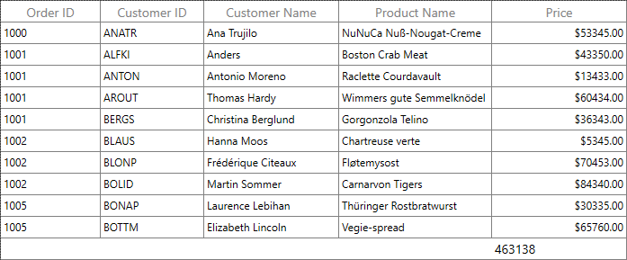

### Formatting Summary Value

You can format the summary value by setting the appropriate format after the aggregate function followed by colon(:) in  [GridSummaryColumn.Format](http://help.syncfusion.com/cr/cref_files/wpf/Syncfusion.SfGrid.WPF~Syncfusion.UI.Xaml.Grid.GridSummaryColumn~Format.html) property.

In the below code snippet `UnitPrice` column summary is formatted using `c` format specifier. Refer [here](https://msdn.microsoft.com/en-us/library/dwhawy9k.aspx?f=255&MSPPError=-2147217396) to know about how to set different format.



<syncfusion:SfDataGrid x:Name="dataGrid"
                       AutoGenerateColumns="True"
                       ItemsSource="{Binding Orders}"
                       ShowGroupDropArea="True">
    <syncfusion:SfDataGrid.TableSummaryRows>
        <syncfusion:GridTableSummaryRow ShowSummaryInRow="False">
            <syncfusion:GridSummaryRow.SummaryColumns>
                <syncfusion:GridSummaryColumn Name="PriceAmount"
                                              Format="'{Sum:c}'"
                                              MappingName="UnitPrice"
                                              SummaryType="DoubleAggregate" />
            </syncfusion:GridSummaryRow.SummaryColumns>
        </syncfusion:GridTableSummaryRow>
    </syncfusion:SfDataGrid.TableSummaryRows>
</syncfusion:SfDataGrid>



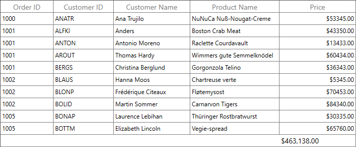

### Displaying additional Content in Summary

You can append additional content with summary value using  [GridSummaryColumn.Format](http://help.syncfusion.com/cr/cref_files/wpf/Syncfusion.SfGrid.WPF~Syncfusion.UI.Xaml.Grid.GridSummaryColumn~Format.html) property.

In the below code snippet `Total UnitPrice: ` text is appended before summary value.



<syncfusion:SfDataGrid x:Name="dataGrid"                               
                       AutoGenerateColumns="True"
                       ItemsSource="{Binding Orders}">
                       
    <syncfusion:SfDataGrid.TableSummaryRows>
        <syncfusion:GridTableSummaryRow ShowSummaryInRow="False">
            <syncfusion:GridSummaryRow.SummaryColumns>
                <syncfusion:GridSummaryColumn Name="PriceAmount"
                                              Format="'Total UnitPrice : {Sum:c}'"
                                              MappingName="UnitPrice"
                                              SummaryType="DoubleAggregate" />
            </syncfusion:GridSummaryRow.SummaryColumns>
        </syncfusion:GridTableSummaryRow>
    </syncfusion:SfDataGrid.TableSummaryRows>
    
</syncfusion:SfDataGrid>



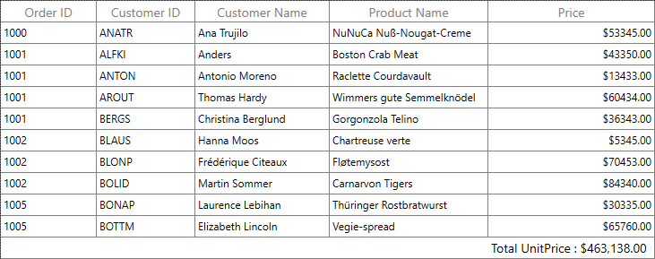

### Formatting Summary for Row using Title Property

You can format the summary value for row using [GridSummaryRow.Title](http://help.syncfusion.com/cr/cref_files/wpf/Syncfusion.SfGrid.WPF~Syncfusion.UI.Xaml.Grid.GridSummaryRow~Title.html)  when ShowSummaryInRow set to `true`.



<syncfusion:SfDataGrid x:Name="dataGrid"
                       AutoGenerateColumns="True"
                       ItemsSource="{Binding Orders}">
    <syncfusion:SfDataGrid.TableSummaryRows>
        <syncfusion:GridTableSummaryRow Title=" Total Price : {PriceAmount} "  
                                        ShowSummaryInRow="True">
            <syncfusion:GridSummaryRow.SummaryColumns>
                <syncfusion:GridSummaryColumn Name="PriceAmount"
                                              Format="'{Sum:c}'"
                                              MappingName="UnitPrice"
                                              SummaryType="DoubleAggregate" />
            </syncfusion:GridSummaryRow.SummaryColumns>
        </syncfusion:GridTableSummaryRow>
    </syncfusion:SfDataGrid.TableSummaryRows>
</syncfusion:SfDataGrid>



## Aggregate Types

You can specify the different summary aggregate types by using [GridSummaryColumn.SummaryType](http://help.syncfusion.com/cr/cref_files/wpf/Syncfusion.SfGrid.WPF~Syncfusion.UI.Xaml.Grid.GridSummaryColumn~SummaryType.html) property and use the built-in function in [GridSummaryColumn.Format](http://help.syncfusion.com/cr/cref_files/wpf/Syncfusion.SfGrid.WPF~Syncfusion.UI.Xaml.Grid.GridSummaryColumn~Format.html).

The following are the list of predefined aggregate types and its built-in functions.

<table>
<tr>
<th>
Aggregate Type
</th>
<th>
Built-in function
</th>
</tr>
<tr>
<td>
CountAggregate
</td>
<td>
Count
</td>
</tr>
<tr>
<td>
Int32Aggregate
</td>
<td>
Count, Max, Min, Average and Sum
</td>
</tr>
<tr>
<td>
DoubleAggregate
</td>
<td>
Count, Max, Min, Average and Sum
</td>
</tr>
<tr>
<td>
Custom
</td>
<td>
Used for custom summaries
</td>
</tr>
</table>

## Calculate summary for selected rows

SfDataGrid calculates the summaries for all records by default. You can calculate the summaries for selected records by using the [SfDataGrid.SummaryCalculationUnit](https://help.syncfusion.com/cr/wpf/Syncfusion.SfGrid.WPF~Syncfusion.UI.Xaml.Grid.SfDataGrid~SummaryCalculationUnit.html) or [GridSummaryRow.CalculationUnit](https://help.syncfusion.com/cr/wpf/Syncfusion.SfGrid.WPF~Syncfusion.UI.Xaml.Grid.GridSummaryRow~CalculationUnit.html) property.
This is applicable for all type of summary rows such as table, caption and group summary.

In the below code snippet, the summaries for selected records are calculated for the top positioned `TableSummaryRow` and the summaries for all records are calculated for the bottom positioned `TableSummaryRow`.



  <syncfusion:SfDataGrid x:Name="sfDataGrid" 
                        ItemsSource="{Binding Path=Orders}"
                        SelectionMode="Multiple"
                        AutoGenerateColumns="True">
     <syncfusion:SfDataGrid.TableSummaryRows>
         <syncfusion:GridTableSummaryRow ShowSummaryInRow="True" Title="Total Price for all records:{UnitPrice}">
             <syncfusion:GridSummaryRow.SummaryColumns>
                 <syncfusion:GridSummaryColumn Name="UnitPrice"
                                       Format="'{Sum:c}'"
                                       MappingName="UnitPrice"
                                       SummaryType="DoubleAggregate" />
             </syncfusion:GridSummaryRow.SummaryColumns>
         </syncfusion:GridTableSummaryRow>
         <syncfusion:GridTableSummaryRow ShowSummaryInRow="True" Title="Total price for selected records: {UnitPrice}" CalculationUnit="SelectedRows" Position="Top">
             <syncfusion:GridSummaryRow.SummaryColumns>
                 <syncfusion:GridSummaryColumn Name="UnitPrice"
                                       Format="'{Sum:c}'"
                                       MappingName="UnitPrice"
                                       SummaryType="DoubleAggregate" />
             </syncfusion:GridSummaryRow.SummaryColumns>
         </syncfusion:GridTableSummaryRow>
     </syncfusion:SfDataGrid.TableSummaryRows>
 </syncfusion:SfDataGrid>




GridTableSummaryRow tableSummaryRow1 = new GridTableSummaryRow()
{
    ShowSummaryInRow = true,
    Position = TableSummaryRowPosition.Top,
    CalculationUnit = SummaryCalculationUnit.SelectedRows,
    Title = "Total price for selected records: {PriceAmount}",
    SummaryColumns = new ObservableCollection<ISummaryColumn>()
    {
        new GridSummaryColumn()
        {
           Name="PriceAmount",
           Format="{Sum:c}",
           MappingName="UnitPrice",
           SummaryType=SummaryType.DoubleAggregate
        }
    }
};

GridTableSummaryRow tableSummaryRow2 = new GridTableSummaryRow()
{
    ShowSummaryInRow = true,
    Position = TableSummaryRowPosition.Bottom,
    Title = "Total price for all records: {UnitPrice}",
    SummaryColumns = new ObservableCollection<ISummaryColumn>()
    {
        new GridSummaryColumn()
        {
            Name="UnitPrice",
            Format="{Sum:c}",
            MappingName="UnitPrice",
            SummaryType=SummaryType.DoubleAggregate
        }
    }
};

this.sfDataGrid.TableSummaryRows.Add(tableSummaryRow1);
this.sfDataGrid.TableSummaryRows.Add(tableSummaryRow2);




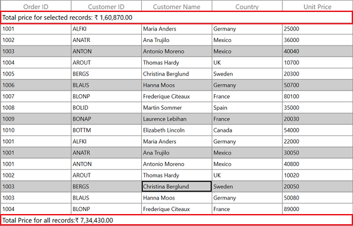

N> The `GridSummaryRow.CalculationUnit` takes higher priority than the `SfDataGrid.SummaryCalculationUnit`.

### Limitation

`SummaryCalculationUnit.SelectedRows` or `SummaryCalculationUnit.Mixed` will not be considered for cell selection.

## Custom summaries

SfDataGrid allows you to implement your own aggregate functions, when the built-in aggregate functions don’t meet your requirement.

You can calculate the summary values based on custom logic using [GridSummaryColumn.CustomAggregate](http://help.syncfusion.com/cr/cref_files/wpf/Syncfusion.SfGrid.WPF~Syncfusion.UI.Xaml.Grid.GridSummaryColumn~CustomAggregate.html) property.

### Implementing custom aggregate

1. Create custom aggregate class by deriving from [ISummaryAggregate](http://help.syncfusion.com/cr/cref_files/wpf/Syncfusion.Data.WPF~Syncfusion.Data.ISummaryAggregate.html) interface.

2. In the `CalculateAggregateFunc` method, you have to calculate the summary and assign it to the property.
 
In the below code snippet, the Standard Deviation is calculated for quantity of products.



public class CustomAggregate:ISummaryAggregate
{
 
    public CustomAggregate()
    {
    }
 
    public double StdDev { get; set; }
 
    public Action<System.Collections.IEnumerable, string, System.ComponentModel.PropertyDescriptor> CalculateAggregateFunc()
    {
        return (items, property, pd) =>
        {
            var enumerableItems = items as IEnumerable<OrderInfo>;
 
            if (pd.Name == "StdDev")
            {
                this.StdDev = enumerableItems.StdDev<OrderInfo>(q => q.Quantity);
            }
        };
    }
}

public static class LinqExtensions
{

    public static double StdDev<T>(this IEnumerable<T> values, Func<T, double?> selector)
    {
        double ret = 0;
        var count = values.Count();

        if (count > 0)
        {                
            double? avg = values.Average(selector);       
            double sum = values.Select(selector).Sum(d =>
            {

                if (d.HasValue)
                {
                    return Math.Pow(d.Value - avg.Value, 2);
                }
                return 0.0;
            });                
            ret = Math.Sqrt((sum) / (count - 1));
        }
        return ret;
    }
}




3.Assign the custom aggregate to `GridSummaryColumn.CustomAggregate` property and set the [SummaryType](http://help.syncfusion.com/cr/cref_files/wpf/Syncfusion.SfGrid.WPF~Syncfusion.UI.Xaml.Grid.GridSummaryColumn~SummaryType.html) as [Custom](http://help.syncfusion.com/cr/cref_files/wpf/Syncfusion.Data.WPF~Syncfusion.Data.SummaryType.html). [GridSummaryColumn.Format](http://help.syncfusion.com/cr/cref_files/wpf/Syncfusion.SfGrid.WPF~Syncfusion.UI.Xaml.Grid.GridSummaryColumn~Format.html) property is defined based on property name in custom aggregate `StdDev`.



<Window.Resources>
    <local:CustomAggregate x:Key="customAggregate" />
</Window.Resources>

<syncfusion:SfDataGrid.TableSummaryRows>
    <syncfusion:GridTableSummaryRow Name="Total Products"
                                    Title="Standard Deviation: {Discount}"
                                    Position="Top"
                                    ShowSummaryInRow="True">
        <syncfusion:GridSummaryRow.SummaryColumns>

            <syncfusion:GridSummaryColumn   Name="Discount"
                                            CustomAggregate="{StaticResource customAggregate}"
                                            Format="'{StdDev:##.##}'"
                                            MappingName="Discount"
                                            SummaryType="Custom" />
        </syncfusion:GridSummaryRow.SummaryColumns>
    </syncfusion:GridTableSummaryRow>
</syncfusion:SfDataGrid.TableSummaryRows>


this.dataGrid.TableSummaryRows.Add(new GridTableSummaryRow()
{
    ShowSummaryInRow = true,
    Position=TableSummaryRowPosition.Top,
    Title = "Standard Deviation: {Discount}",
    SummaryColumns = new ObservableCollection<ISummaryColumn>()
    {
 
        new GridSummaryColumn()
        { 
            Name = "Discount", 
            MappingName="Discount", 
            CustomAggregate=new CustomAggregate(),
            SummaryType=SummaryType.Custom, 
            Format="{StdDev}"
        },      
    }
});



You can download the sample demo [here](http://www.syncfusion.com/downloads/support/directtrac/general/ze/CustomSummaries-366686956.zip) .

## Overriding Summary Renderer

Each summary cell is associated with its own renderer and you can customize it by overriding the available virtual methods in the renderer. 

There will be specific key for each summary row. You can remove and add the key from [SfDataGrid.CellRenderers](http://help.syncfusion.com/cr/cref_files/wpf/Syncfusion.SfGrid.WPF~Syncfusion.UI.Xaml.Grid.SfDataGrid~CellRenderers.html) collection, when the renderer is need to be customized.

<table>
<tr>
<th>
Types of summary
</th>
<th>
Renderer
</th>
<th>
Key
</th>
</tr>
<tr>
<td>
Table summary
</td>
<td>
{{'[GridTableSummaryCellRenderer](http://help.syncfusion.com/cr/cref_files/wpf/Syncfusion.SfGrid.WPF~Syncfusion.UI.Xaml.Grid.Cells.GridTableSummaryCellRenderer.html)'| markdownify }}
</td>
<td>
TableSummary
</td>
</tr>
<tr>
<td>
Caption summary
</td>
<td>
{{'[GridCaptionSummaryCellRenderer](http://help.syncfusion.com/cr/cref_files/wpf/Syncfusion.SfGrid.WPF~Syncfusion.UI.Xaml.Grid.Cells.GridCaptionSummaryCellRenderer.html)'| markdownify }}
</td>
<td>
CaptionSummary
</td>
</tr>
<tr>
<td>
Group summary
</td>
<td>
{{'[GridSummaryCellRenderer](http://help.syncfusion.com/cr/cref_files/wpf/Syncfusion.SfGrid.WPF~Syncfusion.UI.Xaml.Grid.Cells.GridSummaryCellRenderer.html)'| markdownify }}
</td>
<td>
GroupSummary
</td>
</tr>
</table>

### Formatting Table Summary

You can apply number format for numeric values displayed on `GridTableSummaryRow` by overriding the `OnUpdateEditBinding` method in [GridTableSummaryCellRenderer](http://help.syncfusion.com/cr/cref_files/wpf/Syncfusion.SfGrid.WPF~Syncfusion.UI.Xaml.Grid.Cells.GridTableSummaryCellRenderer.html) class.



this.dataGrid.CellRenderers.Remove("TableSummary");
this.dataGrid.CellRenderers.Add("TableSummary", new GridTableSummaryCellRendererExt());

public class GridTableSummaryCellRendererExt : GridTableSummaryCellRenderer
{

    public override void OnUpdateEditBinding(Syncfusion.UI.Xaml.Grid.DataColumnBase dataColumn, Syncfusion.UI.Xaml.Grid.GridTableSummaryCell element, object dataContext)
    {

        //Check whether the dataContext is SummaryRecordEntry
        var record = dataContext as SummaryRecordEntry;

        if (!(dataContext is SummaryRecordEntry))
            return;

        //Process each SummaryColumn and get the display text of corresponding summary

        foreach (ISummaryColumn summaryColumn in record.SummaryRow.SummaryColumns)
        {

            if (!summaryColumn.MappingName.Contains(dataColumn.GridColumn.MappingName))
                continue;
            string summaryText = string.Empty;

            if (record.SummaryRow.ShowSummaryInRow)
                summaryText = SummaryCreator.GetSummaryDisplayTextForRow(record, this.DataGrid.View);

            else
                summaryText = SummaryCreator.GetSummaryDisplayText(record, dataColumn.GridColumn.MappingName, this.DataGrid.View);

            if (!string.IsNullOrEmpty(summaryText))
            {

                //Create new number format and apply it to summary columns 
                NumberFormatInfo format = new NumberFormatInfo();
                format.NumberDecimalDigits = 3;
                format.NumberDecimalSeparator = "*";
                format.NumberGroupSeparator = ",";

                //Number format is applied to summary columns                    
                element.Content = Convert.ToDouble(double.Parse(summaryText, NumberStyles.Currency)).ToString("N", format);
            }
        }
    }
}



You can download the sample demo [here](http://www.syncfusion.com/downloads/support/directtrac/general/ze/SfDataGridDemo-462271589.zip).

### Customizing GroupCaptionText

You can apply different group caption text format for available groups based on certain conditions by deriving the [GridCaptionSummaryCellRenderer](http://help.syncfusion.com/cr/cref_files/wpf/Syncfusion.SfGrid.WPF~Syncfusion.UI.Xaml.Grid.Cells.GridCaptionSummaryCellRenderer.html) class .

For example, the group caption text is customized based on the group name and items count of the column.



this.dataGrid.CellRenderers.Remove("CaptionSummary");
this.dataGrid.CellRenderers.Add("CaptionSummary", new GridCaptionSummaryCellRendererExt());

public class GridCaptionSummaryCellRendererExt : GridCaptionSummaryCellRenderer
{    

    public override void OnUpdateEditBinding(Syncfusion.UI.Xaml.Grid.DataColumnBase dataColumn, Syncfusion.UI.Xaml.Grid.GridCaptionSummaryCell element, object dataContext)
    {

        if (element.DataContext is Group && this.DataGrid.View.GroupDescriptions.Count > 0)
        {
            var groupRecord = element.DataContext as Group;                
            var groupedColumn = this.GetGroupedColumn(groupRecord);

            if (this.DataGrid.CaptionSummaryRow == null)
            {

                if (this.DataGrid.View.GroupDescriptions.Count < groupRecord.Level)
                    return;

                //Set the CaptionSummaryCell text as customized.
                element.Content = GetCustomizedCaptionText(groupedColumn.HeaderText, groupRecord.Key, groupRecord.ItemsCount);
            }

            else if (this.DataGrid.CaptionSummaryRow.ShowSummaryInRow)
            {
                element.Content = SummaryCreator.GetSummaryDisplayTextForRow(groupRecord.SummaryDetails, this.DataGrid.View, groupedColumn.HeaderText);
            }

            else
                element.Content = SummaryCreator.GetSummaryDisplayText(groupRecord.SummaryDetails, dataColumn.GridColumn.MappingName, this.DataGrid.View);
        }
    }

    private GridColumn GetGroupedColumn(Group group)
    {
        var groupDesc = this.DataGrid.View.GroupDescriptions[group.Level - 1] as PropertyGroupDescription;

        foreach (var column in this.DataGrid.Columns)
        {

            if (column.MappingName == groupDesc.PropertyName)
            {
                return column;
            }
        }
        return null;
    }

    private string GetCustomizedCaptionText(string columnName, object groupName, int itemsCount)
    {

        //entryText - instead of "Items", the entryText is assigned to Customize the CaptionSummaryCell Text.
        string entryText = string.Empty;

        if (itemsCount < 20)
            entryText = "entries in the Group";

        else if (itemsCount < 40)
            entryText = "elements in the Group";

        else if (itemsCount < 60)
            entryText = "list in the Group";

        else
            entryText = "items in the Group";

        if (groupName.ToString().Equals("1001"))
            groupName = "Thousand and One";

        else if (groupName.ToString().Equals("1002"))
            groupName = "Thousand and Two";

        else if (groupName.ToString().Equals("1004"))
            groupName = "Thousand and Four";
        return string.Format("{0}: {1} - {2} {3}", columnName, groupName, itemsCount, entryText);
    }
}




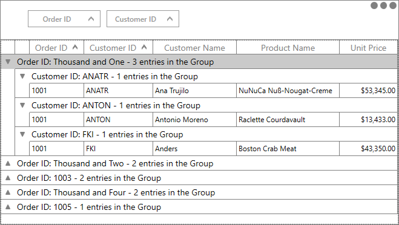

You can download the sample demo [here](http://www.syncfusion.com/downloads/support/directtrac/general/ze/SfDataGridDemo-1006707349.zip). 

## See Also

[How to show vertical border to the column wise summary rows?](https://www.syncfusion.com/kb/10038)

[How to define summary rows using AttachedProperty in datagrid](https://www.syncfusion.com/kb/9838)

[How to add a textbox under each group and binding a underlying property on that?](https://www.syncfusion.com/kb/9295)

[How to load a button in CaptionSummaryRow and prevent expanding and collapsing of groups upon clicking it?](https://www.syncfusion.com/kb/7842)

[How to display the NumberFormatInfo in GridSummaryColumn?](https://www.syncfusion.com/kb/6669)

[How to apply different styles to the GridTableSummaryRow?](https://www.syncfusion.com/kb/5319)

[How to use NumberFormatInfo in the SummaryColumn of the GridTableSummaryRow?](https://www.syncfusion.com/kb/5312)

[How to Change the GroupCaptionText based on Display member of the GridComboboxColumn?](https://www.syncfusion.com/kb/3446)

[How to customize the CaptionSummaryCell text in the SfDataGrid?](https://www.syncfusion.com/kb/3249)

[How to Set the horizontal alignment on summary columns?](https://www.syncfusion.com/kb/2485)
