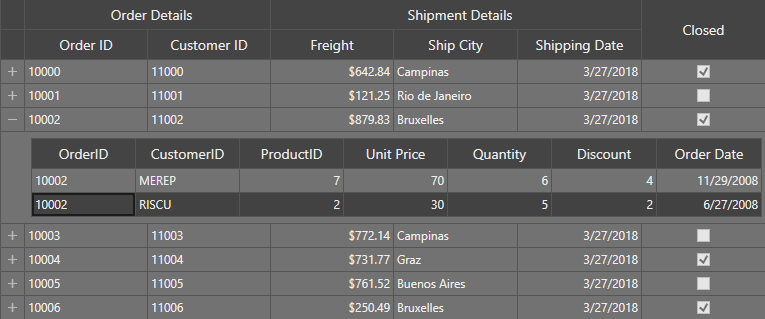

# Themes in WPF DataGrid (SfDataGrid)

SfDataGrid provides built-in themes which can be applied using [SfSkinManager](https://help.syncfusion.com/wpf/themes/getting-started) and also provides support to create custom theme using [theme studio](https://help.syncfusion.com/wpf/themes/theme-studio). 

## Built-in Themes

The appearance of SfDataGrid control can be customized by [VisualStyle](https://help.syncfusion.com/cr/cref_files/wpf/Syncfusion.SfSkinManager.WPF~Syncfusion.SfSkinManager.VisualStyles.html) attached property of the [SfSkinManager](https://help.syncfusion.com/cr/cref_files/wpf/Syncfusion.SfSkinManager.WPF~Syncfusion.SfSkinManager.SfSkinManager.html). You can find the list of available built-in themes and the assemblies needs to be referred in the below documentation [link](https://help.syncfusion.com/wpf/themes/getting-started).

Below example explains how to apply blend theme for SfDataGrid using `SfSkinManager` in an existing application.
<ul>
<li>Add reference to <b>Syncfusion.SfSkinManager.Wpf.dll</b> and <b>Syncfusion.Themes.Blend.Wpf.dll</b> assembly.</li>
<li>Now add reference to <mark>SfSkinManager</mark> namespace and set <mark>SfSkinManager.VisualStyle</mark> attached property to window or SfDataGrid. Setting <mark>VisualStyle</mark> property to window will apply blend theme for all controls in Windows.



<Window x:Class="VisualStylesDemo.MainWindow"
                             xmlns="http://schemas.microsoft.com/winfx/2006/xaml/presentation"
                             xmlns:x="http://schemas.microsoft.com/winfx/2006/xaml"                             
                             xmlns:syncfusion="http://schemas.syncfusion.com/wpf"
                             xmlns:local="clr-namespace:VisualStylesDemo"
                             xmlns:skinManager="clr-namespace:Syncfusion.SfSkinManager;assembly=Syncfusion.SfSkinManager.WPF"
                             Title="Visual Styles Demo"  Icon="App.ico"
                             Width="1200" Height="720"
                             WindowStartupLocation="CenterScreen">
    <syncfusion:SfDataGrid x:Name="dataGrid"
                        AutoGenerateColumns="False"
                        skinManager:SfSkinManager.VisualStyle="Blend"
                        ItemsSource="{Binding OrdersDetails}"/>


using Syncfusion.SfSkinManager;

SfSkinManager.SetVisualStyle(dataGrid, VisualStyles.Blend);        



</li> 

<li>Now run the application, you can see blend theme applied for SfDataGrid.</li>
</ul>

N> Refer below theme studio documentation to know more about of `SfSkinManger` it its various features such as theming MS controls, changing themes at runtime and applying theme globally in the application. 

## Custom Theme using Theme Studio

SfDataGrid themes can be customized using theme studio. Refer the documentation [link](https://help.syncfusion.com/wpf/themes/theme-studio) for more information. 

