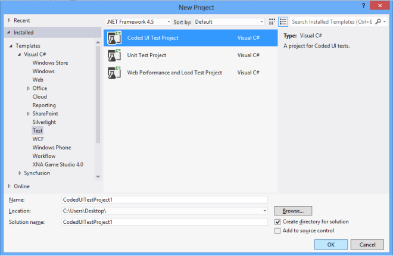
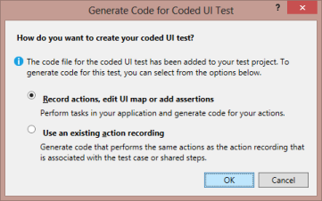
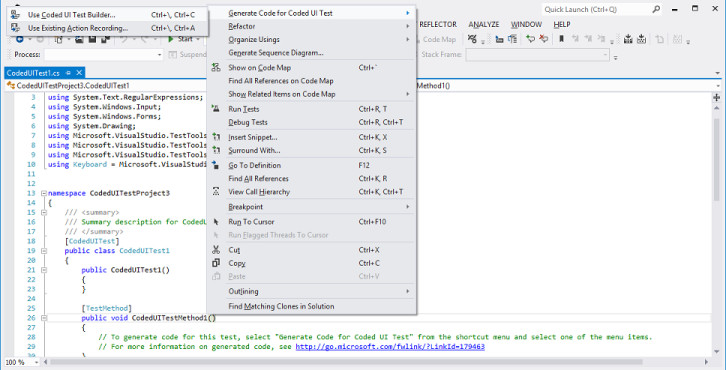
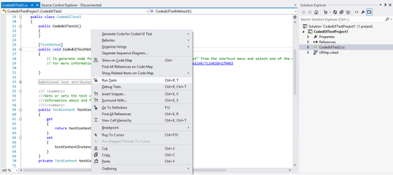

# UI Automation in WPF DataGrid (SfDataGrid)

Microsoft UI Automation is the new accessibility Framework for Microsoft Windows, available on all operating systems that support Windows Presentation Foundation (WPF). UI Automation provides accessibility to most UI elements and it provides the information about UI element to the end user. You can interact with the UI by using automated test scripts. To know more about UI Automation, refer the MSDN page [here](https://msdn.microsoft.com/en-us/library/ms747327(v=vs.110).aspx).

SfDataGrid supports the following types of UI Automation,

1. Coded UI
2. Quick Test Professional

## Coded UI Test

Automated tests that drive your application through its user interface (UI) are known as Coded UI Tests (CUITs). These tests include functional testing of the UI controls. SfDataGrid supports CUITs Coded UI automation that helps you create automated tests for inner elements and records the sequence of actions. While dragging the crosshair that is shown in CodedUITestBuilder, on UI elements, it shows the properties of the respective UI elements and you can also add assertion for each of the properties.

SfDataPager and SfMultiColumnDropDownControl support Coded UI Test automation.

Provided here are three levels of support in Coded UI Test automation.

Coded UI Test

<table>
<tr>
<th>
Levels</th><th>
Description</th></tr>
<tr>
<th>
Level – 1</th><th>
Record and Detect the UI Elements when you perform any actions in the Control.</th></tr>
<tr>
<th>
Level – 2</th><th>
Provide custom properties for UI elements when you drag the Crosshair to any UI element.</th></tr>
<tr>
<th>
Level – 3</th><th>
Coded UI Test Builder generates code from recorded session and custom class is implemented to access custom properties, so the generated code is simplified.</th></tr>
</table>

### Requirements and Configuration

Coded UI provides support only in Visual Studio Ultimate and Visual Studio Premium. For more information about the platforms and configurations that are supported by Coded UI tests, refer this [link](https://msdn.microsoft.com/en-us/library/dd380742.aspx).

To test SfDataGrid with CUITs, build the Extension Project and place it in the mentioned location. You can get the Extension Project of SfDataGrid from [this](http://www.syncfusion.com/downloads/support/directtrac/general/ze/Src-229533545.zip) location.

1. Open the Extension Project and build it.
2. You can get the Syncfusion.VisualStudio.TestTools.UITest.SfGridExtension.dll from bin folder. 

The above assembly must be placed into the following directory based on your Visual Studio version.

For Visual Studio 2010: C:\Program Files (x86)\Common Files\Microsoft Shared\VSTT\10.0\UITestExtensionPackages

For Visual Studio 2012: C:\Program Files (x86)\Common Files\Microsoft Shared\VSTT\11.0\UITestExtensionPackages

For Visual Studio 2013: C:\Program Files (x86)\Common Files\Microsoft Shared\VSTT\12.0\UITestExtensionPackages

N> Syncfusion.VisualStudio.TestTools.UITest.SfGridExtension.dll need to be installed in GAC location. Please refer the MSDN link for_ [GAC](https://msdn.microsoft.com/en-us/library/ex0ss12c(v=vs.80).aspx) _installation.

### Getting Started

This topic shows you how to create a CodedUITest project and test the SfDataGrid application. 

1. Create a new WPF application or open an existing WPF application with SfDataGrid and enable Coded UI Test in SfDataGrid. To enable CUITs, you need to set AutomationPeerHelper.EnableCodedUI__as True and access the AutomationPeerHelper class from Syncfusion.UI.Xaml.Grid__namespace as shown in the following code example,




using Syncfusion.UI.Xaml.Grid;

public MainWindow()
{
	 InitializeComponent();
	 AutomationPeerHelper.EnableCodedUI = true;
}




2. Build the application and launch the .exe file from the bin folder.          
3. Create a Coded UI Test Project as shown in the following screenshot.               

   

   Add New Project
   {:.caption}
4. After you create a new Coded UI project, a CUIT file is added automatically and the Generate Code dialog box appears. In this, choose Record actions, edit UI map or add assertions.

   

   Generate Code for Coded UI Test
   {:.caption}
5. Now the Coded UI project Visual Studio gets minimized and CodedUITestBuilder appears in the bottom right corner of your window. You can record the actions by clicking Start Recording in CodedUITestBuilder.

   

   CodedUITestBuilder
   {:.caption}
6. You can also open the CodedUITestBuilder from existing Coded UI project by right clicking on the CodedUITestMethod1 in CUIT file and clicking the Generate Code For Coded UI Test as shown in the following screenshot. You can see the same CodedUITestBuilder in the bottom right corner of the window.

   

   CodedUITestMethod
   {:.caption}
7. Now you can drag the Crosshairs on to the UI elements of your WPF SfDataGrid application and it shows the available properties of the inner UI elements in SfDataGrid.
8. You can record the actions made on UI elements by clicking Record button on the CodedUITest builder. For example you can record the action of changing the cell value in SfDataGrid. Click the Pause button to finish the record.

   

   CodedUITest
   {:.caption}
9. Once the record is completed, click the GenerateCode icon in CodedUITestBuilder for generate a test method. Then close the CodedUITestBuilder and you can see the generated code for cell value changed action as follows.




public void RecordedMethod1()
{
    #region Variable Declarations
    WpfText uIMEREPText = this.UIWpfWindow.UISfDataGridCustom.UIGridCellCustom4.UIMEREPText;
    WpfEdit uIGridCellEdit = this.UIWpfWindow.UISfDataGridCustom.UIGridCellEdit;
	WpfSfGridCell uIGridCellCustom11 = this.UIWpfWindow.UISfDataGridCustom.UIGridCellCustom11;
	WpfSfGridCell uIGridCellCustom12 = this.UIWpfWindow.UISfDataGridCustom.UIGridCellCustom12;
	#endregion

}




10. You can also create an assertion to check the modified cell value. Drag the crosshair to the modified cell, and the Assertion window appears. The properties for control (Cell) is now listed in the Assertion dialog box. You can add assertion by clicking the Generate Code button in CodedUITestBuilder.

    

    Assertion window
    {:.caption}
11. After all tests and assertion are created, right-click on the Test method and click Run Tests to run the test as follows.

    

    Run Test
	{:.caption}

### Tables for Properties 

The following properties are for each of the UI elements in SfDataGrid.

UI Elements:

<table>
<tr>
<th>
UI Elements</th><th>
Properties</th></tr>
<tr>
<th>
DataGrid</th><th>
RowCountColumnCountSelectionModeSelectionUnitSelectedIndexSelectedItemCount</th></tr>
<tr>
<th>
GridCell</th><th>
CellValueFormattedValueRowIndexColumnIndexColumnName</th></tr>
<tr>
<th>
GridHeaderCellControl</th><th>
MappingNameIsFilterAppliedFilterIconVisibilitySortDirectionSortNumberVisibility</th></tr>
<tr>
<th>
GridRowHeaderCell</th><th>
RowErrorMessageRowIndexState</th></tr>
<tr>
<th>
GroupDropArea</th><th>
IsExpandedGroupDropAreaText</th></tr>
<tr>
<th>
DetailsViewDataGrid</th><th>
RowCountColumnCountSelectionModeSelectionUnitSelectedIndexSelectedItemCount</th></tr>
<tr>
<th>
GroupDropAreaItem</th><th>
GroupNameSortDirection</th></tr>
<tr>
<th>
GridStackedHeaderCellControl</th><th>
      Default Properties </th></tr>
<tr>
<th>
GridTableSummaryCell</th><th>
      Default Properties</th></tr>
<tr>
<th>
GridGroupSummaryCell</th><th>
      Default Properties</th></tr>
<tr>
<th>
GridCaptionSummaryCell</th><th>
      Default Properties</th></tr>
<tr>
<th>
GridDetailsViewExpanderCellControl</th><th>
      Default Properties</th></tr>
<tr>
<th>
GridIndentCell</th><th>
      Default Properties</th></tr>
</table>

The following properties are for SfMultiColumnDropDownControl.

SfMultiColumnDropDownControl Properties

<table>
<tr>
<th>
UI Elements</th><th>
Properties</th></tr>
<tr>
<th>
SfMultiColumnDropDownControl</th><th>
AllowAutoCompleteAllowNullInputAllowImmediatePopupAllowIncrementalFilteringAllowCaseSensitiveFilteringAllowSpinOnMouseWheelDisplayMemberIsDropDownOpenSelectedIndexValueMember</th></tr>
</table>

The following properties are for SfDataPager.

SfDataPager Properties

<table>
<tr>
<th>
UI Elements</th><th>
Properties</th></tr>
<tr>
<th>
SfDataPager</th><th>
AccentBackgroundAccentForegroundAutoEllipsisModeAutoEllipsisTextDisplayModeEnableGridPagingNumericButtonCountOrientationPageCountPageSizeUseOnDemandPaging</th></tr>
</table>

### Limitations

*  SfDataGrid UI Automation will not work when you automate the datagrid with editing in Visual Studio 2015. It is a known issue in Visual Studio 2015.

### How To

### How to Enable Coded UI Test in SfDataGrid

To enable Coded UI Test in SfDataGrid, set AutomationPeerHelper.EnableCodedUI__to True. You can use the AutomationPeerHelper class from Syncfusion.UI.Xaml.Grid__namespace.



using Syncfusion.UI.Xaml.Grid;

public MainWindow()
{
    InitializeComponent();
    AutomationPeerHelper.EnableCodedUI = true;
}



## Quick Test Professional (QTP)

You can refer the UFT/QTP document from [here](https://help.syncfusion.com/wpf/testing/uft)