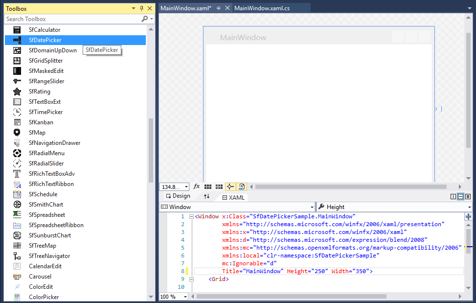
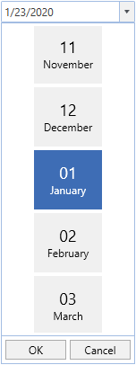

# Getting Started with WPF SfDatePicker

This section explains how to create a WPF [SfDatePicker](https://help.syncfusion.com/cr/wpf/Syncfusion.SfInput.Wpf~Syncfusion.Windows.Controls.Input.SfDatePicker.html) and explains about its structure.

## Structure of SfDatePicker

## Assembly deployment

Refer to the [control dependencies](https://help.syncfusion.com/wpf/control-dependencies#sfdatepicker) section to get the list of assemblies or NuGet package that needs to be added as a reference to use the control in any application.

You can find more details about installing the NuGet package in a WPF application in the following link: 

[How to install nuget packages](https://help.syncfusion.com/wpf/nuget-packages)

## Add control through designer

The `SfDatePicker` control can be added to an application by dragging it from the toolbox to a designer view. The following required assembly references will be added automatically:

* Syncfusion.SfInput.WPF
* Syncfusion.SfShared.WPF

## Adding control manually in XAML

To add the control manually in XAML, follow the given steps:

1.	Add the following required assembly references to the project:
    * Syncfusion.SfInput.WPF
    * Syncfusion.SfShared.WPF
2.	Import Syncfusion WPF schema **http://schemas.syncfusion.com/wpf** in the XAML page.
3.	Declare the `SfDatePicker` control in the XAML page.




<Window xmlns="http://schemas.microsoft.com/winfx/2006/xaml/presentation"
        xmlns:x="http://schemas.microsoft.com/winfx/2006/xaml"
        xmlns:syncfusion="http://schemas.syncfusion.com/wpf" 
        x:Class="SfDatePickerSample.MainWindow"
        Title="SfDatePicker Sample" Height="350" Width="525">
    <Grid>
        <!-- Adding SfDatePicker control -->
        <syncfusion:SfDatePicker x:Name="sfDatePicker" 
                                 Width="200"/>
    </Grid>
</Window>




## Add control manually in C\#

To add the control manually in C#, follow the given steps:

1.	Add the following required assembly references to the project:
    * Syncfusion.SfInput.WPF
    * Syncfusion.SfShared.WPF
2.	Import the `SfDatePicker` namespace **using Syncfusion.Windows.Controls.Input;**.
3.	Create an `SfDatePicker` instance, and add it to the window.




using Syncfusion.Windows.Controls.Input;
namespace SfDatePickerSample {    
    public partial class MainWindow : Window {
        public MainWindow() {
            InitializeComponent();

            //Creating an instance of SfDatePicker control
            SfDatePicker sfDatePicker = new SfDatePicker();

            //Adding SfDatePicker as window content
            this.Content = sfDatePicker;
        } 
    }
}




## Setting the Date

We can set or change the selected date by using either [Value](https://help.syncfusion.com/cr/wpf/Syncfusion.SfInput.Wpf~Syncfusion.Windows.Controls.Input.SfDatePicker~Value.html) or [DateTime](https://help.syncfusion.com/cr/wpf/Syncfusion.SfInput.Wpf~Syncfusion.Windows.Controls.Input.SfDatePicker~DateTime.html) property. Here, `Value` is the `object` type property and `DateTime` is the `DateTime` type property.




<syncfusion:SfDatePicker  Value="5/30/2021"
						  Name="sfDatePicker" />




SfDatePicker sfDatePicker= new SfDatePicker();
sfDatePicker.Value = new DateTime(2021,5,30);




## Display the date using the FormatString

 We can display the selected date with various formatting like date, month and year formats by using the [FormatString](https://help.syncfusion.com/cr/wpf/Syncfusion.SfInput.Wpf~Syncfusion.Windows.Controls.Input.SfDatePicker~FormatString.html) property.




<syncfusion:SfDatePicker x:Name="sfDatePicker" 
                         FormatString="M"/>




SfDatePicker sfDatePicker = new SfDatePicker();
sfDatePicker.FormatString = "M";




## Specifying format for the DateSelector

We can enable the user to select only the date or month or year from the [SfDateSelector](https://help.syncfusion.com/cr/wpf/Syncfusion.SfInput.Wpf~Syncfusion.Windows.Controls.Input.SfDateSelector.html) by using the [SelectorFormatString](https://help.syncfusion.com/cr/wpf/Syncfusion.SfInput.Wpf~Syncfusion.Windows.Controls.Input.SfDatePicker~SelectorFormatString.html) property.




<syncfusion:SfDatePicker x:Name="sfDatePicker" 
                         SelectorFormatString="M"/>




SfDatePicker sfDatePicker = new SfDatePicker();
sfDatePicker.SelectorFormatString = "M";




Click [here](https://github.com/SyncfusionExamples/wpf-date-picker-examples/tree/master/Samples/Formatting) to download the sample that showcases the display date formatting and date selection formatting by the `SfDatePicker`.

## Set selected value on lost focus

By default, the selected value of `SfDateSelector` can be directly sets to the `Value` property when `OK` button is clicked. We can update the `Value` property only on control lost it focus by setting the [SetValueOnLostFocus](https://help.syncfusion.com/cr/wpf/Syncfusion.SfInput.Wpf~Syncfusion.Windows.Controls.Input.SfDatePicker~SetValueOnLostFocus.html) property value as `true`.  




<syncfusion:SfDatePicker  SetValueOnLostFocus="True"
				          Name="sfDatePicker" />




SfDatePicker sfDatePicker= new SfDatePicker();
sfDatePicker.SetValueOnLostFocus = true;




Click [here](https://github.com/SyncfusionExamples/wpf-date-picker-examples/tree/master/Samples/SfDatePicker-Value-setting) to download the sample that showcases the value setting support in the `SfDatePicker`.