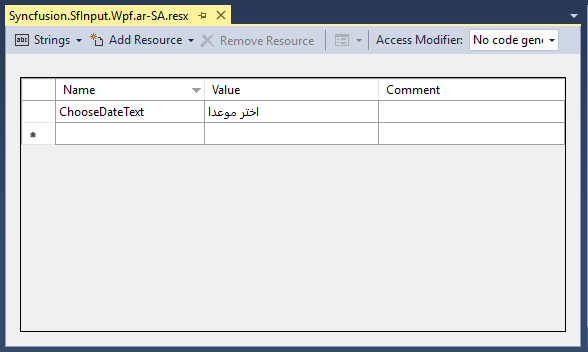
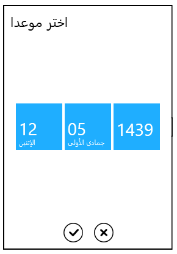

# Getting started

This section explains how to create a WPF [SfDatePicker](https://help.syncfusion.com/cr/wpf/Syncfusion.SfInput.Wpf~Syncfusion.Windows.Controls.Input.SfDatePicker.html) and explains about its structure.

## Structure of SfDatePicker

## Assembly deployment

Refer to the [control dependencies](https://help.syncfusion.com/wpf/control-dependencies#sfdatepicker) section to get the list of assemblies or NuGet package that needs to be added as a reference to use the control in any application.

You can find more details about installing the NuGet package in a WPF application in the following link: 

[How to install nuget packages](https://help.syncfusion.com/wpf/nuget-packages)

## Creating a simple application with SfDatePicker

You can create a WPF application with SfDatePicker control using the following steps:

## Create a project

Create a new WPF project in Visual Studio to display the SfDatePicker control with their functionalities.

## Add control through designer

The SfDatePicker control can be added to an application by dragging it from the toolbox to a designer view. The following required assembly references will be added automatically:

* Syncfusion.SfInput.WPF
* Syncfusion.SfShared.WPF

## Adding control manually in XAML

To add the control manually in XAML, follow the given steps:

1.	Add the following required assembly references to the project:
    * Syncfusion.SfInput.WPF
    * Syncfusion.SfShared.WPF
2.	Import Syncfusion WPF schema **http://schemas.syncfusion.com/wpf** in the XAML page.
3.	Declare the SfDatePicker control in the XAML page.



<Window xmlns="http://schemas.microsoft.com/winfx/2006/xaml/presentation"
        xmlns:x="http://schemas.microsoft.com/winfx/2006/xaml"
        xmlns:syncfusion="http://schemas.syncfusion.com/wpf" 
        x:Class="SfDatePickerSample.MainWindow"
        Title="SfDatePicker Sample" Height="350" Width="525">
    <Grid>
        <!-- Adding SfDatePicker control -->
        <syncfusion:SfDatePicker x:Name="sfdatePicker" HorizontalAlignment="Center"  VerticalAlignment="Center" Width="200"/>
    </Grid>
</Window>



## Add control manually in C\#

To add the control manually in C#, follow the given steps:

1.	Add the following required assembly references to the project:
    * Syncfusion.SfInput.WPF
    * Syncfusion.SfShared.WPF
2.	Import the SfDatePicker namespace **using Syncfusion.Windows.Controls.Input;**.
3.	Create an SfDatePicker instance, and add it to the window.



using Syncfusion.Windows.Controls.Input;
namespace SfDatePickerSample
{
    /// 

    /// Interaction logic for MainWindow.xaml
    /// 

    public partial class MainWindow : Window
    {
        public MainWindow()
        {
            InitializeComponent();
            //Creating an instance of SfDatePicker control
            SfDatePicker sfdatePicker = new SfDatePicker();
            //Adding SfDatePicker as window content
            this.Content = sfdatePicker;
        } 
    }
}



## Format the display text

The SfDatePicker control allows users format the display text in various ways. The [FormatString](https://help.syncfusion.com/cr/wpf/Syncfusion.SfInput.Wpf~Syncfusion.Windows.Controls.Input.SfDatePicker~FormatString.html) property determines the format specifier, by which the display text has to be formatted.



<!-- Setting format -->
<syncfusion:SfDatePicker x:Name="sfdatePicker" VerticalAlignment="Center" Width="200" HorizontalAlignment="Center" FormatString="M"/>


//Setting format
sfdatePicker.FormatString = "M";



### Specify format for the DateSelector

The [SelectorFormatString](https://help.syncfusion.com/cr/wpf/Syncfusion.SfInput.Wpf~Syncfusion.Windows.Controls.Input.SfDatePicker~SelectorFormatString.html) property is used to specify the format for DateSelector.



<!-- Setting specify format -->
<syncfusion:SfDatePicker SelectorFormatString="M" x:Name="sfdatePicker" VerticalAlignment="Center" Width="200" Margin="15" />


//Setting specify format 
sfdatePicker.SelectorFormatString="M";



### Set selected value in SfDatePicker on focus lost

Enable the [SetValueOnLostFocus](https://help.syncfusion.com/cr/wpf/Syncfusion.SfInput.Wpf~Syncfusion.Windows.Controls.Input.SfDatePicker~SetValueOnLostFocus.html) property to apply the selected value of `SfDateSelector` in `SfDatePicker` on its lost focus. 



<syncfusion:SfDatePicker x:Name="sfdatePicker" SetValueOnLostFocus="True" />


// Enabling SetValueOnLostFocus
sfdatePicker.SetValueOnLostFocus = true;



## Localization support

Localization is the process of making an application as multi-lingual by formatting the content according to different cultures.

### Create resource file and add value to the resource string based on the culture

Add a resource file(.resx) in the application, and assign key values to the resource string based on the culture. The following screenshot illustrates how to create a resource file and add values to the resource string based on the culture. 

### Assign the current UI culture to application

When initializing the application, [CurrentCulture](https://docs.microsoft.com/en-us/dotnet/api/system.globalization.cultureinfo.currentculture?view=netframework-4.7.2) and [CurrentUICulture](https://docs.microsoft.com/en-us/dotnet/api/system.threading.thread.currentuiculture?view=netframework-4.7.2) should be mentioned in code, so that the application will get the appropriate values provided in the resource file.



<syncfusion:SfDatePicker Name="sfdatePicker" HorizontalAlignment="Center" VerticalAlignment="Center" FormatString="dddd, MMMM dd, yyyy h:mm:ss tt"/>


CultureInfo culture = new System.Globalization.CultureInfo("ar-SA");
culture.DateTimeFormat.AMDesignator = "صباحا";
culture.DateTimeFormat.PMDesignator = "مساء";
System.Threading.Thread.CurrentThread.CurrentCulture = culture;
System.Threading.Thread.CurrentThread.CurrentUICulture = culture;


Dim culture As CultureInfo = New System.Globalization.CultureInfo("ar-SA")
culture.DateTimeFormat.AMDesignator = "5('-'"
culture.DateTimeFormat.PMDesignator = "E3'!"
System.Threading.Thread.CurrentThread.CurrentCulture = culture
System.Threading.Thread.CurrentThread.CurrentUICulture = culture



Value field of SfDatePicker is localized
{:.caption}

Display text "Choose Date" is localized to ar-SA culture
{:.caption}