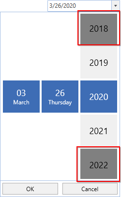

# Setting date in WPF SfDatePicker

We can change the value of [SfDatePicker](https://help.syncfusion.com/cr/wpf/Syncfusion.SfInput.Wpf~Syncfusion.Windows.Controls.Input.SfDatePicker.html) by using the [SfDateSelector](https://help.syncfusion.com/cr/wpf/Syncfusion.SfInput.Wpf~Syncfusion.Windows.Controls.Input.SfDateSelector.html) and keyboard interaction.

## Setting Date using property

We can set or change the selected date by using either [Value](https://help.syncfusion.com/cr/wpf/Syncfusion.SfInput.Wpf~Syncfusion.Windows.Controls.Input.SfDatePicker~Value.html) or [DateTime](https://help.syncfusion.com/cr/wpf/Syncfusion.SfInput.Wpf~Syncfusion.Windows.Controls.Input.SfDatePicker~DateTime.html) property. Here, `Value` is the `object` type property and `DateTime` is the `DateTime` type property.




<syncfusion:SfDatePicker  Value="5/30/2021"
						  Name="sfDatePicker" />




SfDatePicker sfDatePicker= new SfDatePicker();
sfDatePicker.Value = new DateTime(2021,5,30);




## Setting Null Value

If we want to set null value for the `SfDatePicker`, set the [AllowNull](https://help.syncfusion.com/cr/wpf/Syncfusion.SfInput.Wpf~Syncfusion.Windows.Controls.Input.SfDatePicker~AllowNull.html) property as `true` and [Value](https://help.syncfusion.com/cr/wpf/Syncfusion.SfInput.Wpf~Syncfusion.Windows.Controls.Input.SfDatePicker~Value.html) property as `null`.




<syncfusion:SfDatePicker  AllowNull="True" 
                          Value="{x:Null}"
						  Name="sfDatePicker" />




SfDatePicker sfDatePicker= new SfDatePicker();
sfDatePicker.AllowNull = true;
sfDatePicker.Value = null;




## Set selected value on lost focus

By default, the selected value of `SfDateSelector` can be directly sets to the `Value` property when `OK` button is clicked. We can update the `Value` property only on control lost it focus by setting the [SetValueOnLostFocus](https://help.syncfusion.com/cr/wpf/Syncfusion.SfInput.Wpf~Syncfusion.Windows.Controls.Input.SfDatePicker~SetValueOnLostFocus.html) property value as `true`.  




<syncfusion:SfDatePicker  SetValueOnLostFocus="True"
				          Name="sfDatePicker" />




SfDatePicker sfDatePicker= new SfDatePicker();
sfDatePicker.SetValueOnLostFocus = true;




## Setting the Input Scope for the On-Screen Keyboard

We can change the input type of the on-screen keyboard by using the [InputScope](https://help.syncfusion.com/cr/wpf/Syncfusion.SfInput.Wpf~Syncfusion.Windows.Controls.Input.SfDatePicker~InputScope.html) property. When the `InputScope` property set to `Number`, only the numeric keypad will be visible in the on-screen keyboard.

N> The [AllowInlineEditing](https://help.syncfusion.com/cr/wpf/Syncfusion.SfInput.Wpf~Syncfusion.Windows.Controls.Input.SfDatePicker~AllowInlineEditing.html) property must be set to `True` for this property to take effect.




<syncfusion:SfDatePicker Name="sfDatePicker" 
                         AllowInlineEditing="True" 
                         InputScope="Number"/>




SfDatePicker sfDatePicker= new SfDatePicker();
sfDatePicker.AllowInlineEditing = true;
sfDatePicker.InputScope = InputScopeNameValue.Date;




## Restrict selecting date limit

we can restrict the user to select a date in the specific date limit by setting the value for the [MinDate](https://help.syncfusion.com/cr/wpf/Syncfusion.SfInput.Wpf~Syncfusion.Windows.Controls.Input.SfDatePicker~MinDate.html) and [MaxDate](https://help.syncfusion.com/cr/wpf/Syncfusion.SfInput.Wpf~Syncfusion.Windows.Controls.Input.SfDatePicker~MaxDate.html) properties.




<syncfusion:SfDatePicker MinDate="1/1/2020"
                         MaxDate="6/30/2020" 
                         Name="sfDatePicker"/>




SfDatePicker sfDatePicker = new SfDatePicker();
sfDatePicker.MinDate = new DateTime(2020, 1, 1);
sfDatePicker.MaxDate = new DateTime(2020, 6, 30);




Here, the users can select the year from 2019 to 2021 only. 

## Selected Date changed notification

When the selected date of `SfDatePicker`is changed, it will be notified by using the [ValueChanged](https://help.syncfusion.com/cr/wpf/Syncfusion.SfInput.Wpf~Syncfusion.Windows.Controls.Input.SfDatePicker~ValueChanged_EV.html) event. You can get the details about the checked item in [ItemCheckedEventArgs](https://help.syncfusion.com/cr/wpf/Syncfusion.Tools.Wpf~Syncfusion.Windows.Tools.Controls.ItemCheckedEventArgs.html).

* **OldValue** : Gets a date which is previously selected.

* **NewValue** : Gets a date which is currently selected.




<syncfusion:SfDatePicker ValueChanged="SfdatePicker_ValueChanged" 
                         Name="sfDatePicker"/>




SfDatePicker sfDatePicker = new SfDatePicker();
sfDatePicker.ValueChanged += SfdatePicker_ValueChanged;




You can handle the event as follows:




private void SfdatePicker_ValueChanged(DependencyObject d, DependencyPropertyChangedEventArgs e) {          
    Console.WriteLine("The Old selected Date: " + e.OldValue.ToString());
    Console.WriteLine("The Newly selected Date: " + e.NewValue.ToString());            
}




Click [here](https://github.com/SyncfusionExamples/wpf-date-picker-examples/tree/master/Samples/SfDatePicker-Value-setting) to download the sample that showcases the input types and selected date with its notification supports.