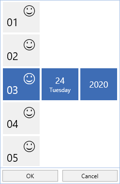

# SfDateSelector in the SfDatePicker

The [SfDateSelector](https://help.syncfusion.com/cr/wpf/Syncfusion.SfInput.Wpf~Syncfusion.Windows.Controls.Input.SfDateSelector.html) control opens inside the drop-down popup.

The visual elements of the date selector can be customized using the [SelectorStyle](https://help.syncfusion.com/cr/wpf/Syncfusion.SfInput.Wpf~Syncfusion.Windows.Controls.Input.SfDatePicker~SelectorStyle.html) property.

## Change the Cell templates

We can changes the template for the each selection Date, Month or Year list by the `DayCellTemplate`, `MonthCellTemplate` or `YearCellTemplate` which are available in the `SfDateSelector`.

N> The DataContext of Selection box is Syncfusion.UI.Xaml.Primitives.DateTimeWrapper.

## Change the DayCell Template

We can change the date selector template by using the [DayCellTemplate](https://help.syncfusion.com/cr/wpf/Syncfusion.SfInput.Wpf~Syncfusion.Windows.Controls.Input.SfDateSelector~DayCellTemplate.html) property. In that, we can add any image, icon or text with the day number.



<syncfusion:SfDatePicker VerticalAlignment="Center"
                         HorizontalAlignment="Center"
                         Width="200">

    <syncfusion:SfDatePicker.SelectorStyle>
        
    </syncfusion:SfDatePicker.SelectorStyle>
</syncfusion:SfDatePicker>



## Change the MonthCell Template

We can change the month selector template by using the [MonthCellTemplate](https://help.syncfusion.com/cr/wpf/Syncfusion.SfInput.Wpf~Syncfusion.Windows.Controls.Input.SfDateSelector~MonthCellTemplate.html) property. In that, we can add any image, icon or text with the month number.



<syncfusion:SfDatePicker VerticalAlignment="Center"
                 HorizontalAlignment="Center"
                 Width="200">

    <syncfusion:SfDatePicker.SelectorStyle>
        
    </syncfusion:SfDatePicker.SelectorStyle>
</syncfusion:SfDatePicker>



## Change the YearCell Template

We can change the year selector template by using the [YearCellTemplate](https://help.syncfusion.com/cr/wpf/Syncfusion.SfInput.Wpf~Syncfusion.Windows.Controls.Input.SfDateSelector~YearCellTemplate.html) property. In that, we can add any image, icon or text with the year number.



<syncfusion:SfDatePicker VerticalAlignment="Center"
                 HorizontalAlignment="Center"
                 Width="200">

    <syncfusion:SfDatePicker.SelectorStyle>
        
    </syncfusion:SfDatePicker.SelectorStyle>
</syncfusion:SfDatePicker>


			

Click [here]() to download the sample that showcases the `SfDateSelector` template customization. 