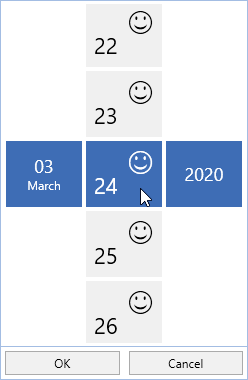
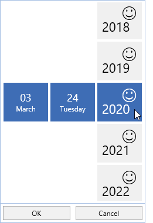
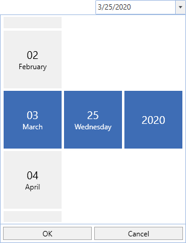

# DateSelector in WPF SfDatePicker

The [SfDateSelector](https://help.syncfusion.com/cr/wpf/Syncfusion.SfInput.Wpf~Syncfusion.Windows.Controls.Input.SfDateSelector.html) is a sub-control of [SfDatePicker](https://help.syncfusion.com/cr/wpf/Syncfusion.SfInput.Wpf~Syncfusion.Windows.Controls.Input.SfDatePicker.html) which opens inside the drop-down popup and used to select the date for the `SfDatePicker`. It contains the date, month and year selection cells for select the date. The selected date of the `SfDateSelector` is assigned to the [SfDatePicker.Value](https://help.syncfusion.com/cr/wpf/Syncfusion.SfInput.Wpf~Syncfusion.Windows.Controls.Input.SfDatePicker~Value.html) property. 

The visual elements of the date selector can be customized using the [SelectorStyle](https://help.syncfusion.com/cr/wpf/Syncfusion.SfInput.Wpf~Syncfusion.Windows.Controls.Input.SfDatePicker~SelectorStyle.html) property.

## Change the Cell templates

We can changes the template for the Date, Month or Year selector by using the `DayCellTemplate`, `MonthCellTemplate` or `YearCellTemplate` which are available in the `SfDateSelector`.

N> The DataContext of Month, Date and Year selection cell is [DateTimeWrapper](https://help.syncfusion.com/cr/wpf/Syncfusion.SfShared.Wpf~Syncfusion.Windows.Primitives.DateTimeWrapper.html).

## Change the DayCell Template

We can change the day selector template by using the [DayCellTemplate](https://help.syncfusion.com/cr/wpf/Syncfusion.SfInput.Wpf~Syncfusion.Windows.Controls.Input.SfDateSelector~DayCellTemplate.html) property. In that, we can add like image, icon or text with the day numbers.



<syncfusion:SfDatePicker VerticalAlignment="Center"
                         HorizontalAlignment="Center"
                         Width="200"
                         Name="sfDatePicker">

    <syncfusion:SfDatePicker.SelectorStyle>
        
    </syncfusion:SfDatePicker.SelectorStyle>
</syncfusion:SfDatePicker>



## Change the MonthCell Template

We can change the month selector template by using the [MonthCellTemplate](https://help.syncfusion.com/cr/wpf/Syncfusion.SfInput.Wpf~Syncfusion.Windows.Controls.Input.SfDateSelector~MonthCellTemplate.html) property. In that, we can add like image, icon or text with the month numbers.



<syncfusion:SfDatePicker VerticalAlignment="Center"
                         HorizontalAlignment="Center"
                         Width="200"
                         Name="sfDatePicker">

    <syncfusion:SfDatePicker.SelectorStyle>
        
    </syncfusion:SfDatePicker.SelectorStyle>
</syncfusion:SfDatePicker>



## Change the YearCell Template

We can change the year selector template by using the [YearCellTemplate](https://help.syncfusion.com/cr/wpf/Syncfusion.SfInput.Wpf~Syncfusion.Windows.Controls.Input.SfDateSelector~YearCellTemplate.html) property. In that, we can add like image, icon or text with the year numbers.



<syncfusion:SfDatePicker VerticalAlignment="Center"
                         HorizontalAlignment="Center"
                         Width="200"
                         Name="sfDatePicker">

    <syncfusion:SfDatePicker.SelectorStyle>
        
    </syncfusion:SfDatePicker.SelectorStyle>
</syncfusion:SfDatePicker>


			

## Change size of cells

We can change the cell size in the `SfDateSelector` control by setting the [SelectorItemWidth](https://help.syncfusion.com/cr/wpf/Syncfusion.SfInput.Wpf~Syncfusion.Windows.Controls.Input.SfDatePicker~SelectorItemWidth.html) and [SelectorItemHeight](https://help.syncfusion.com/cr/wpf/Syncfusion.SfInput.Wpf~Syncfusion.Windows.Controls.Input.SfDatePicker~SelectorItemHeight.html) properties. The default value of the `SelectorItemWidth` and `SelectorItemHeight` properties is `80` and `70`. 




<syncfusion:SfDatePicker SelectorItemWidth="100" 
                         SelectorItemHeight="100" 
	                     x:Name="sfDatePicker"/>




SfDatePicker sfDatePicker = new SfDatePicker();
sfDatePicker.SelectorItemWidth = 100;
sfDatePicker.SelectorItemHeight = 100;




## DateSelector item spacing
 
We can change the space between `SfDateSelector` date, month and year items by using the [SelectorItemSpacing](https://help.syncfusion.com/cr/wpf/Syncfusion.SfInput.Wpf~Syncfusion.Windows.Controls.Input.SfDatePicker~SelectorItemSpacing.html) property. The default value of the `SelectorItemSpacing` property is `4`.




<syncfusion:SfDatePicker SelectorItemSpacing="50" 
	                     x:Name="sfDatePicker"/>




SfDatePicker sfDatePicker = new SfDatePicker();
sfDatePicker.SelectorItemSpacing = 50;




Click [here](https://github.com/SyncfusionExamples/wpf-date-picker-examples/tree/master/Samples/DateSelectorTemplates) to download the sample that showcases the `SfDateSelector` template customization. 