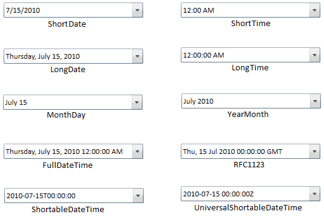

# DateTime Patterns

The DateTime [Pattern](https://help.syncfusion.com/cr/cref_files/wpf/Syncfusion.Shared.Wpf~Syncfusion.Windows.Shared.DateTimeBase~Pattern.html) helps you to specify the date-time display pattern for the `DateTimeEdit` control.

The display format of the date in the `DateTimeEdit` control can be customized by the [Pattern](https://help.syncfusion.com/cr/cref_files/wpf/Syncfusion.Shared.Wpf~Syncfusion.Windows.Shared.DateTimeBase~Pattern.html) and [CustomPattern](https://help.syncfusion.com/cr/cref_files/wpf/Syncfusion.Shared.Wpf~Syncfusion.Windows.Shared.DateTimeBase~CustomPattern.html) properties.

## Pattern

The `DateTimeEdit` control supports the following patterns: 

* LongDate 
* LongTime 
* ShortDate 
* ShortTime 
* FullDateTime 
* MonthDay 
* CustomPattern 
* ShortableDateTime 
* UniversalShortableDateTime 
* RFC1123 
* YearMonth 

The pattern is set by using the [Pattern](https://help.syncfusion.com/cr/cref_files/wpf/Syncfusion.Shared.Wpf~Syncfusion.Windows.Shared.DateTimeBase~Pattern.html) property. The following code snippet illustrates how to set the patterns:





<!--Setting ShortDate Pattern-->

<syncfusion:DateTimeEdit x:Name="dateTimeEdit" Height="25" Width="200" DateTime="07/15/2010" Pattern="ShortDate"></syncfusion:DateTimeEdit>

<!--Setting LongDate Pattern-->

<syncfusion:DateTimeEdit x:Name="dateTimeEdit" Height="25" Width="200" DateTime="07/15/2010" Pattern="LongDate"></syncfusion:DateTimeEdit>

<!--Setting LongTime Pattern-->

<syncfusion:DateTimeEdit x:Name="dateTimeEdit" Height="25" Width="200" DateTime="07/15/2010" Pattern="LongTime"></syncfusion:DateTimeEdit>

<!--Setting ShortTime Pattern-->

<syncfusion:DateTimeEdit x:Name="dateTimeEdit" Height="25" Width="200" DateTime="07/15/2010" Pattern="ShortTime"></syncfusion:DateTimeEdit>

<!--Setting FullDateTime Pattern-->

<syncfusion:DateTimeEdit x:Name="dateTimeEdit" Height="25" Width="200" DateTime="07/15/2010" Pattern="FullDateTime"></syncfusion:DateTimeEdit>

<!--Setting MonthDay Pattern-->

<syncfusion:DateTimeEdit x:Name="dateTimeEdit" Height="25" Width="200" DateTime="07/15/2010" Pattern="MonthDay"></syncfusion:DateTimeEdit>

<!--Setting ShortableDateTime Pattern-->

<syncfusion:DateTimeEdit x:Name="dateTimeEdit" Height="25" Width="200" DateTime="07/15/2010" Pattern="ShortableDateTime"></syncfusion:DateTimeEdit>

<!--Setting UniversalShortableDateTime Pattern-->

<syncfusion:DateTimeEdit x:Name="dateTimeEdit" Height="25" Width="200" DateTime="07/15/2010" Pattern="UniversalShortableDateTime"></syncfusion:DateTimeEdit>

<!--Setting RFC1123 Pattern-->

<syncfusion:DateTimeEdit x:Name="dateTimeEdit" Height="25" Width="200" DateTime="07/15/2010" Pattern="RFC1123"></syncfusion:DateTimeEdit>

<!--Setting YearMonth Pattern-->

<syncfusion:DateTimeEdit x:Name="dateTimeEdit" Height="25" Width="200" DateTime="07/15/2010" Pattern="YearMonth"></syncfusion:DateTimeEdit>





Syncfusion.Windows.Shared.DateTimeEdit dateTimeEdit = new  Syncfusion.Windows.Shared.DateTimeEdit();

dateTimeEdit.Width = 200;

dateTimeEdit.Height = 25;

dateTimeEdit.DateTime = new DateTime(2010, 07, 15);

//Setting predefined ShortDate pattern

dateTimeEdit.Pattern = DateTimePattern.ShortDate;

//Setting predefined ShortTime pattern

dateTimeEdit.Pattern = DateTimePattern.ShortTime;

//Setting predefined LongDate pattern

dateTimeEdit.Pattern = DateTimePattern.LongDate;

//Setting predefined LongTime pattern

dateTimeEdit.Pattern = DateTimePattern.LongTime;

//Setting predefined FullDateTime pattern

dateTimeEdit.Pattern = DateTimePattern.FullDateTime;

//Setting predefined MonthDay pattern

dateTimeEdit.Pattern = DateTimePattern.MonthDay;

//Setting predefined ShortableDateTime pattern

dateTimeEdit.Pattern = DateTimePattern.ShortableDateTime;

//Setting predefined UniversalShortableDateTime pattern

dateTimeEdit.Pattern = DateTimePattern.UniversalShortableDateTime;

//Setting predefined RFC1123 pattern

dateTimeEdit.Pattern = DateTimePattern.RFC1123;

//Setting predefined YearMonth pattern

dateTimeEdit.Pattern = DateTimePattern.YearMonth;



 

## Custom pattern

You can also set the custom pattern for displaying the date in the DateTimeEdit control by using the [CustomPattern](https://help.syncfusion.com/cr/cref_files/wpf/Syncfusion.Shared.Wpf~Syncfusion.Windows.Shared.DateTimeBase~CustomPattern.html) property.





<syncfusion:DateTimeEdit x:Name="dateTimeEdit" Height="25" Width="200"  DateTime="07/15/2010" Pattern="CustomPattern" CustomPattern="MM/dd/yy hh:mm:ss"></syncfusion:DateTimeEdit>





Syncfusion.Windows.Shared.DateTimeEdit dateTimeEdit = new Syncfusion.Windows.Shared.DateTimeEdit();
dateTimeEdit.Width = 200;
dateTimeEdit.Height = 25;
dateTimeEdit.DateTime = new DateTime(2010, 07, 05);
dateTimeEdit.Pattern = DateTimePattern.CustomPattern;

//Setting Custom Pattern

dateTimeEdit.CustomPattern = "MM/dd/yy hh:mm:ss";

this.LayoutRoot.Children.Add(dateTimeEdit);



 

N>[CustomPattern](https://help.syncfusion.com/cr/cref_files/wpf/Syncfusion.Shared.Wpf~Syncfusion.Windows.Shared.DateTimeBase~CustomPattern.html) support can be enabled by setting the [Pattern](https://help.syncfusion.com/cr/cref_files/wpf/Syncfusion.Shared.Wpf~Syncfusion.Windows.Shared.DateTimeBase~Pattern.html) property to the DateTimePattern.CustomPattern.
