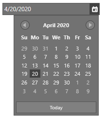
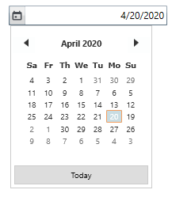

# Appearance     

The DateTimeEdit provides built-in themes which can be applied using SkinStorage and SfSkinManager. Also provides support to create custom theme using theme studio. You can customize the appearance of calendar, clock, up-down and drop-down buttons in the DateTimeEdit.

## Customize up-down appearance

 The visibility of the Repeat Button can be enabled by setting the [IsVisibleRepeatButton](https://help.syncfusion.com/cr/cref_files/wpf/Syncfusion.Shared.Wpf~Syncfusion.Windows.Shared.DateTimeBase~IsVisibleRepeatButton.html) property to true. The [RepeatButtonBackground](https://help.syncfusion.com/cr/cref_files/wpf/Syncfusion.Shared.Wpf~Syncfusion.Windows.Shared.DateTimeBase~RepeatButtonBackground.html), [RepeatButtonBorderThickness](https://help.syncfusion.com/cr/cref_files/wpf/Syncfusion.Shared.Wpf~Syncfusion.Windows.Shared.DateTimeBase~RepeatButtonBorderThickness.html), [UpRepeatButtonTemplate](https://help.syncfusion.com/cr/cref_files/wpf/Syncfusion.Shared.Wpf~Syncfusion.Windows.Shared.DateTimeBase~UpRepeatButtonTemplate.html), [DownRepeatButtonTemplate](https://help.syncfusion.com/cr/cref_files/wpf/Syncfusion.Shared.Wpf~Syncfusion.Windows.Shared.DateTimeBase~DownRepeatButtonTemplate.html), [UpRepeatButtonMargin](https://help.syncfusion.com/cr/cref_files/wpf/Syncfusion.Shared.Wpf~Syncfusion.Windows.Shared.DateTimeBase~UpRepeatButtonMargin.html), and [DownRepeatButtonMargin](https://help.syncfusion.com/cr/cref_files/wpf/Syncfusion.Shared.Wpf~Syncfusion.Windows.Shared.DateTimeBase~DownRepeatButtonMargin.html) properties are used to customize the appearance of the Repeat Buttons.





<syncfusion:DateTimeEdit x:Name="dateTimeEdit" Height="25" Width="200" 
                         IsVisibleRepeatButton="True" RepeatButtonBackground="Violet" 
                         UpRepeatButtonMargin="1" DownRepeatButtonMargin="1" />          





dateTimeEdit.RepeatButtonBackground = Brushes.Violet;
dateTimeEdit.UpRepeatButtonMargin = new Thickness(1);
dateTimeEdit.DownRepeatButtonMargin = new Thickness(1);





## Custom calendar and clock

You can host your own calendar and clock control in DateTimeEdit by using [DateTimeCalender](https://help.syncfusion.com/cr/wpf/Syncfusion.Shared.Wpf~Syncfusion.Windows.Shared.DateTimeEdit~DateTimeCalender.html) and [Clock](https://help.syncfusion.com/cr/wpf/Syncfusion.Shared.Wpf~Syncfusion.Windows.Shared.DateTimeEdit~Clock.html) properties to enhance its appearance.

### Custom calendar

You can host a custom calendar by using [DateTimeCalender](https://help.syncfusion.com/cr/wpf/Syncfusion.Shared.Wpf~Syncfusion.Windows.Shared.DateTimeEdit~DateTimeCalender.html) property of DateTimeEdit. 





<syncfusion:DateTimeEdit Width="250" Height="25" x:Name="dateTimeEdit">
    <syncfusion:DateTimeEdit.DateTimeCalender>
        <syncfusion:SfDateSelector Width="250" ShowCancelButton="False" ShowDoneButton="False" 
                                   SelectorItemWidth="75" SelectorItemHeight="75" 
                                   SelectorItemSpacing="4.5" Height="430" Margin="0, 2, 0 ,0" 
                                   SelectedDateTime="{Binding ElementName=dateTimeEdit,Path=DateTime,
                                                      Mode=TwoWay,UpdateSourceTrigger=PropertyChanged}">
        </syncfusion:SfDateSelector>
    </syncfusion:DateTimeEdit.DateTimeCalender>
</syncfusion:DateTimeEdit>





ToggleButton todayButton;
public MainWindow()
{
    InitializeComponent();
    dateTimeEdit.IsDropDownOpenChanged += DateTimeEdit_IsDropDownOpenChanged;
}

private void DateTimeEdit_IsDropDownOpenChanged(DependencyObject d, DependencyPropertyChangedEventArgs e)
{
    if (dateTimeEdit.IsDropDownOpen)
    {
        todayButton = dateTimeEdit.Template.FindName("Button_Today_Classic", dateTimeEdit) as ToggleButton;
        if (todayButton != null)
        {
            todayButton.Visibility = Visibility.Collapsed;
        }
    }
}





### Custom clock

You can host a custom clock using the [Clock](https://help.syncfusion.com/cr/wpf/Syncfusion.Shared.Wpf~Syncfusion.Windows.Shared.DateTimeEdit~Clock.html) property of DateTimeEdit. You can enable or disable the clock by setting [EnableClassicStyle](https://help.syncfusion.com/cr/wpf/Syncfusion.Shared.Wpf~Syncfusion.Windows.Shared.DateTimeEdit~EnableClassicStyle.html) and [IsWatchEnabled](https://help.syncfusion.com/cr/cref_files/wpf/Syncfusion.Shared.Wpf~Syncfusion.Windows.Shared.DateTimeBase~IsWatchEnabled.html) properties to true.





<syncfusion:DateTimeEdit Width="250" Height="25" EnableClassicStyle="True" IsCalendarEnabled="False" x:Name="dateTimeEdit">
    <syncfusion:DateTimeEdit.Clock>
        <syncfusion:SfTimeSelector Width="248" ShowCancelButton="False" ShowDoneButton="False" 
                                   SelectorItemWidth="75" SelectorItemHeight="75" Height="430"
                                   SelectorItemSpacing="4.5" BorderThickness="1" BorderBrush="Black"                   
                                   SelectedTime="{Binding ElementName=dateTimeEdit,Path=DateTime,
                                                  Mode=TwoWay,UpdateSourceTrigger=PropertyChanged}">
        </syncfusion:SfTimeSelector>
    </syncfusion:DateTimeEdit.Clock>
</syncfusion:DateTimeEdit>





N> Download demo application from [GitHub](https://github.com/SyncfusionExamples/wpf-date-time-edit-examples/tree/master/Samples/Custom-clock-and-calendar)

## Built-in themes

The appearance of DateTimeEdit control can be customized by VisualStyle attached property of the `SfSkinManager` and `SkinStorage`. You can find the list of available built-in themes and the assemblies needs to be referred in the following documentation [SfSkinManager](https://help.syncfusion.com/wpf/themes/getting-started) and [SkinStorage](https://help.syncfusion.com/wpf/skinmanager/overview).

Below example explains how to apply blend theme for DateTimeEdit using SfSkinManager in an existing application.

* Add reference Syncfusion.SfSkinManager.Wpf.dll and Syncfusion.Themes.Blend.Wpf.dll assembly.
* Now add reference to `SfSkinManager` namespace and set `SfSkinManager.VisualStyle` attached property to window or DateTimeEdit. Setting `VisualStyle` property to window will apply blend theme for all controls in Windows.





<Window x:Class="DateTimeEdit_sample.MainWindow"
        xmlns="http://schemas.microsoft.com/winfx/2006/xaml/presentation"
        xmlns:x="http://schemas.microsoft.com/winfx/2006/xaml"                          
        xmlns:syncfusion="http://schemas.syncfusion.com/wpf"
        xmlns:local="clr-namespace:DateTimeEdit_sample"
        xmlns:skinManager="clr-namespace:Syncfusion.SfSkinManager;assembly=Syncfusion.SfSkinManager.WPF"
        Title="Visual Styles Demo"  Icon="App.ico"
        Width="1200" Height="720"
        WindowStartupLocation="CenterScreen">

    <Grid>             
       <syncfusion:DateTimeEdit skinManager:SfSkinManager.VisualStyle="Blend" x:Name="datetimeedit" Width="200" Height="25" />
   </Grid>

</Window>                        





using Syncfusion.SfSkinManager;

SfSkinManager.SetVisualStyle(datetimeedit, VisualStyles.Blend);





* Now run the application, you can see blend theme applied for DateTimeEdit.

### Custom Theme using Theme Studio

DateTimeEdit themes can be customized using theme studio. Refer the documentation [link](https://help.syncfusion.com/wpf/themes/theme-studio) for more information.

## Flow direction 

The `DateTimeEdit` control elements can be aligned in right-to-left direction by using `FlowDirection` property. The default value is `LeftToRight`.  





<syncfusion:DateTimeEdit x:Name="dateTimeEdit" FlowDirection="RightToLeft" Width="200" Height="25" />          





dateTimeEdit.FlowDirection = FlowDirection.RightToLeft;





