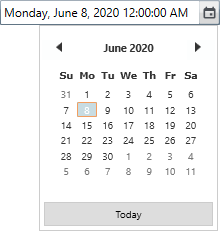

# DateTime formatting in WPF DateTimePicker (DateTimeEdit)

you can specify the selected datetime display format in the [DateTimeEdit](https://help.syncfusion.com/cr/wpf/Syncfusion.Shared.Wpf~Syncfusion.Windows.Shared.DateTimeEdit.html) by using the predefined patterns and custom patterns.

## Predefined display patterns

You can display the selected date time in the predefined patterns
by setting the pattern value to the [Pattern](https://help.syncfusion.com/cr/cref_files/wpf/Syncfusion.Shared.Wpf~Syncfusion.Windows.Shared.DateTimeBase~Pattern.html) property. The default value of `Pattern` property is `ShortDate`.

The `DateTimeEdit` control supports the following patterns:
* LongDate 
* LongTime 
* ShortDate 
* ShortTime 
* FullDateTime 
* MonthDay 
* CustomPattern 
* ShortableDateTime 
* UniversalShortableDateTime 
* RFC1123 
* YearMonth 




<syncfusion:DateTimeEdit Pattern="FullDateTime" 
                         Name="dateTimeEdit" />




DateTimeEdit dateTimeEdit = new DateTimeEdit();
dateTimeEdit.Pattern = DateTimePattern.FullDateTime;




N> View [Sample](https://github.com/SyncfusionExamples/wpf-datetimepicker-examples/tree/master/Samples/DateTimeFormatting) in GitHub

### Pattern Changed notification

The `DateTimeEdit` notifies that the pattern is changed through the [PatternChanged](https://help.syncfusion.com/cr/cref_files/wpf/Syncfusion.Shared.Wpf~Syncfusion.Windows.Shared.DateTimeBase~PatternChanged_EV.html) event. You can get the old and new pattern by using the `OldValue` and `NewValue` properties in the `PatternChanged` event.




DateTimeEdit dateTimeEdit = new DateTimeEdit();
dateTimeEdit.PatternChanged += DateTimeEdit_PatternChanged;

private void DateTimeEdit_PatternChanged(DependencyObject d, DependencyPropertyChangedEventArgs e) {
    //Get old and new pattern values
    var oldPattern = e.OldValue;
    var newPattern = e.NewValue;
}




## Change datetime format

you can change the date time format by using the [DateTimeFormat](https://help.syncfusion.com/cr/cref_files/wpf/Syncfusion.Shared.Wpf~Syncfusion.Windows.Shared.DateTimeBase~DateTimeFormat.html)  property. The default value of `` property is ``.




<syncfusion:DateTimeEdit Name="dateTimeEdit">
    <syncfusion:DateTimeEdit.DateTimeFormat>
        <global:DateTimeFormatInfo ShortDatePattern="MM/dd/yy hh:mm:ss"/>
    </syncfusion:DateTimeEdit.DateTimeFormat>
</syncfusion:DateTimeEdit>




DateTimeEdit dateTimeEdit = new DateTimeEdit();
dateTimeEdit.DateTimeFormat = new DateTimeFormatInfo()
{ 
    ShortDatePattern = "MM/dd/yy hh:mm:ss" 
};




N> View [Sample](https://github.com/SyncfusionExamples/wpf-datetimepicker-examples/tree/master/Samples/DateTimeFormatting) in GitHub

## Custom display pattern

You can also set the custom pattern for displaying the datetime in the `DateTimeEdit` control by using the [CustomPattern](https://help.syncfusion.com/cr/cref_files/wpf/Syncfusion.Shared.Wpf~Syncfusion.Windows.Shared.DateTimeBase~CustomPattern.html) property. You can enable the custom display pattern by setting the `Pattern` propety value as `CustomPattern`.




<syncfusion:DateTimeEdit CustomPattern="MM**dd**yy" 
                         Pattern="CustomPattern" 
                         Name="dateTimeEdit" />




DateTimeEdit dateTimeEdit = new DateTimeEdit();
dateTimeEdit.CustomPattern = "MM**dd**yy";
dateTimeEdit.Pattern = DateTimePattern.CustomPattern;




N> View [Sample](https://github.com/SyncfusionExamples/wpf-datetimepicker-examples/tree/master/Samples/DateTimeFormatting) in GitHub

### Custom pattern Changed notification

The `DateTimeEdit` notifies that the custom pattern is changed through the [CustomPatternChanged](https://help.syncfusion.com/cr/cref_files/wpf/Syncfusion.Shared.Wpf~Syncfusion.Windows.Shared.DateTimeBase~CustomPatternChanged_EV.html) event. You can get the old and new custom pattern by using the `OldValue` and `NewValue` properties in the `CustomPatternChanged` event.




DateTimeEdit dateTimeEdit = new DateTimeEdit();
dateTimeEdit.CustomPatternChanged += dateTimeEdit_CustomPatternChanged;

private void dateTimeEdit_CustomPatternChanged(DependencyObject d, DependencyPropertyChangedEventArgs e) {
    //Get old and new custom pattern values
    var oldCustomPattern = e.OldValue;
    var newCustomPattern = e.NewValue;
}




N> View [Sample](https://github.com/SyncfusionExamples/wpf-datetimepicker-examples/tree/master/Samples/DateTimeFormatting) in GitHub

## Change culture 

By default, the `DateTimeEdit` supports system’s current culture. You can change the culture of `DateTimeEdit` by using the [CultureInfo](https://help.syncfusion.com/cr/cref_files/wpf/Syncfusion.Shared.Wpf~Syncfusion.Windows.Shared.DateTimeBase~CultureInfo.html) property. Based on the value of `CultureInfo` property, `DateTimeEdit` control elements localized.




<syncfusion:DateTimeEdit CultureInfo="en-US" 
                         Pattern="FullDateTime"
                         Name="dateTimeEdit" />




DateTimeEdit dateTimeEdit = new DateTimeEdit();
dateTimeEdit.CultureInfo = new CultureInfo("fr-FR");
dateTimeEdit.Pattern = DateTimePattern.FullDateTime;




N> View [Sample](https://github.com/SyncfusionExamples/wpf-datetimepicker-examples/tree/master/Samples/DateTimeFormatting) in GitHub
