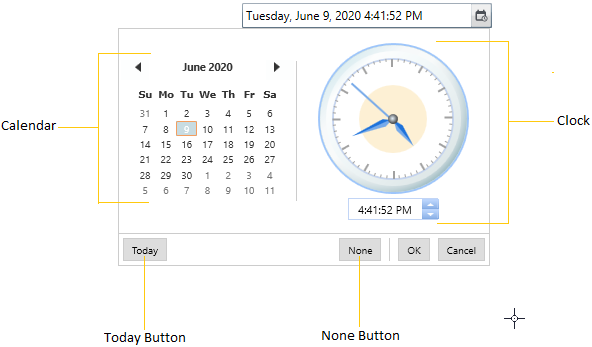
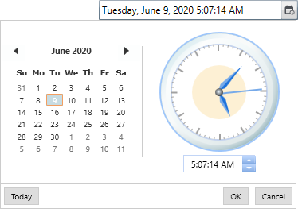
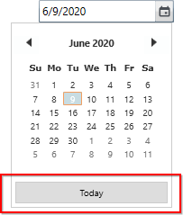
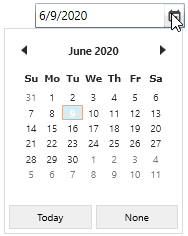
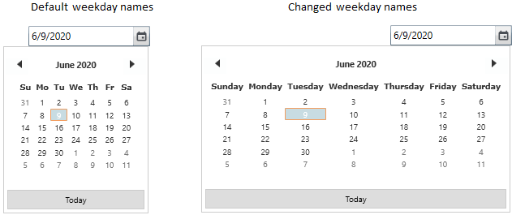
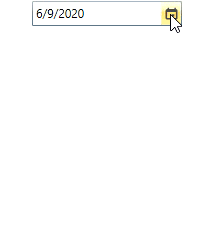

# Dropdown Pop-up in WPF DateTimePicker (DateTimeEdit)

You can display the dropdown popup by clicking the dropdown button. You can select the datetime by using the dropdown popup calendar and clock. The dropdown pop-up in [DateTimeEdit](https://help.syncfusion.com/cr/wpf/Syncfusion.Windows.Shared.DateTimeEdit.html) controls contains the following parts:

* Calendar
* Clock
* Today Button
* None Button

DropDown_Structure

## Open and close the datetime selector popup using short-cut keys

You can open or close the popup datetime selector popup by pressing the `Alt + Down` key and `F4` key.

## Dropdown date time selector

You can select the date and time using `Calendar` and `Clock`.  By default, the `Calender` is displayed in the drop down popup.
You can use the [DropDownView](https://help.syncfusion.com/cr/wpf/Syncfusion.Windows.Shared.DateTimeEdit.html#Syncfusion_Windows_Shared_DateTimeEdit_DropDownView) property to display either  `Calendar` or `Clock` or both in the drop down to select the datetime.




<syncfusion:DateTimeEdit DropDownView="Combined" 
                         Pattern="FullDateTime"
                         Name="dateTimeEdit"/>




DateTimeEdit dateTimeEdit = new DateTimeEdit();
dateTimeEdit.DropDownView = DropDownViews.Combined;
dateTimeEdit.Pattern = DateTimePattern.FullDateTime;




N> View [Sample](https://github.com/SyncfusionExamples/wpf-datetimepicker-examples/tree/master/Samples/Dropdown-Options) in GitHub

## Custom drop down date time selector

You can add your own calendar and clock control in `DateTimeEdit` drop down to selected the date and time.
Please refer the [Change date time using custom calendar and clock](https://help.syncfusion.com/wpf/datetimepicker/datetime-editing#change-date-time-using-custom-calendar-and-clock) topic to know more about the custom calendar and clock.

N> View [Sample](https://github.com/SyncfusionExamples/wpf-datetimepicker-examples/tree/master/Samples/Custom-FullDateSelector) in GitHub

## Custom UI for drop down button

You can customize the dropdown button appearance by using the [DropDownButtonTemplate](https://help.syncfusion.com/cr/wpf/Syncfusion.Windows.Shared.DateTimeBase.html#Syncfusion_Windows_Shared_DateTimeBase_DropDownButtonTemplate) property.




<syncfusion:DateTimeEdit DropDownView="Calendar"
                         Name="dateTimeEdit">
    <syncfusion:DateTimeEdit.DropDownButtonTemplate>
        <ControlTemplate>
            <Border Background="Red">
                <Border Background="Green"
                        Margin="3"/>
            </Border>
        </ControlTemplate>
    </syncfusion:DateTimeEdit.DropDownButtonTemplate>
</syncfusion:DateTimeEdit>




N> View [Sample](https://github.com/SyncfusionExamples/wpf-datetimepicker-examples/tree/master/Samples/Custom-DropDownButton) in GitHub

## Select today date

You can easily select the today date by clicking the dropdown popup `Today` button.

### Select today date and time

You can select the today date and time by setting the [TodayButtonAction](https://help.syncfusion.com/cr/wpf/Syncfusion.Windows.Shared.DateTimeEdit.html#Syncfusion_Windows_Shared_DateTimeEdit_TodayButtonAction) property as `DateTime` and clicking the dropdown popup `Today` button. The default value of `TodayButtonAction` property is `Date`.




<syncfusion:DateTimeEdit TodayButtonAction="DateTime"
                         Pattern="FullDateTime"
                         Name="dateTimeEdit"/>




DateTimeEdit dateTimeEdit = new DateTimeEdit();
dateTimeEdit.TodayButtonAction = TodayButtonAction.DateTime;
dateTimeEdit.Pattern = DateTimePattern.FullDateTime;




N> View [Sample](https://github.com/SyncfusionExamples/wpf-datetimepicker-examples/tree/master/Samples/Dropdown-Options) in GitHub

## Reset the selected date

You can easily reset the selected datetime value with null value by clicking the dropdown popup `None` button. You can enable it by setting the [IsEmptyDateEnabled](https://help.syncfusion.com/cr/wpf/Syncfusion.Windows.Shared.DateTimeBase.html#Syncfusion_Windows_Shared_DateTimeBase_IsEmptyDateEnabled) property as `true`. The default value of `IsEmptyDateEnabled` property is `false`.




<syncfusion:DateTimeEdit IsEmptyDateEnabled="True" 
                         Name="dateTimeEdit"/>




DateTimeEdit dateTimeEdit = new DateTimeEdit();
dateTimeEdit.IsEmptyDateEnabled = true;




N> View [Sample](https://github.com/SyncfusionExamples/wpf-datetimepicker-examples/tree/master/Samples/Dropdown-Options) in GitHub

## Change month names

You can change the popup calendar month names by adding the respective new names to the [AbbreviatedMonthNames](https://help.syncfusion.com/cr/wpf/Syncfusion.Windows.Shared.DateTimeEdit.html#Syncfusion_Windows_Shared_DateTimeEdit_AbbreviatedMonthNames) property. The default value of `AbbreviatedMonthNames` property is `null`.




<syncfusion:DateTimeEdit Name="dateTimeEdit" >
    <syncfusion:DateTimeEdit.AbbreviatedMonthNames>
        <x:Array Type="sys:String" 
                 xmlns:sys="clr-namespace:System;assembly=mscorlib">
            <sys:String>[1]Jan</sys:String>
            <sys:String>[2]Feb</sys:String>
            <sys:String>[3]Mar</sys:String>
            <sys:String>[4]Apr</sys:String>
            <sys:String>[5]May</sys:String>
            <sys:String>[6]Jun</sys:String>
            <sys:String>[7]Jul</sys:String>
            <sys:String>[8]Aug</sys:String>
            <sys:String>[9]Sep</sys:String>
            <sys:String>[10]Oct</sys:String>
            <sys:String>[11]Nov</sys:String>
            <sys:String>[12]Dec</sys:String>
        </x:Array>
    </syncfusion:DateTimeEdit.AbbreviatedMonthNames>    
</syncfusion:DateTimeEdit>




DateTimeEdit dateTimeEdit = new DateTimeEdit();
dateTimeEdit.AbbreviatedMonthNames = new string[]
{
    "[1]Jan",
    "[2]Feb",
    "[3]Mar",
    "[4]Apr",
    "[5]May",
    "[6]Jun",
    "[7]Jul",
    "[8]Aug",
    "[9]Sep",
    "[10]Oct",
    "[11]Nov",
    "[12]Dec"
};




N> View [Sample](https://github.com/SyncfusionExamples/wpf-datetimepicker-examples/tree/master/Samples/MonthNames) in GitHub

## Change weekday names

You can change the popup calendar week day names by adding the respective new names to the [AbbreviatedMonthNames](https://help.syncfusion.com/cr/wpf/Syncfusion.Windows.Shared.DateTimeEdit.html#Syncfusion_Windows_Shared_DateTimeEdit_AbbreviatedMonthNames) property. The default value of `AbbreviatedMonthNames` property is `null`.




<syncfusion:DateTimeEdit Name="dateTimeEdit" >
    <syncfusion:DateTimeEdit.ShortestDayNames>
        <x:Array Type="sys:String" 
                 xmlns:sys="clr-namespace:System;assembly=mscorlib">
            <sys:String>Sunday</sys:String>
            <sys:String>Monday</sys:String>
            <sys:String>Tuesday</sys:String>
            <sys:String>Wednesday</sys:String>
            <sys:String>Thursday</sys:String>
            <sys:String>Friday</sys:String>
            <sys:String>Saturday</sys:String>
        </x:Array>
    </syncfusion:DateTimeEdit.ShortestDayNames>    
</syncfusion:DateTimeEdit>




DateTimeEdit dateTimeEdit = new DateTimeEdit();
dateTimeEdit.ShortestDayNames= new string[]
{
    "Sunday",
    "Monday",
    "Tuesday",
    "Wednesday",
    "Thursday",
    "Friday",
    "Saturday"
};




N> View [Sample](https://github.com/SyncfusionExamples/wpf-datetimepicker-examples/tree/master/Samples/WeekDayNames) in GitHub

## Open the popup date time selector with time delay

You can open the dropdown popup with some delay after clicking the dropdown button by setting the time span to the [PopupDelay](https://help.syncfusion.com/cr/wpf/Syncfusion.Windows.Shared.DateTimeBase.html#Syncfusion_Windows_Shared_DateTimeBase_PopupDelay) property. The default value of `PopupDelay` property is `{00:00:00}`.




<syncfusion:DateTimeEdit PopupDelay="0:0:2"
                         Name="dateTimeEdit"/>




DateTimeEdit dateTimeEdit = new DateTimeEdit();
dateTimeEdit.PopupDelay = new TimeSpan(0, 0, 2);




## Disable dropdown date time selector

You can restrict the user to select the datetime from the dropdown popup calendar and clock by hiding the dropdown button. You can hide the dropdown button by setting the [IsButtonPopUpEnabled](https://help.syncfusion.com/cr/wpf/Syncfusion.Windows.Shared.DateTimeBase.html#Syncfusion_Windows_Shared_DateTimeBase_IsButtonPopUpEnabled) property value as `false`. The default value of `IsButtonPopUpEnabled` property is `true`.




<syncfusion:DateTimeEdit IsButtonPopUpEnabled="False"
                         Name="dateTimeEdit"/>




DateTimeEdit dateTimeEdit = new DateTimeEdit();
dateTimeEdit.IsButtonPopUpEnabled = false;




N> View [Sample](https://github.com/SyncfusionExamples/wpf-datetimepicker-examples/tree/master/Samples/Dropdown-Options) in GitHub

## Hide Today button

 Today button in the dropdown of DateTimeEdit can collapsed by setting the visibility by retrieving it using code in loaded event.





private void DateTimeEdit_Loaded(object sender, RoutedEventArgs e)
        {
            Button button = dateTimeEdit.Template.FindName("todayButton", dateTimeEdit) as Button;
            if (button != null)
            {
                button.Visibility = Visibility.Collapsed;
            }
        }




