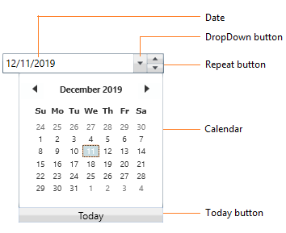
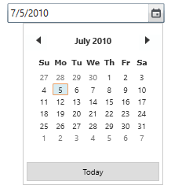
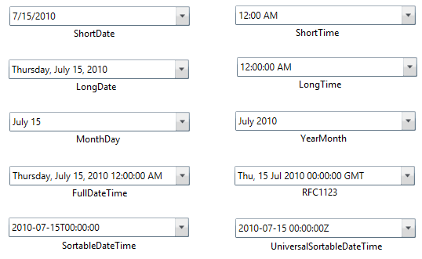
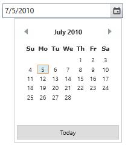

# Getting Started with DateTimeEdit

This section explains how to create a WPF DateTimeEdit and explains about its structure.

## Structure of DateTimeEdit

The various elements of DateTimeEdit are illustrated in the following screenshot.

## Assembly deployment

Refer to the [Control Dependencies](https://help.syncfusion.com/wpf/control-dependencies#datetimeedit) section to get the list of assemblies or NuGet package that needs to be added as a reference to use the control in any application.

Refer to this [documentation](https://help.syncfusion.com/wpf/visual-studio-integration/nuget-packages) to find more details about installing nuget packages in a WPF application.

## Adding WPF DateTimeEdit via designer

1) The DateTimeEdit can be added to an application by dragging it from the toolbox to a designer view. The following dependent assemblies will be added automatically:

* Syncfusion.Shared.WPF

2) Set the properties for DateTimeEdit in design mode using the SmartTag feature.

## Adding WPF DateTimeEdit via XAML

To add the DateTimeEdit manually in XAML, follow these steps:

1) Create a new WPF project in Visual Studio.

2) Add the following required assembly references to the project:

* Syncfusion.Shared.WPF

3) Import Syncfusion WPF schema **http://schemas.syncfusion.com/wpf**, and declare the DateTimeEdit in XAML page.





<Window x:Class="DateTimeEdit_sample.MainWindow"
        xmlns="http://schemas.microsoft.com/winfx/2006/xaml/presentation"
        xmlns:x="http://schemas.microsoft.com/winfx/2006/xaml"
        xmlns:d="http://schemas.microsoft.com/expression/blend/2008"
        xmlns:mc="http://schemas.openxmlformats.org/markup-compatibility/2006"
        xmlns:local="clr-namespace:DateTimeEdit_sample"
        xmlns:syncfusion="http://schemas.syncfusion.com/wpf"
        mc:Ignorable="d"
        Title="MainWindow" Height="450" Width="800">

<Grid Name="grid">
    <syncfusion:DateTimeEdit Name="dateTimeEdit" Height="25" Width="200" />
</Grid>

</Window>





## Adding WPF DateTimeEdit via C#

To add the DateTimeEdit manually in C#, follow these steps:

1) Create a new WPF application via Visual Studio.

2) Add the following required assembly references to the project:

* Syncfusion.Shared.WPF

3) Include the required namespace.





using Syncfusion.Windows.Shared;





4) Create an instance of [DateTimeEdit](https://help.syncfusion.com/cr/wpf/Syncfusion.Shared.Wpf~Syncfusion.Windows.Shared.DateTimeEdit.html), and add it to the window.





// Creating an instance of the DateTimeEdit
Syncfusion.Windows.Shared.DateTimeEdit dateTimeEdit = new Syncfusion.Windows.Shared.DateTimeEdit();

// Setting height and width to DateTimeEdit
dateTimeEdit.Height = 25;
dateTimeEdit.Width = 200;

// Adding control into the main window
grid.Children.Add(dateTimeEdit); 





N> Add **Syncfusion.SfSkinManager.WPF** and **Syncfusion.Themes.Office2016Colorful.WPF** assemblies to get the above DateTimeEdit UI. You can find more details regarding the list of available built-in themes and the assemblies needs to be referred in the following [SfSkinManager](https://help.syncfusion.com/wpf/themes/getting-started) documentation.

## Setting date time value

You can set the date using the [DateTime](https://help.syncfusion.com/cr/wpf/Syncfusion.Shared.Wpf~Syncfusion.Windows.Shared.DateTimeEdit~DateTime.html) property of DateTimeEdit.





<!--Setting date -->
<syncfusion:DateTimeEdit x:Name="dateTimeEdit" Height="25" Width="200" DateTime="07/05/2010" Pattern="LongDate"/>





//Setting date
dateTimeEdit.DateTime = new DateTime(2010, 07, 05);





N> Download demo application from [GitHub](https://github.com/SyncfusionExamples/wpf-date-time-edit-examples/tree/master/Samples/SettingDate)

### Date time value changed 

The DateTimeEdit notifies that the value is changed through the [DateTimeChanged](https://help.syncfusion.com/cr/wpf/Syncfusion.Shared.Wpf~Syncfusion.Windows.Shared.DateTimeEdit~DateTimeChanged_EV.html) event. You can use the **OldValue** and **NewValue** properties to get the old and new date time value in the **DateTimeChanged** event.





dateTimeEdit.DateTimeChanged += DateTimeEdit_DateTimeChanged;

private void DateTimeEdit_DateTimeChanged(DependencyObject d, DependencyPropertyChangedEventArgs e)
{
    Console.WriteLine("DateTimeChanged event is fired");     
}





## Date time format

You can define the format to display the date value in the DateTimeEdit using its [DateTimeFormat](https://help.syncfusion.com/cr/wpf/Syncfusion.Shared.Wpf~Syncfusion.Windows.Shared.DateTimeBase~DateTimeFormat.html) property.





<Window xmlns="http://schemas.microsoft.com/winfx/2006/xaml/presentation"
        xmlns:x="http://schemas.microsoft.com/winfx/2006/xaml"
        xmlns:d="http://schemas.microsoft.com/expression/blend/2008"
        xmlns:mc="http://schemas.openxmlformats.org/markup-compatibility/2006"
        xmlns:local="clr-namespace:DateTimeEdit_sample"
        xmlns:syncfusion="http://schemas.syncfusion.com/wpf"
        xmlns:global="clr-namespace:System.Globalization;assembly=mscorlib"
        x:Class="DateTimeEdit_sample.MainWindow"
        mc:Ignorable="d"
        Title="MainWindow" Height="323" Width="384">
    <Grid>
        <syncfusion:DateTimeEdit x:Name="dateTimeEdit" Height="25" Width="200" DateTime="07/15/2010" Pattern="ShortDate">
            <syncfusion:DateTimeEdit.DateTimeFormat>
                <global:DateTimeFormatInfo ShortDatePattern="MM/dd/yy hh:mm:ss"/>
            </syncfusion:DateTimeEdit.DateTimeFormat>
        </syncfusion:DateTimeEdit>
    </Grid>
</Window>





Syncfusion.Windows.Shared.DateTimeEdit dateTimeEdit = new Syncfusion.Windows.Shared.DateTimeEdit();
dateTimeEdit.Width = 200;
dateTimeEdit.Height = 25;
dateTimeEdit.DateTime = new DateTime(2010, 07, 05);
dateTimeEdit.Pattern = DateTimePattern.ShortDate;
dateTimeEdit.DateTimeFormat = new DateTimeFormatInfo()
{
	ShortDatePattern = "MM/dd/yy hh:mm:ss"
};





## Date time pattern

You can change the date-time pattern using the [Pattern](https://help.syncfusion.com/cr/wpf/Syncfusion.Shared.Wpf~Syncfusion.Windows.Shared.DateTimeBase~Pattern.html) property of the DateTimeEdit. The DateTimeEdit control supports the following DateTime format:

* LongDate
* LongTime
* ShortDate
* ShortTime
* FullDateTime
* MonthDay
* CustomPattern
* ShortableDateTime
* UniversalShortableDateTime
* RFC1123
* YearMonth 





<!--Setting ShortDate Pattern-->
<syncfusion:DateTimeEdit x:Name="dateTimeEdit" Height="25" Width="200" DateTime="07/15/2010" Pattern="ShortDate"/>





//Setting predefined ShortDate pattern
dateTimeEdit.Pattern = DateTimePattern.ShortDate;





## Editing date time

The date-time value in the DateTimeEdit can be edited by two ways as follows.

* Default Editing
* Mask Editing

Editing modes can be changed using the [CanEdit](https://help.syncfusion.com/cr/cref_files/wpf/Syncfusion.Shared.Wpf~Syncfusion.Windows.Shared.DateTimeBase~CanEdit.html) property of DateTimeEdit. The following code example demonstrates how to type and select date values in the empty DateTimeEdit text box by setting the **CanEdit** property as true.





<syncfusion:DateTimeEdit Name="dateTimeEdit" Pattern="ShortDate" Height="25" Width="200" IsEmptyDateEnabled="True" CanEdit="True">
</syncfusion:DateTimeEdit>





//Setting predefined ShortDate pattern
dateTimeEdit.CanEdit = true;





## Restrict date range

You can define the start and end dates by setting the [MinDateTime](https://help.syncfusion.com/cr/wpf/Syncfusion.Shared.Wpf~Syncfusion.Windows.Shared.DateTimeEdit~MinDateTime.html) and [MaxDateTime](https://help.syncfusion.com/cr/wpf/Syncfusion.Shared.Wpf~Syncfusion.Windows.Shared.DateTimeEdit~MaxDateTime.html) properties of the DateTimeEdit.





<!--Setting date range -->
<syncfusion:DateTimeEdit x:Name="dateTimeEdit" Height="25" Width="200" DateTime="07/05/2010" MinDateTime="07/01/2010" MaxDateTime="07/28/2010" Pattern="LongDate"/>





//Setting date range
dateTimeEdit.MinDateTime = new DateTime(2010, 07, 01);
dateTimeEdit.MaxDateTime = new DateTime(2010, 07, 28);





## Watermark for null value

You can set watermark to the content using the [NoneDateText](https://help.syncfusion.com/cr/cref_files/wpf/Syncfusion.Shared.Wpf~Syncfusion.Windows.Shared.DateTimeBase~NoneDateText.html) property of DateTimeEdit when its value is null.





<!--Setting ShortDate Pattern-->
<syncfusion:DateTimeEdit x:Name="dateTimeEdit" CanEdit="True" Height="25" Width="200" NoneDateText="No date is selected" IsEmptyDateEnabled="True" NullValue="{x:Null}"/>





dateTimeEdit.NullValue = null;
dateTimeEdit.IsEmptyDateEnabled = true;
dateTimeEdit.NoneDateText = "No date is selected";





