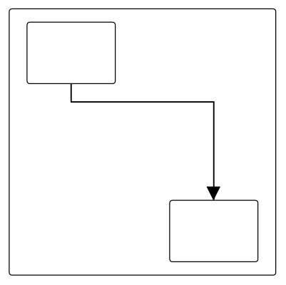
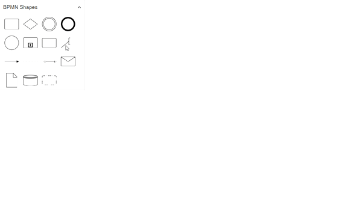
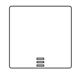
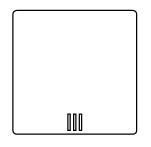
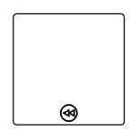
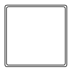

# BPMN ExpandedSubProcess and its customization

A ExpandedSubProcess is used to frame a part of the diagram, shows that elements included in it are logically belong together and does not have any other semantics other than organizing elements. 

ExpandedSubProcess is the extended version of Group.

## Create BPMN ExpandedSubProcess

To create a ExpandedSubProcess, you have to define the BpmnGroupViewModel object and enable the [IsExpandedSubProcess](https://help.syncfusion.com/cr/wpf/Syncfusion.UI.Xaml.Diagram.BpmnGroupViewModel.html#Syncfusion_UI_Xaml_Diagram_BpmnGroupViewModel_IsExpandedSubProcess) property and add that to groups collection of the Diagram .

The following code example explains how to create a BPMN group.



 <!--Initialize the SfDiagram-->
<syncfusion:SfDiagram x:Name="Diagram">
   <syncfusion:SfDiagram.Nodes>
     <syncfusion:NodeCollection/>
   </syncfusion:SfDiagram.Nodes>
   <syncfusion:SfDiagram.Connectors>
      <syncfusion:ConnectorCollection/>
   </syncfusion:SfDiagram.Connectors>
   <syncfusion:SfDiagram.Groups>
    <!--Initialize the Group Collection-->
    <syncfusion:GroupCollection>
    <!--Initialize the BpmnGroupViewModel-->
      <syncfusion:BpmnGroupViewModel OffsetX="300" OffsetY="300" UnitHeight="300" UnitWidth="250" IsExpandedSubProcess="True"></syncfusion:BpmnGroupViewModel>
     </syncfusion:GroupCollection>
    </syncfusion:SfDiagram.Groups>
</syncfusion:SfDiagram>




//Initialize the diagram
SfDiagram diagram = new SfDiagram();

 //Initialize the BpmnGroupViewModel
BpmnGroupViewModel group = new BpmnGroupViewModel()
{
  OffsetX = 300,
  OffsetY = 300,
  UnitWidth = 300,
  UnitHeight = 250,
  IsExpandedSubProcess = true
 };
 // Add the group into Group's collection
(Diagram.Groups as GroupCollection).Add(group);




## Add BPMNNode into BPMNGroup

To add a [BpmnNodeViewModel](https://help.syncfusion.com/cr/wpf/Syncfusion.UI.Xaml.Diagram.BpmnNodeViewModel.html) into BPMNGroup, you have to define the BpmnNodeViewModel object and add that to nodes collection of the BPMNGroup.

The following code example explains how to create a BPMN group.



 <!--Initialize the SfDiagram-->
<syncfusion:SfDiagram x:Name="Diagram">
  <syncfusion:SfDiagram.Nodes>
     <syncfusion:NodeCollection/>
   </syncfusion:SfDiagram.Nodes>
   <syncfusion:SfDiagram.Connectors>
      <syncfusion:ConnectorCollection/>
   </syncfusion:SfDiagram.Connectors>
   <syncfusion:SfDiagram.Groups>
    <!--Initialize the Group Collection-->
    <syncfusion:GroupCollection>
    <!--Initialize the BpmnGroupViewModel-->
       <syncfusion:BpmnGroupViewModel OffsetX="300" OffsetY="300" UnitHeight="300" UnitWidth="300" IsExpandedSubProcess="True" >
       <syncfusion:BpmnGroupViewModel.Nodes>
         <syncfusion:NodeCollection>
           <syncfusion:BpmnNodeViewModel ID="node1" OffsetX="220" OffsetY="200" UnitHeight="70" UnitWidth="100"></syncfusion:BpmnNodeViewModel>
           <syncfusion:BpmnNodeViewModel ID="node2" OffsetX="380" OffsetY="400" UnitHeight="70" UnitWidth="100"></syncfusion:BpmnNodeViewModel>
         </syncfusion:NodeCollection>
        </syncfusion:BpmnGroupViewModel.Nodes>
        <syncfusion:BpmnGroupViewModel.Connectors>
          <syncfusion:ConnectorCollection>
           <syncfusion:BpmnFlowViewModel SourceNodeID="node1" TargetNodeID="node2"></syncfusion:BpmnFlowViewModel>
          </syncfusion:ConnectorCollection>
        </syncfusion:BpmnGroupViewModel.Connectors>
        </syncfusion:BpmnGroupViewModel>
     </syncfusion:GroupCollection>
    </syncfusion:SfDiagram.Groups>
</syncfusion:SfDiagram>




//Initialize the diagram
SfDiagram diagram = new SfDiagram();

 //Initialize the BpmnGroupViewModel
BpmnGroupViewModel group = new BpmnGroupViewModel()
{
  OffsetX = 300,
  OffsetY = 300,
  UnitWidth = 300,
  UnitHeight = 300,
  IsExpandedSubProcess = true
 };
 //Initialize the BpmnNodeViewModel
 BpmnNodeViewModel node1 = new BpmnNodeViewModel()
 {
    OffsetX = 220,
    OffsetY = 200,
    UnitWidth = 100,
    UnitHeight = 70,
    Type = BpmnShapeType.Activity,
 };
 //Initialize the BpmnNodeViewModel
 BpmnNodeViewModel node2 = new BpmnNodeViewModel()
 {
    OffsetX = 380,
    OffsetY = 400,
    UnitWidth = 100,
    UnitHeight = 70,
    Type = BpmnShapeType.Activity,
 };
 //Initialize the BpmnFlowViewModel
 BpmnFlowViewModel flow = new BpmnFlowViewModel()
 {
    SourceNode = node1,
    TargetNode = node2,
 };
 // Add the node into Node's collection
(group.Nodes as NodeCollection).Add(node1);
// Add the node into Node's collection
(group.Nodes as NodeCollection).Add(node2);
// Add the connector into Connector's collection
(group.Connectors as ConnectorCollection).Add(flow);
 // Add the group into Group's collection
(Diagram.Groups as GroupCollection).Add(group);




## Add ExpandedSubProcess from stencil

ExpandedSubProcess can be predefined and added to the stencil and can be dropped into the Diagram when needed. For more information about adding Nodes from Stencil, refer to the [Stencil](/wpf/sfdiagram/stencil "Stencil") and [BPMN-Shapes-Palette](/wpf/sfdiagram/BPMN-Shapes/BPMN-Shapes-Palette "BPMN-Shapes-Palette").

## Add BPMNNode into BPMN ExpandedSubProcess at runtime
we can add BPMNNode into BPMN ExpandedSubProcess at runtime by drag and drop the BPMNNode from stencil to BPMN ExpandedSubProcess and drag and drop the BPMNNode from diagram to BPMN ExpandedSubProcess.

 * While resize/drag the child Node, if the child node bounds with in the ExpandedSubProcess bounds, the ExpandedSubProcess size will be updated along with that.

 The following image shows how to add BPMNNode into BPMN ExpandedSubProcess at runtime.

## BPMN activity sub process

A Sub-process is a group of tasks that is used to hide or reveal details of additional levels.

### Loop

[`LoopActivity`](https://help.syncfusion.com/cr/wpf/Syncfusion.UI.Xaml.Diagram.BpmnGroupViewModel.html#Syncfusion_UI_Xaml_Diagram_BpmnGroupViewModel_LoopActivity) is a task that is internally being looped. The loop property of task allows you to define the type of loop. The default value for `LoopActivity` is **None**.
You can define the loop property in subprocess BPMN shape as shown in the following code.



 <!--Initialize the SfDiagram-->
<syncfusion:SfDiagram x:Name="Diagram">
   <syncfusion:SfDiagram.Nodes>
     <syncfusion:NodeCollection/>
   </syncfusion:SfDiagram.Nodes>
   <syncfusion:SfDiagram.Connectors>
      <syncfusion:ConnectorCollection/>
   </syncfusion:SfDiagram.Connectors>
   <syncfusion:SfDiagram.Groups>
    <!--Initialize the Group Collection-->
    <syncfusion:GroupCollection>
    <!--Initialize the BpmnGroupViewModel-->
      <syncfusion:BpmnGroupViewModel OffsetX="300" OffsetY="300" UnitHeight="300" UnitWidth="250" IsExpandedSubProcess="True" LoopActivity="Standard"></syncfusion:BpmnGroupViewModel>
     </syncfusion:GroupCollection>
    </syncfusion:SfDiagram.Groups>
</syncfusion:SfDiagram>




//Initialize the diagram
SfDiagram diagram = new SfDiagram();

 //Initialize the BpmnGroupViewModel
BpmnGroupViewModel group = new BpmnGroupViewModel()
{
  OffsetX = 300,
  OffsetY = 300,
  UnitWidth = 300,
  UnitHeight = 250,
  IsExpandedSubProcess = true,
  LoopActivity = LoopCharacteristic.Standard
 };
 // Add the group into Group's collection
(Diagram.Groups as GroupCollection).Add(group);




The following table contains various types of BPMN loops.

| Loops | Task |
| -------- | -------- |
| None |   | 
| Standard |   | 
| SequenceMultiInstance |  |  
| ParallelMultiInstance |  |

### Compensation

Compensation is triggered when the operation is partially failed and enabled it with the compensation property of the task and the subprocess. To create a Compensation, you have to enable the [IsCompensationActivity](https://help.syncfusion.com/cr/wpf/Syncfusion.UI.Xaml.Diagram.BpmnGroupViewModel.html#Syncfusion_UI_Xaml_Diagram_BpmnGroupViewModel_IsCompensationActivity) property of the BPMNGroupViewModel.

>Note: By default, IsCompensationActivity property is false.



 <!--Initialize the SfDiagram-->
<syncfusion:SfDiagram x:Name="Diagram">
   <syncfusion:SfDiagram.Nodes>
     <syncfusion:NodeCollection/>
   </syncfusion:SfDiagram.Nodes>
   <syncfusion:SfDiagram.Connectors>
      <syncfusion:ConnectorCollection/>
   </syncfusion:SfDiagram.Connectors>
   <syncfusion:SfDiagram.Groups>
    <!--Initialize the Group Collection-->
    <syncfusion:GroupCollection>
    <!--Initialize the BpmnGroupViewModel-->
      <syncfusion:BpmnGroupViewModel OffsetX="300" OffsetY="300" UnitHeight="300" UnitWidth="250" IsExpandedSubProcess="True" IsCompensationActivity="True"></syncfusion:BpmnGroupViewModel>
     </syncfusion:GroupCollection>
    </syncfusion:SfDiagram.Groups>
</syncfusion:SfDiagram>




//Initialize the diagram
SfDiagram diagram = new SfDiagram();

 //Initialize the BpmnGroupViewModel
BpmnGroupViewModel group = new BpmnGroupViewModel()
{
  OffsetX = 300,
  OffsetY = 300,
  UnitWidth = 300,
  UnitHeight = 250,
  IsExpandedSubProcess = true,
  IsCompensationActivity = true
 };
 // Add the group into Group's collection
(Diagram.Groups as GroupCollection).Add(group);




### Ad-Hoc

An ad-hoc subprocess is a group of tasks that are executed in any order or skipped in order to fulfill the end condition and set it with the [`IsAdhocActivity`](https://help.syncfusion.com/cr/wpf/Syncfusion.UI.Xaml.Diagram.BpmnGroupViewModel.html#Syncfusion_UI_Xaml_Diagram_BpmnGroupViewModel_IsAdhocActivity) property of subprocess.

>Note: By default, IsAdhocActivity property is false.



 <!--Initialize the SfDiagram-->
<syncfusion:SfDiagram x:Name="Diagram">
   <syncfusion:SfDiagram.Nodes>
     <syncfusion:NodeCollection/>
   </syncfusion:SfDiagram.Nodes>
   <syncfusion:SfDiagram.Connectors>
      <syncfusion:ConnectorCollection/>
   </syncfusion:SfDiagram.Connectors>
   <syncfusion:SfDiagram.Groups>
    <!--Initialize the Group Collection-->
    <syncfusion:GroupCollection>
    <!--Initialize the BpmnGroupViewModel-->
      <syncfusion:BpmnGroupViewModel OffsetX="300" OffsetY="300" UnitHeight="300" UnitWidth="250" IsExpandedSubProcess="True" IsAdhocActivity="True"></syncfusion:BpmnGroupViewModel>
     </syncfusion:GroupCollection>
    </syncfusion:SfDiagram.Groups>
</syncfusion:SfDiagram>




//Initialize the diagram
SfDiagram diagram = new SfDiagram();

 //Initialize the BpmnGroupViewModel
BpmnGroupViewModel group = new BpmnGroupViewModel()
{
  OffsetX = 300,
  OffsetY = 300,
  UnitWidth = 300,
  UnitHeight = 250,
  IsExpandedSubProcess = true,
  IsAdhocActivity = true
 };
 // Add the group into Group's collection
(Diagram.Groups as GroupCollection).Add(group);




### SubProcessType

SubProcessType represents the type of task that is being processed. The [`SubProcessType`](https://help.syncfusion.com/cr/wpf/Syncfusion.UI.Xaml.Diagram.BpmnGroupViewModel.html#Syncfusion_UI_Xaml_Diagram_BpmnGroupViewModel_SubProcessType) property of subprocess allows you to define the type of boundary. By default, it is set to **Default**.



 <!--Initialize the SfDiagram-->
<syncfusion:SfDiagram x:Name="Diagram">
   <syncfusion:SfDiagram.Nodes>
     <syncfusion:NodeCollection/>
   </syncfusion:SfDiagram.Nodes>
   <syncfusion:SfDiagram.Connectors>
      <syncfusion:ConnectorCollection/>
   </syncfusion:SfDiagram.Connectors>
   <syncfusion:SfDiagram.Groups>
    <!--Initialize the Group Collection-->
    <syncfusion:GroupCollection>
    <!--Initialize the BpmnGroupViewModel-->
      <syncfusion:BpmnGroupViewModel OffsetX="300" OffsetY="300" UnitHeight="300" UnitWidth="250" IsExpandedSubProcess="True" SubProcessType="Event"></syncfusion:BpmnGroupViewModel>
     </syncfusion:GroupCollection>
    </syncfusion:SfDiagram.Groups>
</syncfusion:SfDiagram>




//Initialize the diagram
SfDiagram diagram = new SfDiagram();

 //Initialize the BpmnGroupViewModel
BpmnGroupViewModel group = new BpmnGroupViewModel()
{
  OffsetX = 300,
  OffsetY = 300,
  UnitWidth = 300,
  UnitHeight = 250,
  IsExpandedSubProcess = true,
  SubProcessType = SubProcessType.Event
 };
 // Add the group into Group's collection
(Diagram.Groups as GroupCollection).Add(group);




The following table contains various types of BPMN boundaries.

| SubProcessType | Image |
| -------- | -------- |
| Call |  |
| Event |  |
| Default |  |
| Transaction |  |