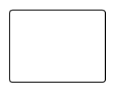
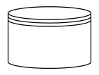
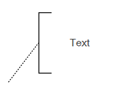
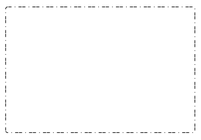
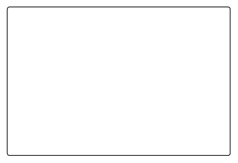

# BPMN Shapes and its customization

BPMN(Business Process Model and Notation) shapes are used to represent the internal business procedure in a graphical notation and enable you to communicate the procedures in a standard manner. To create a [BpmnNodeViewModel](https://help.syncfusion.com/cr/wpf/Syncfusion.UI.Xaml.Diagram.BpmnNodeViewModel.html) shape,in the [Type](https://help.syncfusion.com/cr/wpf/Syncfusion.UI.Xaml.Diagram.BpmnNodeViewModel.html#Syncfusion_UI_Xaml_Diagram_BpmnNodeViewModel_Type) property, type should be set to “Activity” and its shape should be set as any one of the built-in shapes.

The following code example explains how to create a simple business process.



<!--Initialize the SfDiagram-->
<syncfusion:SfDiagram x:Name="diagram">
    <!--Initialize the Node-->
    <syncfusion:SfDiagram.Nodes>
        <!--Initialize the Node Collection-->
        <syncfusion:NodeCollection>
            <!--Initialize the BpmnNodeViewModel-->
            <syncfusion:BpmnNodeViewModel UnitHeight="70" UnitWidth="100" OffsetX="100" OffsetY="100" Type="Activity">
            </syncfusion:BpmnNodeViewModel>
        </syncfusion:NodeCollection>
    </syncfusion:SfDiagram.Nodes>
</syncfusion:SfDiagram>




//Initialize the diagram
SfDiagram diagram = new SfDiagram();

//Initialize the BpmnNodeViewModel
BpmnNodeViewModel node = new BpmnNodeViewModel()
{
  OffsetX = 100,
  OffsetY = 100,
  UnitHeight = 70,
  UnitWidth = 100,
  Type = BpmnShapeType.Activity,
};

// Add the node into Node's collection
(Diagram.Nodes as NodeCollection).Add(node);




>Note : The default value for the property [`Type`](https://help.syncfusion.com/cr/wpf/Syncfusion.UI.Xaml.Diagram.BpmnNodeViewModel.html#Syncfusion_UI_Xaml_Diagram_BpmnNodeViewModel_Type) is BpmnShapeType.Activity.

The list of BPMN shapes are as follows:

| Shape | Image |
| -------- | -------- |
| Event |  |
| Gateway |  |
| Task |  |
| Message |  |
| DataSource |  |
| DataObject |  |
| TextAnnotation |  |
| Group |  |
| Expandedsubprocess |  |
| Sequenceflow |  |
| DefaultSequenceflow |  |
| ConditionalSequenceflow |  |
| Association |  |
| DirectionalAssociation |  |
| BiDirectionalAssociation |  |
| MessageFlow |  |
| InitiatingMessageflow |  |
| NonInitiatingMessageflow |  |

Please find the BPMN Editor sample as follows.

[View BPMN Editor sample in GitHub](https://github.com/SyncfusionExamples/WPF-Diagram-Examples/tree/master/Samples/BPMNEditor/Sample)