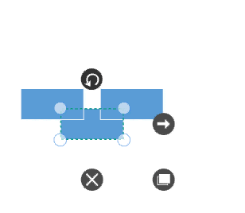

# Z – Order in WPF Diagram(SfDiagram)

Z – Order commands are used to visually arrange the selected objects such as Nodes and Connectors on the diagram page with its Z-order values.

## BringToFront

The BringToFront command is used to visually brings the selected element to the front over all other overlapped elements. 




IGraphInfo graphinfo = diagramcontrol.Info as IGraphInfo;

//Brings to front
graphinfo.Commands.BringToFront.Execute(null);




## SendToBack

The SendToBack command visually moves the selected elements behind all the other overlapped elements. 




IGraphInfo graphinfo = diagramcontrol.Info as IGraphInfo;

// Send To Back
graphinfo.Commands.SendToBack.Execute(null);




## SendBackward

The SendBackward command visually moves the selected elements behind the underlying element.




IGraphInfo graphinfo = diagramcontrol.Info as IGraphInfo;

// Send To Backward
graphinfo.Commands.SendBackward.Execute(null);




## BringForward

The BringForward command visually moves the selected element over the nearest overlapping element.




IGraphInfo graphinfo = diagramcontrol.Info as IGraphInfo;

// Brings To Forward
graphinfo.Commands.BringForward.Execute(null);




Please find the [Z-Order sample](https://github.com/SyncfusionExamples/WPF-Diagram-Examples/tree/master/Samples/Commands/Z-Order%20Commands) to depict these commands.