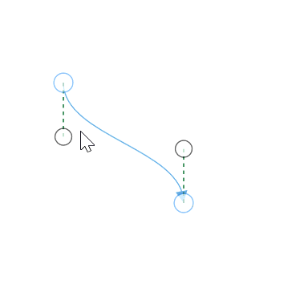

# Cubic Curve Segments

Cubic curve segments are used to create curve segments and the curves are configurable with end control points.

## how to create cubic curve segments

To create a Curve line, you should specify the segment as `CubicCurveSegment`.



<!--Initialize the Sfdiagram-->
<syncfusion:SfDiagram x:Name="diagram">
    <syncfusion:SfDiagram.Connectors>
        <!--Initialize the Connector Collection-->
        <syncfusion:ConnectorCollection>
            <!--create the connector with cubic curve segments-->
            <syncfusion:ConnectorViewModel SourcePoint="900,100" TargetPoint="1000,200">
                <syncfusion:ConnectorViewModel.Segments>
                    <syncfusion:ConnectorSegments>
                        <!--Specify the segment as cubic curve segment-->
                        <syncfusion:CubicCurveSegment/>
                    </syncfusion:ConnectorSegments>
                </syncfusion:ConnectorViewModel.Segments>
            </syncfusion:ConnectorViewModel>
        </syncfusion:ConnectorCollection>
    </syncfusion:SfDiagram.Connectors>
</syncfusion:SfDiagram>



//Initialize the SfDiagram
SfDiagram diagram = new SfDiagram();
//create the connector with cubic bezier segments
ConnectorViewModel cubicBezierConnector = new ConnectorViewModel()
{
    SourcePoint = new Point(900, 100),
    TargetPoint = new Point(1000, 200),
    Segments = new ObservableCollection<IConnectorSegment>()
    {
        //Specify the segment as cubic curve segment
        new CubicCurveSegment()
    }
};

//Adding connector into Collection
(diagram.Connectors as ConnectorCollection).Add(cubicBezierConnector);




## How to edit the cubic bezier segments

Cubic bezier segments are annotated with thumbs to represent the control points. Control points of the curve can be configured by clicking and dragging the control point thumbs which are consisting of dashed lines from source point and target point.

## How to add multiple cubic bezier segments

'n' number of cubic bezier segments can be added into single connector by using `Point1`, `Point2` and `Point3` properties of `CubicCurveSegment` class. 

*   Point1: Specifies the left side control point of the segment.
*   Point2: Specifies the right side control point of the segment.
*   Point3: Specifies the end point point of the current cubic bezier segment and starting point to the next cubic bezier segment.




<!--create the connector with cubic curve segments with points-->
<syncfusion:ConnectorViewModel SourcePoint="100,100" TargetPoint="300,300">
    <syncfusion:ConnectorViewModel.Segments>
        <syncfusion:ConnectorSegments>
            <syncfusion:CubicCurveSegment Point1="50,150" Point2="260,150" Point3="200,200"/>
            <syncfusion:CubicCurveSegment Point1="100,250" Point2="350,260" />
        </syncfusion:ConnectorSegments>
    </syncfusion:ConnectorViewModel.Segments>
</syncfusion:ConnectorViewModel>
                 




//create the connector with cubic bezier segments
ConnectorViewModel cubicBezierConnector = new ConnectorViewModel()
{
    SourcePoint = new Point(100, 100),
    TargetPoint = new Point(300, 300),
    Segments = new ObservableCollection<IConnectorSegment>()
    {
        //Specify the segment as cubic curve segment
        new CubicCurveSegment()
        {
            //Specifies the left side control point
            Point1 = new Point(50,150),
            //Specifies the right side control point
            Point2 = new Point(260,150),
            //Specifies the ending point of the segment
            Point3 = new Point(200,200),
        },
        new CubicCurveSegment()
        {
            Point1 = new Point(100,250),
            Point2 = new Point(350,260),
        }
    }
};




 &ensp;&ensp;&ensp;&ensp; 

