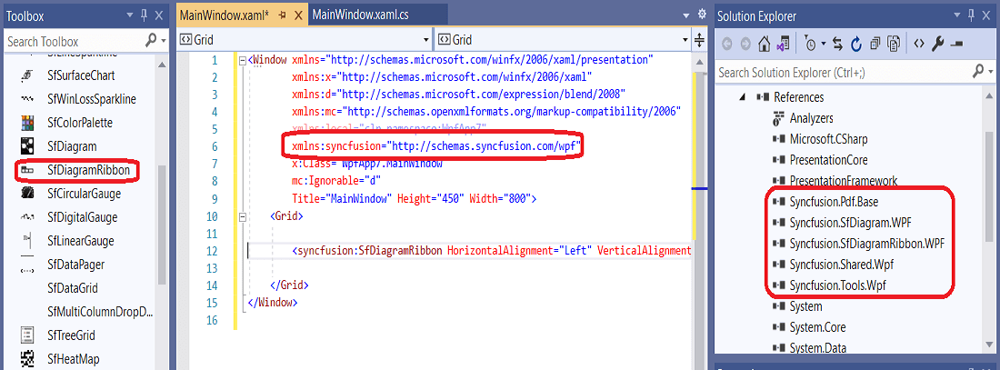
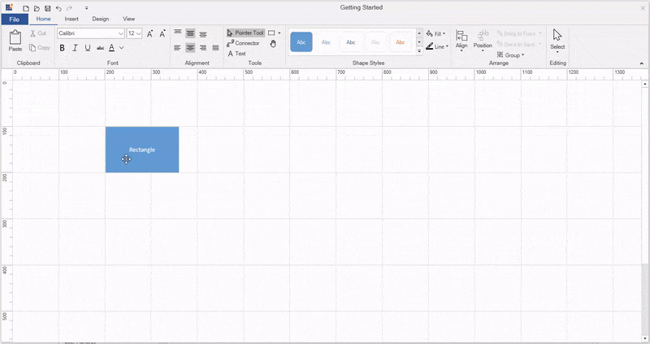

# WPF Diagram Ribbon (SfDiagramRibbon) in WPF Diagram (SfDiagram)

Diagram Ribbon Control is a user interface that hosts a Quick Access Toolbar, Application Menu, and Tabs to provide the most common features and settings for WPF Diagram. The Diagram Ribbon Control contains UI elements that allow end-users to load and save diagrams, add diagram items to the canvas, format text within the diagram items, rearrange and recolor shapes, change the canvas size and orientation, and perform copy/paste operations.

The table below lists actions end-users can perform using the Diagram Ribbon.

| Ribbon Tab | Ribbon Bar | Actions |
|---|---|---|
| Home | Clipboard | Cut, Copy, and Paste operations. |
|  | Font | Change the font settings of the selected shape. |
|  | Alignment | Realign the text within the selected shape. |
|  | Tools | Select a tool. |
|  | Shape Styles | Change the background and border colors for the currently selected shape using a palette of predefined patterns or by selecting the colors individually using color pickers. |
|  | Arrange | Change the position/alignment of the selected shapes and move the selected shapes in and out in the Z-order. |
|  | Select | Select all the diagram items or by specific type. |
| Insert | Diagram Parts | Allows you to add an image item or connection line to the canvas. |
| Design | Page Setup | Toggle between portrait and landscape page orientation, set the page size. |
|  | Background | Apply a background style to the page. |
|  | Connectors | Change the appearance of the connection lines in the canvas. |
| View | Show | Toggle the visibility of the Zoom Pan window, Rulers, Gridlines, and Page Breaks. |
|  | Zoom | Zoom the diagram so that the entire page either fits the window or is as wide as the window. |

## Assembly Deployment

Refer to the [control dependencies](https://help.syncfusion.com/wpf/control-dependencies#diagram-ribbon) section to get the list of assemblies or NuGet package that needs to be added as a reference to use the control in any application.

You can find more details about installing the NuGet package in a WPF application in the following link:
[How to install nuget packages](https://help.syncfusion.com/wpf/visual-studio-integration/nuget-packages)

## Adding Diagram Ribbon

The following section helps you to add SfDiagramRibbon in your application with SfDiagram.

SfDiagramRibbon control can be added to the application by dragging it from Toolbox and dropping it in Designer view. The required assembly references will be added automatically.

Steps to add Diagram Ribbon control manually is given below with its code example.

1. Add the following required assembly reference to the project `Syncfusion.SfDiagramRibbon.WPF`.

2. Import Syncfusion WPF schema `http://schemas.syncfusion.com/wpf` or SfDiagramRibbon control namespace `Syncfusion.UI.Xaml.DiagramRibbon` in your application.

3. Declare SfDiagramRibbon control in your application.





<Window xmlns="http://schemas.microsoft.com/winfx/2006/xaml/presentation"
        xmlns:x="http://schemas.microsoft.com/winfx/2006/xaml"
        xmlns:d="http://schemas.microsoft.com/expression/blend/2008"
        xmlns:mc="http://schemas.openxmlformats.org/markup-compatibility/2006"
        xmlns:local="clr-namespace:SfDiagram_WPF"
        xmlns:syncfusion="http://schemas.syncfusion.com/wpf"
        x:Class="SfDiagram_WPF.MainWindow"
        mc:Ignorable="d" Title="MainWindow" Height="350" Width="525">
    <Grid>
        <Grid.RowDefinitions>
            <RowDefinition Height="Auto"/>
            <RowDefinition Height="*"/>
        </Grid.RowDefinitions>        
        <syncfusion:SfDiagramRibbon DataContext="{Binding ElementName=Diagram}" Grid.Row="0"/>
        <syncfusion:SfDiagram x:Name="Diagram" Grid.Row="1">
            <syncfusion:SfDiagram.Theme>
                <syncfusion:OfficeTheme/>
            </syncfusion:SfDiagram.Theme>
            <syncfusion:SfDiagram.Nodes>
                <syncfusion:NodeCollection/>
            </syncfusion:SfDiagram.Nodes>
            <syncfusion:SfDiagram.Connectors>
                <syncfusion:ConnectorCollection/>
            </syncfusion:SfDiagram.Connectors>            
        </syncfusion:SfDiagram>
    </Grid>
</Window>





using Syncfusion.UI.Xaml.Diagram;
using Syncfusion.UI.Xaml.Diagram.Theming;
using Syncfusion.UI.Xaml.DiagramRibbon;

namespace SfDiagram_WPF
{   
    public partial class MainWindow : Window
    {
        public MainWindow()
        {
            InitializeComponent();

            // Initialize, Arrange and Add Diagram and Diagram Ribbon in the Application
            
            SfDiagram Sfdiagram = new SfDiagram() { Theme = new OfficeTheme(), Nodes = new NodeCollection(), Connectors = new ConnectorCollection() };
            SfDiagramRibbon sfDiagramRibbon = new SfDiagramRibbon() { DataContext = Sfdiagram };

            Sfdiagram.SetValue(Grid.RowProperty, 1);
            sfDiagramRibbon.SetValue(Grid.RowProperty, 0);

            Root_Grid.Children.Add(Sfdiagram);
            Root_Grid.Children.Add(sfDiagramRibbon);
        }
    }
}





## Simple Diagram Designer

This section describes how to build a simple Diagram Designer application with Diagram Ribbon, and Diagram Controls.

N> You have to set the Diagram as DataContext for the Diagram Ribbon control, which will help the users to interact with the Diagram by using Diagram Ribbon control.





    <Grid>
        <Grid.RowDefinitions>
            <RowDefinition Height="Auto"/>
            <RowDefinition Height="*"/>
        </Grid.RowDefinitions>

        <syncfusion:SfDiagramRibbon x:Name="DiagramRibbon" Grid.Row="0" DataContext="{Binding ElementName=Diagram}"/>
        <syncfusion:SfDiagram x:Name="Diagram" Grid.Row="1" Constraints="Undoable,Default">
            <syncfusion:SfDiagram.Theme>
                <syncfusion:OfficeTheme/>                
            </syncfusion:SfDiagram.Theme>
            <syncfusion:SfDiagram.Nodes>
                <syncfusion:NodeCollection/>
            </syncfusion:SfDiagram.Nodes>
            <syncfusion:SfDiagram.Connectors>
                <syncfusion:ConnectorCollection/>
            </syncfusion:SfDiagram.Connectors>
            <syncfusion:SfDiagram.Groups>
                <syncfusion:GroupCollection/>
            </syncfusion:SfDiagram.Groups>
            <syncfusion:SfDiagram.SnapSettings>
                <syncfusion:SnapSettings SnapConstraints="All"/>
            </syncfusion:SfDiagram.SnapSettings>
            <syncfusion:SfDiagram.HorizontalRuler>
                <syncfusion:Ruler Orientation="Horizontal"/>
            </syncfusion:SfDiagram.HorizontalRuler>
            <syncfusion:SfDiagram.VerticalRuler>
                <syncfusion:Ruler Orientation="Vertical"/>
            </syncfusion:SfDiagram.VerticalRuler>
        </syncfusion:SfDiagram>

    </Grid>





            SfSkinManager.SetTheme(this, new Syncfusion.SfSkinManager.Theme() { ThemeName = "Office2019Colorful" });

            // Initialize, Arrange and Add Diagram and Diagram Ribbon in the Application

            SfDiagram Sfdiagram = new SfDiagram()
            {
                Theme = new OfficeTheme(),
                Nodes = new NodeCollection(),
                Connectors = new ConnectorCollection(),
                Groups = new GroupCollection(),
                Constraints = GraphConstraints.Default | GraphConstraints.Undoable,
                SnapSettings = new SnapSettings() { SnapConstraints = SnapConstraints.All },
                HorizontalRuler = new Syncfusion.UI.Xaml.Diagram.Controls.Ruler() { Orientation = Orientation.Horizontal },
                VerticalRuler = new Syncfusion.UI.Xaml.Diagram.Controls.Ruler() { Orientation = Orientation.Vertical },
            };

            SfDiagramRibbon sfDiagramRibbon = new SfDiagramRibbon() { DataContext = Sfdiagram };

            Sfdiagram.SetValue(Grid.RowProperty, 1);
            sfDiagramRibbon.SetValue(Grid.RowProperty, 0);

            Root_Grid.Children.Add(Sfdiagram);
            Root_Grid.Children.Add(sfDiagramRibbon);





[View sample in GitHub](https://github.com/SyncfusionExamples/WPF-Diagram-Examples/tree/master/Samples/Diagram%20Ribbon)

## Ribbon Customization

Ribbon Customization can be done in two ways.

### Using Control Template

User can customize the ribbon items by overriding the template of the [SfDiagramRibbon](https://help.syncfusion.com/cr/wpf/Syncfusion.UI.Xaml.DiagramRibbon.SfDiagramRibbon.html).

### Using Tabs property in Events

By invoking SfDiagramRibbon Loaded Event, User can add/delete the ribbon tabs, and ribbon items with the help of [Tabs Property](https://help.syncfusion.com/cr/wpf/Syncfusion.UI.Xaml.DiagramRibbon.SfDiagramRibbon.html#Syncfusion_UI_Xaml_DiagramRibbon_SfDiagramRibbon_Tabs) in the `SfDiagramRibbon`.

#### Adding RibbonTab

To add a custom ribbon tab with the default tabs in `SfDiagramRibbon`.





        DiagramRibbon.Loaded += DiagramRibbon_Loaded;

        private void DiagramRibbon_Loaded(object sender, RoutedEventArgs e)
        {
            // Add new Ribbon Tab.
            RibbonTab FormatTab = new RibbonTab() { Caption = "Format" };
            (sender as SfDiagramRibbon).Tabs.Add(FormatTab);
        }





#### Removing Ribbon Tab

To remove a ribbon tab from the default tabs in `SfDiagramRibbon`.





        DiagramRibbon.Loaded += DiagramRibbon_Loaded;

        private void DiagramRibbon_Loaded(object sender, RoutedEventArgs e)
        {
            // Remove Insert Tab.
            (sender as SfDiagramRibbon).Tabs.RemoveAt(1);
        }





#### Adding RibbonItems

To add a custom ribbon item with the default items in an already existing ribbon tab.





        DiagramRibbon.Loaded += DiagramRibbon_Loaded;

        private void DiagramRibbon_Loaded(object sender, RoutedEventArgs e)
        {
            // Add new Ribbon Item.
            RibbonTab InsertTab = (sender as SfDiagramRibbon).Tabs.ElementAt(1);
            InsertTab.Items.Add(new RibbonBar() { Header = "Links" });
        }





#### Removing Ribbon Tab

To remove an already existing ribbon item from the ribbon tab.





        DiagramRibbon.Loaded += DiagramRibbon_Loaded;

        private void DiagramRibbon_Loaded(object sender, RoutedEventArgs e)
        {
            // Remove Alignment Bar from Home Tab.
            RibbonTab HomeTab = (sender as SfDiagramRibbon).Tabs.ElementAt(0);
            HomeTab.Items.RemoveAt(2);
        }



