# Getting Started

This section helps you to get started with Essential Diagram and has the following topics:

## Diagram Architecture

The following is a general description about the important classes of Diagram WPF. These classes form the base of the control. 

### Diagram Control

The Diagram control is the base class, which contains the view and the model. It receives user input and translates it into actions and commands on the model and view. It also implements SymbolPalette and scrolling, and enables horizontal and vertical scrollbars when the size of the view exceeds the size of the window. 
Diagram Model

A model represents data for an application and contains the logic for adding, accessing, and manipulating the data. Nodes and connectors are added to the Diagram Control using the Model property. A predefined layout can be applied using the LayoutType property of the DiagramModel, or the position of the nodes can be manually specified.

### Diagram View

The view obtains data from the model and presents them to the user. It typically manages the overall layout of the data obtained from the model.
Apart from presenting the data, view also handles navigation between the items, and some aspects of item selection. The views also implements basic user interface features, such as rulers, and drag-and-drop. It handles the events, which occur on the objects, obtained from the model. Command mechanism is also implemented by the view.
A view can be constructed without a model, but a model must be provided before it can display useful information. Views can also render additional visual information that do not exist inside the model such as bounding boxes and grids. These additional view-specific objects are referred to as decorators, because they provide additional visual aids and window dressing to the view; but they are not actually a part of the model.

### Diagram Page

The DiagramPage is just a container to hold the objects(nodes and connectors) added through the model. The DiagramView uses the page to display the diagram objects. As mentioned before, the view implements several basic user interface features like rulers, grids, events and commands. So therefore page is just a container to hold the graphical objects added through the model and the DiagramView uses it to display the objects.

### SymbolPalette

The SymbolPalette control displays node shapes and allows a user to drag and drop symbols onto diagrams. It supports grouping and filtering symbols. It allows users to classify items as groups, so they can be navigated easily. Also, custom shapes can be added to the SymbolPalette.

### SymbolPaletteGroup

A SymbolPalette group is a collection of SymbolPalette items. It is used to group the items in the SymbolPalette control based on classifications provided. The SymbolPalette group can be added to the SymbolPalette using the SymbolGroups property.

### SymbolPaletteFilter

A SymbolPalette filter can be added to the SymbolPalette control, using the SymbolFilters property, so that only desired SymbolPalette groups get displayed. 

### SymbolPaletteItem

SymbolPalette items are contained in the SymbolPalette group. A SymbolPalette item does not restrict users to the type of content that can be added to it. A SymbolPalette item can be a text box, combo box, image, button, and so on.

### Horizontal / Vertical Ruler

Rulers display the coordinates of elements on the diagram page. Negative label values get displayed on the ruler in case the page is panned to the right side. On Zooming, the ruler values get adjusted accordingly, to match with the current Zoom level. At any point, the ruler value always indicates the exact coordinates of the page and its elements. So when the page is zoomed, the interval values get halved or doubled depending upon the zoom level.

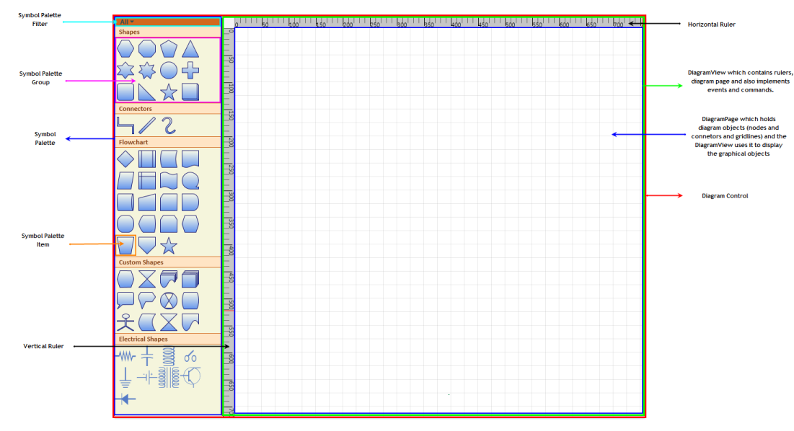

## Class Diagram

The class diagram for Essential Diagram WPF is as follows.

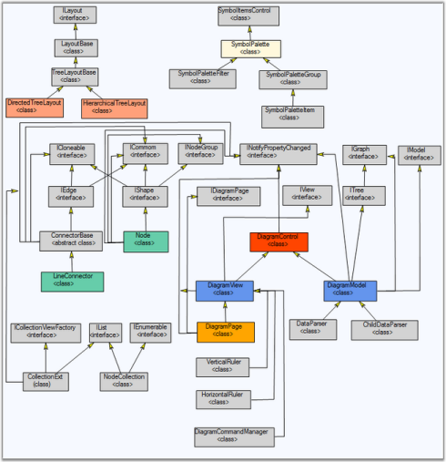

## Creating a WPF application

This section illustrates the step-by-step procedure to create a WPF application. 

1. Open Microsoft Visual Studio. Click New Project in the Start Page. 

   

2. In the New Project dialog, select WPF Application template, name the project and click OK. 

   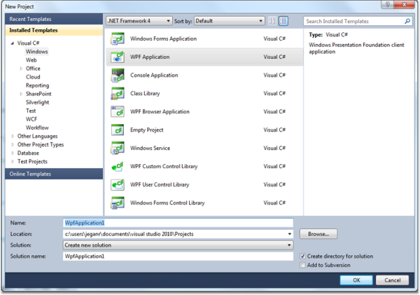

   

3. A new WPF application is created.

### Creating a Diagram

Essential Diagram WPF can be used to create a rich Visio-like application. This framework provides many utility controls to help you easily put an application together. End users can get started in minutes using this diagram control. 

Following is a basic step to create DiagramControl and initialize the necessary properties. Details about individual parts are explained later in this documentation.

### Create DiagramControl

The Diagram Control can be added to the application using the following code.

DiagramControl can be created in two ways,

* Through XAML
* Through Code Behind

   
   


<Window x:Class="WpfApplication1.Window1" xmlns="http://schemas.microsoft.com/winfx/2006/xaml/presentation"

xmlns:x="http://schemas.microsoft.com/winfx/2006/xaml" Title="EssentialDiagramWPF" Height="400" Width="600"

xmlns:sfdiagram="clr-namespace:Syncfusion.Windows.Diagram;assembly=Syncfusion.Diagram.WPF" xmlns:local="clr-namespace:WpfApplication1">

<Grid Name="diagramgrid">

<sfdiagram:DiagramControl></sfdiagram:DiagramControl>

</Grid>

</Window>




DiagramControl dc = new DiagramControl();




Dim dc As New DiagramControl()



This shows a window with empty diagramcontrol.

Enabling SymbolPalette

* Now you need to add the SymbolPalette to your newly created Diagram control. The SymbolPalette is displayed by setting the IsSymbolPaletteEnabled property to _True_. By default, it is set to _False_. The following code enables the SymbolPalette.

SymbolPalette can be enabled in two ways,

* Through XAML
* Through Code Behind



<Window x:Class="WpfApplication1.Window1" xmlns="http://schemas.microsoft.com/winfx/2006/xaml/presentation"

xmlns:x="http://schemas.microsoft.com/winfx/2006/xaml" Title="EssentialDiagramWPF" Height="400" Width="600"

xmlns:sfdiagram="clr-namespace:Syncfusion.Windows.Diagram;assembly=Syncfusion.Diagram.WPF" xmlns:local="clr-namespace:WpfApplication1">

<Grid Name="diagramgrid">

<sfdiagram:DiagramControl IsSymbolPaletteEnabled="True">

</sfdiagram:DiagramControl>

</Grid>

</Window>




DiagramControl diagramcontrol = new DiagramControl();

diagramcontrol.IsSymbolPaletteEnabled = true;




Dim diagramcontrol As New DiagramControl()

diagramcontrol.IsSymbolPaletteEnabled = True



Create DiagramModel

* To add contents into the drawing area, use the Model property of the diagram control. The following code can be used to add the model.

DiagramModel can be created and assigned to DiagramControl’s View Property using two ways,

* Through XAML
* Through Code Behind



<Window x:Class="WpfApplication1.Window1" xmlns="http://schemas.microsoft.com/winfx/2006/xaml/presentation"

xmlns:x="http://schemas.microsoft.com/winfx/2006/xaml" Title="EssentialDiagramWPF" Height="400" Width="600"

xmlns:sfdiagram="clr-namespace:Syncfusion.Windows.Diagram;assembly=Syncfusion.Diagram.WPF" xmlns:local="clr-namespace:WpfApplication1">

    <Grid Name="diagramgrid">

        <sfdiagram:DiagramControl IsSymbolPaletteEnabled="True">

           <sfdiagram:DiagramControl.Model>

                <sfdiagram:DiagramModel></sfdiagram:DiagramModel>

            </sfdiagram:DiagramControl.Model>

        </sfdiagram:DiagramControl>

    </Grid>

</Window>




DiagramControl dc = new DiagramControl();

dc.IsSymbolPaletteEnabled = true;

DiagramModel model = new DiagramModel();

dc.Model = model;

diagramgrid.Children.Add(dc);




Dim dc As New DiagramControl()

dc.IsSymbolPaletteEnabled = True

Dim model As New DiagramModel()

dc.Model = model

diagramgrid.Children.Add(dc)



Create DiagramView

* To display the drawing area, use the View property of the diagram control. The following code can be used to add the view.

DiagramView can be created and assigned to DiagramControl’s View Property using two ways,

* Through XAML
* Through Code Behind 



<Window x:Class="WpfApplication1.Window1" xmlns="http://schemas.microsoft.com/winfx/2006/xaml/presentation"

xmlns:x="http://schemas.microsoft.com/winfx/2006/xaml" Title="EssentialDiagramWPF" Height="400" Width="600"

xmlns:sfdiagram="clr-namespace:Syncfusion.Windows.Diagram;assembly=Syncfusion.Diagram.WPF" xmlns:local="clr-namespace:WpfApplication1">

    <Grid Name="diagramgrid">

        <sfdiagram:DiagramControl IsSymbolPaletteEnabled="True">

            <sfdiagram:DiagramControl.Model>

                <sfdiagram:DiagramModel></sfdiagram:DiagramModel>

            </sfdiagram:DiagramControl.Model>

            <sfdiagram:DiagramControl.View>

                <sfdiagram:DiagramView ></sfdiagram:DiagramView>

            </sfdiagram:DiagramControl.View>

        </sfdiagram:DiagramControl>

    </Grid>

</Window>




DiagramControl dc = new DiagramControl();

dc.IsSymbolPaletteEnabled = true;

DiagramView view = new DiagramView();

view.Bounds = new System.Drawing.Thickness(0, 0, 1000, 1000);

dc.View = view;

diagramgrid.Children.Add(dc);



Dim dc As New DiagramControl()

dc.IsSymbolPaletteEnabled = True

Dim view As New DiagramView()

view.Bounds = New System.Drawing.Thickness(0, 0, 1000, 1000)

dc.View = view

diagramgrid.Children.Add(dc)



* This creates a Diagram Control with the SymbolPalette and the drawing area as illustrated in the following image. 

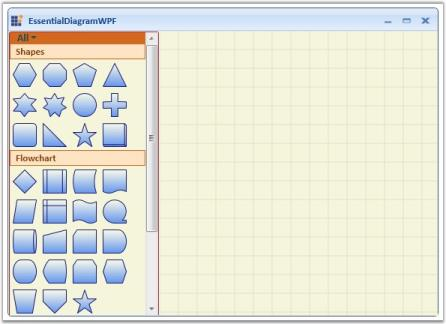

N> For orthogonal and Bezier connectors, the connection always happens at the center of the node's edge.

For straight line connectors, the connection happens at the intersection point of the edge and the line connector.

### Creating Diagram control through Designer

The Diagram Control can be added to the application using designer.

Following are the steps to create Diagram Control through Designer.

1. Open the XAML page of the application

   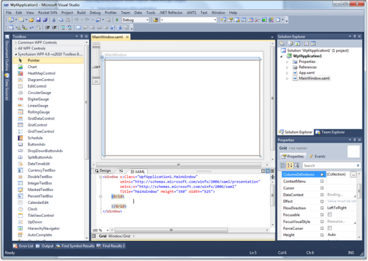

2. Select Diagram Control from ToolBox.

   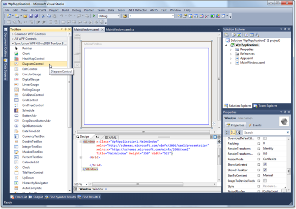

3. Drag the Diagram Control onto the Designer.

   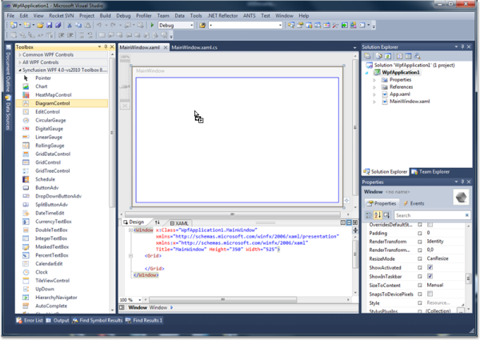

4. DiagramControl is added to the Page and also the assembly reference is added to the Project file.

   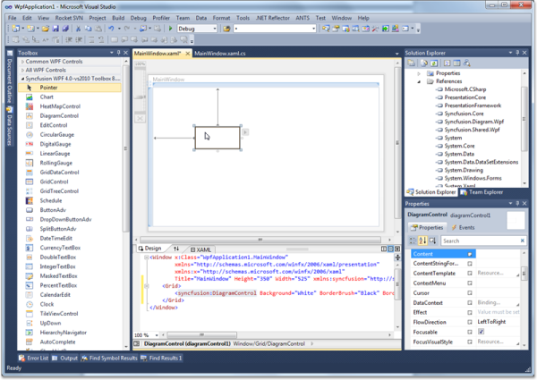

   

Kindly refer to Add Diagram Model to the Diagram Control and Add Diagram View to the Diagram Control to add the model and view to the control.

### Add Diagram Model to the Diagram Control

A model represents data for an application and contains the logic for adding, accessing, and manipulating the data.

#### Features

* Nodes and connectors are added to the Diagram Control using the Model property.
* A predefined layout is applied using the LayoutType property.
* A data template is applied to the layout using the Hierarchical DataTemplate property.

The following code shows how the Model property can be applied to the Diagram control.



<Window x:Class="WpfApplication1.Window1" xmlns="http://schemas.microsoft.com/winfx/2006/xaml/presentation"

xmlns:x="http://schemas.microsoft.com/winfx/2006/xaml" Title="EssentialDiagramWPF" Height="420" Width="600"

xmlns:sfdiagram="clr-namespace:Syncfusion.Windows.Diagram;assembly=Syncfusion.Diagram.WPF" xmlns:local="clr-namespace:WpfApplication1">

    <Grid Name="diagramgrid">

        <sfdiagram:DiagramControl IsSymbolPaletteEnabled="True">

            <sfdiagram:DiagramControl.Model>

                <sfdiagram:DiagramModel x:Name="diagramModel">

                </sfdiagram:DiagramModel>

            </sfdiagram:DiagramControl.Model>

            <sfdiagram:DiagramControl.View>

                <sfdiagram:DiagramView></sfdiagram:DiagramView>

            </sfdiagram:DiagramControl.View>

        </sfdiagram:DiagramControl>

    </Grid>

</Window>



DiagramControl dc = new DiagramControl();

dc.IsSymbolPaletteEnabled = true;

DiagramView view = new DiagramView();

view.Bounds = new System.Drawing.Thickness(0, 0, 1000, 1000);

dc.View = view;

DiagramModel diagramModel = new DiagramModel();

dc.Model = diagramModel;

diagramgrid.Children.Add(dc);




Dim dc As New DiagramControl()

dc.IsSymbolPaletteEnabled = True

Dim view As New DiagramView()

view.Bounds = New System.Drawing.Thickness(0, 0, 1000, 1000)

dc.View = view

Dim diagramModel As New DiagramModel()

dc.Model = diagramModel

diagramgrid.Children.Add(dc)



This adds a model to the Diagram Control, and defines Bounds Property for DiagramModel

### Add Diagram View to the Diagram Control

The view obtains items of data from the model and presents them to the user. It typically manages the overall layout of the data obtained from model.

Apart from presenting the data, view also handles navigation between the items, and some aspects of item selection. The views also implement basic user interface features, such as rulers, and drag and drop. It handles the events, which occur on the objects, obtained from the model. Command mechanism is also implemented by the view. 

A view can be constructed without a model, but a model must be provided before it can display useful information. Views can also render additional visual information that do not exist inside the model such as bounding boxes and grids. These additional view-specific objects are referred to as decorators, because they provide additional visual aids and window dressing to the view; but they are not actually a part of the model.

The following code illustrates adding a Diagram View to the Diagram control.



<Window x:Class="WpfApplication1.Window1" xmlns="http://schemas.microsoft.com/winfx/2006/xaml/presentation"

xmlns:x="http://schemas.microsoft.com/winfx/2006/xaml" Title="EssentialDiagramWPF" Height="400" Width="600"

xmlns:sfdiagram="clr-namespace:Syncfusion.Windows.Diagram;assembly=Syncfusion.Diagram.WPF" xmlns:local="clr-namespace:WpfApplication1">

    <Grid Name="diagramgrid">

        <sfdiagram:DiagramControl IsSymbolPaletteEnabled="True">

            <sfdiagram:DiagramControl.View>

                <sfdiagram:DiagramView ></sfdiagram:DiagramView>

            </sfdiagram:DiagramControl.View>

        </sfdiagram:DiagramControl>

    </Grid>

</Window>

 


DiagramControl dc = new DiagramControl();

dc.IsSymbolPaletteEnabled = true;

DiagramView view = new DiagramView();

view.Bounds = new System.Drawing.Thickness(0, 0, 1000, 1000);

dc.View = view;

diagramgrid.Children.Add(dc);




Dim dc As New DiagramControl()

dc.IsSymbolPaletteEnabled = True

Dim view As New DiagramView()

view.Bounds = New System.Drawing.Thickness(0, 0, 1000, 1000)

dc.View = view

diagramgrid.Children.Add(dc)



### Manual Layout

The Essential Diagram WPF allows you to manually specify the layout of the page. The nodes can be positioned at any point on the diagram page. The OffsetX and OffsetY properties can be used to specify the position. Connections can then be made between the nodes using the various line connectors.

The nodes and the connectors need to be added to the Nodes and Connections collection of DiagramModel respectively. This gives a complete control over the placement of nodes on the page and enables the user to create diagrams as suited for their business needs.

The following code snippet shows how the manual layout may be specified.


Node EssentialWPF = new Node(Guid.NewGuid(), "EssentialWPF");

EssentialWPF.Shape = Shapes.Ellipse;

EssentialWPF.Width = 100;

EssentialWPF.Height = 50;

EssentialWPF.OffsetX = 300;

EssentialWPF.OffsetY = 300;

EssentialWPF.Content = "Essential WPF";

Node EssentialTools = new Node(Guid.NewGuid(), "EssentialTools");

EssentialTools.Shape = Shapes.Ellipse;

EssentialTools.Width = 100;

EssentialTools.Height = 50;

EssentialTools.OffsetX = 300;

EssentialTools.OffsetY = 500;

EssentialTools.Content = "Essential Tools";

Node EssentialChart = new Node(Guid.NewGuid(), "EssentialChart");

EssentialChart.Shape = Shapes.Ellipse;

EssentialChart.Width = 100;

EssentialChart.Height = 50;

EssentialChart.OffsetX = 300;

EssentialChart.OffsetY = 100;

EssentialChart.Content = "Essential Chart";

Node EssentialDiagram = new Node(Guid.NewGuid(), "EssentialDiagram");

EssentialDiagram.Shape = Shapes.Ellipse;

EssentialDiagram.Width = 100;

EssentialDiagram.Height = 50;

EssentialDiagram.OffsetX = 100;

EssentialDiagram.OffsetY = 300;

EssentialDiagram.Content = "Essential Diagram";

Node EssentialEdit = new Node(Guid.NewGuid(), "EssentialEdit");

EssentialEdit.Shape = Shapes.Ellipse;

EssentialEdit.Width = 100;

EssentialEdit.Height = 50;

EssentialEdit.OffsetX = 500;

EssentialEdit.OffsetY = 300;

EssentialEdit.Content = "Essential Edit";

// Adding the nodes to the Diagram Model.

diagramModel.Nodes.Add(EssentialWPF);

diagramModel.Nodes.Add(EssentialTools);

diagramModel.Nodes.Add(EssentialChart);

diagramModel.Nodes.Add(EssentialDiagram); 

diagramModel.Nodes.Add(EssentialEdit);

//Creating the Connections between the nodes.

Connect(EssentialWPF, EssentialTools);

Connect(EssentialChart, EssentialWPF);

Connect(EssentialDiagram, EssentialWPF);

Connect(EssentialEdit, EssentialWPF);

//Creating connection and adding to the model.

void Connect(Node HeadNode, Node TailNode)

{

LineConnector connection = new LineConnector();

connection.ConnectorType = ConnectorType.Orthogonal;

// Specify the TailNode node.

connection.TailNode = TailNode;

//Specifying the Head Node.

connection.HeadNode = HeadNode;

connection.TailDecoratorShape = DecoratorShape.Arrow;

//Adding to the Diagram Model.

diagramModel.Connections.Add(connection);

}




Private EssentialWPF As New Node(Guid.NewGuid(), "EssentialWPF")

EssentialWPF.Shape = Shapes.Ellipse

EssentialWPF.Width = 100

EssentialWPF.Height = 50

EssentialWPF.OffsetX = 300

EssentialWPF.OffsetY = 300

EssentialWPF.Content = "Essential WPF"

Dim EssentialTools As New Node(Guid.NewGuid(), "EssentialTools")

EssentialTools.Shape = Shapes.Ellipse

EssentialTools.Width = 100

EssentialTools.Height = 50

EssentialTools.OffsetX = 300

EssentialTools.OffsetY = 500

EssentialTools.Content = "Essential Tools"

Dim EssentialChart As New Node(Guid.NewGuid(), "EssentialChart")

EssentialChart.Shape = Shapes.Ellipse

EssentialChart.Width = 100

EssentialChart.Height = 50

EssentialChart.OffsetX = 300

EssentialChart.OffsetY = 100

EssentialChart.Content = "Essential Chart"

Dim EssentialDiagram As New Node(Guid.NewGuid(), "EssentialDiagram")

EssentialDiagram.Shape = Shapes.Ellipse

EssentialDiagram.Width = 100

EssentialDiagram.Height = 50

EssentialDiagram.OffsetX = 100

EssentialDiagram.OffsetY = 300

EssentialDiagram.Content = "Essential Diagram"

Dim EssentialEdit As New Node(Guid.NewGuid(), "EssentialEdit")

EssentialEdit.Shape = Shapes.Ellipse

EssentialEdit.Width = 100

EssentialEdit.Height = 50

EssentialEdit.OffsetX = 500

EssentialEdit.OffsetY = 300

EssentialEdit.Content = "Essential Edit"

'Adding the nodes to the Diagram Model.

diagramModel.Nodes.Add(EssentialWPF)

diagramModel.Nodes.Add(EssentialTools)

diagramModel.Nodes.Add(EssentialChart)

diagramModel.Nodes.Add(EssentialDiagram)

diagramModel.Nodes.Add(EssentialEdit)

'Creating the Connections between the nodes.

Connect(EssentialWPF, EssentialTools)

Connect(EssentialChart, EssentialWPF)

Connect(EssentialDiagram, EssentialWPF)

Connect(EssentialEdit, EssentialWPF)

'Creating connection and adding to the model.

void Connect(Node HeadNode, Node TailNode)

Dim connection As New LineConnector()

connection.ConnectorType = ConnectorType.Orthogonal

'Specify the TailNode node.

connection.TailNode = TailNode

'Specifying the Head Node.

connection.HeadNode = HeadNode

connection.TailDecoratorShape = DecoratorShape.Arrow

'Adding to the Diagram Model.

diagramModel.Connections.Add(connection)


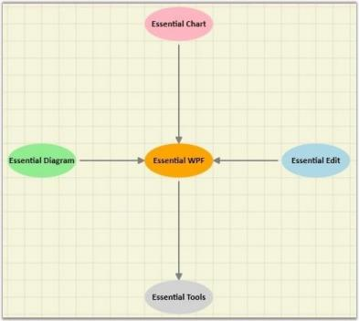

### Automatic Layout

Essential Diagram WPF allows you to specify automatic layouts the nodes. Following layout types are available:

* Directed-Tree layout
* Hierarchical-Tree layout
* Radial-Tree layout
* Table layout

<table>
<tr>
<th>
Property</th><th>
Description</th><th>
Type of the property</th><th>
Value it accepts</th></tr>
<tr>
<td>
VerticalSpacing</td><td>
Gets or sets the Vertical spacing between nodes.</td><td>
CLR property</td><td>
Double</td></tr>
<tr>
<td>
HorizontalSpacing</td><td>
Gets or sets the Horizontal spacing between nodes.</td><td>
CLR property</td><td>
Double</td></tr>
<tr>
<td>
SpaceBetweenSubTrees</td><td>
Gets or sets the space between sub trees.</td><td>
CLR property</td><td>
Double</td></tr>
<tr>
<td>
Orientation</td><td>
Gets or sets the orientation.</td><td>
CLR property</td><td>
TreeOrientation.LeftRightTreeOrientation.RightLeftTreeOrientation.TopBottomTreeOrientation.BottomTop</td></tr>
<tr>
<td>
EnableCycleDetection</td><td>
Gets or sets a value indicating whether Cycle detection is enabled or not.</td><td>
DependencyProperty</td><td>
Booleantrue/ false</td></tr>
<tr>
<td>
TableExpandMode</td><td>
Gets or sets the table expand mode.</td><td>
DependencyProperty</td><td>
ExpandMode.HorizontalExpandMode.Vertical</td></tr>
<tr>
<td>
RowCount</td><td>
Gets or sets the Row Count for the table layout.</td><td>
DependencyProperty</td><td>
int</td></tr>
<tr>
<td>
ColumnCount</td><td>
Gets or sets the Column Count for the table layout.</td><td>
DependencyProperty</td><td>
int</td></tr>
<tr>
<td>
EnableLayoutWithVariedSizes</td><td>
Gets or sets a value indicating whether to enable the varied size algorithm. In case the Model consists of the nodes of different sizes, this property can be set to true. This will align the differently sized nodes with respect to the center.</td><td>
DependencyProperty</td><td>
Boolean (true/ false)</td></tr>
<tr>
<td>
Bounds</td><td>
Gets or sets the bounds value which specifies the position of the root node in case of tree layout.</td><td>
CLR property</td><td>
Thickness</td></tr>
<tr>
<td>
BowtieSubTreePlacement</td><td>
Gets or sets a value from the BowtieSubTreePlacement.</td><td>
Attached Dependency property</td><td>
BowtieSubTreePlacement</td></tr>
</table>

#### Directed-Tree Layout

The Directed-Tree Layout automatically arranges nodes in a tree-like structure. This enables you to position nodes in a tree-like fashion without specifying the coordinate location for each node. However, it is necessary to specify a layout root for the tree layout. The Directed-Tree layout will position the nodes based on the layout root.

#### Hierarchical-Tree Layout

The Hierarchical Tree Layout arranges nodes in a tree-like structure, where the nodes in hierarchical layout may have multiple parents. As a result, there is no need to specify the layout root. 

#### Radial-Tree Layout

The Radial-Tree Layout Manager arranges nodes in a circular layout and positions the root-node at the center of the graph and child-nodes in a circular fashion around the root. Sub-trees formed by the branching of the child-node are located radially around the child-node. 

#### Table Layout

Table layout is a layout manager that arranges the nodes in rows and column basis. The number of nodes in each row and column can be specified and the layout will take place accordingly. 

#### Directed – Tree Layout

The Directed-Tree layout allows you to arrange the nodes in a tree-like structure. This layout can be applied to any diagram that comprises a directed tree graph with unique root and child nodes. This makes creating diagrams easier because the node position is determined automatically, based on the connections. However, it is necessary to specify a layout root for the tree layout. The Directed-Tree layout will position the nodes based on the layout root.

#### Orientation

The Layout Manager lets you orient the tree in many directions and create sophisticated arrangements. The Orientation property of the Diagram model can be used to specify the tree orientation.

* TopBottom - Places the root node at the top and the child nodes are arranged below the root node. 
* BottomTop - Places the root node at the bottom and the child nodes are arranged above the root node. 
* LeftRight - Places the root node at the left and the child nodes are arranged on the right side of the root node. 
* RightLeft - Places the root node at the right and the child nodes are arranged on the left side of the root node. 

The Bounds property of the DiagramView class can be used to specify the position of the root node based on which the entire tree gets generated.

<table>
<tr>
<th>
Property</th><th>
Description </th><th>
Type of the property</th><th>
Value it accepts</th></tr>
<tr>
<td>
VerticalSpacing</td><td>
Gets or sets the Vertical spacing between nodes.</td><td>
CLR property</td><td>
Double</td></tr>
<tr>
<td>
HorizontalSpacing</td><td>
Gets or sets the Horizontal spacing between nodes.</td><td>
CLR property</td><td>
Double</td></tr>
<tr>
<td>
SpaceBetweenSubTrees</td><td>
Gets or sets the space between sub trees.</td><td>
CLR property</td><td>
Double</td></tr>
<tr>
<td>
Orientation</td><td>
Gets or sets the orientation.</td><td>
CLR property</td><td>
TreeOrientation.LeftRightTreeOrientation.RightLeftTreeOrientation.TopBottomTreeOrientation.BottomTop</td></tr>
<tr>
<td>
Bounds</td><td>
Gets or sets the bounds value which specifies the position of the root node in case of tree layout.</td><td>
CLR property</td><td>
Thickness</td></tr>
</table>

Methods

<table>
<tr>
<th>
Name</th><th>
Parameters </th><th>
Return Type</th><th>
Description</th><th>
Reference Links</th></tr>
<tr>
<td>
RefreshLayout()</td><td>
Null</td><td>
void</td><td>
Refresh the layout</td><td>
N/A</td></tr>
</table>

The following code shows how the automatic layout can be generated.

1. The LayoutType should be set to DirectedTreeLayout in DiagramModel class.

			<Window x:Class="RadialTreeLayout_2008.Window1"

				xmlns="http://schemas.microsoft.com/winfx/2006/xaml/presentation"

				xmlns:x="http://schemas.microsoft.com/winfx/2006/xaml"

				Title="Radial Tree Layout Demo" WindowState="Normal"

				WindowStartupLocation="CenterScreen" Name="mainwindow"

				xmlns:syncfusion="http://schemas.syncfusion.com/wpf" Icon="App.ico"

				FontWeight="Bold" xmlns:local="clr-namespace:RadialTreeLayout_2008" Height="1000" Width="900">

				<!--Diagram Control-->

				<syncfusion:DiagramControl  Name="diagramControl">

					<!-- Model to add nodes and connections-->

					<syncfusion:DiagramControl.Model>

						 <syncfusion:DiagramModel LayoutType="DirectedTreeLayout" Orientation="TopBottom" 

			                                        x:Name="diagramModel">

			             </syncfusion:DiagramModel>

					</syncfusion:DiagramControl.Model>

					<!--View to display nodes and connections added through model.-->

					<syncfusion:DiagramControl.View>

						<syncfusion:DiagramView Name="diagramView">

						</syncfusion:DiagramView>

					</syncfusion:DiagramControl.View>

				</syncfusion:DiagramControl>

			</Window>

2. Then, the nodes are defined and the connections are made.

			Style s = (Style)this.Resources["{x:Type sfdiagram:Node}"];

			Node CEO = CreateNode("CEO", "CEO of the company", "Steve-CEO", s);

			Node SLS = CreateNode("ManagerSLS", "Tom-ManagerSLS", "Sales Manager of the company ", s);

			Node Marketing = CreateNode("ManagerMarketing", "Mary-MKT Manager", "Marketing Manager of the company", s);

			Node DEV = CreateNode("ManagerDEV", "Jim-Manager DEV", "Development Manager of the company", s);

			Node CSR1 = Node DEV = CreateNode("CSR1", "Kevin-CSR", "CSR  of the company", s);

			Node CSR2 = Node DEV = CreateNode("CSR2", "Peter-CSR", "CSR  of the company", s);

			//The layout happens with respect to the layout root.

			diagramModel.LayoutRoot = CEO;

			//Add the nodes to the model.

			diagramModel.Nodes.Add(CEO);

			diagramModel.Nodes.Add(Marketing);

			diagramModel.Nodes.Add(SLS);

			diagramModel.Nodes.Add(DEV);

			diagramModel.Nodes.Add(CSR1);

			diagramModel.Nodes.Add(CSR2);

			//Creating the Connections between the nodes.

			Connect(CEO, Marketing);

			Connect(CEO, SLS);

			Connect(CEO, DEV);

			Connect(SLS, CSR1);

			Connect(SLS, CSR2);

					Node CreateNode(string Name, string Label, string ToolTip, Style s)

					{

						Node NewNode = new Node(Guid.NewGuid(), Name);

						NewNode.Label = Label;

						NewNode.ToolTip = ToolTip;

						NewNode.CustomPathStyle = s;

						return NewNode;

					}

			        //Creating connection and adding to the model.

			        void Connect(Node HeadNode, Node TailNode)

			        {

			            LineConnector connection = new LineConnector();

			            connection.ConnectorType = ConnectorType.Orthogonal;

			            // Specify the TailNode node

			            connection.TailNode = TailNode;

			            //Specifying the Head Node

			            connection.HeadNode = HeadNode;

			            connection.TailDecoratorShape = DecoratorShape.Arrow;

			            //Adding to the Diagram Model

			            diagramModel.Connections.Add(connection);

			        }

				Private s As Style = CType(Me.Resources("{x:Type sfdiagram:Node}"), Style)

				Private CEO As Node = CreateNode("CEO", "CEO of the company", "Steve-CEO", s)

				Private SLS As Node = CreateNode("ManagerSLS", "Tom-ManagerSLS", "Sales Manager of the company ", s)

				Private Marketing As Node = CreateNode("ManagerMarketing", "Mary-MKT Manager", "Marketing Manager of the company", s)

				Private DEV As Node = CreateNode("ManagerDEV", "Jim-Manager DEV", "Development Manager of the company", s)

				Private CSR1 As Node = Node DEV = CreateNode("CSR1", "Kevin-CSR", "CSR  of the company", s)

				Private CSR2 As Node = Node DEV = CreateNode("CSR2", "Peter-CSR", "CSR  of the company", s)

				'The layout happens with respect to the layout root.

				diagramModel.LayoutRoot = CEO

				'Add the nodes to the model.

				diagramModel.Nodes.Add(CEO)

				diagramModel.Nodes.Add(Marketing)

				diagramModel.Nodes.Add(SLS)

				diagramModel.Nodes.Add(DEV)

				diagramModel.Nodes.Add(CSR1)

				diagramModel.Nodes.Add(CSR2)

				'Creating the Connections between the nodes.

				Connect(CEO, Marketing)

				Connect(CEO, SLS)

				Connect(CEO, DEV)

				Connect(SLS, CSR1)

				Connect(SLS, CSR2)

				Node CreateNode(String Name, String Label, String ToolTip, Style s)

				Dim NewNode As New Node(Guid.NewGuid(), Name)

				NewNode.Label = Label

				NewNode.ToolTip = ToolTip

				NewNode.CustomPathStyle = s

				Return NewNode

				'Creating connection and adding to the model.

				void Connect(Node HeadNode, Node TailNode)

				Dim connection As New LineConnector()

				connection.ConnectorType = ConnectorType.Orthogonal

				'Specify the TailNode node

				connection.TailNode = TailNode

				'Specifying the Head Node

				connection.HeadNode = HeadNode

				connection.TailDecoratorShape = DecoratorShape.Arrow

				'Adding to the Diagram Model

				diagramModel.Connections.Add(connection)

   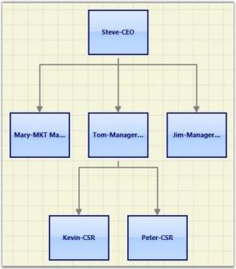

   

Layout Spacing

Spacing between the nodes with respect different levels and siblings are adjustable; this will be helpful to adjust the distance between nodes, so that it will meet many business needs. As this is a general topic between all layouts, detailed explanation about this can be found in Layout Spacing under DiagramModel.

Refresh Layout

When there are changes in content of the page link new nodes and connectors added, the layout has to be refreshed to get the page’s content aligned again to give space for new contents. To refresh the layout please follow the following code snippet.



DirectedTreeLayout tree = new DirectedTreeLayout(diagramModel, diagramView);

tree.RefreshLayout();




Dim tree As New DirectedTreeLayout(diagramModel, diagramView)

tree.RefreshLayout()


Here diagramModel and diagramView is an instance of DiagramModel and DiagramView respectively.

#### Hierarchical – Tree Layout

The Hierarchical Tree Layout arranges nodes in a tree-like structure, where the nodes in hierarchical layout may have multiple parents. As a result, there is no need to specify the layout root. 

Orientation

The Layout Manager lets you orient the hierarchical tree in many directions. The Orientation property of Diagram Model can be used to specify the tree orientation.

* TopBottom - Places the root node at the top and the child nodes are arranged below the root node. 
* BottomTop - Places the root node at the bottom and the child nodes are arranged above the root node. 
* LeftRight - Places the root node at the left and the child nodes are arranged on the right side of the root node. 
* RightLeft - Places the root node at the right and the child nodes are arranged on the left side of the root node. 

<table>
<tr>
<th>
Property</th><th>
Description </th><th>
Type of the property</th><th>
Value it accepts</th></tr>
<tr>
<td>
VerticalSpacing</td><td>
Gets or sets the Vertical spacing between nodes.</td><td>
CLR property</td><td>
Double</td></tr>
<tr>
<td>
HorizontalSpacing</td><td>
Gets or sets the Horizontal spacing between nodes.</td><td>
CLR property</td><td>
Double</td></tr>
<tr>
<td>
SpaceBetweenSubTrees</td><td>
Gets or sets the space between sub trees.</td><td>
CLR property</td><td>
Double</td></tr>
<tr>
<td>
Orientation</td><td>
Gets or sets the orientation.</td><td>
CLR property</td><td>
TreeOrientation.LeftRightTreeOrientation.RightLeftTreeOrientation.TopBottomTreeOrientation.BottomTop</td></tr>
<tr>
<td>
EnableCycleDetection</td><td>
Gets or sets a value indicating whether Cycle detection is enabled or not.</td><td>
DependencyProperty</td><td>
Boolean (true/ false)</td></tr>
<tr>
<td>
Bounds</td><td>
Gets or sets the bounds value which specifies the position of the root node in case of tree layout.</td><td>
CLR property</td><td>
Thickness</td></tr>
</table>

<table>
<tr>
<th>
Name</th><th>
Parameters </th><th>
Return Type</th><th>
Description</th><th>
Reference Links</th></tr>
<tr>
<td>
RefreshLayout()</td><td>
Null</td><td>
void</td><td>
Refresh the layout</td><td>
N/A</td></tr>
</table>

The Bounds property of the DiagramView class can be used to specify the position of the root node, based on which the entire tree gets generated.

The following code example specifies how the Hierarchical-tree layout can be specified.

1. The LayoutType should be set to HierarchicalTreeLayout in DiagramModel class.

				<Window x:Class="RadialTreeLayout_2008.Window1"

					xmlns="http://schemas.microsoft.com/winfx/2006/xaml/presentation"

					xmlns:x="http://schemas.microsoft.com/winfx/2006/xaml"

					Title="Radial Tree Layout Demo" WindowState="Normal"

					WindowStartupLocation="CenterScreen" Name="mainwindow"

					xmlns:syncfusion="http://schemas.syncfusion.com/wpf" Icon="App.ico"

					FontWeight="Bold" xmlns:local="clr-namespace:RadialTreeLayout_2008" Height="1000" Width="900">

				<!--Diagram Control-->       

				<syncfusion:DiagramControl  Name="diagramControl">           

				<!-- Model to add nodes and connections-->            <syncfusion:DiagramControl.Model>               

				<syncfusion:DiagramModel  LayoutType="HierarchicalTreeLayout" Orientation="TopBottom"   x:Name="diagramModel">               </syncfusion:DiagramModel>           

				</syncfusion:DiagramControl.Model>   

				<!--View to display nodes and connections added through model.-->            

				<syncfusion:DiagramControl.View>              

				  <syncfusion:DiagramView Bounds="0,0,700,750"  

				  Background="White"   Name="diagramView"   >                    

				  </syncfusion:DiagramView>           

				 </syncfusion:DiagramControl.View>       

				</syncfusion:DiagramControl>

				</Window>

2. Then the nodes can be added and the connections can be specified as follows:

    

			Node n1 = new Node(Guid.NewGuid(), "n1");

			n1.Level = 0;

			 Node n2 = new Node(Guid.NewGuid(), "n2");

			n2.Level = 0;

			 Node n3 = new Node(Guid.NewGuid(), "n3");

			n3.Level = 0;

			 Node n4 = new Node(Guid.NewGuid(), "n4");

			n4.Level = 1;

			Node n5 = new Node(Guid.NewGuid(), "n5");

			n5.Level = 2;

			Node n6 = new Node(Guid.NewGuid(), "n6");

			n6.Level = 1;

			Node n7 = new Node(Guid.NewGuid(), "n7");

			n7.Level = 1;

			Node n8 = new Node(Guid.NewGuid(), "n8");

			n8.Level = 3;

			Node n9 = new Node(Guid.NewGuid(), "n9");

			n9.Level = 3;

			Node n10 = new Node(Guid.NewGuid(), "n10");

			n10.Level = 2;

			Node n11 = new Node(Guid.NewGuid(), "n11");

			n11.Level = 2;

			Node n12 = new Node(Guid.NewGuid(), "n12");

			n12.Level = 2;

			Node n13 = new Node(Guid.NewGuid(), "n13");

			n13.Level = 3;

			Node n14 = new Node(Guid.NewGuid(), "n14");

			n14.Level = 3;

				   //Adding nodes to the diagram Model.                            

			diagramModel.Nodes.Add(n1);  

						diagramModel.Nodes.Add(n2);

						diagramModel.Nodes.Add(n3);

						diagramModel.Nodes.Add(n4);

						diagramModel.Nodes.Add(n5);

						diagramModel.Nodes.Add(n6);

						diagramModel.Nodes.Add(n7);

						diagramModel.Nodes.Add(n8);

						diagramModel.Nodes.Add(n9);

						diagramModel.Nodes.Add(n10);

						diagramModel.Nodes.Add(n11);

						diagramModel.Nodes.Add(n12);  

						diagramModel.Nodes.Add(n13);  

						diagramModel.Nodes.Add(n14); 

				 //Creating conections between nodes.   

					   Connect(n1, n4);

					   Connect(n6, n11);

					   Connect(n2, n6);  

					   Connect(n6, n10);  

					   Connect(n3, n7);   

					   Connect(n5, n8);  

					   Connect(n5, n9); 

					   Connect(n4, n5); 

					   Connect(n7, n10); 

					   Connect(n4, n11); 

					   Connect(n7, n12); 

					   Connect(n12, n13); 

					   Connect(n12, n14);  

				  }   

			   //Creating connection and adding to the model. 

				void Connect(Node HeadNode, Node TailNode)    

				{        

				LineConnector connection = new LineConnector(); 

				connection.ConnectorType = ConnectorType.Straight;  

				// Specify the TailNode node.           

				connection.TailNode = TailNode;       

				//Specifying the Head Node.  

				connection.HeadNode = HeadNode;

				connection.TailDecoratorShape = DecoratorShape.Circle;    

			//Adding to the Diagram Model.                 

			diagramModel.Connections.Add(connection);  

				}

				Private n1 As New Node(Guid.NewGuid(), "n1")

				n1.Level = 0

				Dim n2 As New Node(Guid.NewGuid(), "n2")

				n2.Level = 0

				Dim n3 As New Node(Guid.NewGuid(), "n3")

				n3.Level = 0

				Dim n4 As New Node(Guid.NewGuid(), "n4")

				n4.Level = 1

				Dim n5 As New Node(Guid.NewGuid(), "n5")

				n5.Level = 2

				Dim n6 As New Node(Guid.NewGuid(), "n6")

				n6.Level = 1

				Dim n7 As New Node(Guid.NewGuid(), "n7")

				n7.Level = 1

				Dim n8 As New Node(Guid.NewGuid(), "n8")

				n8.Level = 3

				Dim n9 As New Node(Guid.NewGuid(), "n9")

				n9.Level = 3

				Dim n10 As New Node(Guid.NewGuid(), "n10")

				n10.Level = 2

				Dim n11 As New Node(Guid.NewGuid(), "n11")

				n11.Level = 2

				Dim n12 As New Node(Guid.NewGuid(), "n12")

				n12.Level = 2

				Dim n13 As New Node(Guid.NewGuid(), "n13")

				n13.Level = 3

				Dim n14 As New Node(Guid.NewGuid(), "n14")

				n14.Level = 3

				'Adding nodes to the diagram Model.                            

				diagramModel.Nodes.Add(n1)

				diagramModel.Nodes.Add(n2)

				diagramModel.Nodes.Add(n3)

				diagramModel.Nodes.Add(n4)

				diagramModel.Nodes.Add(n5)

				diagramModel.Nodes.Add(n6)

				diagramModel.Nodes.Add(n7)

				diagramModel.Nodes.Add(n8)

				diagramModel.Nodes.Add(n9)

				diagramModel.Nodes.Add(n10)

				diagramModel.Nodes.Add(n11)

				diagramModel.Nodes.Add(n12)

				diagramModel.Nodes.Add(n13)

				diagramModel.Nodes.Add(n14)

				'Creating conections between nodes.   

				Connect(n1, n4)

				Connect(n6, n11)

				Connect(n2, n6)

				Connect(n6, n10)

				Connect(n3, n7)

				Connect(n5, n8)

				Connect(n5, n9)

				Connect(n4, n5)

				Connect(n7, n10)

				Connect(n4, n11)

				Connect(n7, n12)

				Connect(n12, n13)

				Connect(n12, n14)

				'Creating connection and adding to the model. 

				void Connect(Node HeadNode, Node TailNode)

				Dim connection As New LineConnector()

				connection.ConnectorType = ConnectorType.Straight

				'Specify the TailNode node.           

				connection.TailNode = TailNode

				'Specifying the Head Node.  

				connection.HeadNode = HeadNode

				connection.TailDecoratorShape = DecoratorShape.Circle

				'Adding to the Diagram Model.                 

				diagramModel.Connections.Add(connection)
				
			

   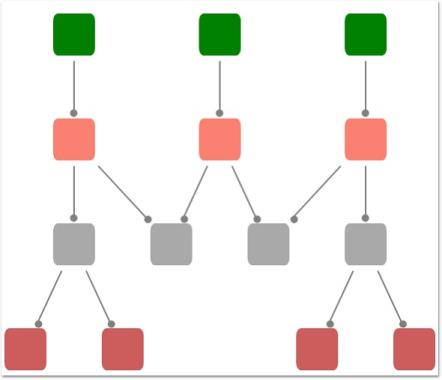

   

Layout Spacing

Spacing between the nodes with respect different levels and siblings are adjustable; this will be helpful to adjust the distance between nodes, so that it will meet many business needs. As this is a general topic between all layouts, detailed explanation about this can be found in Layout Spacing under DiagramModel.

Cyclic path in Hierarchical-Tree Layout

Unlike Directed-Tree layout, hierarchical tree layout supports nodes with multiple parents, this will cause a cyclic path in the layout, a detailed explanation about this scenario can be found in Cyclic path in Hierarchical-Tree Layout under DiagramModel.

Refresh Layout

When there are changes in content of the page link new nodes and connectors added, the layout has to be refreshed to get the page’s content aligned again to give space for new contents. To refresh the layout please follow the following code snippet.



HierarchicalTreeLayout tree = new HierarchicalTreeLayout(diagramModel, diagramView);

tree.RefreshLayout();




Dim tree As New HierarchicalTreeLayout(diagramModel, diagramView)

tree.RefreshLayout()



Here diagramModel and diagramView is an instance of DiagramModel and DiagramView respectively.



Layout Spacing Refer Concepts and Features -> Diagram Model -> Layout Spacing

Tree Orientation Refer Concepts and Features -> Diagram Model -> Tree Orientation

Cyclic path in Hierarchical-Tree Layout: Refer Concepts and Features -> Diagram Model -> Cyclic path in Hierarchical – TreeLayout.



#### Radial – Tree Layout

The Radial-TreeLayoutis a specialization of the Directed Tree Layout Manager that employs a circular layout algorithm for locating the diagram nodes. The Radial-Tree Layout arranges nodes in a circular layout, positioning the root node at the center of the graph and the child nodes in a circular fashion around the root. Sub-trees formed by the branching of child nodes are located radially around the child nodes. This arrangement results in an ever-expanding concentric arrangement with radial proximity to the root node indicating the node level in the hierarchy. However, it is necessary to specify a layout root for the tree layout. The Radial-Tree layout will position the nodes based on the layout root.

The Bounds property of the DiagramView class can be used to specify the position of the root node, based on which the entire tree gets generated.

<table>
<tr>
<th>
Property</th><th>
Description</th><th>
Type of the property</th><th>
Value it accepts</th></tr>
<tr>
<td>
VerticalSpacing</td><td>
Gets or sets the Vertical spacing between nodes.</td><td>
CLR property</td><td>
Double</td></tr>
<tr>
<td>
HorizontalSpacing</td><td>
Gets or sets the Horizontal spacing between nodes.</td><td>
CLR property</td><td>
Double</td></tr>
<tr>
<td>
Bounds</td><td>
Gets or sets the bounds value which specifies the position of the root node in case of tree layout.</td><td>
CLR property</td><td>
Thickness</td></tr>
</table>

<table>
<tr>
<td>
Name</td><td>
Parameters </td><td>
Return Type</td><td>
Description</td><td>
Reference Links</td></tr>
<tr>
<td>
RefreshLayout()</td><td>
Null</td><td>
void</td><td>
Refresh the layout</td><td>
N/A</td></tr>
</table>

1. The LayoutType should be set to RadialTreeLayout in DiagramModel class.
   
   
   

			 <Window x:Class="RadialTreeLayout_2008.Window1"

				xmlns="http://schemas.microsoft.com/winfx/2006/xaml/presentation"

				xmlns:x="http://schemas.microsoft.com/winfx/2006/xaml"

				Title="Radial Tree Layout Demo" WindowState="Normal"

				WindowStartupLocation="CenterScreen" Name="mainwindow"

				xmlns:syncfusion="http://schemas.syncfusion.com/wpf" Icon="App.ico"

				FontWeight="Bold" xmlns:local="clr-namespace:RadialTreeLayout_2008" Height="1000" Width="900">

				<!--Diagram Control-->

				<syncfusion:DiagramControl  Name="diagramControl">

					<!-- Model to add nodes and connections-->

					<syncfusion:DiagramControl.Model>

						<syncfusion:DiagramModel x:Name="diagramModel" LayoutType="RadialTreeLayout">

						</syncfusion:DiagramModel>

					</syncfusion:DiagramControl.Model>

					<!--View to display nodes and connections added through model.-->

					<syncfusion:DiagramControl.View>

						<syncfusion:DiagramView Name="diagramView">

						</syncfusion:DiagramView>

					</syncfusion:DiagramControl.View>

				</syncfusion:DiagramControl>

			</Window>
			
	

2.Then the nodes can be added and the connections can be specified as follows:

   

			//Define Spacings.

			diagramModel.HorizontalSpacing = 10;

			diagramModel.VerticalSpacing = 30;

			Node n1 = new Node(Guid.NewGuid(), "n1");

			n1.Level = 0;

			Node n2 = new Node(Guid.NewGuid(), "n2");

			n2.Level = 1;

			Node n3 = new Node(Guid.NewGuid(), "n3");

			n3.Level = 1;

			Node n4 = new Node(Guid.NewGuid(), "n4");

			n4.Level = 1;

			Node n5 = new Node(Guid.NewGuid(), "n5");

			n5.Level = 1;

			Node n6 = new Node(Guid.NewGuid(), "n6");

			n6.Level = 1;

			//Adding nodes to the diagram Model.                            

			diagramModel.Nodes.Add(n1);  

			diagramModel.Nodes.Add(n2);

			diagramModel.Nodes.Add(n3);

			diagramModel.Nodes.Add(n4);

			diagramModel.Nodes.Add(n5);

			diagramModel.Nodes.Add(n6); 

			//Creating conections between nodes.  

			Connect(n1, n2);

			Connect(n1, n3);

			Connect(n1, n4);  

			Connect(n1, n5);  

			Connect(n1, n6);

			diagramModel.LayoutRoot = n1;

			   //Creating connection and adding to the model. 

				void Connect(Node HeadNode, Node TailNode)    

				{        

				LineConnector connection = new LineConnector(); 

				connection.ConnectorType = ConnectorType.Straight;  

				// Specify the TailNode node.          

				connection.TailNode = TailNode;       

				//Specifying the Head Node.   

				connection.HeadNode = HeadNode;

				connection.TailDecoratorShape = DecoratorShape.Circle;    

			//Adding to the Diagram Model.                 

			diagramModel.Connections.Add(connection);  

				}

				'Define Spacings.

				diagramModel.HorizontalSpacing = 10

				diagramModel.VerticalSpacing = 30

				Dim n1 As New Node(Guid.NewGuid(), "n1")

				n1.Level = 0

				Dim n2 As New Node(Guid.NewGuid(), "n2")

				n2.Level = 1

				Dim n3 As New Node(Guid.NewGuid(), "n3")

				n3.Level = 1

				Dim n4 As New Node(Guid.NewGuid(), "n4")

				n4.Level = 1

				Dim n5 As New Node(Guid.NewGuid(), "n5")

				n5.Level = 1

				Dim n6 As New Node(Guid.NewGuid(), "n6")

				n6.Level = 1

				'Adding nodes to the diagram Model.                            

				diagramModel.Nodes.Add(n1)

				diagramModel.Nodes.Add(n2)

				diagramModel.Nodes.Add(n3)

				diagramModel.Nodes.Add(n4)

				diagramModel.Nodes.Add(n5)

				diagramModel.Nodes.Add(n6)

				'Creating conections between nodes.  

				Connect(n1, n2)

				Connect(n1, n3)

				Connect(n1, n4)

				Connect(n1, n5)

				Connect(n1, n6)

				diagramModel.LayoutRoot = n1

				'Creating connection and adding to the model. 

				void Connect(Node HeadNode, Node TailNode)

				Dim connection As New LineConnector()

				connection.ConnectorType = ConnectorType.Straight

				'Specify the TailNode node.          

				connection.TailNode = TailNode

				'Specifying the Head Node.   

				connection.HeadNode = HeadNode

				connection.TailDecoratorShape = DecoratorShape.Circle

				'Adding to the Diagram Model.                 

				diagramModel.Connections.Add(connection)

           

   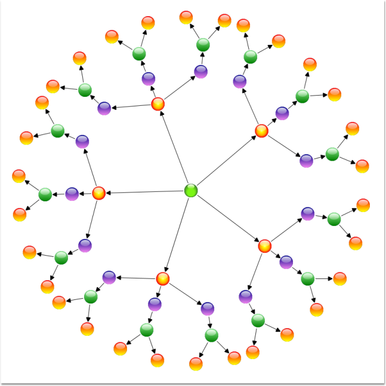

   

Layout Spacing

Spacing between the nodes with respect different levels and siblings are adjustable; this will be helpful to adjust the distance between nodes, so that it will meet many business needs. As this is a general topic between all layouts, detailed explanation about this can be found in Layout Spacing under DiagramModel.

Refresh Layout

When there are changes in content of the page link new nodes and connectors added, the layout has to be refreshed to get the page’s content aligned again to give space for new contents. To refresh the layout please follow the following code snippet.



RadialTreeLayout tree = new RadialTreeLayout(diagramModel, diagramView);

tree.RefreshLayout();




Dim tree As New RadialTreeLayout(diagramModel, diagramView)

tree.RefreshLayout()



Here diagramModel and diagramView is an instance of DiagramModel and DiagramView respectively.

#### Table Layout

Table layout arranges the nodes in a tabular structure based on specified intervals between them. The number of nodes in each row and column can be specified and the layout will take place accordingly. The nodes are assigned rows and columns based on the order in which they are added to the model and based on the maximum nodes allowed in that row and column. This layout enables to layout nodes automatically without the need to specify offset positions for each node.

<table>
<tr>
<th>
Property</th><th>
Description </th><th>
Type of the property</th><th>
Value it accepts</th></tr>
<tr>
<td>
VerticalSpacing</td><td>
Gets or sets the Vertical spacing between nodes.</td><td>
CLR property</td><td>
Double</td></tr>
<tr>
<td>
HorizontalSpacing</td><td>
Gets or sets the Horizontal spacing between nodes.</td><td>
CLR property</td><td>
Double</td></tr>
<tr>
<td>
Orientation</td><td>
Gets or sets the orientation.</td><td>
CLR property</td><td>
TreeOrientation.LeftRightTreeOrientation.RightLeftTreeOrientation.TopBottomTreeOrientation.BottomTop</td></tr>
<tr>
<td>
TableExpandMode</td><td>
Gets or sets the table expand mode.</td><td>
DependencyProperty</td><td>
ExpandMode.HorizontalExpandMode.Vertical</td></tr>
<tr>
<td>
RowCount</td><td>
Gets or sets the Row Count for the table layout.</td><td>
DependencyProperty</td><td>
int</td></tr>
<tr>
<td>
ColumnCount</td><td>
Gets or sets the Column Count for the table layout.</td><td>
DependencyProperty</td><td>
int</td></tr>
<tr>
<td>
EnableLayoutWithVariedSizes</td><td>
Gets or sets a value indicating whether to enable the varied size algorithm. In case the Model consists of the nodes of different sizes, this property can be set to true. This will align the differently sized nodes with respect to the centre.</td><td>
DependencyProperty</td><td>
Boolean (true/ false)</td></tr>
<tr>
<td>
Bounds</td><td>
Gets or sets the bounds value which specifies the position of the root node in case of tree layout.</td><td>
CLR property</td><td>
Thickness</td></tr>
</table>

<table>
<tr>
<th>
Name</th><th>
Parameters </th><th>
Return Type</th><th>
Description</th><th>
Reference Links</th></tr>
<tr>
<td>
RefreshLayout()</td><td>
Null</td><td>
void</td><td>
Refresh the layout</td><td>
N/A</td></tr>
</table>

The Layout Manager lets you orient the table in two directions, Horizontal and Vertical. The TableExpandMode property of Diagram Model is used to specify the orientation.

Horizontal: 

When set to Horizontal, the Rowcount is automatically calculated based on the number of nodes. The ColumnCount must be specified and the nodes will be arranged in the specified number of columns. When the maximum column count is reached, it starts placing the nodes in a new row.

Vertical: 

When set to Vertical, the Columncount is automatically calculated based on the number of nodes. The RowCount must be specified and the nodes will be arranged in the specified number of rows. When the maximum row count is reached, it starts placing the nodes in a new column.

The Bounds property of the DiagramView class can be used to specify the position of the first node.



<Window x:Class="RadialTreeLayout_2008.Window1"

    xmlns="http://schemas.microsoft.com/winfx/2006/xaml/presentation"

    xmlns:x="http://schemas.microsoft.com/winfx/2006/xaml"

    Title="Radial Tree Layout Demo" WindowState="Normal"

    WindowStartupLocation="CenterScreen" Name="mainwindow"

    xmlns:syncfusion="http://schemas.syncfusion.com/wpf" Icon="App.ico"

    FontWeight="Bold" xmlns:local="clr-namespace:RadialTreeLayout_2008" Height="1000" Width="900">

<syncfusion:DiagramControl IsSymbolPaletteEnabled="False" Name="diagramControl">

  <!-- Model to add nodes and connections-->

<syncfusion:DiagramControl.Model>

<syncfusion:DiagramModel

LayoutType="TableLayout" 

EnableLayoutWithVariedSizes="False" 

TableExpandMode="Horizontal" 

HorizontalSpacing="50" 

VerticalSpacing="50" 

RowCount="4" 

ColumnCount="4"  

x:Name="diagramModel">

</syncfusion:DiagramModel>

 </syncfusion:DiagramControl.Model>

 <!--View to display nodes and connections added through model.-->

 <syncfusion:DiagramControl.View>

     <syncfusion:DiagramView Bounds="0,0,200,200" Name="diagramView"/>

     </syncfusion:DiagramControl.View>

</syncfusion:DiagramControl></Window>




DiagramControl dc = new DiagramControl();

DiagramModel diagramModel = new DiagramModel();

dc.Model = diagramModel;

diagramModel.LayoutType = LayoutType.TableLayout;

diagramModel.TableExpandMode = ExpandMode.Horizontal;

diagramModel.EnableLayoutWithVariedSizes = false;

diagramModel.HorizontalSpacing = 50;

diagramModel.VerticalSpacing = 50;

diagramModel.RowCount = 10;

diagramModel.ColumnCount = 3;




Dim dc As New DiagramControl()

Dim diagramModel As New DiagramModel()

dc.Model = diagramModel

diagramModel.LayoutType = LayoutType.TableLayout

diagramModel.TableExpandMode = ExpandMode.Horizontal

diagramModel.EnableLayoutWithVariedSizes = False

diagramModel.HorizontalSpacing = 50

diagramModel.VerticalSpacing = 50

diagramModel.RowCount = 10

diagramModel.ColumnCount = 3



Layout Spacing

Spacing between the nodes with respect different levels and siblings are adjustable; this will be helpful to adjust the distance between nodes, so that it will meet many business needs. As this is a general topic between all layouts, detailed explanation about this can be found in Layout Spacing under DiagramModel.

Refresh Layout

When there are changes in content of the page like new nodes or connectors added, the layout has to be refreshed to get the page’s content aligned again to give space for new contents. To refresh the layout please follow the following code snippet.



TableLayout tree = new TableLayout(diagramModel, diagramView);

tree.RefreshLayout();




Dim tree As New TableLayout(diagramModel, diagramView)

tree.RefreshLayout()



Here diagramModel and diagramView is an instance of DiagramModel and DiagramView respectively.
There are some more customization supported for Table Layout, please refer the links following ‘see also’ topic.

See Also

Layout Spacing Refer Concepts and Features -> Diagram Model -> Layout Spacing

TableExpandMode Refer Concepts and Features -> Diagram Model -> TableExpandMode

RowCount and ColumnCount Refer Concepts and Features -> Diagram Model -> RowCount and ColumnCount

Enable TableLayout with varied Node sizes Refer Concepts and Features -> Diagram Model -> Enable TableLayout with varied Node size

#### BowTie Layout

The BowTie Diagram is a graphical representation of the risk assessment process. This can be used for assessing all type of risks.

Properties

<table>
<tr>
<th>
Property</th><th>
Description </th><th>
Type </th><th>
Data Type</th><th>
Reference links </th></tr>
<tr>
<td>
VerticalSpacing</td><td>
Gets or sets the Vertical spacing between nodes.</td><td>
CLR Property</td><td>
Double</td><td>
NA</td></tr>
<tr>
<td>
HorizontalSpacing</td><td>
Gets or sets the Horizontal spacing between nodes.</td><td>
CLR Property</td><td>
Double</td><td>
NA</td></tr>
<tr>
<td>
SpaceBetweenSubTrees</td><td>
Gets or sets the space between sub trees.</td><td>
CLR Property</td><td>
Double</td><td>
NA</td></tr>
<tr>
<td>
Bounds</td><td>
Gets or sets the bounds value which specifies the position of the root node in case of tree layout.</td><td>
CLR Property</td><td>
Thickness</td><td>
NA</td></tr>
<tr>
<td>
BowtieSubTreePlacement</td><td>
Gets or sets a value from the BowtieSubTreePlacement.</td><td>
Attached Dependency property</td><td>
 BowtieSubTreePlacement</td><td>
NA</td></tr>
</table>

The following code illustrates how to generate the BowTie layout: 

1. The LayoutType should be set to BowtieLayout in DiagramModel class.

        

			   <!--Diagram Control-->       

			<syncfusion:DiagramControl  Name="diagramControl" Grid.Row="1">            

				<syncfusion:DiagramControl.Model>

					<syncfusion:DiagramModel x:Name="diagramModel" LayoutType="BowtieLayout"/>

				</syncfusion:DiagramControl.Model>            

				<syncfusion:DiagramControl.View>

					<syncfusion:DiagramView Name="diagramView" Bounds="0, 0, 1400, 700"/>

				</syncfusion:DiagramControl.View>

			</syncfusion:DiagramControl>
			
			
			

2. Then, the nodes are defined and the connections are made.

    

					//Tree spacing properties.

					diagramModel.VerticalSpacing = 35;

					diagramModel.HorizontalSpacing = 30;

					diagramModel.SpaceBetweenSubTrees = 150;

					//Defines the nodes and adds it to the model.

					Node Root = AddNode("R", "Systems\nSecurity", Brushes.Red, Brushes.Black, 4, Shapes.Ellipse);

					this.diagramModel.LayoutRoot = Root;

					diagramModel.LayoutType = LayoutType.BowtieLayout;

					//creating the Left Tree.

					createLeftNodes(Root, BowtieSubTreePlacement.Left);

					//creating the Right Tree.

					createRightNodes(Root, BowtieSubTreePlacement.Right);

					//setting the Root Node.

					this.diagramModel.LayoutRoot = Root;

				public void createLeftNodes(Node Root, BowtieSubTreePlacement place)

				{

					//Defines the nodes.

					Node n1 = AddNode("n1", "Hacking", Brushes.Blue, Brushes.Black, 1, Shapes.Ellipse);

					Node n2 = AddNode("n2", "Firewall", Brushes.Yellow, Brushes.Black, 1, Shapes.RoundedRectangle);

					Node n3 = AddNode("n3", "Identification", Brushes.Yellow, Brushes.Black, 1, Shapes.RoundedRectangle);

					Node n4 = AddNode("n4", "Authorization", Brushes.Yellow, Brushes.Black, 2, Shapes.RoundedRectangle);

					Node n5 = AddNode("n5", "Theft\nof\nInformation", Brushes.Blue, Brushes.Black, 3, Shapes.Ellipse);

					Node n6 = AddNode("n6", "Firewall", Brushes.Yellow, Brushes.Black, 3, Shapes.RoundedRectangle);

					Node n7 = AddNode("n7", "Network Access", Brushes.Yellow, Brushes.Black, 2, Shapes.RoundedRectangle);

					Node n8 = AddNode("n8", "Data Access", Brushes.Yellow, Brushes.Black, 2, Shapes.RoundedRectangle);

					DiagramControl.SetBowtieSubTreePlacement(n4, place);

					DiagramControl.SetBowtieSubTreePlacement(n8, place);

					//Creating connections between the nodes

					Connect(n1, n2);

					Connect(n2, n3);

					Connect(n3, n4);

					Connect(n4, Root);

					Connect(n5, n6);

					Connect(n6, n7);

					Connect(n7, n8);

					Connect(n8, Root);

				}

		//Defines the nodes. 

				public void createRightNodes(Node Root, BowtieSubTreePlacement place)

				{

					//Defining the nodes.            

					Node n1 = AddNode("n1", "Account Limits", Brushes.Yellow, Brushes.Black, 1, Shapes.RoundedRectangle);

					Node n2 = AddNode("n2", "Challenge", Brushes.Yellow, Brushes.Black, 1, Shapes.RoundedRectangle);

					Node n3 = AddNode("n3", "Detection & Prosecution", Brushes.Yellow, Brushes.Black, 2, Shapes.RoundedRectangle);

					Node n4 = AddNode("n4", "Recovery", Brushes.Yellow, Brushes.Black, 3, Shapes.RoundedRectangle);

					Node n5 = AddNode("n5", "Restitution\nto\nCustomer", Brushes.Blue, Brushes.Black, 3, Shapes.Ellipse);

					Node n6 = AddNode("n6", "Cost to Bank", Brushes.Blue, Brushes.Black, 3, Shapes.Ellipse);

					DiagramControl.SetBowtieSubTreePlacement(n1, place);

					//Creating connections between the nodes.

					Connect(Root, n1);

					Connect(n1, n2);

					Connect(n2, n3);

					Connect(n3, n4);

					Connect(n4, n5);

					Connect(n4, n6);

				}

									'Tree spacing properties.

				diagramModel.VerticalSpacing = 35

				diagramModel.HorizontalSpacing = 30

				diagramModel.SpaceBetweenSubTrees = 150

				'Defines the nodes and adds it to the model.

				Dim Root As Node = AddNode("R", "Systems" & Constants.vbLf & "Security", Brushes.Red, Brushes.Black, 4, Shapes.Ellipse)

				Me.diagramModel.LayoutRoot = Root

				diagramModel.LayoutType = LayoutType.BowtieLayout

				'creating the Left Side Tree

				createLeftNodes(Root, BowtieSubTreePlacement.Left)

				'creating the Right Tree

				createRightNodes(Root, BowtieSubTreePlacement.Right)

				'setting the Root Node

				Me.diagramModel.LayoutRoot = Root

				public void createLeftNodes(Node Root, BowtieSubTreePlacement place)

				Defines nodes.

				Dim n1 As Node = AddNode("n1", "Hacking", Brushes.Blue, Brushes.Black, 1, Shapes.Ellipse)

				Dim n2 As Node = AddNode("n2", "Firewall", Brushes.Yellow, Brushes.Black, 1, Shapes.RoundedRectangle)

				Dim n3 As Node = AddNode("n3", "Identification", Brushes.Yellow, Brushes.Black, 1, Shapes.RoundedRectangle)

				Dim n4 As Node = AddNode("n4", "Authorization", Brushes.Yellow, Brushes.Black, 2, Shapes.RoundedRectangle)

				Dim n5 As Node = AddNode("n5", "Theft" & Constants.vbLf & "of" & Constants.vbLf & "Information", Brushes.Blue, Brushes.Black, 3, Shapes.Ellipse)

				Dim n6 As Node = AddNode("n6", "Firewall", Brushes.Yellow, Brushes.Black, 3, Shapes.RoundedRectangle)

				Dim n7 As Node = AddNode("n7", "Network Access", Brushes.Yellow, Brushes.Black, 2, Shapes.RoundedRectangle)

				Dim n8 As Node = AddNode("n8", "Data Access", Brushes.Yellow, Brushes.Black, 2, Shapes.RoundedRectangle)

				DiagramControl.SetBowtieSubTreePlacement(n4, place)

				DiagramControl.SetBowtieSubTreePlacement(n8, place)

				'Creating connections between the nodes

				Connect(n1, n2)

				Connect(n2, n3)

				Connect(n3, n4)

				Connect(n4, Root)

				Connect(n5, n6)

				Connect(n6, n7)

				Connect(n7, n8)

				Connect(n8, Root)

				'Defines the nodes. 

				public void createRightNodes(Node Root, BowtieSubTreePlacement place)

							'Defining the nodes.            

				Dim n1 As Node = AddNode("n1", "Account Limits", Brushes.Yellow, Brushes.Black, 1, Shapes.RoundedRectangle)

				Dim n2 As Node = AddNode("n2", "Challenge", Brushes.Yellow, Brushes.Black, 1, Shapes.RoundedRectangle)

				Dim n3 As Node = AddNode("n3", "Detection & Prosecution", Brushes.Yellow, Brushes.Black, 2, Shapes.RoundedRectangle)

				Dim n4 As Node = AddNode("n4", "Recovery", Brushes.Yellow, Brushes.Black, 3, Shapes.RoundedRectangle)

				Dim n5 As Node = AddNode("n5", "Restitution" & Constants.vbLf & "to" & Constants.vbLf & "Customer", Brushes.Blue, Brushes.Black, 3, Shapes.Ellipse)

				Dim n6 As Node = AddNode("n6", "Cost to Bank", Brushes.Blue, Brushes.Black, 3, Shapes.Ellipse)

				DiagramControl.SetBowtieSubTreePlacement(n1, place)

				'Creating connections between the nodes.

				Connect(Root, n1)

				Connect(n1, n2)

				Connect(n2, n3)

				Connect(n3, n4)

				Connect(n4, n5)

				Connect(n4, n6)

       
	   
	   
   

   

Layout Spacing

Spacing between the nodes with respect to different levels and siblings are adjustable. This will be helpful to adjust the distance between nodes, so that it will meet many business needs. As this is a general topic between all layouts, detailed explanation about this can be found in [Layout Spacing](http://help.syncfusion.com/silverlight/diagram/diagram-model#layout) under DiagramModel.

Refresh Layout

When there are changes in the content of the page-- such as adding new nodes and connectors to the layout, the page has to be refreshed to get the content aligned again. Only then it will give space for new contents. Refresh the layout as given in the following code example:



BowtieLayout tree = new BowtieLayout (diagramModel, diagramView);

tree.RefreshLayout();




Dim tree As New BowtieLayout (diagramModel, diagramView)

tree.RefreshLayout()


#### Table Layout for Selected Nodes

This feature enables you to apply the table layout on selected nodes instead of applying it to the entire diagram. This arranges selected nodes or a given node collection in a tabular structure based on specified intervals between them. The number of nodes in each row and column can be specified and the layout will be applied accordingly. 

Use Case Scenarios

* Users can easily make the layout with a specific collection of nodes called ordered nodes.
* Users can easily position the layout.
* Users can easily align the layout by using the layout alignment properties.
* Users can set a rectangle boundary around nodes by using the Layout Bounds property.

Properties

<table>
<tr>
<th>
Property</th><th>
Description</th><th>
Type</th><th>
Data Type</th></tr>
<tr>
<td>
OrderedNodes</td><td>
This property is used to get or set the Collection of Nodes for table layout.</td><td>
Dependency property</td><td>
List&lt;IShape&gt;</td></tr>
</table>

Sample Link

To view a sample of this feature:

1. Open Dashboard.
2. Click User Interface > WPF. 
3. Click Run Samples. 
4. Navigate to Diagram > Automatic Layout > Table Layout.

#### Adding Table Layout for selected Nodes 

To apply a table layout to the selected nodes, assign the selected nodes to the OrderNodes property of the DiagramModel. You can also assign your own collection of IShape to the _OrderNodes_ property. Then create an instance of the TableLayout and call the RefreshLayout method for this instance.

The following code illustrates this: 



       // Assigning selected node to the OrderedNodes property.

          diagramModel.OrderedNodes= diagramView.SelectionList.OfType<IShape>().ToList(); 

       // Create an instance of TableLayout and refresh it.

          TableLayout table = new TableLayout(diagramModel, diagramView);

          table.RefreshLayout();



'Assigning selected node to the OrderedNodes property.

diagramModel.OrderedNodes= diagramView.SelectionList.OfType(Of IShape)().ToList()

'Create an instance of TableLayout and refresh it.

Dim table As New TableLayout(diagramModel, diagramView)

table.RefreshLayout()



When the code runs, the table layout will be applied to the specified node collection.  

N> If the OrderNodes property is set to null, then the table layout will be applied to the entire diagram.

Table Layout Applied for Specified Nodes
{:.caption}

#### Aligning the Layout on a Specified Location

To align the ordered nodes in a particular position, call the TableLayout’s RefreshLayout (Point PivotPoint) method and specify the particular point as a parameter. The layout will be positioned in the specified pivot point. 

The following code illustrates this:



       // Assigning selected node to the OrderedNodes.

          diagramModel.OrderedNodes= diagramView.SelectionList.OfType<IShape>().ToList(); 

          TableLayout table = new TableLayout(diagramModel, diagramView);

          table.RefreshLayout(300,400);




' Assigning selected node to the OrderedNodes.

diagramModel.OrderedNodes= diagramView.SelectionList.OfType(Of IShape)().ToList()

Dim table As New TableLayout(diagramModel, diagramView)

table.RefreshLayout(300,400)


#### Removing Table Layout from the Specific Nodes

You can remove the table layout applied to specific nodes. To achieve this set the OrderedNodes property of the DiagramMode to null, and call the RefreshLayout method of the TableLayout. The layout will be applied to the entire diagram. By default the OrderedNodes property is set to null.

The following code illustrates how to remove the layout from the specific nodes:



       // Set null value to the OrderedNodes property.

          diagramModel.OrderedNodes = null;

          TableLayout table = new TableLayout(diagramModel, diagramView);

          table.RefreshLayout(300,400);



