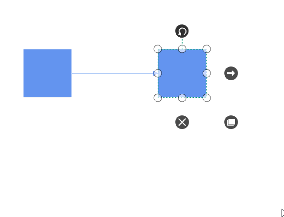

## Preview Settings in WPF Diagram (SfDiagram)

SfDiagram provides support to drag objects as an outline without affecting original object. When multiple elements are selected, outline of every selected element will be moved.

Preview Dragging can be enabled by assigning values other than [PreviewMode.Preview](https://help.syncfusion.com/cr/wpf/Syncfusion.SfDiagram.WPF~Syncfusion.UI.Xaml.Diagram.PreviewMode.html) to [SfDiagram.PreviewSettings.PreviewMode](https://help.syncfusion.com/cr/wpf/Syncfusion.SfDiagram.WPF~Syncfusion.UI.Xaml.Diagram.PreviewSettings~PreviewMode.html).

By default, Outline of the connectors connected to the dragging objects will be in disabled state. But, you can able to view the outline of the connectors, by holding dragging objects for certain time span. [ConnectorRefreshingSpan](https://help.syncfusion.com/cr/wpf/Syncfusion.SfDiagram.WPF~Syncfusion.UI.Xaml.Diagram.PreviewSettings~ConnectorRefreshingSpan.html) property of [PreviewSettings](https://help.syncfusion.com/cr/wpf/Syncfusion.SfDiagram.WPF~Syncfusion.UI.Xaml.Diagram.PreviewSettings.html) allows you to specify the time span and the value should be greater than 300ms.




this.diagram.PreviewSettings = new PreviewSettings() { PreviewMode = PreviewMode.Preview, ConnectorRefreshingSpan = 300 };




### Appearance

Appearance of the preview can be modified using [PreviewStyle](https://help.syncfusion.com/cr/wpf/Syncfusion.SfDiagram.WPF~Syncfusion.UI.Xaml.Diagram.PreviewSettings~PreviewStyle.html) property of `PreviewSettings`.




var previewStyle = new Style();
previewStyle.TargetType = typeof(Shape);
previewStyle.Setters.Add(new Setter() { Property = Shape.StrokeProperty, Value = new SolidColorBrush(Colors.CornflowerBlue) });
previewStyle.Setters.Add(new Setter() { Property = Shape.StrokeThicknessProperty, Value = 1.5 });
previewStyle.Setters.Add(new Setter() { Property = Shape.StrokeDashArrayProperty, Value = new DoubleCollection { 3, 3 } });
this.diagram.PreviewSettings = new PreviewSettings() { PreviewMode = PreviewMode.Preview, ConnectorRefreshingSpan = 300, PreviewStyle = previewStyle };




[View sample in GitHub](https://github.com/SyncfusionExamples/WPF-Diagram-Examples/tree/master/Samples/Interaction/PreviewSettings-sample).
