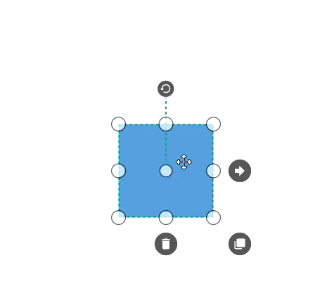

# Tooltip in WPF Diagram (SfDiagram)

In Graphical User Interface (GUI), the tooltip is a message that is displayed when mouse hovers over an element. In SfDiagram, Tooltip is used to provide information about the position, size, and rotation angle while dragging, resizing, and rotating the diagram elements.

## Static Tooltip

By default, the diagram displays the tooltip at a static position during an interaction. While dragging and resizing, the size and position information will be displayed at the top of the node and during rotation, it will be displayed at the top of the rotation thumb.

## Dynamic Tooltip

Diagram control displays the tooltip at a dynamic position when the `SelectorHandleDisplayMode` is set as `Compact`. When resizing a diagram element, the tooltip is positioned closer to the resizer thumbs, and when dragging, the tooltip is positioned automatically in the nearest available viewport area around that diagram element. The following image illustrates how the dynamic tooltip works.

